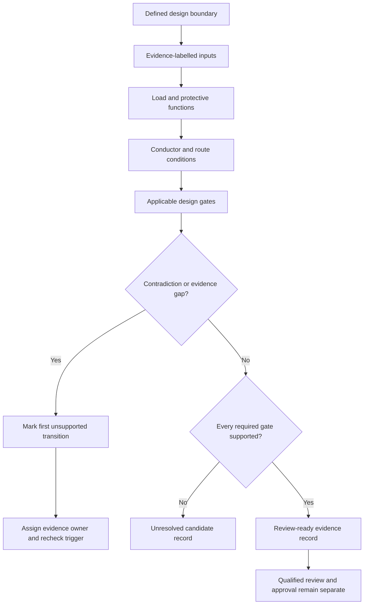
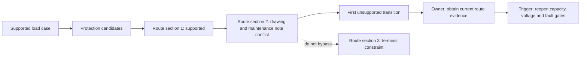

# Day 24 — Complete Cable-Selection Workflow and Evidence Record

> **Currency and scope notice:** This module teaches an evidence-led design sequence using fictional data. Exact requirements, values, selection methods and exceptions require current authorised verification. It does not approve a design and is not `technically-reviewed`.

## 1. Outcome and entry check

By the end of this module, the learner should be able to:

1. define a design boundary, candidate, evidence record, unresolved dependency and reopening trigger;
2. apply the **S-E-L-E-C-T** workflow in the correct sequence;
3. label each input as a stated fact, derived fact, supported inference, assumption, contradiction or evidence gap;
4. identify the **first unsupported transition** in a cable-selection claim chain;
5. distinguish a provisional candidate from a completed and approved design;
6. preserve competing candidates when the evidence does not support rejection;
7. assign an evidence owner and recheck trigger to every unresolved dependency;
8. revise all affected gates when at least two material conditions change; and
9. stop before unsupported selection, field work, certification or approval.

### Entry check

Without notes, list the evidence needed before comparing a load, protective device and conductor. Then name four checks that remain after a preliminary current-capacity comparison. Mark each response as high, medium or low confidence; confidence is calibration evidence, not proof of correctness.

## 2. Why it matters

Cable selection is not a lookup followed by a single inequality. A defensible result depends on the defined load case, protective purpose, route and environment, source data, correction factors, voltage and fault conditions, terminals, installation constraints and documentation. Missing evidence must remain visible rather than being replaced by a plausible guess. A candidate that passes one gate can still fail later, and a candidate that cannot yet be verified is not automatically unsuitable.

*Caption: Record each gate, source and unresolved dependency before moving from a candidate to a bounded conclusion.*

## 3. Core concepts and terminology

- **Design boundary:** the circuit, operating case, supply arrangement and physical route being assessed.
- **Candidate:** a possible device-and-conductor combination that has not yet passed every applicable check.
- **Evidence record:** a traceable list of inputs, sources, calculations, decisions, assumptions and unresolved items.
- **Dependency:** a fact or result needed before a later conclusion can be supported.
- **Design gate:** a check that must be resolved before progression.
- **Reopening trigger:** a changed condition that requires one or more completed gates to be repeated.
- **Evidence owner:** the person or authorised source responsible for resolving an evidence gap or contradiction.
- **First unsupported transition:** the earliest step where the available evidence no longer supports the next claim; later conclusions must not be treated as established.
- **Provisional conclusion:** a bounded statement supported only for the checks already completed.
- **Approval:** qualified acceptance under applicable requirements; this module does not provide it.

### Evidence labels

- **Stated fact:** information explicitly supplied by the scenario or an identified source.
- **Derived fact:** a transparent result calculated only from supported inputs.
- **Supported inference:** a conclusion reasonably drawn from evidence, with the reasoning stated.
- **Assumption:** a temporary proposition that is not yet verified and cannot silently become a fact.
- **Contradiction:** two sources or observations that cannot both be accepted without resolution.
- **Evidence gap:** information required for a later decision but not yet available.

### Criterion states

- **Secure:** independently traceable, internally consistent and transferable to a changed scenario.
- **Developing:** substantially correct but incomplete, weakly explained or dependent on prompting.
- **Unsupported:** the claim lacks sufficient evidence or contains an unresolved contradiction.
- **`stop-required`:** progression would cross a safety, authority, evidence or approval boundary.

These are educational planning states, not official grades or competency decisions.

## 4. Rule-finding workflow

Use **S-E-L-E-C-T**:

1. **S — Set the boundary:** define supply, phases, load case, route, environment, equipment and exclusions.
2. **E — Establish evidence:** label every input and record its source, confidence and unresolved conflict.
3. **L — Link load and protection:** record design current, protective functions, device identity, device data and assumptions without treating a nominal rating as proof of operation.
4. **E — Evaluate conductor conditions:** identify installation method, materials, grouping, temperature, route sections and terminal constraints.
5. **C — Check every applicable gate:** capacity, protection, voltage, fault conditions, terminals, mechanical and environmental suitability, and any special conditions.
6. **T — Trace and transfer:** document the bounded conclusion, first unsupported transition, evidence owner, unresolved checks and reopening triggers; repeat affected gates when facts change.

The diagram shows progression of evidence, not permission to construct, test or energise an installation. Once the first unsupported transition is reached, downstream claims remain provisional even when earlier arithmetic is correct.

## 5. Visual model or worked example

A fictional workshop circuit has a supplied design current, two device candidates, two conductor candidates and three route sections. The drawing identifies one grouping arrangement, while a later maintenance note states that an additional circuit was added to the same enclosed route. The second route section therefore contains a contradiction rather than merely a missing value. The third section has a supplied terminal constraint.

The learner must retain both grouping interpretations and show how each affects the candidate record. Neither interpretation may be selected merely because it produces the preferred cable size. The bounded conclusion states that the candidates remain unresolved until the route evidence is reconciled, after which every dependent gate is reopened.

### Worked-example fading

A second scenario supplies the route and factors but contains conflicting protective-device model references. Complete the record to the first unsupported transition. State:

1. what remains supported;
2. which competing device identities remain open;
3. who owns the evidence gap;
4. which gates must be repeated; and
5. the exact claims that are prohibited until resolution.

## 6. Practical application

### Task A — design-gate register

Create a register with columns for gate, claim, evidence label, required input, source, transformation, result, criterion state, contradiction or gap, first unsupported transition, evidence owner and reopening trigger.

### Task B — candidate comparison

Compare three fictional candidates. Reject a candidate only where supported evidence establishes rejection. Otherwise classify it as secure, developing, unsupported or `stop-required` at each gate. Strong performance at one gate cannot cancel a safety-critical or evidence failure elsewhere.

### Task C — changed-condition transfer

Change at least two material conditions, such as the load schedule and route grouping, or the supply arrangement and terminal constraint. Identify every gate that must be reopened and rebuild the affected reasoning from the changed inputs rather than editing only the final value.

### Task D — audit summary

Write a 180-word review note separating supported findings, competing interpretations, unresolved dependencies, prohibited claims, evidence owners and the next authorised-source check.

### Criterion decision record

Assess each criterion separately:

| Criterion | Secure evidence | Developing evidence | Unsupported / `stop-required` |
|---|---|---|---|
| Boundary definition | All material circuit, supply, route and operating conditions are explicit | Minor omissions do not yet affect a gate | A material boundary is missing or assumed |
| Evidence classification | Every input and transformation is traceable | Labels are mostly correct but inconsistently justified | Facts, assumptions and contradictions are merged |
| Gate sequence | Dependencies are respected and reopened when needed | Sequence is mostly correct with prompting | A downstream conclusion bypasses an unresolved gate |
| Candidate treatment | Rejection and retention are evidence-based | Reasoning is incomplete but bounded | A preferred candidate is selected by convenience |
| Transfer | Two changed conditions are propagated through affected gates | Some dependent gates are missed | Only the final value is edited |
| Safety and authority | All stop conditions and prohibited actions are explicit | Boundary is understood but incompletely stated | Practical work, approval or compliance is implied without authority |

Progression requires no `stop-required` criterion and an explicit remediation plan for every developing or unsupported criterion. This is not an official pass mark.

## 7. Common errors and safety checkpoint

Common errors include starting with a preferred cable size, hiding assumptions inside arithmetic, treating one route condition as representative of all sections, using a protective-device rating as proof of complete protection, omitting terminals or alternate supplies, resolving conflicting records by convenience, repeating the same calculator entry as an “independent” check, and calling a candidate compliant before every applicable gate and qualified review are complete.

### Blocking conditions

Record `stop-required` when any of the following occurs:

- a rating, factor, device characteristic or route condition is invented;
- conflicting evidence is ignored or silently reconciled;
- an unsupported input is used to claim suitability, operation, compliance or approval;
- a changed condition is not propagated through dependent gates;
- practical inspection, testing or alteration is required but is outside the learner's authority; or
- a candidate is represented as approved without qualified review.

Stop and escalate when source data conflicts, a route or supply condition cannot be classified, an applicable check cannot be identified, practical inspection or testing would be required, or approval, certification or sign-off is requested.

This module authorises no switching, isolation, opening, proving, tracing, measurement, testing, disconnection, reconnection, installation, alteration, repair, energisation, commissioning, certification or verification.

## 8. Retrieval and next links

### Closed-note retrieval

1. Recite S-E-L-E-C-T.
2. Define candidate, dependency, design gate, evidence owner, reopening trigger and first unsupported transition.
3. Name eight possible cable-selection gates.
4. Give six evidence labels and four prohibited claims.
5. Explain why an unresolved candidate is not automatically unsuitable.
6. Explain why a correct calculation cannot override contradictory source evidence.

### Exit task

Submit Tasks A–D, the criterion decision record, one corrected high-confidence error, one unresolved authorised-source question and one readiness statement for Day 25.

### Navigation

- **Plan:** [Twelve-Week Capstone Learning Plan](../MASTER_PLAN.md)
- **Knowledge note:** [[12-Week Day 24 - Complete Cable-Selection Workflow and Evidence Record]]
- **Previous:** [Day 23 — Design Current, Protective-Device Rating and Conductor Capacity](day-23-design-current-protective-device-rating-and-conductor-capacity.md)
- **Next:** [Day 25 — Installation Methods, Environmental Influences and Derating](day-25-installation-methods-environmental-influences-and-derating.md)

### Reference and currency notice

This module uses original workflows, fictional values, scenarios, diagrams and assessment tools. It reproduces no standards tables, figures, systematic clause wording, exact official values or assessment material. Qualified review against current authorised sources is required.