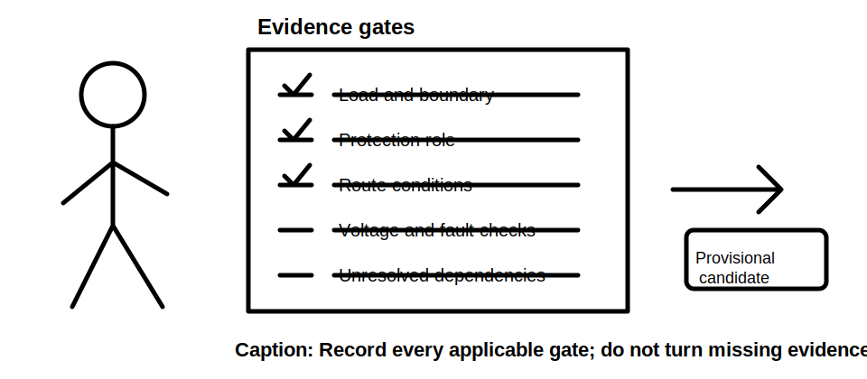
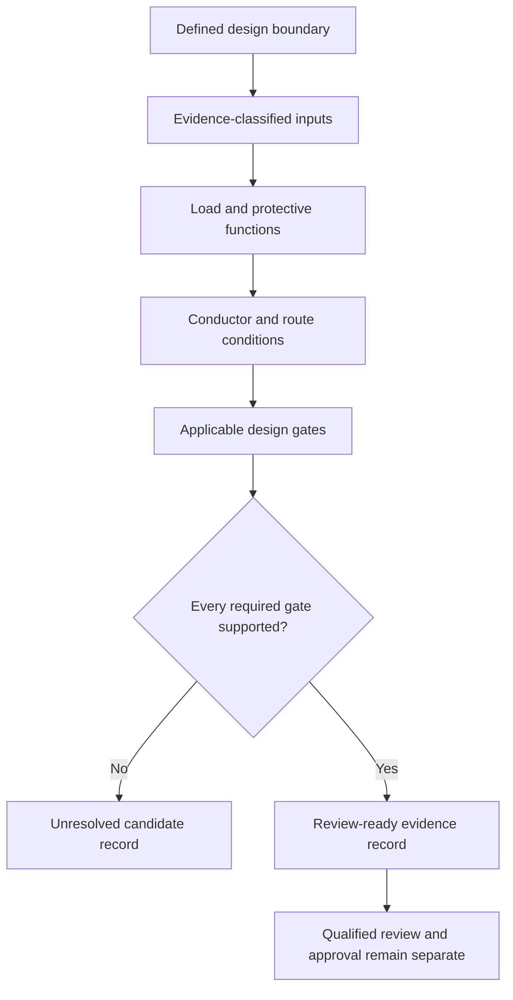
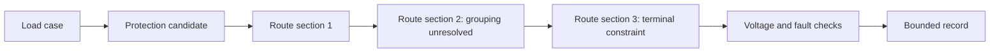

# Day 24 — Complete Cable-Selection Workflow and Evidence Record

> **Currency and scope notice:** This module teaches an evidence-led design sequence using fictional data. Exact requirements, values, selection methods and exceptions require current authorised verification. It does not approve a design and is not `technically-reviewed`.

## 1. Outcome and entry check

By the end of this module, the learner should be able to:

1. define a design boundary, candidate, evidence record, unresolved dependency and reopening trigger;
2. apply the **S-E-L-E-C-T** workflow in the correct sequence;
3. trace every input to a supplied fact, authorised source, transparent derivation or declared training assumption;
4. distinguish a provisional candidate from a completed and approved design;
5. identify which later checks can invalidate an earlier candidate;
6. produce a concise evidence record another reviewer can audit;
7. revise the record when one design condition changes; and
8. stop before unsupported selection, field work, certification or approval.

### Entry check

Without notes, list the evidence needed before comparing a load, protective device and conductor. Then name four checks that remain after a preliminary current-capacity comparison.

## 2. Why it matters

Cable selection is not a lookup followed by a single inequality. A defensible result depends on the defined load case, protective purpose, route and environment, source data, correction factors, voltage and fault conditions, terminals, installation constraints and documentation. Missing evidence must remain visible rather than being replaced by a plausible guess.

## 3. Core concepts and terminology

- **Design boundary:** the circuit, operating case, supply arrangement and physical route being assessed.
- **Candidate:** a possible device-and-conductor combination that has not yet passed every applicable check.
- **Evidence record:** a traceable list of inputs, sources, calculations, decisions, assumptions and unresolved items.
- **Dependency:** a fact or result needed before a later conclusion can be supported.
- **Design gate:** a check that must be resolved before progression.
- **Reopening trigger:** a changed condition that requires one or more completed gates to be repeated.
- **Provisional conclusion:** a bounded statement supported only for the checks already completed.
- **Approval:** qualified acceptance under applicable requirements; this module does not provide it.

## 4. Rule-finding workflow

Use **S-E-L-E-C-T**:

1. **S — Set the boundary:** define supply, phases, load case, route, environment, equipment and exclusions.
2. **E — Establish evidence:** classify each input as supplied fact, authorised rule, derivation, training assumption or unresolved item.
3. **L — Link load and protection:** record design current, protective functions, device data and assumptions.
4. **E — Evaluate conductor conditions:** identify installation method, materials, grouping, temperature, route sections and terminal constraints.
5. **C — Check every applicable gate:** capacity, protection, voltage, fault conditions, terminals, mechanical and environmental suitability, and any special conditions.
6. **T — Trace and transfer:** document the bounded conclusion, unresolved checks and reopening triggers; repeat affected gates when facts change.

The diagram shows progression of evidence, not permission to construct or energise an installation.

## 5. Visual model or worked example

A fictional workshop circuit has a supplied design current, two device candidates, two conductor candidates and three route sections. The first route section is described clearly; the second has incomplete grouping information; the third has a supplied terminal limit.

The learner may compare candidates using supplied fictional values, but must stop before a final selection because the grouping evidence is incomplete. The evidence record states what is supported, what remains unresolved and which checks must be repeated after the missing information is obtained.

### Worked-example fading

A second scenario supplies the route and factors but omits the protective-device characteristic needed for one check. Complete the record up to that dependency and write the exact bounded conclusion allowed.

## 6. Practical application

### Task A — design-gate register

Create a register with columns for gate, required input, source, transformation, result, status, unresolved evidence and reopening trigger.

### Task B — candidate comparison

Compare three fictional candidates. Reject only where supplied evidence supports rejection; otherwise record the candidate as unresolved rather than unsuitable.

### Task C — changed-condition transfer

Change one of: load schedule, route section, grouping, ambient condition, supply arrangement, terminal constraint or device type. Mark every gate that must be reopened and explain why.

### Task D — audit summary

Write a 180-word review note separating supported findings, unresolved dependencies, prohibited claims and the next authorised source check.

### Assessment rubric

Score 0–2 for boundary definition, evidence classification, workflow sequence, gate completeness, reopening logic, record auditability and safety boundary. A score of **12–14**, with no zero in gate completeness or safety, supports progression.

## 7. Common errors and safety checkpoint

Common errors include starting with a preferred cable size, hiding assumptions inside arithmetic, treating one route condition as representative of all sections, using a protective-device rating as proof of complete protection, omitting terminals or alternate supplies, resolving missing data by guesswork, and calling a candidate compliant before every applicable gate and qualified review are complete.

Stop and escalate when source data conflicts, a route or supply condition cannot be classified, an applicable check cannot be identified, practical inspection or testing would be required, or approval, certification or sign-off is requested.

This module authorises no switching, isolation, opening, proving, tracing, measurement, testing, disconnection, reconnection, installation, alteration, repair, energisation, commissioning, certification or verification.

## 8. Retrieval and next links

### Closed-note retrieval

1. Recite S-E-L-E-C-T.
2. Define candidate, dependency, design gate and reopening trigger.
3. Name eight possible cable-selection gates.
4. Give five evidence classes and four prohibited claims.
5. Explain why an unresolved candidate is not automatically unsuitable.

### Exit task

Submit Tasks A–D, the rubric score, one corrected high-confidence error, one unresolved authorised-source question and one readiness statement for Day 25.

### Navigation

- **Plan:** [Twelve-Week Capstone Learning Plan](../MASTER_PLAN.md)
- **Knowledge note:** [[12-Week Day 24 - Complete Cable-Selection Workflow and Evidence Record]]
- **Previous:** [Day 23 — Design Current, Protective-Device Rating and Conductor Capacity](day-23-design-current-protective-device-rating-and-conductor-capacity.md)
- **Next:** [Day 25 — Installation Methods, Environmental Influences and Derating](day-25-installation-methods-environmental-influences-and-derating.md)

### Reference and currency notice

This module uses original workflows, fictional values, scenarios, diagrams and assessment tools. It reproduces no standards tables, figures, systematic clause wording, exact official values or assessment material. Qualified review against current authorised sources is required.
