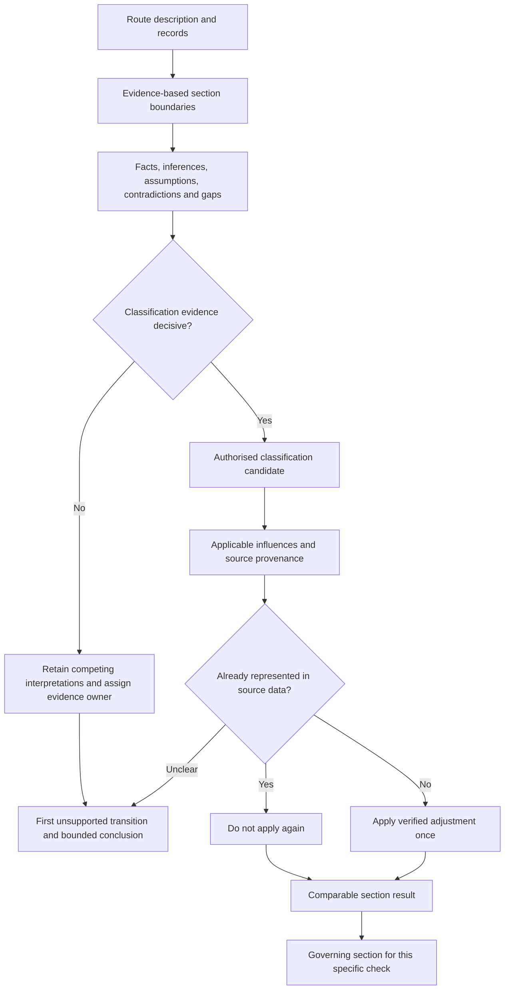
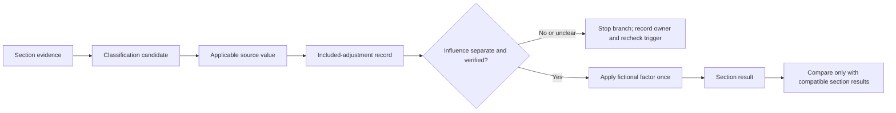

# Day 25 — Installation Methods, Environmental Influences and Derating

> **Currency and scope notice:** This module teaches classification and evidence control with fictional data. Exact installation classifications, correction factors, capacities, applicability conditions and exceptions require current authorised verification. It is not `technically-reviewed`.

## 1. Outcome and entry check

By the end of this module, the learner should be able to:

1. define installation method, route section, environmental influence, grouping, thermal-insulation influence, correction factor, governing section and factor provenance;
2. divide a mixed route into evidence-based sections where conditions materially differ;
3. label each input as a stated fact, derived fact, supported inference, assumption, contradiction or evidence gap;
4. apply the **C-O-N-D-I-T-I-O-N-S** workflow without selecting a classification or factor by resemblance alone;
5. show whether an influence is already included in source data before applying any additional fictional factor;
6. preserve competing route interpretations when records conflict;
7. identify the first unsupported transition in a classification or calculation chain;
8. transfer the workflow to a scenario with at least two material changes; and
9. stop before unsupported classification, physical access, design approval or compliance claims.

### Entry check

Explain why a cable route may require more than one installation classification. Then distinguish these two claims:

- “The drawing describes this section as enclosed.”
- “The actual section has been verified as belonging to an authorised installation classification.”

The first is documentary evidence. It does not by itself establish the second.

## 2. Why it matters

A conductor’s usable capacity depends on the installation and environmental conditions represented by the selected authorised method. A route can pass through open air, enclosure, grouped regions, thermal insulation, elevated-temperature areas or mechanically exposed locations. Treating the whole route as one convenient condition can hide the controlling section. Applying a factor twice, or applying one to incompatible source data, can also create a precise-looking but unsupported result.

*Instructional caption: Divide the route where relevant conditions change, then verify each section’s evidence before selecting source data or applying an adjustment.*

## 3. Core concepts and terminology

- **Installation method:** an authorised classification describing how a wiring system is installed for a stated design purpose. A casual physical description is not automatically an authorised classification.
- **Route section:** a portion of the route with materially consistent installation and environmental conditions for the check being performed.
- **Section boundary:** the point where a relevant condition changes enough to require a separate evidence or design assessment.
- **Environmental influence:** a surrounding condition that may affect selection, capacity, protection, mechanical performance or durability.
- **Grouping:** proximity of current-carrying circuits or conductors that may affect heat dissipation. Exact applicability rules require authorised verification.
- **Thermal-insulation influence:** interaction with insulation that may restrict heat loss. The extent, arrangement and applicable method must not be guessed.
- **Correction factor:** an authorised adjustment linked to a defined condition, source method and scope.
- **Base value:** the source value before separately applicable adjustments. The source must state what is already included.
- **Corrected value:** a result produced by applying verified adjustments according to an authorised method. It is not automatically a final design approval.
- **Factor provenance:** the record of a factor’s source, represented condition, applicability, units, included adjustments and calculation location.
- **Governing section:** the section that controls a particular design check after comparable, complete and verified results are assessed.
- **Double application:** applying the same influence more than once, directly or through source data that already includes it.
- **Competing interpretation:** an alternative explanation that remains possible because the evidence is incomplete or contradictory.
- **First unsupported transition:** the earliest step where a conclusion is not adequately supported by the preceding evidence. Later conclusions cannot be stronger than this point.
- **Recheck trigger:** a defined change that requires one or more earlier decisions or calculations to be reopened.

### Evidence labels

Use one label for every material input or conclusion:

- **Stated fact:** directly supplied by a traceable source.
- **Derived fact:** calculated or transformed from stated facts using an identified method.
- **Supported inference:** a provisional interpretation supported by evidence but not directly established.
- **Assumption:** an unverified condition introduced to continue analysis; it must remain visible and bounded.
- **Contradiction:** two sources or observations that cannot both be accepted without resolution.
- **Evidence gap:** information required for the next claim but not yet available.

## 4. Rule-finding workflow

Use **C-O-N-D-I-T-I-O-N-S**:

1. **C — Capture the route:** define start, end, length basis, supplied physical description and record sources.
2. **O — Outline sections:** split the route when enclosure, support, grouping, insulation, temperature, environment or another relevant condition changes.
3. **N — Name evidence states:** label facts, inferences, assumptions, contradictions and gaps before classification.
4. **D — Determine the authorised classification:** use current authorised definitions; retain competing classifications when decisive evidence is absent.
5. **I — Identify applicable influences:** include only influences supported for that section, method and source basis.
6. **T — Trace source values:** record source, units, edition or revision, included adjustments, limitations and evidence owner.
7. **I — Implement each adjustment once:** show where each fictional factor enters and prove it is not already represented.
8. **O — Order comparable section results:** compare like-for-like outputs and identify the governing case only for the stated check.
9. **N — Note unresolved dependencies:** identify the first unsupported transition and prevent stronger downstream claims.
10. **S — State reopening triggers:** record which changes require reclassification, recalculation or renewed source review.

The diagram separates physical evidence, authorised classification and calculation treatment. A visually plausible route description cannot bypass the classification-evidence decision, and an influence cannot be applied until its relationship to the source data is known.

### Claim ladder

Build each section’s reasoning in this order:

1. route record exists;
2. physical condition is described;
3. actual condition is sufficiently evidenced;
4. authorised classification is identified;
5. source value is applicable;
6. influence is applicable and not already included;
7. adjustment is applied once using the authorised method;
8. section result is comparable and complete;
9. governing section is identified for the stated check; and
10. a bounded design conclusion is available for qualified review.

Stop at the first unsupported transition. Do not convert an unresolved classification into a numerical result merely to complete the table.

## 5. Visual model or worked example

### Fictional scenario

A proposed route has four recorded sections:

- **Section A:** a drawing describes a ventilated supported run;
- **Section B:** a schedule describes an enclosed run shared with other circuits;
- **Section C:** a renovation note says insulation was added near the route, but does not state the extent of contact;
- **Section D:** an equipment record states a terminal limitation.

A later maintenance note conflicts with the drawing by stating that part of Section A was enclosed during alterations. No verified as-installed record resolves the boundary. The learner must retain at least two interpretations:

- **Interpretation 1:** the original drawing still represents Section A;
- **Interpretation 2:** the altered enclosure extends into Section A and creates another section boundary.

Neither interpretation may be promoted to verified fact. The unresolved boundary is assigned to an evidence owner, with a recheck trigger such as receipt of an authorised as-installed record or qualified inspection evidence gathered under approved procedures.

The learner then uses supplied fictional source values. One source note says grouping is already represented; another fictional worksheet lists a separate grouping factor without identifying its source basis. The first unsupported transition occurs before multiplying the extra factor. The correct educational response is to stop that branch, record the conflict and state what clarification is required.

This model prevents the common shortcut of multiplying every available factor. A factor’s presence in a worksheet is not evidence that it is separate, applicable or compatible.

### Worked-example fading

For a second route, only the section descriptions and two contradictory source notes are supplied. The learner must independently:

1. set section boundaries;
2. label the evidence;
3. preserve competing interpretations;
4. locate the first unsupported transition;
5. identify an evidence owner and recheck trigger; and
6. state which conclusions remain available without inventing a factor or classification.

## 6. Practical application

### Task A — route-section register

Create columns for:

- section and boundary basis;
- physical evidence and source;
- evidence label;
- classification candidate and authorised-source location;
- competing interpretation;
- environment, grouping and insulation evidence;
- base value and included adjustments;
- additional fictional factor and provenance;
- result status;
- first unsupported transition;
- evidence owner; and
- recheck trigger.

### Task B — factor-provenance audit

For each fictional factor, record:

1. represented condition;
2. authorised source and scope;
3. section applicability evidence;
4. whether the base source already includes it;
5. calculation location;
6. independent arithmetic check; and
7. reopening conditions.

Repeating the same calculator entry is not an independent check. A valid independent check changes the checking method, reviewer or representation while preserving the same verified inputs.

### Task C — changed-condition transfer

Change at least two material conditions, such as:

- extend an enclosure across a previous boundary **and** add a conflicting renovation record;
- alter grouping **and** reveal that the base source already includes a grouping treatment;
- change insulation contact **and** revise the route length basis; or
- change ambient conditions **and** introduce a terminal limitation.

Rebuild every affected claim from the earliest changed evidence. Do not edit only the final value.

### Task D — assessment response

In 180 words, explain why “use the worst factor” is an inadequate cable-selection method. Your response must distinguish:

- a condition from its authorised classification;
- a factor from its applicability evidence;
- the smallest fictional corrected value from a complete governing decision; and
- unresolved evidence from demonstrated unsuitability.

### Criterion-level assessment record

Assess each criterion separately:

| Criterion | Secure | Developing | Unsupported | `stop-required` |
|---|---|---|---|---|
| Route segmentation | Boundaries follow material evidence changes and are traceable | Most boundaries are justified; one non-critical basis is incomplete | Boundaries are mainly assumed or copied without evidence | Mixed conditions are collapsed in a way that could support an unsafe conclusion |
| Evidence separation | All material inputs and claims are correctly labelled | Minor label errors do not change the bounded conclusion | Assumptions or gaps are hidden | A contradiction is ignored or presented as resolved |
| Classification reasoning | Authorised classification is separated from physical description and uncertainty | Correct method with a limited unresolved detail | Classification is selected by resemblance or label alone | An unsupported classification is used to justify practical action or approval |
| Source and factor provenance | Source scope, included adjustments and single application are demonstrated | Traceability is mostly complete with one bounded gap | Factor source or inclusion status is unclear | A factor is invented, duplicated or knowingly applied to incompatible data |
| Governing-case reasoning | Results are comparable, complete and bounded to a stated check | Correct comparison with one non-critical limitation | Smallest number is treated as automatically governing | An incomplete result is used as a compliance or safety conclusion |
| Transfer and reopening | At least two changes are propagated from the earliest affected claim | Two changes identified but one downstream dependency is missed | Only the final value is edited | A material change is ignored to preserve the prior conclusion |
| Safety and authority | Written educational boundary and escalation are explicit | Boundary is present but imprecisely expressed | Practical authority is ambiguous | Unauthorised access, testing, alteration, energisation or approval is proposed |

There is no aggregate score. A strong criterion cannot cancel a contradiction, evidence failure, safety breach or authority breach elsewhere. Progression requires all `stop-required` conditions to be resolved and each remaining weakness to have a specific remediation action.

## 7. Common errors and safety checkpoint

Common errors include:

- using one classification for a mixed route;
- treating a drawing or label as proof of actual installation;
- selecting a factor because its name sounds relevant;
- combining incompatible source methods;
- applying an influence twice;
- overlooking short but material sections;
- assuming the numerically smallest result governs every check;
- treating an unresolved candidate as automatically unsuitable;
- editing only the final result after a route change; and
- turning a fictional educational result into a field or compliance decision.

### Blocking conditions

Record `stop-required` when any of the following occurs:

- a route contradiction is ignored;
- a classification, source value or factor is invented;
- included adjustments are unknown but multiplication continues;
- materially different sections are collapsed without justification;
- changed conditions are not propagated;
- practical access or testing is proposed without authority and approved controls; or
- an incomplete educational analysis is presented as approval, verification or compliance.

Stop and escalate when route evidence is incomplete, classifications conflict, source data does not state included adjustments, practical access would be required, or a design approval or field decision is requested.

This module authorises no switching, isolation, opening, proving, tracing, measurement, testing, disconnection, reconnection, installation, alteration, repair, energisation, commissioning, certification or verification.

## 8. Retrieval and next links

### Closed-note retrieval

1. Recite C-O-N-D-I-T-I-O-N-S.
2. Define route section, governing section, factor provenance and double application.
3. Name six reasons to create a new route section.
4. Explain the difference between a physical description and an authorised classification.
5. List the six evidence labels.
6. Explain the first unsupported transition.
7. Give five reopening triggers and four `stop-required` conditions.

### Exit task

Submit Tasks A–D, the criterion-level record, one corrected error, one unresolved authorised-source question, one evidence-owner action and one bounded readiness statement for Day 26.

### Navigation

- **Plan:** [Twelve-Week Capstone Learning Plan](../MASTER_PLAN.md)
- **Knowledge note:** [[12-Week Day 25 - Installation Methods Environmental Influences and Derating]]
- **Previous:** [Day 24 — Complete Cable-Selection Workflow and Evidence Record](day-24-complete-cable-selection-workflow-and-evidence-record.md)
- **Next:** [Day 26 — Rest, Retrieval and Calculation Error-Log Correction](day-26-rest-retrieval-and-calculation-error-log-correction.md)

### Reference and currency notice

This module uses original explanations, workflows, fictional data and diagrams. It reproduces no standards tables, figures, systematic clause wording, exact official values or assessment material. Exact installation classifications, correction factors, capacity methods, applicability rules and exceptions require current authorised verification and qualified review.