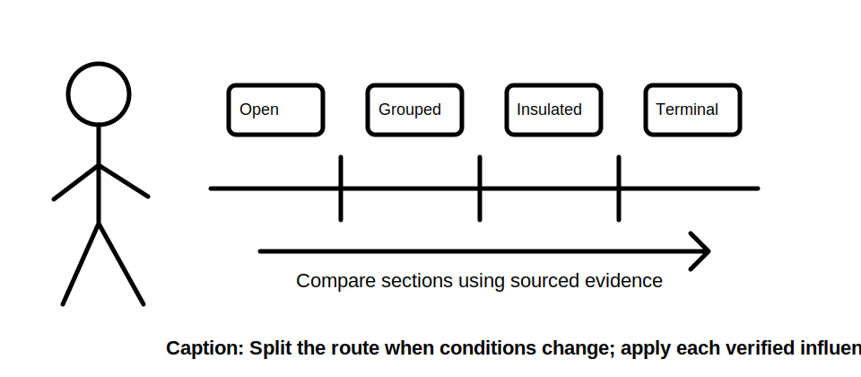
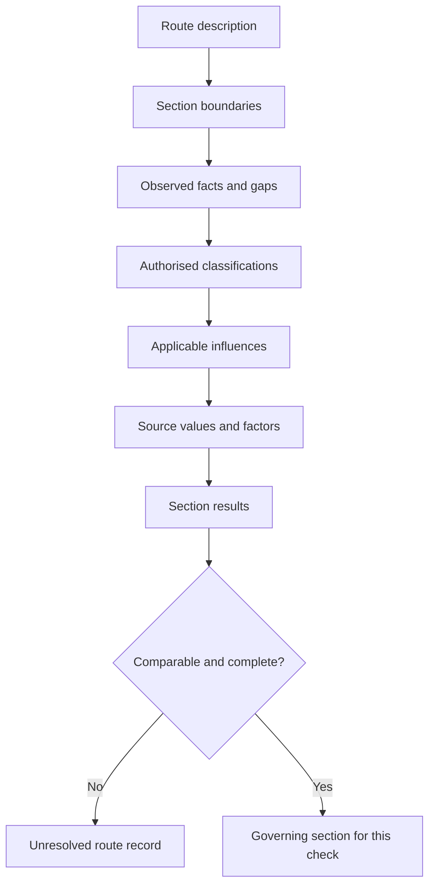

# Day 25 — Installation Methods, Environmental Influences and Derating

> **Currency and scope notice:** This module teaches classification and evidence control with fictional data. Exact installation classifications, correction factors, capacities and exceptions require current authorised verification. It is not `technically-reviewed`.

## 1. Outcome and entry check

By the end of this module, the learner should be able to:

1. define installation method, route section, environmental influence, grouping, thermal insulation and correction factor;
2. divide a route into sections where conditions materially differ;
3. apply the **C-O-N-D-I-T-I-O-N-S** workflow;
4. distinguish observed conditions from inferred classifications;
5. show where each verified factor is applied exactly once;
6. identify the governing route section without assuming it from appearance;
7. reopen affected calculations after a route or environment change; and
8. stop before unsupported classification, field inspection or approval.

### Entry check

Explain why a cable route may require more than one installation classification and why a factor cannot be selected merely because its label sounds plausible.

## 2. Why it matters

A conductor’s usable capacity depends on how and where it is installed. A route can pass through open air, enclosure, insulation, grouped regions, hot spaces or other conditions. Treating the whole route as one convenient condition can conceal the governing section and produce an unsupported design conclusion.

## 3. Core concepts and terminology

- **Installation method:** an authorised classification describing how a wiring system is installed for a stated design purpose.
- **Route section:** a portion of the route with materially consistent installation and environmental conditions.
- **Environmental influence:** a surrounding condition that may affect selection, capacity, protection or durability.
- **Grouping:** proximity of current-carrying circuits or conductors that may affect heat dissipation.
- **Thermal insulation influence:** interaction with insulation that may restrict heat loss.
- **Correction factor:** an authorised adjustment linked to a defined condition and source method.
- **Governing section:** the section that controls a particular design check after verified comparisons.
- **Double application:** applying the same influence more than once, directly or through already-adjusted source data.

## 4. Rule-finding workflow

Use **C-O-N-D-I-T-I-O-N-S**:

1. **C — Capture the route:** define start, end, length basis and supplied physical description.
2. **O — Outline sections:** split the route when enclosure, support, grouping, insulation, temperature or environment changes.
3. **N — Name observed facts:** separate direct evidence from assumptions and missing details.
4. **D — Determine the authorised classification:** use current source definitions and record uncertainty.
5. **I — Identify applicable influences:** include only influences supported for that section and method.
6. **T — Trace source values:** preserve source, units, included adjustments and limitations.
7. **I — Implement each factor once:** show the calculation path and prevent overlap.
8. **O — Order section results:** compare like-for-like results and identify the governing case.
9. **N — Note unresolved dependencies:** do not replace missing route evidence with a guess.
10. **S — State reopening triggers:** record which changes require reclassification or recalculation.

The governing section may differ between design checks; the diagram does not imply one section governs every requirement.

## 5. Visual model or worked example

A fictional route has four sections: clipped in a ventilated area, enclosed with other circuits, adjacent to thermal insulation, and terminating at equipment with a supplied limit. No official factor or capacity is reproduced.

The learner creates a section register, classifies evidence strength, applies supplied fictional factors once and discovers that the section with the smallest fictional corrected capacity is not automatically the only governing consideration because terminal and other checks remain separate.

### Worked-example fading

A second route describes grouping but omits whether the source capacity already incorporates that influence. Stop before multiplying and record the exact source clarification required.

## 6. Practical application

### Task A — route-section register

Create columns for section, physical evidence, classification source, environment, grouping, insulation, base value, included adjustments, additional factors, result and unresolved evidence.

### Task B — factor provenance audit

For each fictional factor, explain the represented condition, source, applicability evidence, calculation location and double-application control.

### Task C — changed-condition transfer

Change one section’s enclosure, grouping, insulation contact, ambient condition or route length. Reclassify only the affected evidence and identify downstream gates that reopen.

### Task D — assessment response

In 180 words, explain why “use the worst factor” is an inadequate cable-selection method.

### Assessment rubric

Score 0–2 for route segmentation, terminology, evidence separation, source tracing, factor control, governing-case reasoning and safety boundary. A score of **12–14**, with no zero in factor control or safety, supports progression.

## 7. Common errors and safety checkpoint

Common errors include using one classification for a mixed route, selecting a factor by name alone, combining incompatible source methods, applying an influence twice, overlooking short but material sections, assuming the numerically smallest result governs every check, and treating a drawing as proof of actual installation conditions.

Stop and escalate when route evidence is incomplete, classifications conflict, source data does not state included adjustments, practical access would be required, or a design approval or field decision is requested.

This module authorises no switching, isolation, opening, proving, tracing, measurement, testing, disconnection, reconnection, installation, alteration, repair, energisation, commissioning, certification or verification.

## 8. Retrieval and next links

### Closed-note retrieval

1. Recite C-O-N-D-I-T-I-O-N-S.
2. Define route section, governing section and double application.
3. Name six reasons to create a new route section.
4. Explain the difference between an observed condition and an authorised classification.
5. Give five reopening triggers and three stop conditions.

### Exit task

Submit Tasks A–D, the rubric score, one corrected error, one unresolved authorised-source question and one readiness statement for Day 26.

### Navigation

- **Plan:** [Twelve-Week Capstone Learning Plan](../MASTER_PLAN.md)
- **Knowledge note:** [[12-Week Day 25 - Installation Methods Environmental Influences and Derating]]
- **Previous:** [Day 24 — Complete Cable-Selection Workflow and Evidence Record](day-24-complete-cable-selection-workflow-and-evidence-record.md)
- **Next:** [Day 26 — Rest, Retrieval and Calculation Error-Log Correction](day-26-rest-retrieval-and-calculation-error-log-correction.md)

### Reference and currency notice

This module uses original explanations, workflows, fictional data and diagrams. It reproduces no standards tables, figures, systematic clause wording, exact official values or assessment material. Qualified review against current authorised sources is required.
