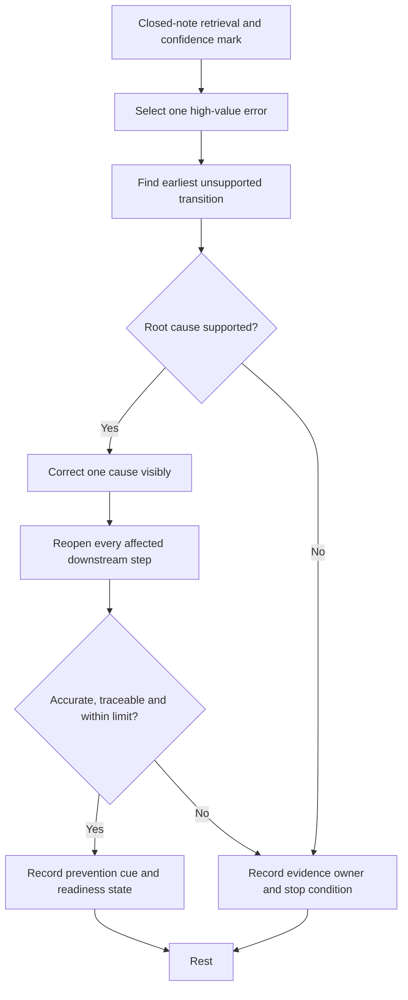
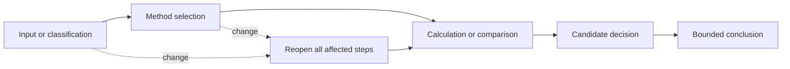

# Day 26 — Rest, Retrieval and Calculation Error-Log Correction

> **Recovery boundary:** This is a maximum 30-minute consolidation block. It introduces no new electrical theory, official values or field procedure. Stop early if fatigue, frustration or concentration loss prevents accurate correction.

## 1. Outcome and entry check

By the end of this module, the learner should be able to:

1. retrieve the purpose and first decision of the Day 22–25 workflows without notes;
2. classify an error as arithmetic, unit, evidence, method, transcription or conclusion related;
3. distinguish the earliest error from later symptoms caused by it;
4. apply the **R-E-P-A-I-R** correction workflow to no more than three selected errors;
5. label each supporting item as a stated fact, supported inference, assumption, contradiction or evidence gap;
6. reopen every downstream result affected by a corrected upstream input;
7. calibrate confidence against evidence rather than familiarity;
8. record unresolved questions, evidence owners and recheck triggers without guessing; and
9. make a bounded readiness decision for Day 27 using criterion-level evidence.

### Entry check

Set a timer for three minutes. From memory, write the purpose and first decision of L-O-A-D-S, R-A-T-I-N-G, S-E-L-E-C-T and C-O-N-D-I-T-I-O-N-S. Beside each answer, mark confidence as **high**, **medium** or **low** before consulting notes. A correct low-confidence answer and a correct high-confidence answer are not the same learning signal.

## 2. Why it matters

Recovery and correction prevent repeated mistakes from becoming habits. A wrong final number may come from correct arithmetic applied to the wrong method, while a correct-looking number may rest on unsupported inputs. Correcting only the visible number can leave the underlying evidence or method error untouched.

The purpose of this block is therefore not to clear an error log. It is to identify the earliest unsupported transition, repair one cause transparently, propagate the change through affected work and stop before fatigue creates new errors.

*Instructional caption: repair the earliest supported cause, recheck affected work, and stop when accuracy begins to fall.*

## 3. Core concepts and terminology

- **Error log:** a record of the error, cause, correction, affected work, evidence status and prevention cue.
- **Arithmetic error:** incorrect mathematical execution after the intended inputs and method are set.
- **Unit error:** incompatible, omitted or incorrectly converted units.
- **Evidence error:** use of an unsupported, stale, unclear, contradictory or misclassified input.
- **Method error:** selection or sequencing of an unsuitable rule, relationship or workflow.
- **Transcription error:** inaccurate copying of a value, symbol, label, condition or source reference.
- **Conclusion error:** a claim stronger than the evidence supports.
- **Root error:** the earliest error that causes one or more later errors or misleading results.
- **Symptom error:** a later incorrect value or conclusion produced by an earlier root error.
- **Downstream reopening:** repeating later steps affected by a corrected upstream input, method or classification.
- **First unsupported transition:** the earliest point where the reasoning moves beyond verified evidence. Later conclusions cannot be treated as secure until this point is repaired.
- **Evidence owner:** the authorised person, record or source needed to resolve an evidence gap or contradiction.
- **Recheck trigger:** a named change that requires the correction to be revisited, such as a confirmed rating, route condition, classification or authorised method.
- **Confidence calibration:** matching confidence to the strength of evidence and reasoning rather than to familiarity or a plausible-looking result.

### Evidence labels

Use one label beside every material input or claim:

- **stated fact** — supplied directly by the scenario or an identified source;
- **supported inference** — a conclusion justified by stated facts and an explained relationship;
- **assumption** — an unverified condition temporarily used for analysis;
- **contradiction** — two or more records or observations that cannot all be accepted together; or
- **evidence gap** — information required before the reasoning can continue securely.

### Criterion-level learning states

Assess each criterion separately:

- **secure** — accurate, traceable and repeatable under a changed scenario;
- **developing** — partly accurate but requiring a prompt, source check or clearer explanation;
- **unsupported** — the conclusion is not justified by the recorded evidence; or
- **`stop-required`** — continuing would cross a safety, authority or evidence boundary.

These are educational planning states, not official grades, competency decisions or legal classifications. Strong work in one criterion cannot cancel an unsupported or `stop-required` result elsewhere.

## 4. Rule-finding workflow

Use **R-E-P-A-I-R**:

1. **R — Retrieve first:** reconstruct the relevant workflow without notes and record confidence before checking.
2. **E — Expose the earliest error:** compare the attempt with supplied evidence and authorised method notes; separate the root error from downstream symptoms.
3. **P — Pinpoint category and evidence status:** classify the error and label each material input or claim.
4. **A — Amend one supported cause:** make one visible correction, explain why it is justified and do not fill unresolved gaps with convenient values.
5. **I — Identify downstream effects:** reopen every result, comparison and conclusion affected by the correction.
6. **R — Record readiness and rest:** add a prevention cue, evidence owner, recheck trigger and criterion-level readiness state, then stop within the time limit.

The diagram shows why the first task is not recalculation. The learner must first locate the earliest point where evidence or reasoning failed. If that point cannot be supported, the correct action is to document the gap and stop, not to manufacture a complete answer.

### Correction propagation model

A corrected upstream input or method can invalidate several later results. Repeating only the final arithmetic is insufficient when the classification, source or method has changed.

## 5. Visual model or worked example

A fictional error log shows a learner applying a supplied adjustment twice. The final value is lower than expected, but that value is only a symptom.

1. The learner identifies the source entry and the base-value note as stated facts.
2. The learner finds that the base value may already include the adjustment, creating a contradiction rather than an immediate arithmetic correction.
3. The **first unsupported transition** occurs where the learner applies the adjustment again without resolving applicability.
4. The evidence owner is the authorised source note or reviewer who can confirm whether the base value is pre-adjusted.
5. Until that evidence is resolved, the adjusted capacity, candidate comparison and readiness conclusion remain unsupported.

### Worked-example fading

A second entry contains a plausible final value but no units, no source for one input and a conclusion that the candidate is suitable. Complete only the following prompts:

- earliest unsupported transition;
- error category or categories;
- evidence labels;
- downstream steps to reopen;
- evidence owner;
- recheck trigger; and
- bounded conclusion.

Do not invent a missing unit, source value or suitability decision.

## 6. Practical application

### Task A — four-workflow retrieval

From memory, write each workflow name, purpose and first decision. Mark confidence before checking Days 22–25. Record:

- accurate and appropriately confident;
- accurate but under-confident;
- inaccurate but over-confident; or
- inaccurate and appropriately uncertain.

An inaccurate high-confidence response is a priority for repair because it can pass unnoticed during independent work.

### Task B — error-log triage

Select no more than three errors. Prioritise errors that are repeated, safety-relevant, method-related, over-confident or capable of changing several downstream results. Do not choose three versions of the same root error merely to increase the completed count.

### Task C — one visible repair per error

For each selected error, record:

| Field | Required entry |
|---|---|
| Original step | The exact input, method, calculation or conclusion being examined |
| Root or symptom | Whether this is the earliest cause or a downstream effect |
| Error category | Arithmetic, unit, evidence, method, transcription or conclusion |
| Evidence labels | Status of every material input or claim |
| First unsupported transition | Earliest point that cannot yet be justified |
| Supported correction | One visible repair, or a clear statement that repair must wait |
| Downstream reopening | Every later result and conclusion affected |
| Evidence owner | Person, record or authorised source needed for closure |
| Recheck trigger | New evidence or changed condition that requires reassessment |
| Prevention cue | A concise action that reduces recurrence |
| Learning state | Secure, developing, unsupported or `stop-required` |

### Task D — changed-context transfer

Take one repaired error and change at least two material conditions, such as the source rating, unit basis, installation condition, classification evidence or method applicability. Rebuild the reasoning from the earliest changed evidence. Do not copy the previous conclusion forward.

### Task E — readiness statement

Assess these criteria separately:

1. workflow retrieval;
2. root-cause classification;
3. evidence labelling;
4. downstream reopening;
5. changed-context transfer;
6. uncertainty and stop-condition control; and
7. confidence calibration.

State **ready for Day 27**, **ready with one named support**, or **not ready until one named prerequisite is repaired**. The overall statement must follow the weakest blocking criterion; strengths elsewhere do not cancel an unsupported or `stop-required` state.

### Time and stop controls

- Maximum total time: 30 minutes.
- Maximum selected errors: three.
- Maximum active repair at one time: one root error.
- Take a short pause after each repair.
- Stop if the same line is reread repeatedly, units or symbols are copied inaccurately, frustration rises, assumptions begin replacing evidence, or confidence falls below the level needed for transparent correction.
- Unfinished errors remain logged for a later supervised or authorised review; they are not failures of this recovery block.

## 7. Common errors and safety checkpoint

Common errors include:

- correcting arithmetic without checking evidence or method;
- repairing a symptom while leaving the root error unchanged;
- treating a plausible result as evidence of correctness;
- repeating the same calculator entry and calling it an independent check;
- converting an assumption into a fact through repetition;
- selecting too many errors and reducing correction quality;
- failing to propagate an upstream change through downstream work;
- hiding uncertainty to claim readiness; and
- studying past the point of useful concentration.

### Blocking conditions

Record `stop-required` and defer the issue when any of the following occurs:

- a current authorised source, value or interpretation is required but unavailable;
- contradictory evidence could materially change the method or conclusion;
- a missing unit, classification or source identity would have to be invented;
- the learner cannot identify which downstream work is affected;
- fatigue prevents accurate copying or explanation; or
- resolution would require practical inspection, measurement, testing or qualified judgement.

This recovery block authorises no field activity, switching, isolation, opening, proving, tracing, measurement, testing, disconnection, reconnection, installation, alteration, repair, energisation, commissioning, certification or verification.

## 8. Retrieval and next links

### Closed-note retrieval

1. Recite R-E-P-A-I-R.
2. Name the six error categories.
3. Distinguish a root error from a symptom error.
4. Define the first unsupported transition.
5. Explain downstream reopening in one sentence.
6. State the error and time limits.
7. Give three fatigue or evidence stop indicators.
8. Explain why confidence must be recorded before checking notes.

### Exit task

Submit the four-workflow retrieval, up to three corrected log entries, one changed-context transfer, one unresolved question with its evidence owner and recheck trigger, and the criterion-level readiness statement. Then stop studying for this block.

### Navigation

- **Plan:** [Twelve-Week Capstone Learning Plan](../MASTER_PLAN.md)
- **Knowledge note:** [[12-Week Day 26 - Rest Retrieval and Calculation Error-Log Correction]]
- **Previous:** [Day 25 — Installation Methods, Environmental Influences and Derating](day-25-installation-methods-environmental-influences-and-derating.md)
- **Next:** [Day 27 — Worked-Example Fading for Circuit Design](day-27-worked-example-fading-for-circuit-design.md)

### Reference and currency notice

This module contains original retrieval, recovery and error-correction activities. It reproduces no standards tables, figures, systematic clause wording, exact official values or assessment material. Unresolved technical matters remain `reference_check_required`, and this automated draft is not `technically-reviewed`.