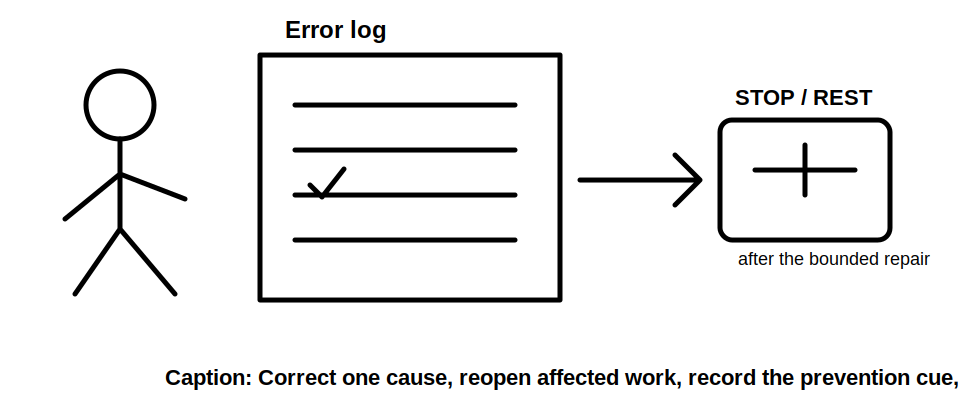
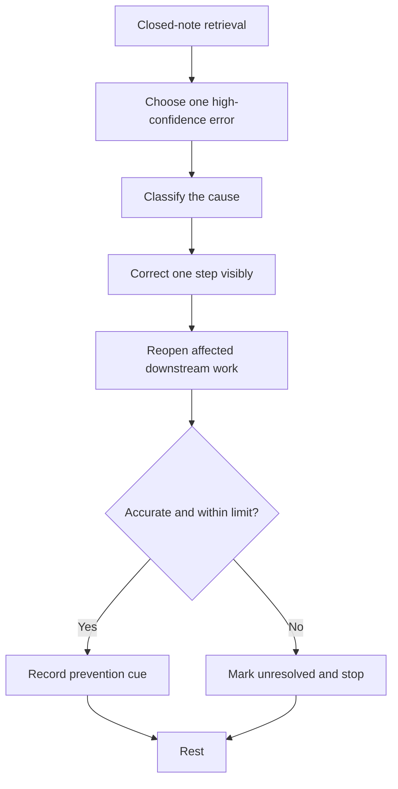

# Day 26 — Rest, Retrieval and Calculation Error-Log Correction

> **Recovery boundary:** This is a maximum 30-minute consolidation block. It introduces no new electrical theory, official values or field procedure. Stop early if fatigue, frustration or concentration loss prevents accurate correction.

## 1. Outcome and entry check

By the end of this module, the learner should be able to:

1. retrieve the Day 22–25 workflows without notes;
2. classify a calculation or design-record error by type;
3. apply the **R-E-P-A-I-R** correction workflow;
4. correct no more than three high-confidence errors;
5. distinguish arithmetic error from evidence, unit, method, transcription and conclusion errors;
6. identify which downstream results must be reopened after a correction;
7. record unresolved questions without guessing; and
8. make a bounded readiness decision for Day 27.

### Entry check

Set a timer for three minutes. From memory, write the purpose of L-O-A-D-S, R-A-T-I-N-G, S-E-L-E-C-T and C-O-N-D-I-T-I-O-N-S. Do not consult notes until the timer ends.

## 2. Why it matters

Recovery and correction prevent repeated mistakes from becoming habits. A wrong final number may come from correct arithmetic applied to the wrong method, while a correct-looking number may rest on unsupported inputs. The goal is not volume; it is accurate diagnosis, one transparent repair and deliberate rest.

## 3. Core concepts and terminology

- **Error log:** a record of the error, cause, correction, affected work and prevention cue.
- **Arithmetic error:** incorrect mathematical execution after the intended inputs and method are set.
- **Unit error:** incompatible, omitted or incorrectly converted units.
- **Evidence error:** use of an unsupported, stale, unclear or misclassified input.
- **Method error:** selection or sequencing of an unsuitable rule or workflow.
- **Transcription error:** inaccurate copying of a value, symbol, label or condition.
- **Conclusion error:** a claim stronger than the evidence supports.
- **Downstream reopening:** repeating later steps affected by a corrected upstream input.

## 4. Rule-finding workflow

Use **R-E-P-A-I-R**:

1. **R — Retrieve first:** reconstruct the relevant workflow without notes.
2. **E — Expose the error:** compare the attempt with supplied evidence and authorised method notes.
3. **P — Pinpoint the category:** arithmetic, unit, evidence, method, transcription or conclusion.
4. **A — Amend one cause:** make one visible correction and explain it.
5. **I — Identify downstream effects:** mark every result or conclusion that must be reopened.
6. **R — Record prevention and rest:** add a short cue, rate confidence and stop within the time limit.

The workflow prioritises correction quality and recovery over completing every outstanding task.

## 5. Visual model or worked example

A fictional error log shows a learner applying a supplied factor twice. The correction is not merely deleting one multiplication: the learner identifies the factor’s source, checks whether the base value already includes it, recalculates the affected section and reopens the candidate comparison and bounded conclusion.

### Worked-example fading

A second entry contains a plausible final value but no units and no source for one input. Classify the errors, repair only what the supplied evidence supports and leave the unresolved input open.

## 6. Practical application

### Task A — four-workflow retrieval

From memory, write each workflow name, purpose and first decision. Then check against Days 22–25 and mark omissions without rewriting the full modules.

### Task B — error-log triage

Select up to three errors from recent work. Prioritise errors that are repeated, safety-relevant, method-related or capable of changing several downstream results.

### Task C — one visible repair per error

For each selected error, record: original step, category, cause, corrected step, downstream work reopened, prevention cue and remaining uncertainty.

### Task D — readiness statement

Choose one outcome: ready for Day 27; ready with one named support; or not ready until one named prerequisite is repaired. Give evidence for the choice.

### Time and stop controls

- Maximum total time: 30 minutes.
- Maximum corrected errors: three.
- Take a short pause after each repair.
- Stop if the same line is reread repeatedly, units or symbols are being copied inaccurately, frustration rises, or confidence falls below the level needed for transparent correction.

## 7. Common errors and safety checkpoint

Common errors include correcting arithmetic without checking method, rewriting an entire solution instead of isolating the cause, selecting too many errors, hiding uncertainty to achieve completion, failing to reopen downstream work, and studying past the point of useful concentration.

Stop and defer any issue that requires an authorised technical interpretation, current source value, practical inspection, measurement, testing or qualified judgement. This recovery block authorises no field activity, switching, isolation, opening, proving, testing, alteration, repair, energisation, commissioning, certification or verification.

## 8. Retrieval and next links

### Closed-note retrieval

1. Recite R-E-P-A-I-R.
2. Name the six error categories.
3. Explain downstream reopening in one sentence.
4. State the error limit and total time limit.
5. Give three fatigue stop indicators.

### Exit task

Submit the four-workflow retrieval, up to three corrected log entries, one unresolved question and the bounded readiness statement. Then stop studying for this block.

### Navigation

- **Plan:** [Twelve-Week Capstone Learning Plan](../MASTER_PLAN.md)
- **Knowledge note:** [[12-Week Day 26 - Rest Retrieval and Calculation Error-Log Correction]]
- **Previous:** [Day 25 — Installation Methods, Environmental Influences and Derating](day-25-installation-methods-environmental-influences-and-derating.md)
- **Next:** Day 27 — Worked-Example Fading for Circuit Design

### Reference and currency notice

This module contains original retrieval, recovery and error-correction activities. It reproduces no standards tables, figures, systematic clause wording, exact official values or assessment material. Unresolved technical matters remain `reference_check_required`.
