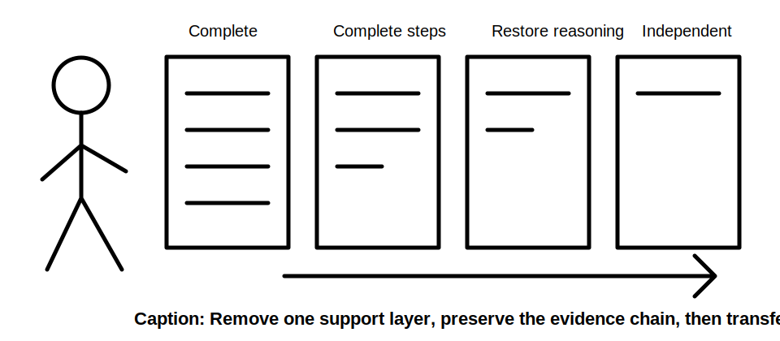
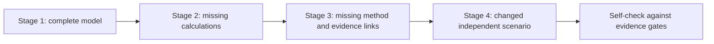

# Day 27 — Worked-Example Fading for Circuit Design

> **Scope boundary:** This is a written design-reasoning exercise using fictional data. It does not authorise field inspection, switching, isolation, testing, installation, alteration, certification or technical approval.

## 1. Outcome and entry check

By the end of this module, the learner should be able to:

1. reconstruct the complete circuit-design evidence chain without copying a finished solution;
2. identify which steps remain supplied, prompted or independently completed at each fading stage;
3. apply the **F-A-D-E** workflow to three progressively less-supported examples;
4. distinguish an unresolved dependency from an arithmetic omission;
5. reopen downstream decisions when an upstream input changes;
6. write a bounded candidate conclusion that matches the evidence grade;
7. diagnose one reasoning error in another learner’s attempt; and
8. state readiness for the independent Day 28 checkpoint using observable evidence.

### Entry check

Without notes, list the design boundary, load evidence, protective-device role, conductor conditions, voltage consideration, fault consideration, terminal constraint and final evidence record. Mark any item you cannot explain in one sentence.

## 2. Why it matters

A fully worked example can create recognition without independent performance. Fading removes support in controlled steps so the learner must retrieve the sequence, select evidence and explain dependencies rather than imitate formatting. The aim is not speed; it is reliable transfer to a changed scenario.

## 3. Core concepts and terminology

- **Worked example:** a complete model showing inputs, reasoning, intermediate decisions and a bounded conclusion.
- **Fading:** planned removal of prompts or completed steps as competence increases.
- **Completion problem:** an exercise where selected steps are missing but the surrounding chain remains visible.
- **Independent transfer:** applying the workflow to a materially changed scenario without copied wording.
- **Scaffold:** temporary support such as a prompt, partially completed register or decision cue.
- **Dependency:** evidence needed before a later decision can be supported.
- **Reopening trigger:** a changed condition that invalidates or weakens downstream work.
- **Evidence grade:** described, supported or verified; the grade limits the strength of the conclusion.

## 4. Rule-finding workflow

Use **F-A-D-E**:

1. **F — Frame the boundary:** identify circuit purpose, source, load case, route, supplied evidence and explicit exclusions.
2. **A — Audit the chain:** check every design gate and mark supplied, independently derived or unresolved.
3. **D — Do the missing work:** complete only the steps supported by the fictional evidence and authorised learning sources.
4. **E — Evaluate and explain:** reopen affected steps, grade the evidence and state a bounded conclusion.

The diagram shows that support is removed by layer. A learner should not advance merely because the final number matches; the evidence chain must also remain traceable.

## 5. Visual model or worked example

### Stage 1 — annotate a complete example

A fictional final subcircuit example supplies a load register, design current, device function, route sections, sourced capacity data, candidate conductor, voltage consideration, fault consideration, terminal information and bounded conclusion. Label each item as fact, supplied rule, derived value, unresolved dependency or conclusion.

### Stage 2 — complete missing transformations

The same example removes the arithmetic and candidate comparison. Reconstruct the missing transformations, show units and state which downstream gates remain provisional.

### Stage 3 — restore missing reasoning

A second example supplies values but omits method selection, source provenance and reopening logic. Add those elements without treating the supplied values as automatically authoritative.

### Stage 4 — independent transfer

A changed scenario alters the route, one operating case and one terminal condition. Build a fresh evidence record rather than editing the previous conclusion.

## 6. Practical application

### Task A — support map

For each fading stage, create three columns: supplied support, learner responsibility and stop/escalation condition.

### Task B — evidence-gate completion

Complete the design chain using the sequence from Days 22–25. Use `reference_check_required` wherever the fictional pack does not supply an authorised method or value.

### Task C — changed-condition propagation

Choose one changed input and identify every affected downstream step. Explain why unaffected steps can remain closed.

### Task D — peer-attempt diagnosis

Review a fictional attempt containing one hidden evidence error, one unit error and one overclaimed conclusion. Classify each error and repair the reasoning, not just the final value.

### Task E — readiness statement

Select one: ready for Day 28; ready with one named scaffold; or not ready until one named prerequisite is repaired. Cite at least three observable pieces of evidence.

## 7. Common errors and safety checkpoint

Common errors include copying the model’s wording, removing several support layers at once, treating a supplied number as a verified rule, completing an unresolved gate by assumption, changing an upstream input without reopening later work, and judging success only by the final number.

Stop and mark `reference_check_required` when an exact clause, limit, device characteristic, conductor capacity, correction factor, test criterion or jurisdiction-specific requirement is needed. This module authorises no practical electrical work or qualified technical determination.

## 8. Retrieval and next links

### Closed-note retrieval

1. Recite F-A-D-E.
2. Define fading and independent transfer.
3. Name the five evidence-chain items most likely to be hidden by a correct-looking final number.
4. Explain one reopening trigger.
5. State why matching the model answer is insufficient evidence of competence.

### Exit task

Submit the four-stage support map, one completed evidence record, one changed-condition propagation trace, the diagnosed peer attempt and the bounded readiness statement.

### Navigation

- **Plan:** [Twelve-Week Capstone Learning Plan](../MASTER_PLAN.md)
- **Knowledge note:** [[12-Week Day 27 - Worked-Example Fading for Circuit Design]]
- **Previous:** [Day 26 — Rest, Retrieval and Calculation Error-Log Correction](day-26-rest-retrieval-and-calculation-error-log-correction.md)
- **Next:** [Day 28 — Week 4 Independent Circuit-Design Checkpoint](day-28-week-4-independent-circuit-design-checkpoint.md)

### Reference and currency notice

All scenarios, workflows and assessment tasks are original educational constructs. Exact technical rules and values remain `reference_check_required`; this module is not `technically-reviewed`.