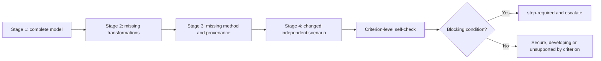
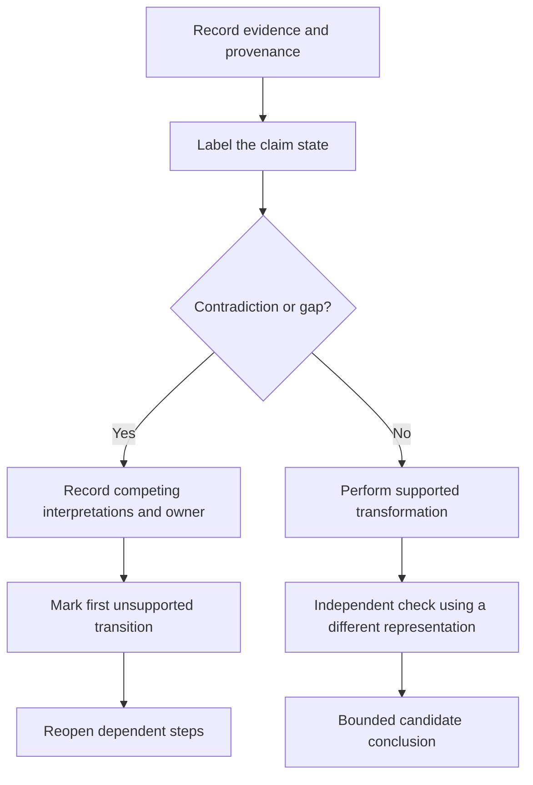

# Day 27 — Worked-Example Fading for Circuit Design

> **Scope boundary:** This is a written design-reasoning exercise using fictional data. It does not authorise field inspection, switching, isolation, testing, installation, alteration, certification or technical approval.

## 1. Outcome and entry check

By the end of this module, the learner should be able to:

1. reconstruct the complete circuit-design evidence chain without copying a finished solution;
2. identify which steps remain supplied, prompted or independently completed at each fading stage;
3. apply the **F-A-D-E** workflow to three progressively less-supported examples;
4. label each claim as a stated fact, derived fact, supported inference, assumption, contradiction or evidence gap;
5. identify the **first unsupported transition** in a reasoning chain and stop stronger downstream claims at that point;
6. reopen every affected downstream decision when an upstream input, classification or source changes;
7. diagnose one reasoning error and one confidence-calibration error in another learner’s attempt; and
8. state readiness for the independent Day 28 checkpoint using criterion-level evidence rather than an aggregate score.

### Entry check

Without notes, reconstruct this sequence: design boundary, load evidence, design-current reasoning, protective-device role, installation conditions, conductor-capacity evidence, voltage consideration, fault consideration, terminal constraint and bounded conclusion. For each item, mark your confidence as **guessing**, **unsure**, **reasonably confident** or **certain**. A correct guess is not yet secure evidence; a high-confidence unsupported answer requires priority remediation.

## 2. Why it matters

A fully worked example can create recognition without independent performance. Fading removes support in controlled steps so the learner must retrieve the sequence, select evidence and explain dependencies rather than imitate formatting. The aim is not speed or answer matching. It is traceable transfer to a changed scenario, with unsupported claims exposed before they propagate into later design decisions.

*Instructional caption: remove one support layer at a time, then verify that the learner can still explain the evidence chain and its limits.*

## 3. Core concepts and terminology

- **Worked example:** a complete model showing inputs, reasoning, intermediate decisions and a bounded conclusion.
- **Fading:** planned removal of prompts or completed steps as competence increases.
- **Completion problem:** an exercise where selected steps are missing but the surrounding chain remains visible.
- **Independent transfer:** applying the workflow to a materially changed scenario without copied wording.
- **Scaffold:** temporary support such as a prompt, partially completed register or decision cue.
- **Dependency:** evidence needed before a later decision can be supported.
- **Reopening trigger:** a changed condition that invalidates or weakens downstream work.
- **Evidence provenance:** the recorded origin, authority, applicability and currency of an input or rule.
- **First unsupported transition:** the earliest step where the reasoning moves from supported evidence to an assumption, unresolved contradiction or evidence gap.
- **Evidence state:** one of six labels used in this module: **stated fact**, **derived fact**, **supported inference**, **assumption**, **contradiction** or **evidence gap**.
- **Criterion-level readiness:** a separate judgement for each required capability rather than one total score.
- **Secure:** independently demonstrated with traceable evidence and no blocking condition.
- **Developing:** partly demonstrated but still dependent on a named scaffold or repair.
- **Unsupported:** not demonstrated with adequate evidence.
- **`stop-required`:** a blocking safety, authority, source or contradiction condition prevents progression regardless of strengths elsewhere.

## 4. Rule-finding workflow

Use **F-A-D-E**:

1. **F — Frame the boundary:** identify circuit purpose, source, load case, route, supplied evidence, authority limits and explicit exclusions.
2. **A — Audit the chain:** check every design gate; label each item by evidence state; record provenance, owner and any competing interpretation.
3. **D — Do the missing work:** complete only steps supported by the fictional evidence and authorised learning sources. Stop at the first unsupported transition.
4. **E — Evaluate and explain:** reopen affected steps, apply criterion-level readiness states and write a conclusion no stronger than the weakest essential evidence gate.

The diagram shows that support is removed by layer, but progression is not automatic. A correct final number cannot bypass a missing source, unresolved contradiction or safety boundary.

### Claim-control sequence

This sequence prevents a supplied value, familiar pattern or repeated calculator entry from being mistaken for independent verification. A different representation could be dimensional checking, a dependency map or a separately reconstructed calculation path.

## 5. Visual model or worked example

### Fictional scenario pack

A fictional workshop final-subcircuit pack contains:

- an equipment schedule and a later manufacturer sheet with different stated operating information;
- a route drawing that shows one installation condition and a maintenance note that suggests a later route alteration;
- a proposed protective device whose role is stated but whose full suitability is not established;
- a terminal note whose applicability depends on resolving the equipment identity; and
- no authorised source extract for any exact capacity, correction factor or acceptance limit.

The disagreement is deliberate. Do not select the more convenient record. Keep both interpretations open, assign an evidence owner and record the event that would permit rechecking.

### Stage 1 — annotate a complete example

A complete model supplies a load register, design-current reasoning, device function, route sections, sourced fictional capacity data, candidate conductor, voltage consideration, fault consideration, terminal information and bounded conclusion. Label every line by evidence state and identify which essential gate controls the conclusion.

### Stage 2 — complete missing transformations

The same example removes arithmetic, unit handling and candidate comparison. Reconstruct the missing transformations, show units, use a second representation to check the result and state which downstream gates remain provisional.

### Stage 3 — restore missing reasoning

A second example supplies values but omits method selection, source provenance, competing interpretations and reopening logic. Add those elements without treating supplied values as automatically authoritative. Mark the first unsupported transition.

### Stage 4 — independent transfer

A changed scenario alters at least two material conditions: the route classification evidence and one equipment or terminal condition. Build a fresh evidence record rather than editing the previous conclusion. Explain which earlier steps remain reusable and which must be reopened.

## 6. Practical application

### Task A — support map

For each fading stage, create four columns: supplied support, learner responsibility, evidence state and stop/escalation condition. Identify the exact support removed between stages.

### Task B — evidence-gate completion

Complete the design chain using the sequence from Days 22–25. For each gate, record:

- claim and evidence state;
- provenance and applicability;
- transformation or decision;
- evidence owner for unresolved items;
- recheck trigger; and
- dependent steps that must reopen if the item changes.

Use `reference_check_required` wherever the fictional pack does not supply an authorised method or value.

### Task C — first unsupported transition

Trace the scenario from source evidence to candidate conclusion. Circle the earliest unsupported transition. Rewrite every later statement so it does not imply that the unresolved step has been verified.

### Task D — changed-condition propagation

Change at least two material conditions, such as route evidence plus equipment identity. Rebuild the affected reasoning chain. Do not merely replace the final number or conclusion. Explain why any unaffected gate can remain closed.

### Task E — peer-attempt diagnosis

Review a fictional attempt containing:

- one hidden provenance error;
- one unit or transformation error;
- one ignored contradiction;
- one overclaimed conclusion; and
- one high-confidence unsupported statement.

Classify each error, identify the root error rather than only downstream symptoms, and repair the reasoning.

### Task F — criterion-level readiness statement

Judge each criterion separately:

1. sequence reconstruction;
2. evidence labelling and provenance;
3. supported transformations and unit control;
4. contradiction and first-unsupported-transition handling;
5. downstream reopening;
6. independent transfer under two changed conditions;
7. bounded conclusion; and
8. safety and authority boundaries.

Assign **secure**, **developing**, **unsupported** or `stop-required` to each. Cite observable evidence. Do not average or total the states.

### Blocking conditions

Any of the following requires `stop-required` for the affected exercise:

- an exact technical value, classification or method is invented;
- a contradiction affecting an essential gate is ignored;
- an unsupported step is presented as verified;
- an upstream change is not propagated through dependent decisions;
- copied wording substitutes for independent reasoning;
- a practical electrical action is proposed outside authorised supervision; or
- an official assessment or compliance conclusion is claimed without evidence.

Strength in another criterion cannot cancel a blocking condition.

## 7. Common errors and safety checkpoint

Common errors include copying the model’s wording, removing several support layers at once, treating a supplied number as a verified rule, completing an unresolved gate by assumption, changing an upstream input without reopening later work, repeating the same calculator entry as an independent check, hiding contradictions by choosing the convenient source, and judging success only by the final number.

Stop and mark `reference_check_required` when an exact clause, limit, device characteristic, conductor capacity, correction factor, test criterion or jurisdiction-specific requirement is needed. This module authorises no switching, isolation, opening, proving, tracing, measurement, testing, disconnection, reconnection, installation, alteration, repair, energisation, commissioning, certification or verification.

## 8. Retrieval and next links

### Closed-note retrieval

1. Recite F-A-D-E and explain the purpose of each step.
2. Define fading, evidence provenance and independent transfer.
3. Name the six evidence states.
4. Explain the first unsupported transition and why later claims must be bounded by it.
5. Give two examples of reopening triggers.
6. State why matching a model answer or repeating a calculator entry is insufficient evidence of competence.
7. Name the four criterion-level readiness states and explain why they are not totalled.

### Exit task

Submit the four-stage support map, one completed evidence record, one first-unsupported-transition trace, one two-condition transfer exercise, the diagnosed peer attempt and the criterion-level readiness statement.

### Navigation

- **Plan:** [Twelve-Week Capstone Learning Plan](../MASTER_PLAN.md)
- **Knowledge note:** [[12-Week Day 27 - Worked-Example Fading for Circuit Design]]
- **Previous:** [Day 26 — Rest, Retrieval and Calculation Error-Log Correction](day-26-rest-retrieval-and-calculation-error-log-correction.md)
- **Next:** [Day 28 — Week 4 Independent Circuit-Design Checkpoint](day-28-week-4-independent-circuit-design-checkpoint.md)

### Reference and currency notice

All scenarios, workflows, diagrams and assessment tasks are original educational constructs. Exact technical rules and values remain `reference_check_required`; this module is not `technically-reviewed`.