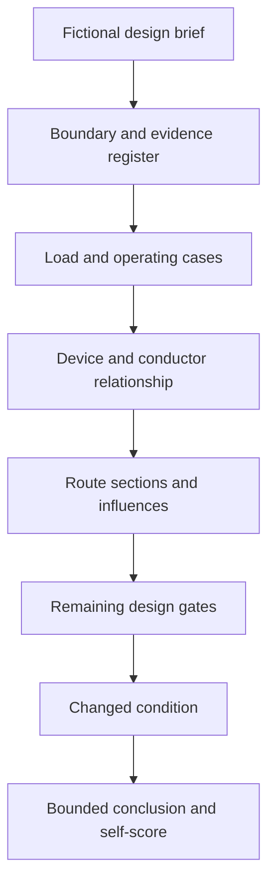

# Day 28 — Week 4 Independent Circuit-Design Checkpoint

> **Checkpoint boundary:** This is an educational written checkpoint using fictional evidence. It is not an official assessment and does not authorise design approval, installation, testing, certification or field activity.

## 1. Outcome and entry check

By the end of this module, the learner should be able to:

1. independently define a circuit-design boundary from a fictional brief;
2. construct a traceable load and operating-case record;
3. relate design current, protective-device purpose and conductor capacity without collapsing them into one decision;
4. segment the route and record relevant installation influences;
5. identify voltage, fault, terminal and evidence gates that remain unresolved;
6. propagate one changed condition through the design record;
7. issue a bounded conclusion using described, supported or verified claim language; and
8. score the attempt against the checkpoint rubric and prescribe one remediation action.

### Entry check

In five minutes, reconstruct the Days 22–27 workflow names and write one sentence describing the purpose of each. Use no notes until the timer ends.

## 2. Why it matters

A cumulative checkpoint tests whether separate concepts can be coordinated under reduced support. It exposes gaps hidden by topic-by-topic success, especially unsupported demand assumptions, incomplete route evidence and conclusions that outrun the available sources.

## 3. Core concepts and terminology

- **Checkpoint:** a bounded learning assessment used to identify readiness and remediation needs.
- **Independent attempt:** work completed without a model solution or step-by-step prompts.
- **Design gate:** a required evidence category that must be addressed before a conclusion can be strengthened.
- **Critical error:** an error that overrides the numerical score because it creates unsafe reasoning or conceals a material dependency.
- **Remediation prescription:** one specific corrective task tied to observed evidence.
- **Claim grade:** described, supported or verified; automated learning content cannot establish qualified verification.
- **Audit trail:** a reviewer-readable chain from source evidence through transformations to conclusion.

## 4. Rule-finding workflow

Use **C-H-E-C-K-P-O-I-N-T**:

1. **C — Clarify the boundary.**
2. **H — Harvest supplied evidence.**
3. **E — Establish load and operating cases.**
4. **C — Connect current, device and conductor roles.**
5. **K — Keep route sections and influences distinct.**
6. **P — Preserve unresolved protection, voltage, fault and terminal gates.**
7. **O — Observe change propagation.**
8. **I — Issue a bounded conclusion.**
9. **N — Note evidence grade and critical errors.**
10. **T — Target one remediation action.**

The model makes the remaining gates visible. A candidate conductor is not an approved design merely because early current and capacity comparisons appear satisfactory.

## 5. Visual model or worked example

### Independent scenario

A fictional small workshop brief supplies equipment descriptions, operating combinations, a route sketch, candidate device information, selected source extracts and terminal data. Some technical evidence is deliberately absent.

The learner must produce:

- a boundary statement;
- a load register and governing operating case;
- a device-purpose statement;
- route-section and influence register;
- candidate comparison;
- unresolved-gate list;
- changed-condition propagation trace; and
- bounded conclusion.

No completed calculation sequence is provided. Missing authorised criteria must remain open rather than being guessed.

## 6. Practical application

### Part A — independent response

Complete the scenario in 60 minutes. Spend no more than 10 minutes on source locating and record every unresolved dependency.

### Part B — changed condition

After the first conclusion, reveal one changed route condition and one changed operating assumption. Reopen only the affected steps and explain the scope of the change.

### Part C — rubric

Score two points each for: boundary; evidence classification; load case; device-role reasoning; conductor-condition reasoning; route segmentation; remaining-gate control; change propagation; bounded conclusion; and audit clarity. Maximum: 20.

### Critical-error gates

Regardless of score, remediation is required if the attempt invents a technical value, treats a provisional candidate as approved, omits a material load, applies an unsupported factor, conceals an unresolved safety dependency or authorises practical work.

### Readiness bands

- **16–20 with no critical error:** proceed, recording one refinement target.
- **11–15 with no critical error:** proceed with one named scaffold and targeted repair.
- **0–10 or any critical error:** complete the prescribed remediation before Day 29.

These are original learning bands, not official assessment criteria.

## 7. Common errors and safety checkpoint

Common errors include rushing to a cable size, using connected load as maximum demand without a supported method, merging different route conditions, applying a factor twice, omitting terminal or fault dependencies, and writing “complies” when only a fictional candidate comparison has been completed.

The scenario is desk-based. Stop when a conclusion would require an exact clause, official limit, test result, manufacturer determination, network requirement or qualified judgement. Mark the item `reference_check_required`.

## 8. Retrieval and next links

### Closed-note retrieval

1. Recite C-H-E-C-K-P-O-I-N-T.
2. Name the ten rubric categories.
3. Give three critical errors.
4. Explain why a high numerical score cannot override a critical error.
5. State the difference between a candidate and an approved design.

### Exit task

Submit the independent response, changed-condition trace, rubric, critical-error check and one remediation prescription.

### Navigation

- **Plan:** [Twelve-Week Capstone Learning Plan](../MASTER_PLAN.md)
- **Knowledge note:** [[12-Week Day 28 - Week 4 Independent Circuit-Design Checkpoint]]
- **Previous:** [Day 27 — Worked-Example Fading for Circuit Design](day-27-worked-example-fading-for-circuit-design.md)
- **Next:** [Day 29 — Voltage-Drop Concepts and Calculation Structure](day-29-voltage-drop-concepts-and-calculation-structure.md)

### Reference and currency notice

The scenario, rubric and workflow are original. Exact technical methods, criteria and values remain `reference_check_required`. This checkpoint is not an official assessment and is not `technically-reviewed`.