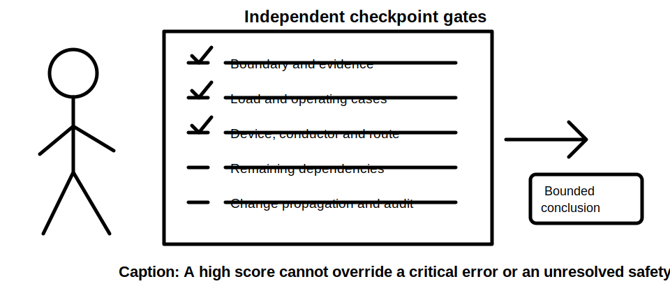
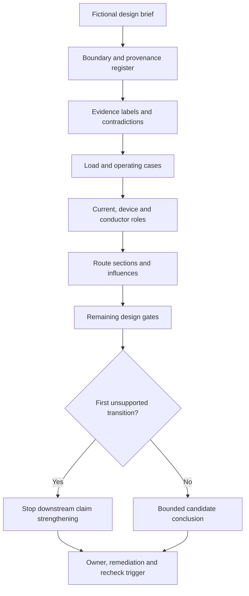
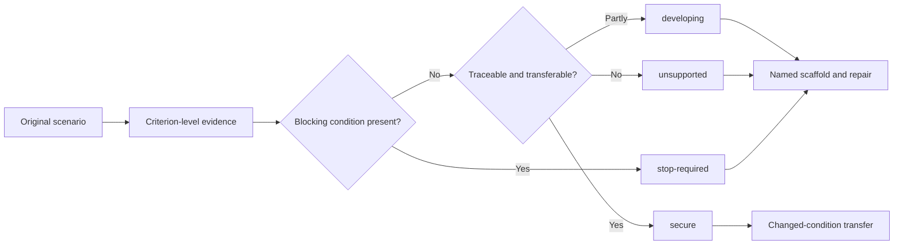

# Day 28 — Week 4 Independent Circuit-Design Checkpoint

> **Checkpoint boundary:** This is an original, desk-based educational checkpoint using fictional evidence. It is not an official assessment and does not authorise design approval, installation, inspection, testing, certification or field activity.

## 1. Outcome and entry check

By the end of this module, the learner should be able to:

1. define a circuit-design boundary from a fictional brief and identify what is outside scope;
2. classify each supplied item as a stated fact, derived fact, supported inference, assumption, contradiction or evidence gap;
3. construct a traceable load and operating-case record without inventing maximum-demand treatment;
4. distinguish design current, protective-device role, conductor capacity and unresolved design gates;
5. segment a route and record the provenance of each installation influence;
6. identify the first unsupported transition in a design claim chain;
7. propagate at least two changed material conditions through every affected step;
8. issue a bounded conclusion and criterion-level remediation decision; and
9. explain why no strength elsewhere can offset a safety, authority, contradiction or evidence blocker.

### Entry check

Without notes, reconstruct the Days 22–27 workflow names. For each workflow, record:

- its purpose in one sentence;
- one dependency it cannot resolve by itself; and
- confidence as **high**, **medium** or **low** before checking the source.

A correct answer with low confidence is not yet secure retrieval. A high-confidence unsupported answer is a priority remediation item.

## 2. Why it matters

A cumulative checkpoint tests whether separate ideas remain coordinated when prompts and modelled steps are removed. Circuit-design work can appear numerically complete while depending on an unidentified load, an unsupported operating assumption, a route classification copied from an outdated drawing or an unresolved terminal limitation. The checkpoint therefore assesses the integrity of the reasoning chain, not merely whether a candidate value was produced.

*Instructional caption: Check the evidence supporting every gate; an early successful comparison cannot close a later unresolved dependency.*

## 3. Core concepts and terminology

- **Checkpoint:** a bounded learning assessment used to identify readiness and remediation needs; it is not an official competency decision.
- **Independent attempt:** work completed without a model solution or step-by-step prompts, while still observing source and safety boundaries.
- **Design boundary:** the stated equipment, circuit, route, operating conditions and decisions included in the fictional task.
- **Design gate:** an evidence category that must be addressed before a related conclusion can be strengthened.
- **Claim chain:** the ordered links from source evidence through classification, calculation or interpretation to a conclusion.
- **First unsupported transition:** the earliest point where a claim moves beyond the evidence supporting it; later conclusions depending on that point remain unsupported.
- **Evidence provenance:** where an item came from, including document identity, revision or scenario source.
- **Stated fact:** information explicitly supplied by a named source.
- **Derived fact:** a result produced transparently from stated inputs using a supported relationship.
- **Supported inference:** a reasoned interpretation for which the evidence and limitations are visible.
- **Assumption:** an unverified proposition temporarily used to explore a scenario; it cannot establish compliance or approval.
- **Contradiction:** two or more relevant evidence items that cannot all describe the same condition accurately.
- **Evidence gap:** information required for a decision but not supplied or verified.
- **Evidence owner:** the authorised person or source responsible for resolving a gap or contradiction.
- **Recheck trigger:** a stated event that requires affected reasoning to be reopened.
- **Competing interpretations:** two plausible readings retained when available evidence does not justify choosing one.
- **Blocking condition:** a safety, authority, contradiction or evidence failure that prevents progression regardless of strengths elsewhere.
- **Criterion-level state:** **secure**, **developing**, **unsupported** or `stop-required` for one observable capability.
- **Secure:** the criterion is completed accurately, traceably and within authority boundaries.
- **Developing:** the method is substantially sound but needs a named scaffold or correction.
- **Unsupported:** the conclusion or method lacks sufficient evidence and must be repaired before it is relied upon.
- **`stop-required`:** progression is blocked because the work invents evidence, exceeds authority, conceals a contradiction or creates unsafe reasoning.
- **Remediation prescription:** one specific corrective task tied to observed evidence.
- **Bounded conclusion:** a statement that distinguishes what is described, supported, unresolved and outside the learner’s authority.
- **Audit trail:** a reviewer-readable chain from source evidence through transformations to conclusion.

## 4. Rule-finding workflow

Use **C-H-E-C-K-P-O-I-N-T**:

1. **C — Clarify the boundary.** Identify included equipment, circuit extent, route, supplied conditions and excluded decisions.
2. **H — Harvest and label evidence.** Record provenance and classify each item before using it.
3. **E — Establish load and operating cases.** Separate connected load, supported operating combinations and unresolved demand treatment.
4. **C — Connect current, device and conductor roles.** Keep each quantity and protective purpose distinct.
5. **K — Keep route sections and influences distinct.** Record the source and confidence for every classification or influence.
6. **P — Preserve unresolved gates.** Leave voltage, fault, terminal, coordination and source-applicability questions open when evidence is absent.
7. **O — Observe claim boundaries and changes.** Mark the first unsupported transition and reopen all affected steps when conditions change.
8. **I — Issue a bounded conclusion.** State only what the evidence supports and identify the evidence owner for unresolved items.
9. **N — Note criterion states and blockers.** Assess each capability independently; do not average away a blocker.
10. **T — Target remediation and recheck triggers.** Prescribe one specific repair and state what new evidence would reopen the conclusion.

The diagram makes claim control visible. Reaching an early current or capacity comparison does not establish that later voltage, fault, terminal, coordination or applicability gates are satisfied.

This readiness model prevents an aggregate score from hiding a critical weakness. A learner may be secure in load organisation and still be `stop-required` for inventing a route classification or approving practical work.

## 5. Visual model or worked example

### Independent fictional scenario

A small workshop brief contains:

- an equipment schedule with two alternative ratings for one machine;
- an operating note stating that two loads are normally interlocked;
- a maintenance record indicating the interlock was bypassed during recent troubleshooting;
- a route sketch showing one installation condition;
- a later renovation note suggesting part of the route was enclosed differently;
- candidate protective-device information;
- a partial terminal-data sheet; and
- selected original source extracts that do not provide every required criterion.

The learner must not choose the convenient version. Record competing interpretations:

- **Interpretation A:** the documented interlock remains effective and the original route sketch is current.
- **Interpretation B:** the interlock state and altered route remain unresolved, so the governing operating case and route influence cannot be finalised.

The learner must produce:

1. a scope and exclusion statement;
2. an evidence-provenance register;
3. contradiction and evidence-gap entries;
4. a load register and competing operating cases;
5. separate device-role and conductor-condition statements;
6. route-section and influence records;
7. a claim chain showing the first unsupported transition;
8. an unresolved-gate list with evidence owners;
9. a bounded candidate conclusion; and
10. recheck triggers.

A defensible response may remain incomplete. Missing authorised criteria, contradictory records or unresolved equipment identity must remain open rather than being guessed.

## 6. Practical application

### Part A — independent response

Complete the scenario in 60 minutes. Spend no more than 10 minutes locating the supplied sources. Record confidence before checking each of these items:

- governing equipment rating;
- valid operating case;
- route classification;
- factor applicability;
- device purpose; and
- conclusion strength.

### Part B — changed-condition transfer

After the first conclusion, reveal both of these changes:

1. the operating control is confirmed unavailable; and
2. a route section is confirmed to pass through a different thermal environment.

Reopen every affected step. Do not patch only the final comparison. Show which unaffected evidence remains valid and which derived facts, supported inferences and candidate conclusions must be recalculated or downgraded.

### Part C — criterion-level checkpoint record

Assess each criterion separately:

| Criterion | Observable evidence | State |
|---|---|---|
| Boundary control | Included and excluded decisions are explicit | secure / developing / unsupported / `stop-required` |
| Evidence provenance | Sources, revisions and labels are traceable | secure / developing / unsupported / `stop-required` |
| Contradiction handling | Competing interpretations remain visible until resolved | secure / developing / unsupported / `stop-required` |
| Load and operating cases | Inputs and governing cases are supported and separated | secure / developing / unsupported / `stop-required` |
| Role separation | Design current, device purpose and conductor capacity are not collapsed | secure / developing / unsupported / `stop-required` |
| Route reasoning | Sections, influences and source applicability are recorded | secure / developing / unsupported / `stop-required` |
| Gate control | Voltage, fault, terminal, coordination and authority gaps remain open | secure / developing / unsupported / `stop-required` |
| Change propagation | Both changed conditions reopen all affected reasoning | secure / developing / unsupported / `stop-required` |
| Conclusion discipline | Claims stop at the first unsupported transition | secure / developing / unsupported / `stop-required` |
| Remediation control | One specific repair, evidence owner and recheck trigger are named | secure / developing / unsupported / `stop-required` |

These states are original educational planning labels, not official assessment grades or competency decisions.

### Blocking conditions

Record `stop-required` when the attempt:

- invents a technical value, rating, classification, factor or source statement;
- selects between contradictory records without support;
- treats a provisional candidate as approved or compliant;
- omits a material load or known changed condition;
- allows a strong criterion to cancel an unresolved safety or authority failure;
- repeats the same calculator entry and calls it an independent check; or
- authorises switching, inspection, testing, installation, alteration, energisation, certification or verification.

### Remediation decision

- **Secure:** evidence is accurate, traceable, bounded and transferable under both changed conditions.
- **Developing:** prescribe one named scaffold and one reattempt criterion.
- **Unsupported:** repair the first unsupported transition and rebuild all dependent work.
- **`stop-required`:** stop progression, correct the blocker under appropriate supervision and repeat the affected checkpoint evidence.

## 7. Common errors and safety checkpoint

Common errors include rushing to a cable size, treating connected load as authorised maximum demand, choosing the newest-looking record without checking applicability, merging different route conditions, applying a factor twice, overlooking terminal or fault dependencies, failing to propagate changed inputs and writing “complies” when only a fictional candidate comparison has been completed.

Stop when a conclusion would require an exact clause, official limit, manufacturer determination, network requirement, test result, practical inspection or qualified judgement. Mark the item `reference_check_required`, name the evidence owner and state the recheck trigger.

This module authorises no switching, isolation, opening, proving, tracing, measurement, testing, disconnection, reconnection, installation, alteration, repair, energisation, commissioning, certification or verification.

## 8. Retrieval and next links

### Closed-note retrieval

1. Recite C-H-E-C-K-P-O-I-N-T.
2. Define the first unsupported transition.
3. Name the six evidence labels.
4. Explain why criterion-level states replace an aggregate score.
5. Give four blocking conditions.
6. Explain why changed conditions must reopen upstream reasoning rather than only the final answer.
7. State the difference between a candidate conclusion and an approved design.

### Exit task

Submit the independent response, evidence-provenance register, changed-condition trace, criterion-level checkpoint record, blocker check and one remediation prescription with evidence owner and recheck trigger.

### Navigation

- **Plan:** [Twelve-Week Capstone Learning Plan](../MASTER_PLAN.md)
- **Knowledge note:** [[12-Week Day 28 - Week 4 Independent Circuit-Design Checkpoint]]
- **Previous:** [Day 27 — Worked-Example Fading for Circuit Design](day-27-worked-example-fading-for-circuit-design.md)
- **Next:** [Day 29 — Voltage-Drop Concepts and Calculation Structure](day-29-voltage-drop-concepts-and-calculation-structure.md)

### Reference and currency notice

The scenario, workflow, checkpoint criteria and readiness states are original. Exact circuit-design methods, demand treatment, installation classifications, conductor capacities, correction factors, device characteristics, voltage and fault criteria, terminal requirements, source applicability and assessment requirements remain `reference_check_required`. This checkpoint is not an official assessment and is not `technically-reviewed`.
