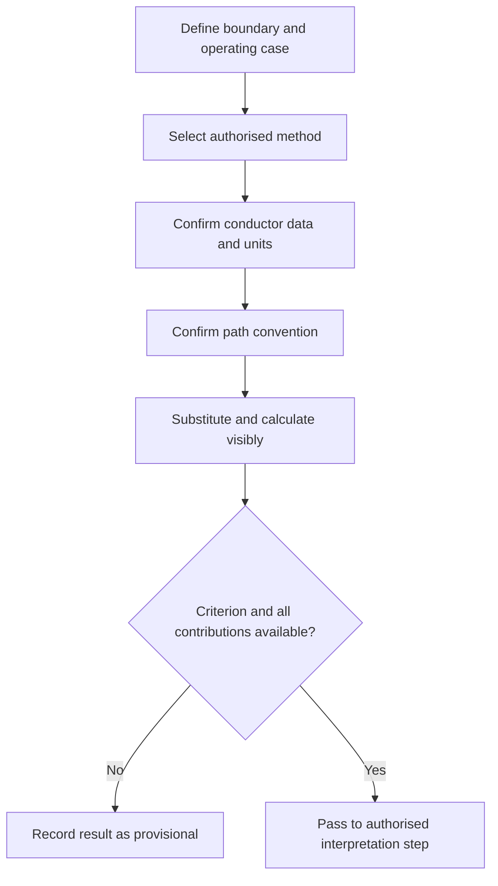

# Day 29 — Voltage-Drop Concepts and Calculation Structure

> **Scope boundary:** This module teaches a transparent calculation structure with fictional values. It does not supply official limits, coefficients or compliance conclusions. Those require current authorised sources and qualified review.

## 1. Outcome and entry check

By the end of this module, the learner should be able to:

1. define voltage drop and distinguish it from supply voltage, load voltage and voltage variation;
2. identify current, path length, conductor data, phase arrangement, units and operating condition as calculation inputs;
3. apply the **V-O-L-T-S** workflow to a fictional calculation pack;
4. distinguish one-way route length from the electrical path convention required by the selected method;
5. preserve units and source provenance through each transformation;
6. identify when a result cannot be interpreted because a criterion or upstream contribution is missing;
7. explain how changed current, length or conductor data affects the result directionally; and
8. record a bounded calculation statement without claiming compliance.

### Entry check

Write a one-sentence explanation of why a conductor can satisfy one design gate while voltage performance remains unresolved. Then list the inputs you expect a voltage-drop method to require and mark each as known, supplied or uncertain.

## 2. Why it matters

Voltage at the load can differ from voltage at the source because current flows through circuit impedance. A sound calculation must make the path, operating case, units and data source visible. Correct arithmetic cannot rescue a wrong path convention, unsupported coefficient or incomplete contribution boundary.

## 3. Core concepts and terminology

- **Voltage drop:** the difference in voltage between two defined points while current flows.
- **Calculation boundary:** the start and end points included in the result.
- **Operating current:** the current associated with the defined operating case used by the method.
- **Path length:** the conductor path represented in the selected equation or data method; it must not be assumed from physical route length alone.
- **Conductor data:** authorised resistance, reactance, impedance or tabulated voltage-drop information applicable to the conductor and conditions.
- **Coefficient:** a sourced quantity used by a defined method; its units and applicability must be retained.
- **Upstream contribution:** voltage drop occurring before the circuit boundary currently being calculated.
- **Result criterion:** an authorised limit or performance requirement used later to interpret the calculated result.
- **Dimensional check:** confirming that units combine to produce the intended result unit.

## 4. Rule-finding workflow

Use **V-O-L-T-S**:

1. **V — Verify the boundary and operating case:** define start point, end point, supply arrangement and current case.
2. **O — Obtain the authorised method and conductor data:** record source, edition, applicability and units.
3. **L — Lock the path convention:** state physical route length and how the selected method represents the electrical path.
4. **T — Transform visibly:** substitute values with units, calculate step by step and retain sensible precision.
5. **S — State the bounded result:** identify missing upstream contributions or criteria and avoid a compliance claim.

The diagram separates calculation from interpretation. Producing a numerical voltage drop does not by itself establish acceptability.

## 5. Visual model or worked example

### Fictional calculation pack

A training pack supplies:

- a clearly defined circuit boundary;
- a fictional operating current;
- a one-way physical route length;
- an explicitly stated path convention for the supplied method;
- fictional conductor data with units; and
- no official acceptance criterion.

The learner first records every input and its source. The learner then performs the supplied training equation with units shown at each step, checks the result dimension and states: “Calculated for the defined boundary and operating case using the supplied fictional method; interpretation remains unresolved.”

### Directional reasoning

Without recalculating, predict what happens when current increases, route length increases or the applicable conductor impedance decreases. Then explain why a changed phase arrangement or method may require more than a directional adjustment.

## 6. Practical application

### Task A — input register

Create fields for boundary, operating case, current, physical length, path convention, conductor data, source, units, upstream contribution and result criterion. Do not calculate while a required field is ambiguous.

### Task B — unit audit

Review three fictional substitutions. Identify a missing unit, an incompatible length unit and a coefficient whose applicability is not established.

### Task C — visible calculation

Complete one fictional calculation using the supplied training method. Show substitution, unit conversion, arithmetic, rounding choice and dimensional check.

### Task D — boundary comparison

Compare two records that produce the same number but use different start and end points. Explain why the results are not interchangeable.

### Task E — changed-condition retrieval

Recalculate after one supplied input changes. Mark which evidence remains valid and which steps reopen.

## 7. Common errors and safety checkpoint

Common errors include doubling length without checking the method, failing to apply a required path convention, mixing metres and kilometres, selecting conductor data from an unverified source, using design current when another operating case governs, omitting upstream contribution, rounding too early and declaring compliance without a criterion.

This module provides no official coefficient, limit, acceptance value or field procedure. Stop and mark `reference_check_required` when the applicable method, conductor data, path convention, criterion or supply condition is not supplied by an authorised source. No measurement, testing, energisation or practical work is authorised.

## 8. Retrieval and next links

### Closed-note retrieval

1. Recite V-O-L-T-S.
2. Define calculation boundary and path convention.
3. Name six inputs that require provenance.
4. Explain why a numerical result and an acceptance decision are separate.
5. Give four triggers that require recalculation.

### Exit task

Submit the input register, unit audit, visible fictional calculation, boundary comparison and one bounded result statement.

### Navigation

- **Plan:** [Twelve-Week Capstone Learning Plan](../MASTER_PLAN.md)
- **Knowledge note:** [[12-Week Day 29 - Voltage-Drop Concepts and Calculation Structure]]
- **Previous:** [Day 28 — Week 4 Independent Circuit-Design Checkpoint](day-28-week-4-independent-circuit-design-checkpoint.md)
- **Next:** [Day 30 — Voltage-Drop Interpretation and Design Iteration](day-30-voltage-drop-interpretation-and-design-iteration.md)

### Reference and currency notice

All values and methods used in exercises are fictional or explicitly supplied for training. Exact equations, conductor data, path conventions, limits and acceptance criteria remain `reference_check_required`. This module is not `technically-reviewed`.