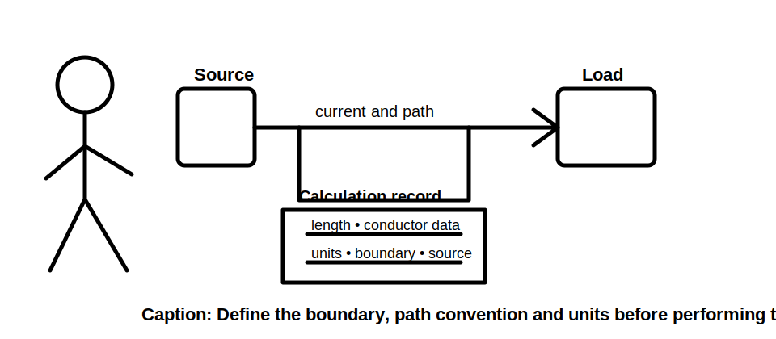
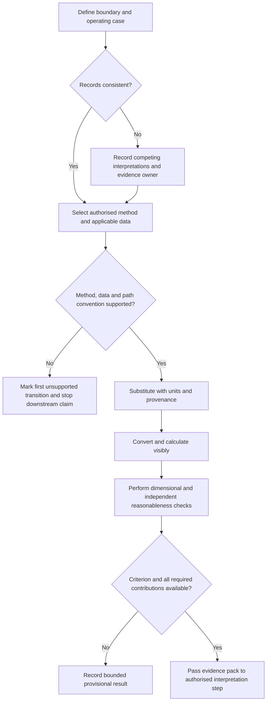
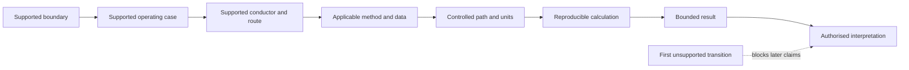

# Day 29 — Voltage-Drop Concepts and Calculation Structure

> **Scope boundary:** This module teaches an evidence-controlled calculation structure using fictional values. It does not provide official equations, limits, coefficients, design approval or compliance conclusions. Those require current authorised sources and qualified review.

## 1. Outcome and entry check

By the end of this module, the learner should be able to:

1. define voltage drop and distinguish it from supply voltage, load voltage and voltage variation;
2. identify the calculation boundary, operating case, current, path length, conductor data, phase arrangement and units required by a supplied fictional method;
3. classify each input as a stated fact, derived fact, supported inference, assumption, contradiction or evidence gap;
4. apply the **V-O-L-T-S** workflow without silently changing a path convention or data source;
5. show substitution, conversion, calculation and dimensional checking as separate observable steps;
6. identify the first unsupported transition in a calculation chain and stop later interpretation at that point;
7. compare competing interpretations when route, equipment or operating records conflict;
8. explain which downstream steps reopen after an upstream input changes; and
9. produce a bounded result statement without claiming suitability, compliance or technical approval.

### Entry check and confidence calibration

Without notes, write a one-sentence explanation of why a conductor can satisfy one design gate while voltage performance remains unresolved. Then list the inputs you expect a voltage-drop method to require. For each answer, record confidence as **high**, **medium** or **low** before checking sources.

A correct answer with weak reasoning is not yet secure. A high-confidence answer built on an unsupported convention is a priority misconception because it is likely to be repeated independently.

## 2. Why it matters

Voltage at the load can differ from voltage at the source because current flows through circuit impedance. A sound calculation makes the boundary, operating case, path convention, units, source and unresolved contributions visible. Correct arithmetic cannot repair a wrong boundary, unsupported coefficient, duplicated path factor or incomplete contribution record.

Calculation and interpretation are different claims. A numerical result may be arithmetically correct for its stated inputs while still being unusable for design because the method, applicability, upstream contribution or criterion is unresolved.

*Instructional caption: Trace the defined boundary, path convention, input provenance and units before performing arithmetic; a neat result does not repair unsupported inputs.*

## 3. Core concepts and terminology

- **Voltage drop:** the difference in voltage between two defined points while current flows.
- **Calculation boundary:** the stated start and end points included in one result.
- **Operating case:** the defined equipment state, loading combination and current condition represented by the calculation.
- **Operating current:** the current associated with the selected operating case; it must not be substituted merely because another current value is available.
- **Physical route length:** the measured or stated one-way distance followed by the wiring route.
- **Path convention:** the way the selected authorised method represents the electrical path. It may not be inferred from physical route length alone.
- **Conductor data:** authorised resistance, reactance, impedance or tabulated voltage-drop information applicable to the conductor and stated conditions.
- **Coefficient:** a sourced quantity used by a defined method. Its units, temperature basis, conductor type and other applicability conditions must remain attached to it.
- **Upstream contribution:** voltage drop occurring before the boundary presently being calculated.
- **Result criterion:** an authorised limit or performance requirement used later to interpret the calculated result.
- **Dimensional check:** confirming that units combine to produce the intended result unit.
- **Provenance:** the origin, edition, location and applicability record for an input or method.
- **First unsupported transition:** the earliest step where the conclusion is not supported by adequate evidence. Later claims that depend on that step remain unsupported.
- **Recheck trigger:** a defined change that reopens one or more completed steps.
- **Evidence owner:** the person or authorised source responsible for resolving an identified gap or contradiction.

### Evidence labels

Use one label for every material input or claim:

- **Stated fact:** directly supplied by an identified record or scenario source.
- **Derived fact:** calculated transparently from supported inputs using a supplied method.
- **Supported inference:** a reasoned conclusion with enough evidence for the limited claim being made.
- **Assumption:** a temporary proposition not yet established by evidence.
- **Contradiction:** two or more records cannot all describe the same condition accurately.
- **Evidence gap:** information required for the next claim is absent or unusable.

An assumption is not converted into a fact by repeating it in a calculation table.

## 4. Rule-finding workflow

Use **V-O-L-T-S**:

1. **V — Verify the boundary and operating case:** define the start point, end point, supply arrangement, equipment state and current case. Record contradictions rather than choosing the convenient record.
2. **O — Obtain the authorised method and conductor data:** record source, edition, location, applicability and units. Mark missing authority or applicability as `reference_check_required`.
3. **L — Lock the path convention:** state the physical route length separately from the electrical path represented by the method. Do not double or otherwise transform length without method evidence.
4. **T — Transform visibly:** show substitution, unit conversion, arithmetic, precision choice and dimensional check as separate steps. Label derived values and retain upstream provenance.
5. **S — State the bounded result:** identify excluded contributions, unresolved criteria, contradictions and the first unsupported transition. Do not convert a calculated value into an approval claim.

The diagram shows two distinct stop points. Unsupported method or path evidence stops the calculation claim itself. A missing criterion or contribution may still permit a bounded calculation result, but not an acceptability conclusion.

### Claim ladder

Use this ordered claim ladder:

1. the boundary is defined;
2. the operating case and current are supported;
3. the conductor and route identity are supported;
4. the selected method and data are applicable;
5. the path convention and units are controlled;
6. the transformation is reproducible;
7. the result is bounded to stated contributions; and
8. interpretation is passed to an authorised decision process.

The first unsupported transition limits every later claim. For example, if conductor identity is contradictory, a precisely calculated result using one assumed conductor record does not establish the result for the actual circuit.

This model prevents later arithmetic quality from concealing an earlier evidence failure.

## 5. Visual model or worked example

### Fictional scenario with conflicting evidence

A training pack describes a final subcircuit supplying a fictional process unit. It contains:

- drawing A, which states a one-way route length of 38 m and conductor type X;
- a later maintenance note, which states that part of the route was diverted but gives no revised length;
- an equipment schedule showing one operating current;
- a commissioning note showing a different current after a control change;
- a fictional voltage-drop coefficient for conductor type X with explicit units and a stated path convention; and
- no authorised acceptance criterion or verified upstream contribution.

The learner must not choose drawing A merely because it produces a complete calculation. Two bounded interpretations remain open:

- **Interpretation 1:** drawing A still represents the installed route and conductor, subject to confirmation of the maintenance change;
- **Interpretation 2:** the route or conductor changed, so the supplied coefficient or length may no longer apply.

The **first unsupported transition** is the move from conflicting route records to a single claimed installed path. The learner may demonstrate the fictional arithmetic for Interpretation 1 as a labelled training calculation, but must not present it as the actual circuit result.

### Evidence register

| Claim or input | Evidence state | Provenance | Consequence | Owner or recheck trigger |
|---|---|---|---|---|
| Boundary start and end | Stated fact | training brief | calculation scope can be described | reopen if circuit boundary changes |
| Installed route length | Contradiction | drawing A versus maintenance note | actual result unresolved | drawing owner or verified as-installed record |
| Operating current | Contradiction | schedule versus commissioning note | operating case unresolved | equipment/control owner |
| Conductor coefficient | Stated fact for training only | fictional data sheet | usable only if conductor identity and applicability are supported | reopen if conductor or conditions change |
| Upstream contribution | Evidence gap | not supplied | total contribution cannot be interpreted | authorised upstream design record |
| Acceptance criterion | Evidence gap | not supplied | no acceptability claim | current authorised source and qualified reviewer |

### Visible fictional transformation

For one explicitly labelled interpretation:

1. write the supplied fictional equation before inserting values;
2. substitute every value with its unit and source identifier;
3. show each unit conversion separately;
4. perform the arithmetic once;
5. use an independent directional or order-of-magnitude check rather than merely repeating the same calculator entry;
6. state sensible precision without implying false measurement accuracy; and
7. write: “Training result for Interpretation 1 only; actual route, operating case, upstream contribution and acceptance remain unresolved.”

### Directional reasoning

Without recalculating, predict the result direction when current increases, represented path length increases or applicable conductor impedance decreases. Then explain why a change of phase arrangement, conductor identity or method may require rebuilding the calculation rather than applying a simple directional adjustment.

## 6. Practical application

### Task A — input and evidence register

Create fields for boundary, operating case, current, physical route, path convention, conductor identity, conductor data, source edition, applicability, units, upstream contribution, criterion, evidence state, owner and recheck trigger. Do not proceed past the first unsupported transition without visibly bounding the exercise.

### Task B — provenance and unit audit

Review three fictional substitutions. Identify:

1. a missing unit;
2. an incompatible length unit;
3. a coefficient detached from its applicability conditions;
4. a route length transformed without path-convention evidence; and
5. a derived value incorrectly labelled as a stated fact.

### Task C — visible calculation

Complete one fictional calculation using the supplied training method. Show equation, substitution, conversion, arithmetic, precision choice, dimensional check and independent reasonableness check. Re-entering the same calculator expression is not an independent check.

### Task D — competing boundaries

Compare two records that produce the same numerical result but use different start and end points. Explain why equal numbers do not make the claims interchangeable.

### Task E — two-condition transfer

Repeat the reasoning after both of these material changes are introduced:

- the route record changes; and
- the operating current source changes.

Identify every step that remains valid, every step that reopens and the new first unsupported transition. This tests transfer rather than memory of the first worked example.

### Criterion-level readiness record

Assess each criterion separately:

- **Secure:** the learner completes the criterion independently, with supported evidence and an appropriately bounded claim.
- **Developing:** the learner reaches a usable result after a prompt or corrects an initially visible error.
- **Unsupported:** the learner cannot support a required input, transformation or claim.
- **`stop-required`:** continuing would conceal a safety, authority, contradiction or evidence failure.

Do not calculate an aggregate score. Strong arithmetic cannot cancel an unsupported path convention, invented input or missing authority.

## 7. Common errors and safety checkpoint

Common errors include:

- doubling length without checking the selected method;
- treating physical route length and represented electrical path as interchangeable;
- mixing metres and kilometres;
- selecting conductor data from an unverified or inapplicable source;
- using a convenient current rather than the defined operating case;
- resolving conflicting records by preference;
- omitting upstream contribution without stating the boundary;
- rounding too early;
- repeating the same calculator entry as an independent check; and
- declaring compliance from a numerical result without an authorised criterion.

### Blocking conditions

Any of the following produces `stop-required` for the affected claim:

- an invented equation, coefficient, route length, conductor identity, operating current or criterion;
- an unresolved contradiction hidden by selecting one record without justification;
- a unit conversion that cannot be reconstructed;
- a path convention applied without source support;
- a changed upstream input not propagated through dependent steps;
- a compliance, approval or suitability claim beyond the available evidence; or
- any unauthorised practical action.

These blockers cannot be offset by strength in another criterion.

This module provides no official equation, coefficient, limit, acceptance value or field procedure. Stop and mark `reference_check_required` when the applicable method, conductor data, path convention, criterion or supply condition is not established by a current authorised source. No switching, isolation, opening, proving, tracing, measurement, testing, disconnection, reconnection, installation, alteration, repair, energisation, commissioning, certification or verification is authorised.

## 8. Retrieval and next links

### Closed-note retrieval

1. Recite V-O-L-T-S and explain the evidence purpose of each step.
2. Define calculation boundary, operating case, path convention and provenance.
3. Name the six evidence labels.
4. Explain the first unsupported transition using the route contradiction scenario.
5. Explain why a numerical result and an acceptance decision are separate claims.
6. Give five recheck triggers.
7. Distinguish an independent reasonableness check from repeating calculator entry.

### Exit task

Submit:

- the input and evidence register;
- the provenance and unit audit;
- one visible fictional calculation;
- the competing-boundary comparison;
- the two-condition transfer record;
- criterion-level readiness states; and
- one bounded result statement naming the first unsupported transition.

### Navigation

- **Plan:** [Twelve-Week Capstone Learning Plan](../MASTER_PLAN.md)
- **Knowledge note:** [[12-Week Day 29 - Voltage-Drop Concepts and Calculation Structure]]
- **Previous:** [Day 28 — Week 4 Independent Circuit-Design Checkpoint](day-28-week-4-independent-circuit-design-checkpoint.md)
- **Next:** [Day 30 — Voltage-Drop Interpretation and Design Iteration](day-30-voltage-drop-interpretation-and-design-iteration.md)

### Reference and currency notice

All exercise values and methods are fictional or explicitly supplied for training. Exact equations, conductor data, path conventions, contribution rules, limits and acceptance criteria remain `reference_check_required`. Secure, developing, unsupported and `stop-required` are educational planning states, not official assessment grades or competency decisions. This module is not `technically-reviewed`.