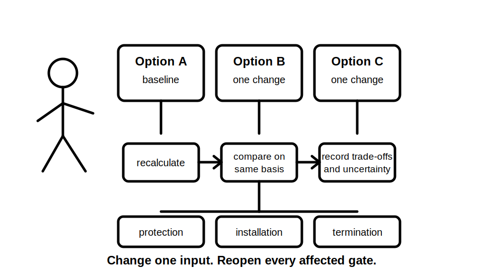
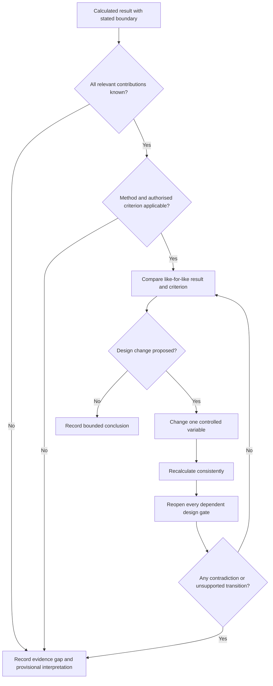
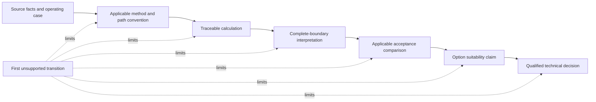
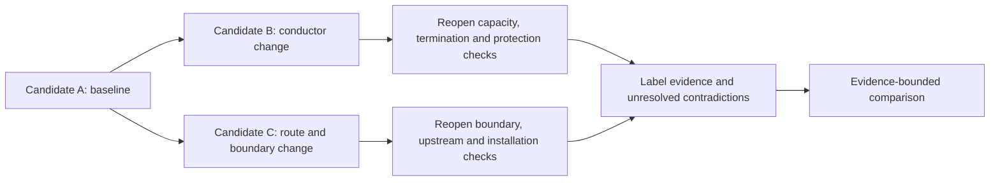

# Day 30 — Voltage-Drop Interpretation and Design Iteration

> **Scope boundary:** This module teaches how to interpret a fictional voltage-drop result, test possible design changes and document an evidence-bounded conclusion. It does not provide official limits, coefficients, conductor data, approved design methods or compliance decisions.

## 1. Outcome and entry check

By the end of this module, the learner should be able to:

1. distinguish a calculated result from an authorised acceptance criterion;
2. identify whether the calculation boundary includes all relevant contributions;
3. classify each material input and conclusion by evidence state;
4. locate the first unsupported transition in a voltage-drop interpretation chain;
5. use the **I-T-E-R-A-T-E** workflow to compare fictional design options;
6. predict which inputs and downstream checks reopen after a design change;
7. reject a change that improves voltage performance while weakening another design gate;
8. compare competing interpretations without selecting the most convenient record;
9. assign evidence owners and recheck triggers to unresolved items; and
10. present a bounded recommendation without claiming technical approval.

### Entry check

Without looking at Day 29:

1. define **calculation boundary**, **upstream contribution** and **acceptance criterion**;
2. list three design changes that could alter a voltage-drop result;
3. list three other design checks those changes might reopen; and
4. rate confidence in each answer as high, medium or low before checking it.

A correct guess is not secure learning. Compare confidence with evidence after the check and record any confidently unsupported answer in the error log.

## 2. Why it matters

A number is useful only when its boundary, inputs, method and comparison criterion are known. Design iteration is not simply choosing the option with the smallest calculated drop. A changed conductor, route, protective device, phase arrangement, distribution point or operating case can affect capacity, protection, fault performance, terminations, installation conditions, cost and maintainability.

Good reasoning therefore preserves the complete design record, changes controlled variables deliberately, reopens every dependent conclusion and stops at the first unsupported transition. An attractive result does not repair missing evidence.

*Instructional caption: change one controlled input, then reopen every conclusion that depends on it before comparing options.*

## 3. Core concepts and terminology

- **Interpretation:** explaining what a calculated result means within its stated boundary, method and evidence.
- **Acceptance criterion:** an authorised requirement against which a result may be judged.
- **Total contribution:** the combined voltage-drop contributions across the complete boundary relevant to the decision.
- **Design iteration:** a controlled change followed by recalculation and rechecking of affected design gates.
- **Sensitivity:** how strongly a result changes when one input changes.
- **Trade-off:** an improvement in one design outcome accompanied by cost, constraint or possible deterioration elsewhere.
- **Reopening trigger:** a changed or corrected fact that invalidates or weakens an earlier conclusion.
- **Discarded option:** a considered design alternative rejected for a recorded reason.
- **Evidence provenance:** where a fact, value, method or criterion came from, including source identity, edition or revision, location and applicability.
- **Evidence owner:** the person or role responsible for resolving an evidence gap or contradiction.
- **Recheck trigger:** the specific new information or changed condition that requires the analysis to be reopened.
- **Competing interpretation:** a plausible alternative explanation retained because available evidence does not yet distinguish between alternatives.
- **First unsupported transition:** the earliest step where the evidence no longer supports movement from one claim to the next. Every downstream claim is limited by that boundary.

### Evidence states

Classify each material statement before using it:

- **Stated fact:** directly supplied by an identified source without alteration.
- **Derived fact:** calculated or transformed transparently from stated facts using an identified method.
- **Supported inference:** a reasoned conclusion supported by traceable facts but not directly stated.
- **Assumption:** a temporary proposition used because required evidence is missing; it must be visible and must not be presented as fact.
- **Contradiction:** two or more relevant sources cannot all be true for the same condition and time.
- **Evidence gap:** information required for the next claim is absent, inaccessible, ambiguous or not shown to be applicable.

### Criterion-level learning states

- **Secure:** independently produces a traceable, internally consistent response and transfers it to changed conditions without a material unsupported claim.
- **Developing:** shows the correct structure but needs prompts, misses a non-critical dependency or incompletely records evidence provenance.
- **Unsupported:** reaches a conclusion through an unresolved assumption, contradiction, missing source, mismatched boundary or untraceable transformation.
- **`stop-required`:** a safety, authority or evidence failure prevents progression regardless of performance elsewhere.

These are educational planning states, not official grades, competency decisions or legal classifications.

## 4. Rule-finding workflow

Use **I-T-E-R-A-T-E**:

1. **I — Identify the complete decision boundary:** confirm start point, end point, operating case, upstream contributions and the decision the calculation is intended to support.
2. **T — Trace the criterion and method to authorised sources:** record edition or revision, source location, units, applicability conditions, exclusions and unresolved exceptions.
3. **E — Evaluate the present result and evidence chain:** compare only like-for-like boundaries, label every material claim and mark the first unsupported transition.
4. **R — Revise one controlled design variable:** change one input, state why it is being changed and predict the expected direction of effect before recalculating.
5. **A — Audit every reopened gate:** revisit capacity, protection, fault, installation, termination, documentation and any upstream or downstream calculation affected by the change.
6. **T — Test alternatives consistently:** use the same boundary, method, precision, evidence standard and decision criteria for every candidate unless a difference is explicitly justified.
7. **E — Explain the bounded recommendation:** record assumptions, contradictions, rejected options, residual uncertainty, evidence owners, recheck triggers and required qualified review.

The loop prevents a locally improved number from being accepted before the wider design consequences and evidence dependencies are checked.

### Claim ladder and unsupported-transition control

Each arrow is a separate evidentiary transition. For example, a correct calculation cannot establish an acceptance comparison when the criterion or total boundary is unresolved. Stop the conclusion at the first unsupported arrow and identify what evidence would reopen it.

## 5. Visual model or worked example

### Fictional option comparison with conflicting records

A training file contains a fictional calculation method and three candidates:

- **Candidate A:** the recorded baseline design;
- **Candidate B:** a changed conductor characteristic; and
- **Candidate C:** a changed route and distribution point.

The evidence pack also contains these conflicts:

- the design drawing and equipment schedule show different operating currents;
- the route drawing shows a direct path, while a later maintenance note describes an unrecorded diversion;
- a termination sheet supports Candidate B, while a manufacturer revision notice may supersede that sheet; and
- Candidate C removes one circuit contribution but creates a new upstream contribution whose boundary has not been established.

The learner must retain at least two competing interpretations where the evidence conflicts. Candidate B improves the calculated voltage result but its termination suitability is unresolved. Candidate C appears to shorten one section but changes both the calculation boundary and installation-condition review. Neither is automatically preferable.

The correct output is an evidence record showing what improved, what reopened, which sources conflict and what remains unresolved—not a guessed compliant design.

### Worked-example fading

1. Review one fully annotated option comparison with evidence labels and reopened gates shown.
2. Complete a second comparison with evidence owners and reopening triggers omitted.
3. Complete a third with only candidate facts, conflicting records and source fields supplied.
4. Transfer the workflow to a scenario where at least two material conditions change, without prompts.

## 6. Practical application

### Task A — interpretation ledger

For a fictional result, record:

- calculation boundary and decision purpose;
- included, excluded and missing contributions;
- operating-case evidence;
- method and criterion provenance;
- applicability evidence;
- evidence state for each material claim;
- first unsupported transition; and
- evidence owner and recheck trigger for each unresolved item.

### Task B — sensitivity predictions

Predict the directional effect of changing current, route length, conductor data and distribution location. Record the reason for each prediction before calculating. Mark any change whose effect cannot be predicted without revisiting the selected method or path convention.

### Task C — one-variable iteration

Change one supplied input, recalculate using the same fictional method and list every design gate reopened by that change. Repeating the same calculator entry is not an independent check; use a separate dimensional, reverse, estimation or dependency check.

### Task D — candidate comparison

Compare three fictional candidates using common headings: result, evidence strength, first unsupported transition, reopened checks, trade-offs, competing interpretations, rejected assumptions and residual uncertainty.

### Task E — two-condition transfer

Change at least two material conditions, such as operating current plus route boundary, or conductor data plus termination evidence. Rebuild every affected step rather than editing only the final number. Identify which conclusions remain valid, which become provisional and which must be withdrawn.

### Criterion-level assessment record

Record **secure**, **developing**, **unsupported** or `stop-required` separately for:

1. boundary and operating-case definition;
2. method and criterion provenance;
3. evidence classification and contradiction handling;
4. like-for-like calculation comparison;
5. first-unsupported-transition control;
6. reopening of dependent design gates;
7. trade-off and competing-interpretation reasoning;
8. independent checking;
9. two-condition transfer; and
10. claim restraint and safety-authority boundaries.

Do not combine these into an aggregate score. A strength in one criterion cannot cancel a material evidence, safety or authority failure in another.

### Blocking conditions

Apply `stop-required` when the learner:

- invents or silently substitutes a method, criterion, coefficient, route, conductor characteristic or operating case;
- ignores a material contradiction or chooses the most convenient source without resolving provenance;
- compares candidates with different boundaries while presenting them as like-for-like;
- retains downstream conclusions after an upstream input or method changes;
- claims suitability, compliance or approval beyond the established evidence;
- treats repeated calculator entry as independent verification; or
- proposes or undertakes practical electrical work outside authorised supervision and procedures.

## 7. Common errors and safety checkpoint

Common errors include treating a circuit-only result as a total result, comparing candidates with different boundaries, using an unverified criterion, changing several variables without tracking dependencies, assuming a larger conductor resolves every design issue, ignoring upstream contribution, forgetting termination or protection consequences, selecting convenient evidence from contradictory records, and retaining a conclusion after its operating case changes.

Stop and mark `reference_check_required` when the method, conductor data, criterion, contribution boundary, device characteristic, installation condition, source arrangement or source applicability is not established by current authorised evidence. Assign an evidence owner and a specific recheck trigger rather than writing “check later”.

This module authorises no measurement, testing, switching, isolation, opening, proving, tracing, installation, alteration, disconnection, reconnection, energisation, commissioning, certification or field verification.

## 8. Retrieval and next links

### Closed-note retrieval

1. Recite I-T-E-R-A-T-E.
2. Define interpretation, sensitivity, evidence provenance and reopening trigger.
3. Name all six evidence states.
4. Explain the first unsupported transition and why later claims inherit its limit.
5. Explain why a smaller calculated result may not identify the preferred design.
6. Name six checks that a design change can reopen.
7. State why repeating a calculator entry is not an independent check.
8. Distinguish educational criterion states from official assessment decisions.

### Exit task

Submit an interpretation ledger, one sensitivity set, one controlled recalculation, a three-candidate comparison, a two-condition transfer and a bounded recommendation identifying evidence owners, recheck triggers and required qualified review.

### Navigation

- **Plan:** [Twelve-Week Capstone Learning Plan](../MASTER_PLAN.md)
- **Knowledge note:** [[12-Week Day 30 - Voltage-Drop Interpretation and Design Iteration]]
- **Previous:** [Day 29 — Voltage-Drop Concepts and Calculation Structure](day-29-voltage-drop-concepts-and-calculation-structure.md)
- **Next:** [Day 31 — Fault-Loop Reasoning at Concept Level](day-31-fault-loop-reasoning-at-concept-level.md)

### Reference and currency notice

All scenarios, values, option comparisons and educational criterion states are original learning constructs. Exact equations, conductor data, total-contribution rules, limits, exceptions, acceptance criteria and official assessment requirements remain `reference_check_required`. This module is not `technically-reviewed`.