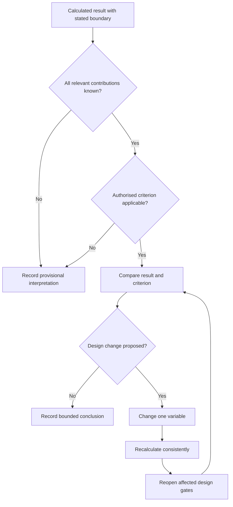
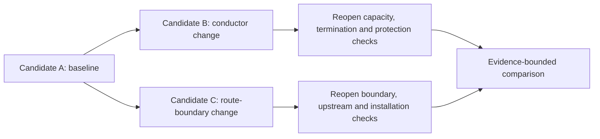

# Day 30 — Voltage-Drop Interpretation and Design Iteration

> **Scope boundary:** This module teaches how to interpret a fictional voltage-drop result, test possible design changes and document an evidence-bounded conclusion. It does not provide official limits, coefficients, conductor data or compliance decisions.

## 1. Outcome and entry check

By the end of this module, the learner should be able to:

1. distinguish a calculated result from an authorised acceptance criterion;
2. identify whether the calculation boundary includes all relevant contributions;
3. classify a voltage-drop conclusion as described, supported or verified;
4. use the **I-T-E-R-A-T-E** workflow to compare fictional design options;
5. predict which inputs and downstream checks reopen after a design change;
6. reject a change that improves voltage performance while weakening another design gate;
7. record assumptions, unresolved evidence and discarded options; and
8. present a bounded recommendation without claiming technical approval.

### Entry check

Without looking at Day 29, write the difference between a calculation boundary, an upstream contribution and an acceptance criterion. Then list three design changes that could alter a voltage-drop result and three other checks those changes might reopen.

## 2. Why it matters

A number is useful only when its boundary, inputs and comparison criterion are known. Design iteration is not simply choosing the option with the smallest calculated drop. A changed conductor, route, protective device, phase arrangement or operating case can affect capacity, protection, fault performance, terminations, installation conditions, cost and maintainability. Good reasoning therefore preserves the whole design record while changing one variable at a time.

## 3. Core concepts and terminology

- **Interpretation:** explaining what a calculated result means within its stated boundary and evidence.
- **Acceptance criterion:** an authorised requirement against which a result may be judged.
- **Total contribution:** the combined voltage-drop contributions across the complete boundary relevant to the decision.
- **Design iteration:** a controlled change followed by recalculation and rechecking of affected design gates.
- **Sensitivity:** how strongly a result changes when one input changes.
- **Trade-off:** an improvement in one design outcome accompanied by cost, constraint or possible deterioration elsewhere.
- **Reopening trigger:** a changed fact that invalidates or weakens an earlier conclusion.
- **Discarded option:** a considered design alternative rejected for a recorded reason.
- **Claim grade:** the strength of a conclusion: **described** from supplied facts, **supported** by traceable evidence, or **verified** only after authorised technical review.

## 4. Rule-finding workflow

Use **I-T-E-R-A-T-E**:

1. **I — Identify the complete decision boundary:** confirm start point, end point, operating case and upstream contributions.
2. **T — Trace the criterion to an authorised source:** record edition, applicability, units and unresolved exceptions.
3. **E — Evaluate the present result:** compare only like-for-like boundaries and state the current claim grade.
4. **R — Revise one design variable:** change one controlled input and explain the expected direction of effect.
5. **A — Audit every reopened gate:** revisit capacity, protection, fault, installation, termination and documentation checks affected by the change.
6. **T — Test alternatives consistently:** use the same boundary, method, precision and evidence standard for every candidate.
7. **E — Explain the bounded recommendation:** record assumptions, rejected options, residual uncertainty and required qualified review.

The loop prevents a locally improved number from being accepted before the wider design consequences are checked.

## 5. Visual model or worked example

### Fictional option comparison

A training record contains a complete fictional calculation method and three candidates:

- **Candidate A:** the current design;
- **Candidate B:** a changed conductor characteristic;
- **Candidate C:** a changed route and distribution point.

The learner keeps the operating case and evidence standard constant. Candidate B improves the calculated voltage result but introduces an unresolved termination constraint. Candidate C shortens one circuit section but creates a new upstream contribution and installation-condition review. Neither is automatically preferable.

The correct output is an evidence record showing what improved, what reopened and what remains unresolved—not a guessed compliant design.

### Worked-example fading

1. Review one fully annotated option comparison.
2. Complete a second comparison with reopening triggers omitted.
3. Complete a third with only candidate facts and source fields supplied.
4. Transfer the workflow to a changed operating case without prompts.

## 6. Practical application

### Task A — interpretation ledger

For a fictional result, record the calculation boundary, included contributions, missing contributions, criterion source, applicability evidence and claim grade.

### Task B — sensitivity predictions

Predict the directional effect of changing current, route length, conductor data and distribution location. Mark any change whose effect cannot be predicted without revisiting the selected method.

### Task C — one-variable iteration

Change one supplied input, recalculate using the same fictional method and list every design gate reopened by that change.

### Task D — candidate comparison

Compare three fictional candidates using common headings: result, evidence strength, reopened checks, trade-offs, rejected assumptions and residual uncertainty.

### Task E — changed-condition transfer

After selecting a provisional candidate, introduce one changed supply or operating condition. Identify which conclusions remain valid and which must be withdrawn.

### Assessment rubric

Score each category from 0 to 2: boundary completeness, criterion provenance, like-for-like comparison, reopening discipline, trade-off explanation and claim restraint. A high-confidence unsupported compliance claim, omitted material contribution or failure to reopen an affected safety gate is a critical error regardless of score.

## 7. Common errors and safety checkpoint

Common errors include treating a circuit-only result as a total result, comparing candidates with different boundaries, using an unverified criterion, changing several variables at once, assuming a larger conductor resolves every design issue, ignoring upstream contribution, forgetting termination or protection consequences, and retaining a conclusion after its operating case changes.

Stop and mark `reference_check_required` when the method, conductor data, criterion, contribution boundary, device characteristic, installation condition or source arrangement is not established by current authorised evidence. This module authorises no measurement, testing, switching, isolation, installation, alteration, energisation, commissioning, certification or field verification.

## 8. Retrieval and next links

### Closed-note retrieval

1. Recite I-T-E-R-A-T-E.
2. Define interpretation, sensitivity and reopening trigger.
3. Explain why a smaller calculated result may not identify the preferred design.
4. Name six checks that a design change can reopen.
5. Distinguish described, supported and verified conclusions.

### Exit task

Submit an interpretation ledger, one sensitivity set, one controlled recalculation, a three-candidate comparison and a bounded recommendation identifying the required qualified review.

### Navigation

- **Plan:** [Twelve-Week Capstone Learning Plan](../MASTER_PLAN.md)
- **Knowledge note:** [[12-Week Day 30 - Voltage-Drop Interpretation and Design Iteration]]
- **Previous:** [Day 29 — Voltage-Drop Concepts and Calculation Structure](day-29-voltage-drop-concepts-and-calculation-structure.md)
- **Next:** [Day 31 — Fault-Loop Reasoning at Concept Level](day-31-fault-loop-reasoning-at-concept-level.md)

### Reference and currency notice

All scenarios, values, option comparisons and rubric bands are original educational constructs. Exact equations, conductor data, total-contribution rules, limits, exceptions and acceptance criteria remain `reference_check_required`. This module is not `technically-reviewed`.