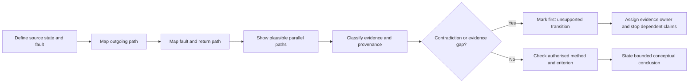
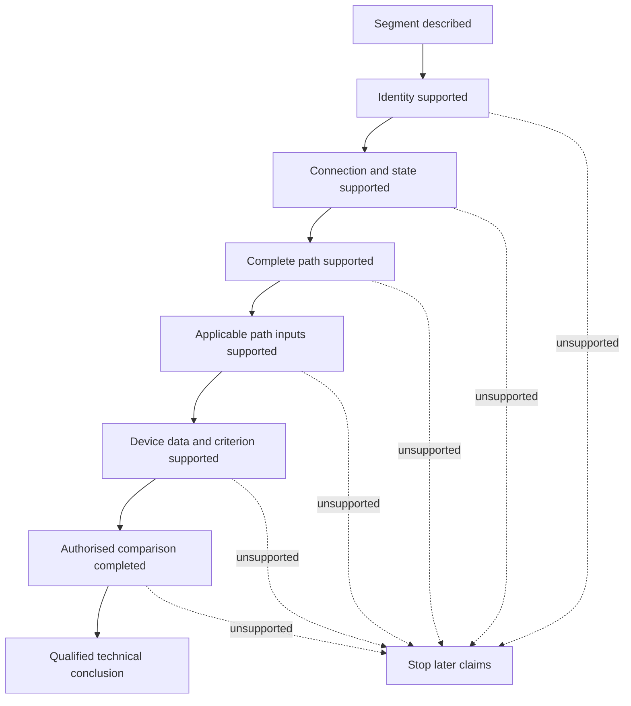

# Day 31 — Fault-Loop Reasoning at Concept Level

> **Scope boundary:** Written conceptual reasoning only. This module supplies no official loop limits, disconnection times, test procedure or compliance conclusion. It does not authorise practical electrical work.

## 1. Outcome and entry check

By the end, the learner can:

1. draw a complete conceptual fault-current path from source to fault and back to the source;
2. distinguish path presence, path identity, continuity, impedance and verified protective outcome;
3. classify each statement as a stated fact, derived fact, supported inference, assumption, contradiction or evidence gap;
4. identify the first unsupported transition in a fault-loop argument and stop later claims at that boundary;
5. compare competing return-path interpretations without selecting the convenient path; and
6. state exactly what evidence owner and recheck trigger are needed before the reasoning may proceed.

### Entry check

Without notes, draw a source-to-fault-and-return path. Label the source, outgoing conductor, fault point, protective return path, source return point and protective device. Beside each label, record:

- your confidence as high, medium or low;
- whether the label is supplied, inferred or assumed; and
- one item that would disprove your path.

A correct guess is not secure evidence. High confidence in an unsupported answer is a priority misconception for correction.

## 2. Why it matters

A protective device can respond only to current produced by an actual, sufficiently characterised return path. A drawing may describe an intended path while the installation records, source arrangement, conductor identity or connection condition support a different path—or no verified path at all.

The key discipline is therefore not merely “close the loop.” It is:

> **Trace the proposed loop, prove each transition, preserve competing interpretations and stop at the first unsupported transition.**

*Instructional caption: Trace every outgoing and return segment, then mark where evidence stops before discussing device operation.*

## 3. Core concepts and terminology

- **Fault loop:** the proposed complete conductive path followed by fault current from a source, through a fault and back to that source.
- **Path presence:** evidence that a conductive segment exists. Presence alone does not prove its identity, connection or suitability.
- **Path identity:** evidence that the observed or recorded segment is the specific conductor, connection or source path claimed in the reasoning.
- **Loop continuity:** evidence that an unbroken conductive path exists under the stated conditions. Continuity does not by itself establish sufficiently low impedance.
- **Loop impedance:** total opposition to current around the complete path. Exact methods, values and limits require authorised sources.
- **Prospective fault current:** current that could flow for a defined source, fault and path condition. It is conditional, not a universal property of the circuit.
- **Automatic disconnection:** protective-device operation intended to remove a hazardous condition under applicable requirements. A conceptual path does not prove that operation will occur within any required condition.
- **Parallel path:** an additional conductive route that may share current or produce misleading evidence about the intended path.
- **Bottleneck:** the path segment, connection or evidence dependency most likely to restrict current or prevent a justified conclusion.
- **Evidence provenance:** where evidence came from, when it applied, what state the system was in and who is responsible for confirming it.
- **First unsupported transition:** the earliest step in a reasoning chain where the conclusion is not adequately supported by the preceding evidence. All dependent claims after that point remain unsupported.
- **Evidence owner:** the authorised person or source responsible for resolving a named gap, such as a qualified reviewer, current manufacturer document, network record or verified installation record.
- **Recheck trigger:** a change that requires earlier reasoning to be reopened, such as a changed source, conductor, joint, protective device, route, operating state or document revision.

### Evidence labels

Use one label for every material statement:

| Label | Meaning |
|---|---|
| **Stated fact** | Directly supplied by the scenario or a traceable source. |
| **Derived fact** | Produced transparently from supported inputs using an applicable method. |
| **Supported inference** | Reasonable interpretation with its evidence and limits stated. |
| **Assumption** | Unverified proposition used temporarily and clearly marked. |
| **Contradiction** | Two or more relevant sources cannot all describe the same condition. |
| **Evidence gap** | Required information is absent, stale, ambiguous or outside authority. |

## 4. Rule-finding workflow

Use **L-O-O-P-S** as an evidence-controlled workflow:

1. **L — Locate the source, operating state and fault point.** Name the proposed source and fault condition. Do not assume the nominal source is the active source.
2. **O — Outline every outgoing and return segment.** Draw each conductor, connection, device and source-return transition separately. Show plausible parallel paths rather than hiding them.
3. **O — Observe and classify the evidence.** Apply the six evidence labels, record provenance and identify contradictions.
4. **P — Predict directionally, not numerically.** Explain how a changed segment could increase, decrease or make uncertain the available fault current. Do not invent values or device behaviour.
5. **S — Source-check, stop and state a bounded conclusion.** Find the applicable authorised criterion, identify the first unsupported transition, assign an evidence owner and state the recheck trigger.

This diagram separates path construction from evidence control. A visually complete loop may still stop at the evidence-classification gate.

### Claim ladder

Use the following order. Skipping a rung creates an unsupported transition:

1. a segment is described;
2. the segment is identified;
3. its connection and state are evidenced;
4. complete-path continuity is supported;
5. applicable impedance or fault-current inputs are supported;
6. protective-device characteristics and applicability are supported;
7. the authorised comparison is completed; and
8. a qualified reviewer determines the permitted technical conclusion.

The dashed transitions show that any unsupported rung limits every claim above it. Strength elsewhere cannot compensate for a missing lower rung.

## 5. Visual model or worked example

### Fictional scenario

A drawing shows a final subcircuit supplied from Board A with a protective conductor returning to Board A. A later maintenance note says the circuit was transferred to Board B, but the circuit schedule was not revised. A continuity record lists the circuit label but not the test endpoints or whether parallel bonding paths were disconnected. The protective device schedule and a photograph also disagree about device identity.

Keep at least two interpretations visible:

- **Interpretation 1:** the circuit remains supplied from Board A and the drawing represents the intended loop;
- **Interpretation 2:** the circuit is supplied from Board B and the drawing, device schedule or continuity record refers to an earlier arrangement.

Neither interpretation supports a protective-operation conclusion until source identity, endpoints, conductor path and device identity are resolved.

| Transition | Current evidence state | Consequence |
|---|---|---|
| Board supplies circuit | Contradiction | Source and outgoing path are unresolved. |
| Protective conductor returns to the same source | Assumption | Complete-loop identity is unsupported. |
| Continuity record proves intended path | Evidence gap | Endpoints and parallel-path state are missing. |
| Scheduled device is the installed device | Contradiction | Device characteristics cannot be applied. |
| Device will disconnect as required | Unsupported | Several earlier transitions are unresolved. |

The first unsupported transition is source identity. Later statements about the return path, fault current and device operation cannot be promoted beyond provisional reasoning.

## 6. Practical application

Complete one original written scenario using this sequence:

1. draw the intended path and at least one plausible competing path;
2. label every material statement with one evidence classification;
3. record source, date, system state and evidence owner for each critical item;
4. mark the first unsupported transition;
5. state which later claims are blocked;
6. assign a resolution owner and recheck trigger; and
7. state a bounded conclusion using no invented values.

### Transfer exercise

Change at least two material conditions—for example:

- change the supplying board and add an alternate source;
- change one return-path connection and the protective device record;
- introduce a parallel conductive path and remove endpoint information; or
- revise the circuit route and make one document stale.

Rebuild the path and evidence chain. Do not merely edit the final sentence.

### Criterion-level readiness

Assess each criterion independently:

- **Secure:** path is complete and internally consistent; evidence labels and provenance are accurate; competing paths are retained; the first unsupported transition, blocked claims, owner and recheck trigger are explicit.
- **Developing:** the main path is plausible, but one non-critical label, provenance item or dependency needs correction.
- **Unsupported:** a material path transition, source, identity, connection, device or criterion is assumed without control.
- **`stop-required`:** the response invents a value, test result, device operation, compliance conclusion or practical instruction, or ignores a safety- or authority-critical contradiction.

There is no aggregate score. A blocking condition cannot be offset by stronger work in another criterion.

## 7. Common errors and safety checkpoint

### Common errors

- omitting the source return point;
- treating conductor presence as proof of identity or connection;
- treating continuity as proof of low impedance or protective performance;
- accepting a continuity record without endpoints, state and provenance;
- ignoring parallel paths that could produce misleading evidence;
- selecting the newest or most convenient record without resolving contradictions;
- assuming an RCD establishes protective-earthing continuity or replaces all other protective functions;
- applying nominal source or device data without applicability evidence; and
- claiming compliance from a conceptual diagram.

### Blocking conditions

Mark `stop-required` when the learner:

- invents loop limits, disconnection times, impedance, current or device characteristics;
- claims that a device operated or will operate without supported inputs and an authorised comparison;
- suppresses a conflicting source, path or device record;
- treats an unidentified parallel path as proof of the intended path;
- gives instructions for switching, isolation, opening, proving, tracing, measurement, testing, fault simulation, disconnection, reconnection or energisation; or
- presents an educational state as an official assessment or competency decision.

Stop and mark `reference_check_required` when source characteristics, conductor identity, connection condition, path state, device data, applicable criterion or test evidence is unresolved. This module authorises no practical electrical work.

## 8. Retrieval and next links

Without notes:

1. recite L-O-O-P-S;
2. explain the difference between presence, identity, continuity and impedance;
3. list the six evidence labels;
4. redraw the claim ladder;
5. explain the first unsupported transition in the fictional scenario; and
6. name two changes that would trigger a complete recheck.

- **Plan:** [Twelve-Week Capstone Learning Plan](../MASTER_PLAN.md)
- **Knowledge note:** [[12-Week Day 31 - Fault-Loop Reasoning at Concept Level]]
- **Previous:** [Day 30 — Voltage-Drop Interpretation and Design Iteration](day-30-voltage-drop-interpretation-and-design-iteration.md)
- **Next:** [Day 32 — Coordination, Selectivity and Upstream/Downstream Consequences](day-32-coordination-selectivity-and-upstream-downstream-consequences.md)

All diagrams and scenarios are original. Exact equations, values, limits, device characteristics, test methods and acceptance criteria remain `reference_check_required`. This module is not `technically-reviewed`.