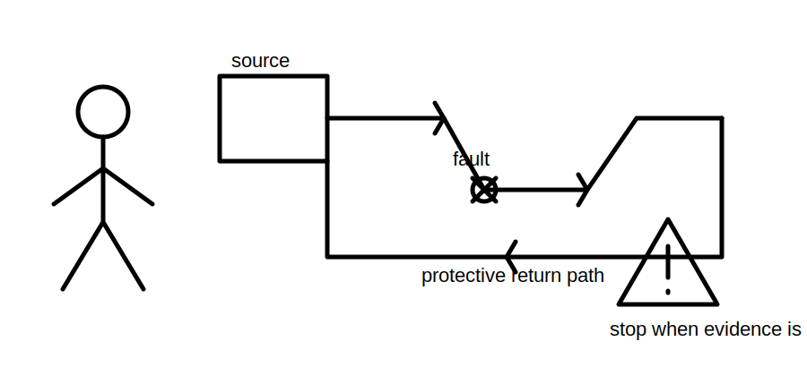
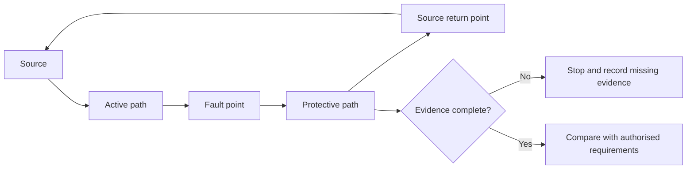
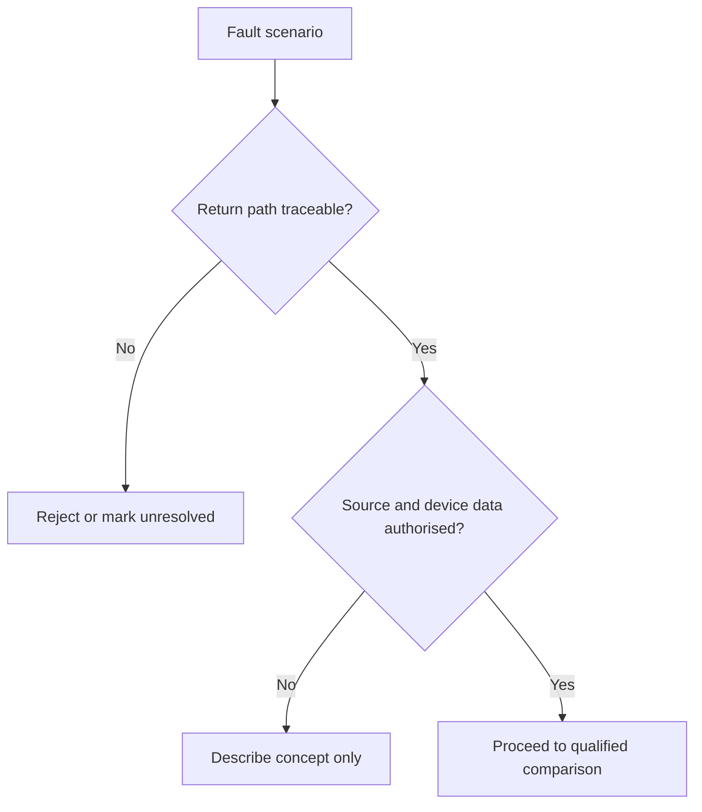

# Day 31 — Fault-Loop Reasoning at Concept Level

> **Scope boundary:** Written conceptual reasoning only. This module supplies no official loop limits, disconnection times, test procedure or compliance conclusion.

## 1. Outcome and entry check

By the end, the learner can map a conceptual fault-current loop, distinguish path continuity from path impedance, identify evidence needed before judging protective operation, classify conclusions as described, supported or verified, and stop when authorised data is absent.

### Entry check

Draw a source-to-fault-and-return path from memory. Label the protective conductor, source return point and protective device, then state which labels are observations and which are assumptions.

## 2. Why it matters

A protective device can only respond to current that has a complete return path. Missing conductors, poor connections, source changes and additional impedance can alter the current available to operate protection. A neat diagram is not proof that the real path is complete or acceptable.

## 3. Core concepts and terminology

- **Fault loop:** the complete path followed by fault current from the source, through the fault and back to the source.
- **Loop continuity:** whether an unbroken conductive path exists.
- **Loop impedance:** total opposition to current around that path; exact calculation and limits require authorised sources.
- **Prospective fault current:** current that could flow under stated fault and source conditions.
- **Automatic disconnection:** protective-device operation intended to remove a hazardous condition under applicable requirements.
- **Bottleneck:** the path section or connection most likely to restrict current or weaken evidence.
- **Claim grade:** described from supplied facts, supported by traceable evidence, or verified only after qualified review.

## 4. Rule-finding workflow

Use **L-O-O-P-S**:

1. **L — Locate the source and fault point.**
2. **O — Outline every outgoing and return segment.**
3. **O — Observe what is known, assumed or missing.**
4. **P — Predict how each segment affects available fault current and protective operation.**
5. **S — Source-check the applicable criterion and state a bounded conclusion.**

The loop must be complete before any protective-operation conclusion is attempted.

## 5. Visual model or worked example

A fictional diagram shows three return paths. Path A is continuous with traceable connection evidence. Path B contains an unverified joint. Path C incorrectly returns through an unrelated conductive object. Only Path A supports further analysis; Path B remains provisional and Path C must be rejected.

## 6. Practical application

1. Annotate two fictional fault-loop diagrams with known, assumed and missing evidence.
2. Rank three path changes by likely direction of effect without inventing values.
3. Explain which earlier design records reopen after a source, conductor, connection or device change.
4. Complete a worked-example-fading sequence: full labels, partial labels, then an independent changed scenario.
5. Score 0–2 for path completeness, terminology, evidence grading, consequence reasoning, source discipline and claim restraint. An invented limit or unsafe practical instruction is a critical error.

## 7. Common errors and safety checkpoint

Common errors include omitting the source return, treating continuity as low impedance, assuming an RCD replaces all other protection, using nominal data without applicability evidence, and claiming compliance from a conceptual sketch.

Stop and mark `reference_check_required` when source characteristics, conductor path, connection condition, device data, applicable criterion or test evidence is unresolved. No opening, isolation, proving, measurement, fault simulation, energisation or field testing is authorised.

## 8. Retrieval and next links

Recite L-O-O-P-S, define the six key terms, redraw the loop closed-note, and explain why continuity alone does not establish protective performance.

- **Plan:** [Twelve-Week Capstone Learning Plan](../MASTER_PLAN.md)
- **Knowledge note:** [[12-Week Day 31 - Fault-Loop Reasoning at Concept Level]]
- **Previous:** [Day 30 — Voltage-Drop Interpretation and Design Iteration](day-30-voltage-drop-interpretation-and-design-iteration.md)
- **Next:** [Day 32 — Coordination, Selectivity and Upstream/Downstream Consequences](day-32-coordination-selectivity-and-upstream-downstream-consequences.md)

All diagrams and scenarios are original. Exact equations, values, limits and acceptance criteria remain `reference_check_required`. This module is not `technically-reviewed`.