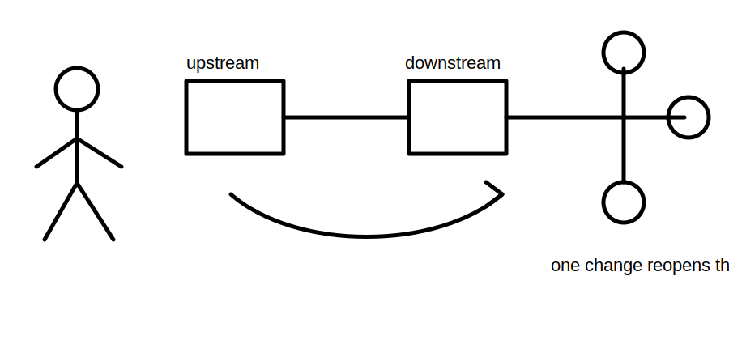
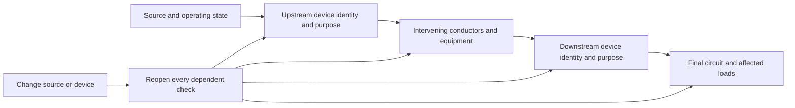
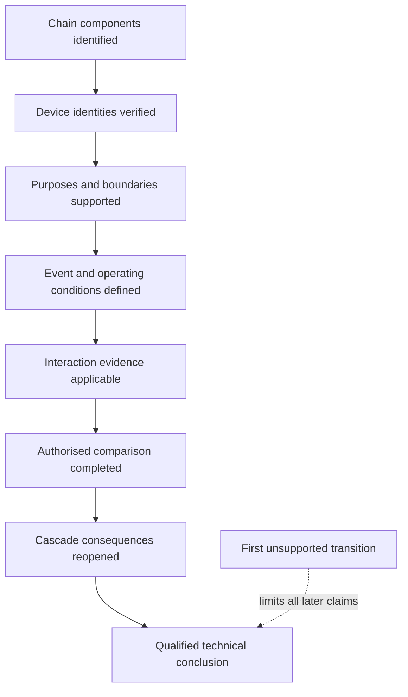

# Day 32 — Coordination, Selectivity and Upstream/Downstream Consequences

> **Scope boundary:** This module teaches evidence-controlled relationship reasoning between fictional protective devices. It supplies no manufacturer settings, curves, limits, fault levels or coordination verdicts and authorises no practical work.

## 1. Outcome and entry check

By the end, the learner can:

1. map a complete upstream-to-downstream protection chain and identify each device's stated purpose and protection boundary;
2. distinguish coordination, selectivity and service continuity without treating them as synonyms;
3. classify each supporting statement as a stated fact, derived fact, supported inference, assumption, contradiction or evidence gap;
4. identify the first unsupported transition in a coordination claim and stop downstream conclusions at that point;
5. trace which conductor, equipment, fault-response and continuity checks must be reopened after a device or source condition changes; and
6. write a bounded conclusion that names the unresolved evidence, its owner and the condition that would trigger re-evaluation.

### Entry check

Without consulting notes, sketch two protective devices in series and label supply side, load side, protected conductors and loads affected if either device operates. Beside each label, record confidence as **high**, **medium** or **low**. A correct guess is not yet secure evidence.

## 2. Why it matters

Protection choices interact. A downstream change may alter conductor protection, equipment duty, fault response, service continuity and the assumptions used for upstream equipment. Coordination is therefore a system relationship, not a property inferred from one device label or from rating order alone.

A learner who jumps directly from "the downstream rating is lower" to "only the downstream device will operate" has crossed several unsupported steps. This module trains the learner to expose those steps, identify the missing evidence and avoid converting a plausible expectation into a technical conclusion.

*Instructional caption: compare the complete protection chain and its evidence; rating order alone does not establish selective operation.*

## 3. Core concepts and terminology

- **Coordination:** evidence-supported arrangement of devices, conductors and equipment so their combined duties and interactions are addressed for stated conditions.
- **Selectivity:** intended restriction of interruption to the smallest practicable affected part for a defined event and operating condition. It is not established merely because one device has a lower rating.
- **Service continuity:** the extent to which unaffected loads remain supplied after an event or protective operation.
- **Upstream device:** protective device nearer the supply in the mapped chain.
- **Downstream device:** protective device nearer the load in the mapped chain.
- **Protection boundary:** the conductors and equipment whose protection depends wholly or partly on a device.
- **Operating region:** the conditions over which a device may respond. Exact characteristics require applicable authorised and manufacturer data.
- **Interaction evidence:** source information showing how two or more devices behave together under stated conditions.
- **Cascade consequence:** a design or verification check that must be reopened because another input or component changed.
- **Evidence provenance:** where an item of evidence came from, which edition or device it applies to, and what operating conditions constrain its use.
- **Evidence owner:** the person or authority responsible for resolving an evidence gap or contradiction.
- **Recheck trigger:** a defined change that invalidates or reopens earlier reasoning.
- **First unsupported transition:** the earliest step in a claim chain that lacks adequate evidence; later conclusions cannot be stronger than this step.

Use these evidence labels:

- **Stated fact:** directly supplied by an identified source.
- **Derived fact:** produced transparently from supported inputs using an authorised method.
- **Supported inference:** reasonable interpretation whose assumptions are explicit and evidence-linked.
- **Assumption:** unverified condition temporarily used for exploration, never as a final conclusion.
- **Contradiction:** two evidence items cannot both describe the same condition as presented.
- **Evidence gap:** required information is absent or not shown to be applicable.

## 4. Rule-finding workflow

Use **C-H-A-I-N-S**:

1. **C — Chart the complete protection chain.** Include source, alternate sources, upstream device, intervening conductors, downstream device, final circuit and affected loads.
2. **H — Highlight each purpose and boundary.** Separate overload, short-circuit, residual-current or other stated functions; do not merge functions without evidence.
3. **A — Assemble applicable evidence.** Record provenance, device identity, source condition, manufacturer applicability and authorised criteria. Keep conflicting records visible.
4. **I — Identify interaction conditions and uncertainty.** State the event being considered, operating state, plausible overlap, alternate paths and the first unsupported transition.
5. **N — Note every cascade consequence.** Reopen conductor capacity, equipment duty, fault-response, voltage, continuity, labelling and verification reasoning where affected.
6. **S — State a bounded conclusion.** Name what is supported, what remains unresolved, who owns the missing evidence and what change would trigger recheck.

The diagram shows that a device change does not stay local. The learner must propagate the change through every dependent protection boundary and design check.

### Claim ladder

Each rung requires its own evidence. If device identity is uncertain, later interaction or selectivity claims remain unsupported even when the chain sketch looks complete.

## 5. Visual model or worked example

A fictional board has Device U feeding Device D and two other branches. The proposed replacement for Device D appears to improve one local protection objective.

Available records state:

- a current single-line diagram identifies Device U and Device D but does not include interaction data;
- a maintenance note lists a replacement model for Device D;
- a photograph label appears to show a different model suffix;
- a manufacturer extract is supplied, but its source conditions and exact device pairing are not confirmed;
- one branch has an alternate supply noted on a later renovation drawing.

Two competing interpretations must remain visible:

1. **Interpretation A:** the maintenance note is current and the manufacturer extract applies to the installed pair.
2. **Interpretation B:** the photograph or renovation record reflects a later change, so the extract may not apply and the alternate source may alter the interaction conditions.

The first unsupported transition occurs before any selectivity conclusion because exact device identity, pairing and source condition are unresolved. The learner may map affected loads and list required evidence, but must not claim selective operation.

Evidence owners and recheck triggers:

| Unresolved item | Evidence owner | Recheck trigger |
|---|---|---|
| Exact installed device identities | authorised designer or responsible records custodian | verified schedule, nameplate record or approved as-installed documentation is supplied |
| Applicable interaction data | manufacturer or authorised technical source | exact device pairing and operating conditions are confirmed |
| Alternate-source effect | authorised designer or supply-system owner | source arrangement and operating state are confirmed |
| Downstream cascade checks | responsible designer | any device, source, conductor or operating-condition input changes |

## 6. Practical application

Complete three fictional paper-based scenarios.

For each scenario:

1. draw the complete protection chain, including alternate sources and unaffected branches;
2. label every statement with one of the six evidence classifications;
3. identify each device's purpose and protection boundary without merging protective functions;
4. write the claim ladder and mark the first unsupported transition;
5. retain at least two competing interpretations when records conflict;
6. list every cascade consequence that must be reopened;
7. assign an evidence owner and recheck trigger to every unresolved item; and
8. write a bounded conclusion that does not exceed the supported evidence.

### Transfer task

Change at least two material conditions, such as device identity plus source arrangement, or conductor route plus affected-load priority. Rebuild the chain and all dependent conclusions rather than editing only the final sentence.

### Criterion-level readiness

Assess each criterion separately:

- **Secure:** accurate, evidence-linked, transferable and bounded without prompting.
- **Developing:** mostly accurate but needs prompting, clearer provenance or stronger consequence tracing.
- **Unsupported:** conclusion exceeds evidence, relies on an unresolved contradiction or omits a material dependency.
- **`stop-required`:** the response invents device behaviour, ignores an alternate source, treats rating order as proof, or proposes unauthorised practical work.

There is no aggregate score. A blocking condition cannot be offset by stronger performance elsewhere.

## 7. Common errors and safety checkpoint

Common errors include:

- treating coordination, selectivity and service continuity as interchangeable;
- assuming a lower downstream rating guarantees local operation;
- comparing manufacturer data for a different device pair or source condition;
- ignoring alternate supplies, parallel paths or changed operating states;
- overlooking conductor and equipment duties after a device change;
- resolving contradictions by choosing the most convenient record;
- repeating the same unsupported assumption in several forms and calling it corroboration; and
- updating the final conclusion without reopening upstream and downstream dependencies.

Blocking conditions are:

- invented settings, curves, fault levels, operating times or coordination results;
- unverified device identity or evidence applicability presented as fact;
- a selectivity or compliance claim after the first unsupported transition;
- ignored contradictions or alternate supplies; and
- proposed adjustment, switching, testing, fault injection, energisation or field verification outside authorised supervision.

Stop when device characteristics, fault conditions, source arrangement, conductor duty, manufacturer evidence or authorised criteria are missing. Record the gap and escalate it to the identified evidence owner. This module authorises no adjustment, switching, isolation, opening, testing, fault simulation, energisation, commissioning, certification or verification.

## 8. Retrieval and next links

Without notes:

1. recite C-H-A-I-N-S;
2. define coordination, selectivity and service continuity in distinct terms;
3. redraw the claim ladder;
4. explain why rating order alone does not prove selective operation;
5. name the six evidence classifications; and
6. describe how the first unsupported transition limits every later claim.

- **Plan:** [Twelve-Week Capstone Learning Plan](../MASTER_PLAN.md)
- **Knowledge note:** [[12-Week Day 32 - Coordination Selectivity and Upstream-Downstream Consequences]]
- **Previous:** [Day 31 — Fault-Loop Reasoning at Concept Level](day-31-fault-loop-reasoning-at-concept-level.md)
- **Next:** [Day 33 — Rest, Retrieval and Formula-Selection Correction](day-33-rest-retrieval-and-formula-selection-correction.md)

All scenarios are original. Exact characteristics, duties, settings, interaction data, source conditions, comparison methods and acceptance requirements remain `reference_check_required`. This module is not `technically-reviewed`.