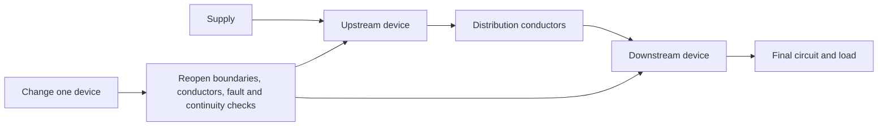
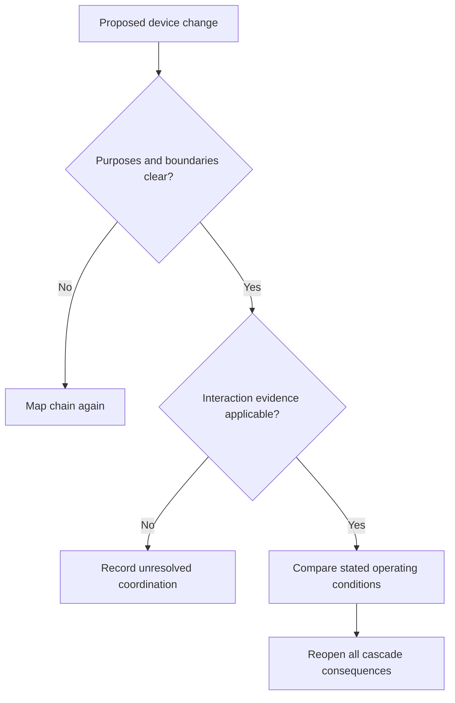

# Day 32 — Coordination, Selectivity and Upstream/Downstream Consequences

> **Scope boundary:** This module teaches relationship reasoning between fictional protective devices. It supplies no manufacturer settings, curves, limits or coordination verdict.

## 1. Outcome and entry check

By the end, the learner can distinguish coordination from selectivity, map upstream and downstream protection boundaries, predict consequences of a device change, identify evidence needed for comparison, and write a bounded conclusion without assuming that different ratings guarantee selective operation.

### Entry check

Sketch two devices in series and label supply side, load side, protected conductors and the loads affected if either device operates.

## 2. Why it matters

Protection choices interact. A downstream change can alter conductor protection, fault response, service continuity and the burden on upstream equipment. Coordination is therefore a system relationship, not a property inferred from one label.

## 3. Core concepts and terminology

- **Coordination:** arrangement of devices and conductors so their combined duties and interactions are addressed.
- **Selectivity:** intended restriction of interruption to the smallest practicable affected part under stated conditions.
- **Upstream device:** protective device nearer the supply.
- **Downstream device:** protective device nearer the load.
- **Protection boundary:** conductors and equipment whose protection depends on a device.
- **Operating region:** range of conditions over which a device may respond; exact characteristics require authorised data.
- **Cascade consequence:** an effect propagated to other design checks after one component changes.

## 4. Rule-finding workflow

Use **C-H-A-I-N-S**:

1. **C — Chart the complete protection chain.**
2. **H — Highlight each device purpose and boundary.**
3. **A — Assemble applicable source and manufacturer evidence.**
4. **I — Identify overlapping operating conditions and uncertainty.**
5. **N — Note every upstream and downstream consequence of a change.**
6. **S — State only the conclusion supported by evidence.**

## 5. Visual model or worked example

A fictional board has Device U feeding Device D and two unaffected branches. A proposed change to Device D appears to improve one local protection objective but uses unverified interaction data. The learner must withhold a selectivity claim, record the affected branches, and identify the manufacturer and authorised-source evidence required.

## 6. Practical application

1. Build a protection-chain map for three fictional scenarios.
2. Separate device purpose, boundary and supplied evidence.
3. Predict which loads and checks are affected if the upstream or downstream device operates.
4. Compare two proposed changes and list missing interaction evidence.
5. Complete a changed-source transfer task.
6. Score 0–2 for chain mapping, terminology, evidence applicability, consequence tracing, change reopening and claim restraint. Rating-only assumptions are critical errors.

## 7. Common errors and safety checkpoint

Common errors include treating coordination and selectivity as synonyms, assuming a lower downstream rating guarantees local operation, ignoring conductor or equipment duties, comparing data from mismatched conditions, and overlooking alternate supplies.

Stop when device characteristics, fault conditions, source arrangement, conductor duty, manufacturer evidence or authorised criteria are missing. No adjustment, switching, testing, fault injection, energisation or field verification is authorised.

## 8. Retrieval and next links

Recite C-H-A-I-N-S, define the seven terms, redraw a two-device chain, and explain why rating order alone does not prove selectivity.

- **Plan:** [Twelve-Week Capstone Learning Plan](../MASTER_PLAN.md)
- **Knowledge note:** [[12-Week Day 32 - Coordination Selectivity and Upstream-Downstream Consequences]]
- **Previous:** [Day 31 — Fault-Loop Reasoning at Concept Level](day-31-fault-loop-reasoning-at-concept-level.md)
- **Next:** [Day 33 — Rest, Retrieval and Formula-Selection Correction](day-33-rest-retrieval-and-formula-selection-correction.md)

All scenarios are original. Exact characteristics, duties, settings, interaction data and acceptance requirements remain `reference_check_required`. This module is not `technically-reviewed`.