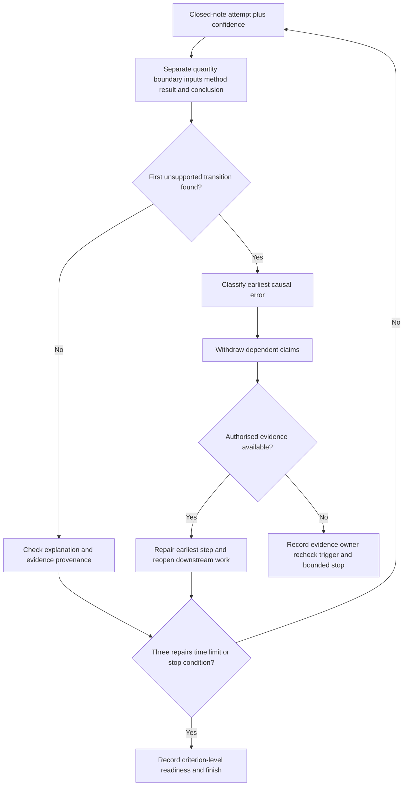
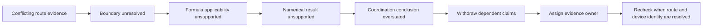

# Day 33 — Rest, Retrieval and Formula-Selection Correction

> **Scope boundary:** This is a written recovery and correction block. It introduces no new electrical theory, official formula, value, limit, test method or practical procedure.

## 1. Outcome and entry check

By the end, the learner can:

1. retrieve the Week 5 reasoning workflows without notes and label confidence before checking;
2. distinguish a formula-selection error from an input, boundary, unit, applicability, arithmetic or conclusion error;
3. locate the **first unsupported transition** in a calculation chain;
4. repair no more than three high-value errors from their earliest causal point;
5. reopen every downstream conclusion affected by a repair;
6. assign an evidence owner and recheck trigger to unresolved gaps; and
7. record a criterion-level readiness state without converting it into an official grade or competency claim.

### Entry check

Before opening notes, write:

- fatigue: 0–5;
- confidence: low, medium or high for each retrieved workflow;
- available time: no more than 30 minutes; and
- one sentence describing the difference between a result and a supported conclusion.

At fatigue 4–5, complete only the six-minute retrieval set and stop. At fatigue 0–3, continue until the first stop condition or the 30-minute limit. Confidence is calibration evidence: a correct guess is not secure retrieval, while a confidently wrong answer is a priority correction.

## 2. Why it matters

Recovery protects learning quality. Repeating calculations while tired can strengthen the wrong boundary, formula family, path convention, unit treatment or conclusion. A visible numerical answer may still be unsupported when its inputs, method applicability or evidence chain are weak.

This block therefore separates **remembering**, **selecting**, **calculating** and **concluding**. The learner repairs the earliest causal problem rather than polishing arithmetic downstream of a bad assumption.

*Instructional caption: repair the earliest high-value error, reopen dependent conclusions, and stop after three repairs or 30 minutes.*

## 3. Core concepts and terminology

- **Retrieval:** recalling and explaining knowledge without looking at notes.
- **Confidence calibration:** comparing confidence recorded before checking with the quality of the checked answer.
- **Formula family:** a group of relationships intended for a particular quantity and set of conditions; the exact authorised relationship remains source-dependent.
- **Formula-selection error:** choosing a relationship that does not match the required quantity, stated boundary, supplied variables or authorised conditions.
- **Input error:** using a value, identity or condition that is absent, contradicted, stale or unsupported.
- **Boundary error:** applying a method to the wrong start point, end point, path or contribution set.
- **Unit error:** combining quantities expressed in incompatible units or applying an unverified conversion.
- **Applicability error:** using a method or source outside the conditions for which it is intended.
- **Arithmetic error:** performing an otherwise appropriate numerical operation incorrectly.
- **Evidence error:** using an input, method or criterion without traceable authority and applicability.
- **Conclusion error:** making a claim stronger than the supported calculation and evidence allow.
- **First unsupported transition:** the earliest step where the reasoning moves from supported information to an unsupported claim. Later conclusions cannot be stronger than this point.
- **Downstream consequence:** any result, comparison, design decision or readiness claim that depends on an earlier step.
- **Evidence owner:** the person or role responsible for resolving a named evidence gap.
- **Recheck trigger:** the event that requires dependent work to be reopened, such as a corrected route, device identity, operating case or source method.
- **Correction limit:** no more than three repaired errors in this block.
- **Stop condition:** fatigue, repeated guessing, frustration escalation, missing authorised evidence, safety uncertainty or the 30-minute limit.

Use these evidence labels in the correction log:

- **stated fact** — explicitly supplied by the exercise;
- **derived fact** — obtained from supported inputs using an authorised method;
- **supported inference** — a bounded interpretation with traceable support;
- **assumption** — provisionally accepted but not verified;
- **contradiction** — two sources or observations cannot both describe the same condition as stated; and
- **evidence gap** — information required for the next claim is absent or unusable.

## 4. Rule-finding workflow

Use **R-E-S-E-T**:

1. **R — Retrieve and rate confidence.** Reconstruct V-O-L-T-S, L-O-O-P-S and C-H-A-I-N-S closed-note. Mark uncertainty rather than filling gaps from memory.
2. **E — Examine the claim chain.** Separate required quantity, boundary, inputs, formula family, authorised source, arithmetic, result and conclusion.
3. **S — Sort the earliest error.** Label it as input, boundary, formula-selection, unit, applicability, arithmetic, evidence or conclusion error. Also label the supporting evidence state.
4. **E — Edit from the first unsupported transition.** Withdraw affected claims, repair only with available authorised evidence, and reopen every downstream consequence.
5. **T — Terminate and transfer.** Stop after three repairs, 30 minutes or any stop condition. Record the evidence owner, recheck trigger and one materially changed transfer case.

The diagram prevents a common shortcut: correcting the visible numerical result while leaving the unsupported boundary, method or input unchanged.

### Correction-log fields

For each selected error, record:

| Field | Required record |
|---|---|
| Intended claim | What the learner was trying to establish |
| First unsupported transition | Earliest unsupported step |
| Error class | Input, boundary, selection, unit, applicability, arithmetic, evidence or conclusion |
| Evidence state | Stated fact, derived fact, supported inference, assumption, contradiction or evidence gap |
| Repair | What changed and why |
| Reopened consequences | Every dependent result or conclusion |
| Evidence owner | Who must resolve any remaining gap |
| Recheck trigger | What new or corrected information requires rework |

## 5. Visual model or worked example

A fictional learner selects a voltage relationship before defining the path and operating case, then carries the numerical result into a coordination claim.

The learner’s page contains four records:

- a sketch showing one route boundary;
- a schedule describing a different route extent;
- an operating-current note with no source; and
- a protective-device description that conflicts with a later photograph.

Two interpretations remain possible:

1. the sketch is current and the schedule is stale; or
2. the schedule reflects a later alteration and the sketch is incomplete.

Neither interpretation may be silently preferred. The first unsupported transition occurs before formula selection because the calculation boundary and applicable operating case are unresolved.

The correct recovery is not to try another formula. It is to preserve both interpretations, stop at the unresolved boundary, and name what evidence would allow the calculation chain to reopen.

### Worked repair

1. Withdraw the voltage and coordination conclusions.
2. Label the route mismatch as a contradiction.
3. Label the operating current and device identity as evidence gaps.
4. Assign the drawing owner or supervisor to resolve route provenance and the authorised reviewer to resolve method applicability.
5. Recheck the voltage calculation, device interaction comparison and any dependent design statement when those facts change.

No technical acceptance conclusion is made in this block.

## 6. Practical application

### Six-minute retrieval set

Without notes:

1. write the purpose of V-O-L-T-S, L-O-O-P-S and C-H-A-I-N-S;
2. draw one voltage boundary, one conceptual fault loop and one protection chain;
3. mark confidence beside each item; and
4. stop when six minutes expires.

### Error-log correction

Select no more than three errors using this priority order:

1. safety or authority overreach;
2. first unsupported transition affecting several later claims;
3. confidently wrong formula selection or boundary;
4. repeated unit or applicability error; then
5. isolated arithmetic error.

For each error, complete every correction-log field. A repaired answer is incomplete until affected downstream claims are reopened.

### Transfer task

Change at least two material conditions in one corrected scenario, for example:

- route boundary and operating case;
- device identity and source condition; or
- conductor record and evidence provenance.

Rebuild the affected reasoning from the first changed dependency. Do not merely substitute new numbers into the old working.

### Criterion-level readiness record

Record each criterion separately:

- **secure** — accurate, explainable, traceable and transferable without hidden support;
- **developing** — substantially correct but one bounded non-safety gap remains;
- **unsupported** — a material claim lacks evidence, applicability or a coherent chain; or
- **`stop-required`** — fatigue, authority, source or safety conditions require the task to end.

Assess these criteria independently:

- workflow retrieval;
- confidence calibration;
- error classification;
- first-unsupported-transition control;
- causal repair and downstream reopening;
- evidence restraint; and
- stop-rule compliance.

These are learning-planning states, not official grades, competency decisions or permission to perform electrical work.

## 7. Common errors and safety checkpoint

Common errors include:

- studying past the time limit;
- changing arithmetic without repairing the boundary;
- choosing a familiar formula before identifying the required quantity;
- treating a calculator repeat as an independent check;
- resolving contradictions by selecting the convenient record;
- correcting an input without reopening dependent conclusions;
- treating recall fluency as practical competence; and
- hiding uncertainty to preserve a score.

The following are blocking conditions and cannot be offset by stronger work elsewhere:

- invented formula, value, limit, rating or source;
- ignored contradiction affecting the selected method;
- unlabelled assumption used as a verified fact;
- unsupported technical acceptance or compliance conclusion;
- continued work after a stop condition; or
- any unauthorised practical action.

Stop immediately for fatigue, frustration escalation, repeated guessing, absent authorised sources, unresolved safety uncertainty or any urge to verify the scenario physically. No switching, isolation, opening, measuring, testing, fault injection, energisation, commissioning, certification or field work is authorised.

## 8. Retrieval and next links

Submit:

- the confidence-rated retrieval sheet;
- three reconstructed diagrams;
- up to three complete correction-log entries;
- one two-condition transfer case; and
- criterion-level readiness states with reasons.

- **Plan:** [Twelve-Week Capstone Learning Plan](../MASTER_PLAN.md)
- **Knowledge note:** [[12-Week Day 33 - Rest Retrieval and Formula-Selection Correction]]
- **Previous:** [Day 32 — Coordination, Selectivity and Upstream/Downstream Consequences](day-32-coordination-selectivity-and-upstream-downstream-consequences.md)
- **Next:** [Day 34 — Integrated Protection, Conductor and Voltage Scenario](day-34-integrated-protection-conductor-and-voltage-scenario.md)

All tasks are original educational exercises. Exact methods, equations, values, limits and criteria remain `reference_check_required`. This module is not `technically-reviewed`.