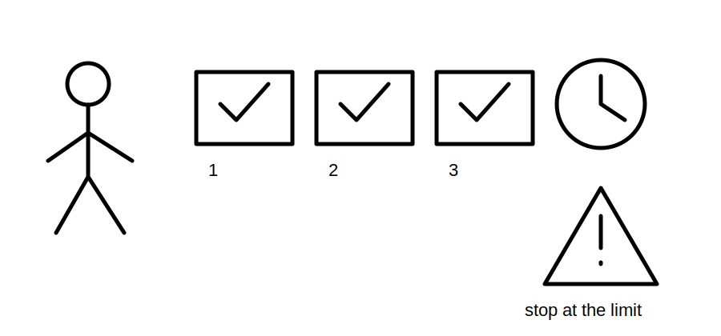
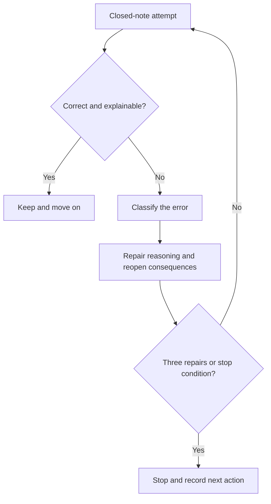
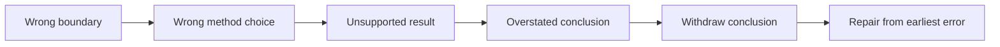

# Day 33 — Rest, Retrieval and Formula-Selection Correction

> **Scope boundary:** This is a recovery and correction block. It introduces no new electrical theory, official formula, value, limit or practical procedure.

## 1. Outcome and entry check

By the end, the learner can retrieve the Week 5 workflows closed-note, classify formula-selection errors, repair no more than three high-value errors, identify stop conditions, and decide whether to proceed, remediate or seek supervised help.

### Entry check

Rate fatigue from 0–5. At 4–5, perform only the short retrieval set and stop. At 0–3, continue for a maximum of 30 minutes.

## 2. Why it matters

Recovery protects learning quality. Repeating calculations while fatigued can reinforce the wrong boundary, formula family, unit convention or conclusion. This block slows the learner down, separates recall failure from source failure and prepares a clean evidence trail for the integrated scenario.

## 3. Core concepts and terminology

- **Retrieval:** recalling knowledge without looking at notes.
- **Formula-selection error:** choosing a relationship that does not match the stated quantity, boundary or supplied variables.
- **Boundary error:** applying a method to the wrong start point, end point or contribution set.
- **Unit error:** mixing incompatible units or conversion assumptions.
- **Evidence error:** using an input or criterion without traceable authority or applicability.
- **Conclusion error:** making a claim stronger than the evidence supports.
- **Correction limit:** a maximum of three repaired errors in this block.
- **Stop condition:** fatigue, repeated uncertainty, missing source evidence or the 30-minute limit.

## 4. Rule-finding workflow

Use **R-E-S-E-T**:

1. **R — Retrieve** L-O-O-P-S, C-H-A-I-N-S and the prior voltage workflow closed-note.
2. **E — Examine** each error without immediately recopying the answer.
3. **S — Sort** it as boundary, formula, unit, evidence or conclusion error.
4. **E — Edit** the reasoning chain and reopen downstream conclusions.
5. **T — Terminate** after three repairs, 30 minutes or any stop condition.

## 5. Visual model or worked example

A fictional learner selects a voltage relationship before defining the path, then carries the result into a coordination claim. The repair sequence is: withdraw the conclusion, define the boundary, identify the required quantity, verify supplied variables and units, then decide whether an authorised formula is available. The learner does not guess the missing method.

## 6. Practical application

1. Recite three workflows and define ten selected terms.
2. Redraw one voltage boundary, one fault loop and one protection chain.
3. Triage an error log into repair now, schedule later or escalate.
4. Repair a maximum of three errors from the earliest causal point.
5. Record readiness: **proceed** when reasoning is accurate and explainable; **remediate** when one bounded gap remains; **seek supervision** when source or safety uncertainty persists.
6. Use a simple rubric: retrieval accuracy, error classification, causal repair, evidence restraint, stop-rule compliance and readiness honesty.

## 7. Common errors and safety checkpoint

Common errors include studying past the time limit, correcting arithmetic without repairing the boundary, copying a formula without checking variables, treating recall difficulty as evidence of practical competence, and hiding uncertainty to preserve a score.

Stop immediately for fatigue, frustration escalation, repeated guessing, absent authorised sources or any urge to perform practical testing. No switching, isolation, opening, measuring, testing, energisation or field work is authorised.

## 8. Retrieval and next links

Submit the closed-note workflows, three diagrams, the corrected error log and one readiness decision with reasons.

- **Plan:** [Twelve-Week Capstone Learning Plan](../MASTER_PLAN.md)
- **Knowledge note:** [[12-Week Day 33 - Rest Retrieval and Formula-Selection Correction]]
- **Previous:** [Day 32 — Coordination, Selectivity and Upstream/Downstream Consequences](day-32-coordination-selectivity-and-upstream-downstream-consequences.md)
- **Next:** Day 34 — Integrated Protection, Conductor and Voltage Scenario

All tasks are original educational exercises. Exact methods, values and criteria remain `reference_check_required`. This module is not `technically-reviewed`.