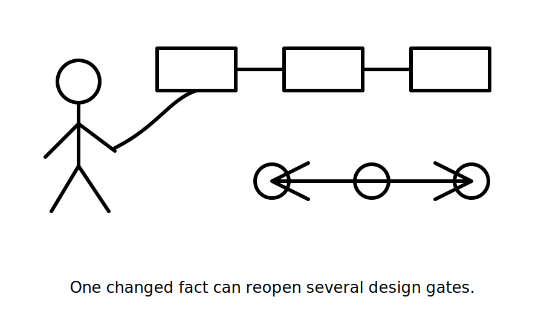
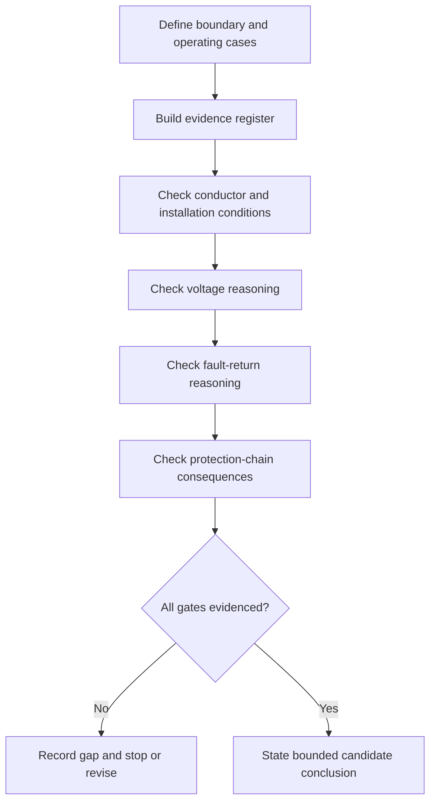
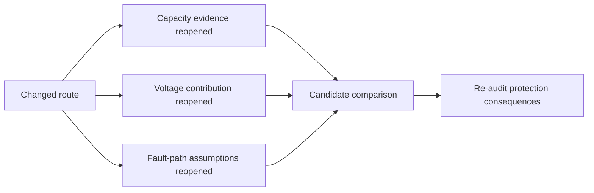

# Day 34 — Integrated Protection, Conductor and Voltage Scenario

> **Scope boundary:** This original learning module develops written reasoning and source-navigation capability. It does not supply official limits, device data, field procedures or technical approval.

## 1. Outcome and entry check

By the end, the learner can integrate protection, conductor, voltage and fault reasoning in one fictional design scenario; distinguish supplied facts, authorised criteria, derived results, training assumptions and unresolved evidence; and defend a bounded candidate without claiming technical approval.

### Entry check

Without notes, state the purpose of each prerequisite workflow, identify one unresolved item that would prevent a verified conclusion, and explain why a plausible answer is not the same as an evidenced answer. Record **ready**, **needs refresher**, or **requires supervised support** before continuing.

## 2. Why it matters

Capstone tasks rarely isolate one rule. A decision can appear correct while relying on an incomplete boundary, unverified source, hidden operating condition or downstream assumption. This block makes the reasoning chain visible so that changes trigger deliberate re-checking rather than silent carry-over.

## 3. Core concepts and terminology

- **Integrated scenario:** a written problem requiring several previously learned domains to be considered together.
- **Design gate:** a required checkpoint that must be supported before the design can progress.
- **Dependency:** a result or claim that changes when an earlier input changes.
- **Reopening trigger:** a changed fact that requires one or more completed checks to be performed again.
- **Evidence register:** a record linking each input or criterion to its source and applicability.
- **Bounded conclusion:** a statement limited to the evidence, assumptions and unresolved items actually available.

## 4. Rule-finding workflow

Use **I-N-T-E-G-R-A-T-E**:

1. **I — Identify** the installation boundary, load purpose and operating cases.
2. **N — Name** every required quantity, protective function and evidence source.
3. **T — Trace** conductor conditions, voltage contributions and the complete fault-return path.
4. **E — Evaluate** each claim against authorised evidence and stated applicability.
5. **G — Gate** the design at capacity, voltage, fault and coordination checkpoints.
6. **R — Reopen** dependent checks whenever an input, route, device or source changes.
7. **A — Audit** assumptions, units, unresolved items and alternative candidates.
8. **T — Transfer** the reasoning to one changed scenario without copying the first answer.
9. **E — Express** only the strongest conclusion the evidence supports.

The diagram shows the evidence gates. A conclusion remains provisional whenever a required input, source, applicability check or consequence check is unresolved.

## 5. Visual model or worked example

A fictional workshop circuit is supplied with a complete load description but only partial route and device evidence. The learner first separates supplied facts from assumptions, then records which capacity, voltage, fault and coordination checks can be supported. When the route changes, the affected checks reopen before either candidate is compared.

The model is not a standards diagram. It visualises the learner's reasoning order and the points where an assumption must be replaced by authorised evidence.

## 6. Practical application

1. Complete a fictional scenario using a one-page evidence register before any calculation or selection.
2. Produce a dependency map showing which conclusions rely on each route, load, source and device input.
3. Compare two candidate responses using the same evidence gates rather than preference or rating order.
4. Change one material fact, reopen every affected check and explain why unaffected checks remain closed.
5. Present a five-minute design defence, followed by two minutes identifying the weakest evidence in the response.

Assess the submission across six dimensions: boundary definition, terminology, source traceability, reasoning sequence, consequence control and conclusion restraint. Score each 0–2. Any invented technical value, unsafe practical action or unsupported acceptance claim is a critical error regardless of score.

## 7. Common errors and safety checkpoint

Common errors include starting calculations before defining the boundary; checking each domain independently but missing interactions; treating a single satisfactory result as whole-design acceptance; changing a conductor or device without reopening dependent checks; and presenting assumptions as verified facts.

Stop when evidence is missing, the scenario implies live or practical work, the learner cannot define the boundary, or an authorised source cannot be checked. No switching, isolation, opening, measuring, testing, adjustment, installation, energisation, commissioning, certification or verification is authorised.

## 8. Retrieval and next links

Submit the annotated scenario, evidence register, reasoning chain, consequence re-check list and one bounded conclusion. Then answer: **What single changed fact would force the largest part of your work to be reopened, and why?**

- **Plan:** [Twelve-Week Capstone Learning Plan](../MASTER_PLAN.md)
- **Knowledge note:** [[12-Week Day 34 - Integrated Protection Conductor and Voltage Scenario]]
- **Previous:** [Day 33 — Rest, Retrieval and Formula-Selection Correction](day-33-rest-retrieval-and-formula-selection-correction.md)
- **Next:** Day 35 — Week 5 Design-Review Conference and Remediation

All examples, diagrams and rubrics are original educational constructs. Exact clauses, limits, formulae, device characteristics and acceptance criteria remain `reference_check_required`. This module is not `technically-reviewed`.
