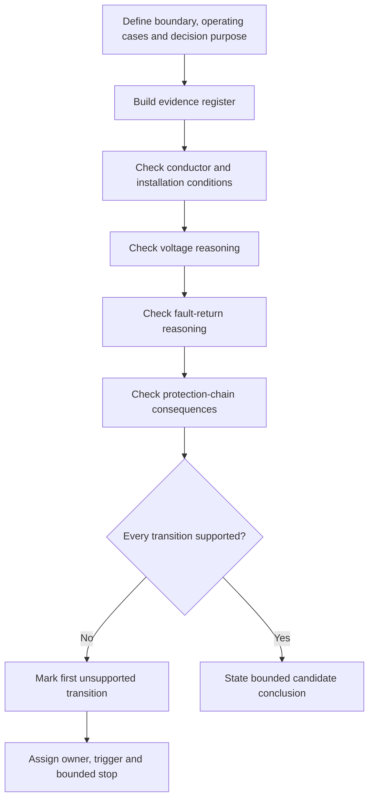
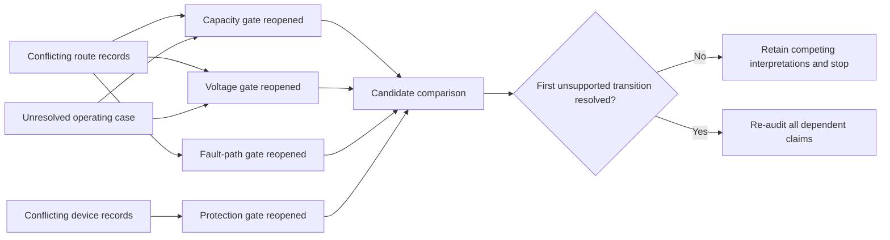

# Day 34 — Integrated Protection, Conductor and Voltage Scenario

> **Scope boundary:** This original learning module develops written reasoning and source-navigation capability. It does not supply official limits, device data, field procedures or technical approval.

## 1. Outcome and entry check

By the end, the learner can produce and defend an integrated evidence chain for one fictional circuit-design scenario by:

1. defining the installation boundary, load purpose and operating cases;
2. classifying each input as a stated fact, derived fact, supported inference, assumption, contradiction or evidence gap;
3. tracing conductor-capacity, voltage, fault-return and protection-coordination dependencies;
4. identifying the first unsupported transition in the chain;
5. reopening every affected check after at least two material scenario changes; and
6. stating a bounded candidate conclusion without claiming compliance, approval or practical competence.

### Entry check

Without notes, write one sentence for the purpose of each prerequisite workflow. Then identify one item that would prevent a verified conclusion in each domain: conductor capacity, voltage, fault return and protection coordination. Record confidence as **high**, **medium** or **low** before checking notes. A correct low-confidence answer is not yet secure retrieval; an incorrect high-confidence answer belongs in the error log.

Continue independently only when the learner can distinguish a supplied fact from an assumption and can explain why a plausible candidate is not an evidenced conclusion. Otherwise use a prerequisite refresher or supervised support.

## 2. Why it matters

Capstone tasks rarely isolate one rule. A candidate may appear reasonable while relying on an incomplete boundary, unverified source, hidden operating condition or outdated record. Integrated reasoning makes these dependencies visible. It also prevents one satisfactory calculation from being treated as whole-design acceptance.

*Instructional caption: a changed route reopens every dependent design gate; it does not merely change one calculation.*

## 3. Core concepts and terminology

- **Integrated scenario:** a written problem requiring several previously learned domains to be considered together.
- **Design gate:** a required checkpoint that must be supported before the design can progress.
- **Dependency:** a result or claim that changes when an earlier input changes.
- **Reopening trigger:** a changed fact, source, assumption or contradiction that requires completed checks to be reconsidered.
- **Evidence register:** a record linking each input or criterion to its source, applicability, owner and recheck trigger.
- **Evidence owner:** the person or authorised source responsible for resolving a gap or contradiction.
- **Competing interpretation:** more than one plausible reading of the available evidence that remains visible until stronger evidence resolves it.
- **First unsupported transition:** the earliest step where the evidence no longer supports movement from one claim to the next.
- **Bounded conclusion:** a statement limited to the evidence, assumptions and unresolved items actually available.
- **Stated fact:** information explicitly supplied by the scenario or an identified authorised source.
- **Derived fact:** a result obtained from supported inputs using an identified and applicable method.
- **Supported inference:** a reasoned interpretation that follows from evidence but is not directly stated.
- **Assumption:** a temporary proposition used to continue reasoning and clearly marked for confirmation.
- **Contradiction:** two records or observations that cannot both describe the same condition without explanation.
- **Evidence gap:** information required for the next claim that is absent, ambiguous, outdated or inapplicable.

## 4. Rule-finding workflow

Use **I-N-T-E-G-R-A-T-E**:

1. **I — Identify** the installation boundary, load purpose, operating cases and decision purpose.
2. **N — Name** every required quantity, protective function, source and unresolved item.
3. **T — Trace** conductor conditions, voltage contributions, the complete fault-return path and upstream/downstream protection relationships.
4. **E — Evaluate** each step against authorised evidence, source currency and stated applicability.
5. **G — Gate** the design at capacity, voltage, fault and coordination checkpoints; mark the first unsupported transition.
6. **R — Reopen** dependent checks whenever an input, route, device, operating case or source changes.
7. **A — Audit** evidence classifications, units, contradictions, alternative interpretations and owner assignments.
8. **T — Transfer** the reasoning to a changed scenario with at least two material changes.
9. **E — Express** only the strongest conclusion the evidence supports.

The diagram is a claim-control workflow, not a standards procedure. The first unsupported transition limits every later claim, even when later arithmetic appears correct.

## 5. Visual model or worked example

### Fictional scenario

A workshop extension is described by four records:

- a design drawing showing a direct route and one conductor description;
- a renovation note showing a longer route through a different environment;
- a switchboard schedule naming one protective device;
- a maintenance photograph showing a device marking that appears inconsistent with the schedule.

The load purpose is supplied, but the normal operating case and whether two loads can operate simultaneously are unresolved. The learner must retain at least two competing interpretations until the route, conductor identity, device identity and operating case are resolved.

The model shows that conflicts propagate. Selecting the convenient route or device record would hide the evidence problem rather than solve it.

### Claim ladder

Use this ladder to prevent overclaiming:

1. scenario item identified;
2. source and currency identified;
3. applicability established;
4. input or condition supported;
5. method selected and justified;
6. derived result independently checked;
7. cross-domain consequence rechecked;
8. bounded educational conclusion stated.

A failure at any rung blocks the rungs above it. Repeating the same calculator entry is not an independent check.

## 6. Practical application

1. Build a one-page evidence register before calculation or selection. Include claim, evidence state, source, applicability, competing interpretation, owner and recheck trigger.
2. Produce a dependency map showing which conclusions rely on each route, load, source, conductor and device input.
3. Compare two candidate responses using identical evidence gates rather than preference, familiarity or rating order.
4. Change at least two material conditions—for example route and operating case, or device identity and conductor condition—and reopen every affected check.
5. Explain why unaffected checks remain closed; do not simply state that they are unchanged.
6. Present a five-minute design defence followed by two minutes identifying the first unsupported transition and the weakest evidence owner assignment.

### Criterion-level readiness

Assess each criterion independently:

- **Secure:** the learner identifies the boundary, classifies evidence, traces dependencies, preserves contradictions, reopens affected gates and limits conclusions without prompting.
- **Developing:** the reasoning is substantially correct but needs a prompt to expose one dependency, evidence state or reopening trigger.
- **Unsupported:** a required transition lacks evidence, applicability or method justification.
- **`stop-required`:** the response invents a technical value, suppresses a contradiction, treats an assumption as verified, makes an unsupported acceptance claim or proposes unauthorised practical work.

Do not total these states into an aggregate score. Strength in one domain cannot compensate for a blocking evidence or safety failure in another.

## 7. Common errors and safety checkpoint

Common errors include starting calculations before defining the boundary; checking domains independently while missing interactions; selecting the most convenient conflicting record; treating a satisfactory result as whole-design acceptance; changing a conductor or device without reopening dependent checks; repeating the same calculation as verification; and presenting assumptions as verified facts.

Stop when evidence is missing, source applicability is unresolved, records conflict without an authorised resolution path, the first unsupported transition cannot be identified, or the scenario implies live or practical work. No switching, isolation, opening, measuring, testing, adjustment, installation, energisation, commissioning, certification or verification is authorised.

Exact equations, conductor data, installation classifications, device characteristics, operating criteria, limits and acceptance decisions require current authorised sources and qualified review.

## 8. Retrieval and next links

Submit the annotated scenario, evidence register, dependency map, competing interpretations, reopened-check list, criterion-level readiness record and one bounded conclusion. Then answer from memory:

1. What is the first unsupported transition?
2. Which downstream claims does it block?
3. Who owns the missing evidence?
4. What event triggers a recheck?
5. Which two material changes would force the largest redesign of the reasoning chain?

- **Plan:** [Twelve-Week Capstone Learning Plan](../MASTER_PLAN.md)
- **Knowledge note:** [[12-Week Day 34 - Integrated Protection Conductor and Voltage Scenario]]
- **Previous:** [Day 33 — Rest, Retrieval and Formula-Selection Correction](day-33-rest-retrieval-and-formula-selection-correction.md)
- **Next:** [Day 35 — Week 5 Design-Review Conference and Remediation](day-35-week-5-design-review-conference-and-remediation.md)

All examples, diagrams and readiness states are original educational constructs. Exact clauses, limits, formulae, device characteristics and acceptance criteria remain `reference_check_required`. This module is not `technically-reviewed`.