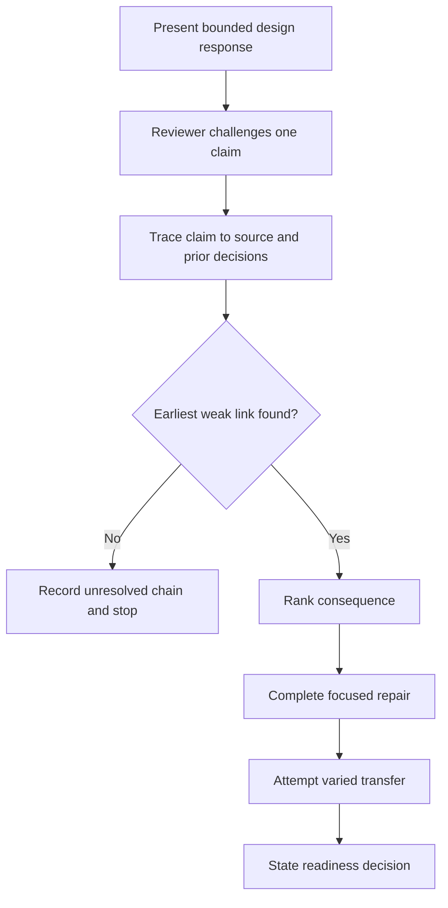
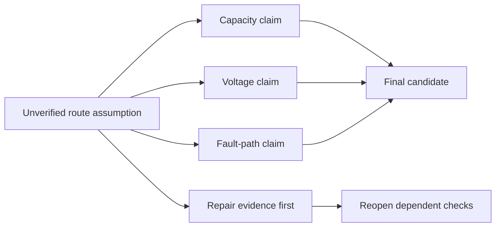

# Day 35 — Week 5 Design-Review Conference and Remediation

> **Scope boundary:** This original conference module reviews written reasoning. It does not provide technical approval, official assessment criteria, field procedures or permission to perform electrical work.

## 1. Outcome and entry check

By the end, the learner can defend one integrated design response, identify its earliest unsupported decision, classify feedback by consequence, complete one targeted remediation cycle and state a bounded readiness decision supported by evidence.

### Entry check

Bring the Day 34 scenario, evidence register, dependency map and error log. Without changing the work, mark each conclusion **supported**, **assumption-dependent**, **unresolved** or **outside authority**. Record **ready for conference**, **requires evidence repair** or **requires supervised support**.

## 2. Why it matters

A design answer can look complete while hiding an unsupported input or a broken dependency. The conference slows the learner down, tests whether reasoning can be explained, and directs remediation to the earliest consequential weakness rather than polishing presentation.

## 3. Core concepts and terminology

- **Design defence:** a concise explanation linking each conclusion to evidence and reasoning.
- **Conference question:** a prompt used to expose assumptions, dependencies or missing evidence.
- **Earliest weak link:** the first unsupported input or transformation on which later work depends.
- **Consequence rank:** priority based on safety, validity and downstream effect rather than ease of correction.
- **Remediation:** focused practice that repairs a diagnosed weakness and tests transfer.
- **Readiness decision:** an evidence-based statement of what the learner can attempt next and what still requires support.

## 4. Rule-finding workflow

Use **D-E-F-E-N-D**:

1. **D — Display** the scenario boundary, evidence register and final bounded conclusion.
2. **E — Explain** each major decision without reading the original response verbatim.
3. **F — Find** the earliest weak link by tracing every challenged claim backward.
4. **E — Evaluate** feedback by safety consequence, validity and dependency reach.
5. **N — Narrow** remediation to one high-value weakness and one transfer task.
6. **D — Decide** readiness using evidence from the repair, not confidence alone.

The diagram shows that remediation begins with diagnosis. A later arithmetic correction is insufficient when the underlying boundary, source or applicability decision remains unsupported.

## 5. Visual model or worked example

A fictional learner presents a candidate circuit design. The reviewer asks what evidence supports one route classification. The learner discovers that several later capacity, voltage and fault claims depend on an unverified route assumption. The remediation therefore replaces the missing evidence and reopens dependent checks rather than correcting only the final sentence.

This is an original learning model, not a standards figure or an official assessment process.

## 6. Practical application

1. Deliver a five-minute design defence using only the evidence register and dependency map.
2. Answer three conference questions: one about boundary, one about source applicability and one about changed-condition consequences.
3. Identify the earliest weak link and rank it **critical**, **major** or **minor**, with reasons.
4. Complete one focused repair and one changed-scenario transfer task.
5. Produce a one-page remediation record: error, cause, consequence, repair, transfer evidence and readiness decision.

Assess six dimensions from 0–2: boundary control, source traceability, terminology, dependency reasoning, remediation quality and conclusion restraint. Any invented technical value, unsafe action or unsupported acceptance claim is a critical error regardless of score.

## 7. Common errors and safety checkpoint

Common errors include defending the final answer instead of examining evidence; selecting the easiest error rather than the earliest consequential one; treating reviewer prompts as proof; correcting one value without reopening dependencies; and using confidence as readiness evidence.

Stop when evidence cannot be verified, authority is unclear, the scenario implies practical work, or fatigue prevents accurate explanation. No switching, isolation, opening, proving, measurement, testing, adjustment, installation, repair, energisation, commissioning, certification or verification is authorised.

## 8. Retrieval and next links

Within 48–72 hours, repeat the transfer task without the remediation record and explain which dependency reopened first. Submit the conference sheet, corrected evidence chain, transfer attempt and bounded readiness decision.

- **Plan:** [Twelve-Week Capstone Learning Plan](../MASTER_PLAN.md)
- **Knowledge note:** [[12-Week Day 35 - Week 5 Design-Review Conference and Remediation]]
- **Previous:** [Day 34 — Integrated Protection, Conductor and Voltage Scenario](day-34-integrated-protection-conductor-and-voltage-scenario.md)
- **Next:** [Day 36 — Functional Switching, Isolation and Emergency Switching Distinctions](day-36-functional-switching-isolation-and-emergency-switching-distinctions.md)

All examples, diagrams and rubrics are original educational constructs. Exact clauses, limits, formulae, device characteristics and acceptance criteria remain `reference_check_required`. This module is not `technically-reviewed`.