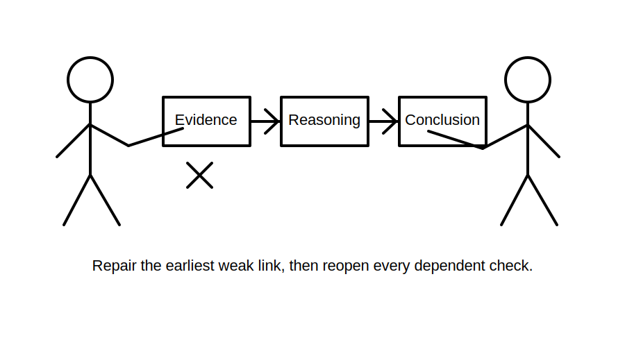
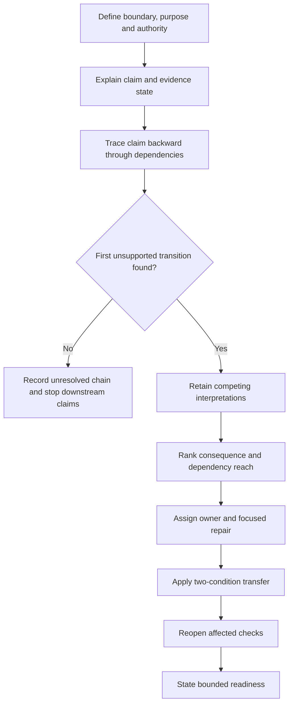
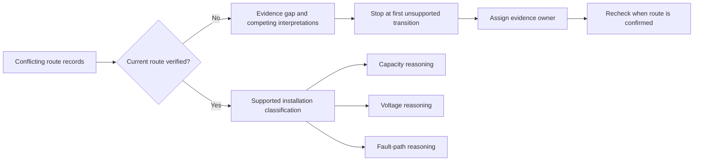

# Day 35 — Week 5 Design-Review Conference and Remediation

> **Scope boundary:** This original conference module reviews written reasoning. It does not provide technical approval, official assessment criteria, field procedures or permission to perform electrical work.

## 1. Outcome and entry check

By the end, the learner can:

1. deliver a five-minute defence of an integrated design response without reading it verbatim;
2. classify each challenged statement as a stated fact, derived fact, supported inference, assumption, contradiction or evidence gap;
3. locate the first unsupported transition in a dependency chain and stop downstream claims at that point;
4. rank feedback by safety consequence, validity and dependency reach rather than ease of correction;
5. complete one focused remediation cycle and reopen every dependent check affected by the repair; and
6. demonstrate transfer under at least two changed material conditions before stating a bounded readiness decision.

### Entry check

Bring the Day 34 scenario, evidence register, dependency map and error log. Before checking any source, label your confidence in each major conclusion as **guessing**, **unsure**, **reasonably confident** or **certain**. Then classify each conclusion as **supported**, **assumption-dependent**, **contradicted**, **unresolved** or **outside authority**.

Record one entry state:

- **conference-ready:** the boundary and main evidence chain can be explained;
- **evidence repair required:** a missing or conflicting source prevents a complete defence; or
- **supervised support required:** the learner cannot yet identify where the reasoning becomes unsupported.

A correct conclusion reached through an unsupported chain is not conference-ready.

## 2. Why it matters

A design answer can appear complete while hiding an unsupported input, an invalid transformation or a contradiction that was silently ignored. A design-review conference tests whether the learner can expose those weaknesses, explain consequences and repair the earliest consequential failure instead of polishing the final presentation.

*The reviewer traces the claim backward until the first unsupported transition is visible; remediation begins there, not at the final sentence.*

## 3. Core concepts and terminology

- **Design defence:** a concise explanation that links each conclusion to evidence, reasoning and stated limits.
- **Conference question:** a prompt used to expose assumptions, dependencies, contradictions or missing evidence. A question is not proof.
- **Stated fact:** information explicitly supplied by the scenario or an identified source.
- **Derived fact:** a result produced from stated facts using a named and applicable method.
- **Supported inference:** a conclusion reasonably drawn from evidence while preserving its limits.
- **Assumption:** an unverified proposition temporarily used to continue reasoning. It must be labelled and cannot support an acceptance claim.
- **Contradiction:** two or more relevant records that cannot all be true in the same scenario state.
- **Evidence gap:** information needed for a decision but not currently available or verified.
- **Dependency chain:** the ordered relationship showing which later claims rely on earlier inputs and decisions.
- **First unsupported transition:** the earliest step where the move from one claim to the next lacks adequate evidence, applicability or reasoning.
- **Competing interpretation:** an alternative explanation that remains plausible while evidence is incomplete or contradictory.
- **Evidence owner:** the authorised person or source responsible for resolving a specific gap or contradiction.
- **Recheck trigger:** a change or new item of evidence that requires affected reasoning to be reopened.
- **Consequence rank:** priority based on safety, validity and downstream effect rather than convenience.
- **Remediation:** focused practice that repairs a diagnosed weakness and tests whether the repair transfers.
- **Bounded readiness decision:** an evidence-based statement of what the learner may attempt next in written or supervised learning and what remains unresolved or outside authority.

## 4. Rule-finding workflow

Use **D-E-F-E-N-D**:

1. **D — Define** the scenario boundary, decision purpose, authority limit and current evidence set.
2. **E — Explain** each major decision in your own words, naming the evidence state and source provenance.
3. **F — Find** the first unsupported transition by tracing every challenged claim backward through the dependency chain.
4. **E — Evaluate** contradictions and competing interpretations, then rank the weakness by safety consequence, validity and dependency reach.
5. **N — Narrow** remediation to one high-value weakness, assign an evidence owner and define the recheck trigger.
6. **D — Demonstrate** transfer under changed conditions, reopen affected checks and state a bounded readiness decision.

The workflow prevents a confident final answer from hiding an unsupported earlier step. If no supported transition can be established, the correct conference response is to preserve the uncertainty and stop.

## 5. Visual model or worked example

A fictional learner presents a candidate circuit design. The drawing identifies one route, a renovation note describes a different route, and the equipment record does not confirm which arrangement is current. The learner had used the drawing to support conductor-capacity, voltage and fault-path conclusions.

The conference separates three competing interpretations:

1. the drawing reflects the current route;
2. the renovation note reflects the current route; or
3. neither record is sufficiently current and the route remains an evidence gap.

The learner cannot select the convenient interpretation. The first unsupported transition occurs when an unverified route identity is converted into an installation classification. All dependent capacity, voltage and fault-path conclusions are reopened. The evidence owner is the authorised source or person able to confirm the current route; the recheck trigger is receipt of that confirmation.

The diagram shows why repairing only the final sentence is inadequate. The upstream evidence must be resolved before dependent technical claims can be reconsidered. This is an original learning model, not a standards figure or official assessment process.

## 6. Practical application

1. Deliver a five-minute design defence using only the evidence register and dependency map.
2. Answer four conference questions: boundary, source applicability, contradiction handling and changed-condition consequences.
3. For every challenged claim, record its evidence state and confidence level.
4. Identify the first unsupported transition and rank it **critical**, **major** or **minor**, explaining the safety, validity and dependency consequences. These are educational priority labels, not official defect or assessment classifications.
5. Complete one focused repair record containing: weakness, root cause, evidence owner, repair action, reopened checks and recheck trigger.
6. Attempt a transfer scenario with at least two material changes, such as a different operating case and a different route record. Rebuild every affected part of the reasoning instead of editing the previous answer mechanically.
7. State one criterion-level result for each dimension:
   - **secure:** independently supported and transferable;
   - **developing:** mostly sound but still needs a bounded prompt or minor evidence repair;
   - **unsupported:** the evidence or reasoning chain is incomplete; or
   - **stop-required:** an authority, safety, contradiction or evidence condition prevents continuation.

Assess boundary control, evidence classification, source traceability, contradiction handling, dependency reasoning, remediation quality, transfer and conclusion restraint separately. Do not combine them into an aggregate pass score. A strong result in one dimension cannot compensate for an invented value, ignored contradiction, unsafe action or unsupported acceptance claim elsewhere.

## 7. Common errors and safety checkpoint

Common errors include:

- defending the final answer instead of examining its evidence chain;
- treating a reviewer prompt, familiar pattern or confident explanation as proof;
- selecting the easiest error rather than the first consequential unsupported transition;
- resolving a contradiction by choosing the convenient record without justification;
- correcting one value without reopening dependent checks;
- repeating the same calculation or calculator entry and calling it an independent check;
- using confidence, fluency or an aggregate score as readiness evidence; and
- claiming technical suitability, compliance or approval beyond the evidence and authority available.

The following are blocking conditions regardless of strengths elsewhere: invented technical values or source details; ignored material contradictions; an unlabelled assumption supporting acceptance; failure to reopen dependent checks after an upstream change; unauthorised practical action; or a conclusion extending beyond the first unsupported transition.

Stop when evidence cannot be verified, authority is unclear, a material contradiction remains unresolved, the scenario implies practical work, or fatigue prevents accurate explanation. No switching, isolation, opening, proving, measurement, testing, adjustment, installation, repair, energisation, commissioning, certification or field verification is authorised.

## 8. Retrieval and next links

Within 48–72 hours, repeat the transfer task without the remediation record. From memory:

1. define the first unsupported transition;
2. name the evidence owner and recheck trigger;
3. explain which dependent checks reopened and why; and
4. state what remains unsupported or outside authority.

Submit the conference sheet, corrected evidence chain, transfer attempt and bounded readiness decision.

- **Plan:** [Twelve-Week Capstone Learning Plan](../MASTER_PLAN.md)
- **Knowledge note:** [[12-Week Day 35 - Week 5 Design-Review Conference and Remediation]]
- **Previous:** [Day 34 — Integrated Protection, Conductor and Voltage Scenario](day-34-integrated-protection-conductor-and-voltage-scenario.md)
- **Next:** [Day 36 — Functional Switching, Isolation and Emergency Switching Distinctions](day-36-functional-switching-isolation-and-emergency-switching-distinctions.md)

All examples, diagrams and criterion states are original educational constructs. Exact clauses, limits, formulae, device characteristics, acceptance criteria and official assessment requirements remain `reference_check_required`. This module is not `technically-reviewed`.