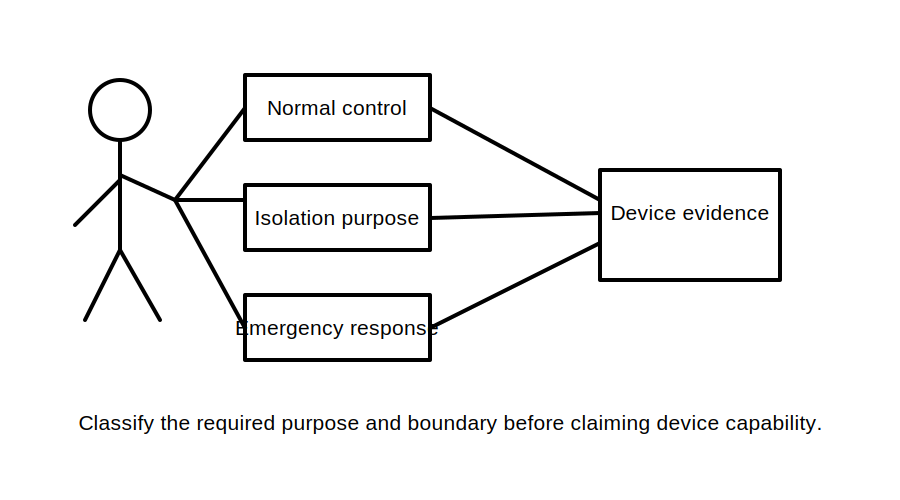
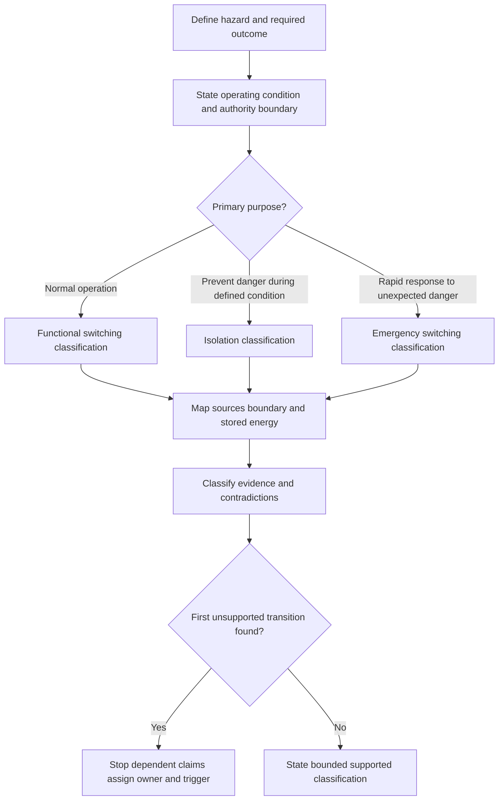
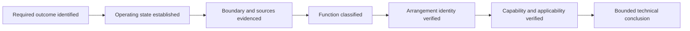

# Day 36 — Functional Switching, Isolation and Emergency Switching Distinctions

> **Scope boundary:** This original module teaches written classification, evidence handling and decision boundaries only. It does not provide a switching procedure, an isolation sequence, device-selection instructions or authority to operate equipment.

## 1. Outcome and entry check

By the end, the learner can:

1. distinguish functional switching, isolation and emergency switching by intended purpose, operating state, affected boundary and required evidence;
2. explain why a stop command, loss of motion or familiar device label does not by itself establish isolation;
3. classify evidence as a stated fact, derived fact, supported inference, assumption, contradiction or evidence gap;
4. identify the first unsupported transition in a switching-function claim and stop all dependent suitability or acceptance claims there;
5. retain competing interpretations when records disagree, assign an evidence owner and define a recheck trigger; and
6. transfer the reasoning to a changed scenario in which at least two material conditions differ.

### Entry check

Without notes, write one sentence each for **control**, **protection** and **isolation**. Then answer:

- What is the difference between equipment having stopped and relevant sources having been separated within a defined boundary?
- Why might one physical device perform more than one function without every claimed function being established?
- Which evidence would you need before accepting a multifunction claim?

Before checking sources, record confidence as **high**, **medium** or **low** beside each answer. A correct low-confidence answer needs consolidation; an incorrect high-confidence answer needs misconception repair. Do not use confidence as proof.

## 2. Why it matters

Switching words can sound interchangeable while describing materially different purposes. Functional switching concerns normal operation. Isolation concerns prevention of danger through source separation within a defined boundary. Emergency switching concerns rapid action in response to an unexpected danger. Confusing these purposes can turn a visible stop into an unsupported safety claim.

The reasoning order is therefore:

1. define the hazard and required outcome;
2. establish the operating state and boundary;
3. identify every relevant source or stored-energy dependency;
4. classify the required function; and
5. verify the arrangement and device evidence before making a suitability claim.

*Instructional caption: classify the required purpose and source boundary first; only then examine whether the arrangement has evidence for that function.*

## 3. Core concepts and terminology

- **Functional switching:** switching intended to start, stop or regulate normal operation.
- **Isolation:** separation intended to prevent danger by disconnecting relevant sources within a defined boundary.
- **Emergency switching:** rapid switching intended to remove or reduce an unexpected danger.
- **Control:** an action or arrangement that directs normal equipment operation; control does not automatically establish isolation.
- **Protection:** a function intended to reduce harmful consequences under defined abnormal conditions; protection and isolation are not interchangeable claims.
- **Purpose statement:** a concise description of what the switching function must achieve and why.
- **Switching boundary:** the equipment, conductors, energy paths and sources included in the claimed function.
- **Operating state:** the defined condition in which the function is required, such as normal production, maintenance preparation or emergency response.
- **Relevant source:** any identified energy source whose continued connection could defeat the required outcome. Exact source treatment remains subject to authorised verification.
- **Stored-energy dependency:** energy that may remain available after a switching action and therefore affects the conclusion boundary.
- **Suitability evidence:** authorised, applicable information supporting that an arrangement can perform the claimed function under the stated conditions.
- **Stated fact:** information directly supplied by an identified source.
- **Derived fact:** a result produced transparently from verified inputs using an authorised method.
- **Supported inference:** a conclusion reasonably drawn from evidence while remaining short of direct verification.
- **Assumption:** an unverified proposition temporarily used for analysis and clearly labelled as such.
- **Contradiction:** two or more relevant evidence items that cannot all describe the same condition accurately.
- **Evidence gap:** required information that is absent, inaccessible, ambiguous or not current enough to support the claim.
- **Competing interpretation:** one of multiple plausible explanations retained while contradictory or incomplete evidence remains unresolved.
- **Evidence owner:** the authorised person or source responsible for resolving an identified gap or contradiction.
- **Recheck trigger:** the specific new information or condition that requires affected reasoning to be reopened.
- **First unsupported transition:** the earliest step in a claim chain that lacks sufficient evidence; no dependent claim may be stronger than this step.
- **Bounded conclusion:** a conclusion that states what is supported, what remains unresolved and what must happen next without implying technical approval.

## 4. Rule-finding workflow

Use **P-U-R-P-O-S-E**:

1. **P — Pinpoint** the hazard, equipment, requested outcome and decision purpose. Separate normal-operation convenience from danger prevention.
2. **U — Understand** the operating state, authority boundary and conditions under which the function is required.
3. **R — Resolve** whether the required purpose is functional switching, isolation, emergency switching or a combination. Do not classify from the device name alone.
4. **P — Plot** the switching boundary, relevant sources and stored-energy dependencies. Retain alternate source interpretations until evidence resolves them.
5. **O — Obtain** current authorised evidence for arrangement identity, source coverage, device capability and applicability. Record provenance rather than copying unsupported labels.
6. **S — Separate** stated facts, derived facts, supported inferences, assumptions, contradictions and evidence gaps. Identify the first unsupported transition, assign an evidence owner and define a recheck trigger.
7. **E — Express** a bounded classification. Reopen every dependent claim when an upstream fact, boundary or source condition changes.

The diagram shows that purpose classification precedes equipment acceptance. Finding an unsupported transition does not make the earlier supported observations disappear; it limits how far the conclusion may extend.

### Claim ladder

Use this ladder to prevent a plausible description from becoming an unsupported acceptance claim:

Each arrow is a claim transition. If source coverage is unresolved at step C, later claims about isolation, emergency effectiveness, device suitability or compliance must remain unresolved even when the equipment label appears familiar.

## 5. Visual model or worked example

### Fictional scenario: packaging line with conflicting records

A written scenario contains the following evidence:

- the operator screen has a control labelled **Line Stop**;
- a nearby red control is labelled **Emergency Stop** on an older drawing;
- a recent maintenance note calls the same control **Emergency Off**;
- a local switch is described on a laminated instruction card as the maintenance isolator;
- a renovation drawing shows a later auxiliary supply feeding part of the control system;
- the equipment schedule does not identify whether the local switch affects that auxiliary supply; and
- no current authorised record establishes the capability or coverage of the three controls.

Classify each item before drawing conclusions:

| Item | Evidence state | What it supports | What remains unresolved |
|---|---|---|---|
| Operator-screen label | Stated fact | A normal control label exists | Actual function and safety capability |
| Older and newer emergency labels | Contradiction | Records claim an emergency purpose | Current identity, action and coverage |
| Laminated maintenance card | Stated fact with applicability question | A local instruction claims isolation | Current authority, source coverage and capability |
| Auxiliary-supply drawing | Stated fact | An additional source may exist | Whether it is current and within each switching boundary |
| Missing capability record | Evidence gap | None beyond identifying missing evidence | Suitability for any claimed safety function |

Retain at least two competing interpretations:

- **Interpretation A:** the local switch covers all energy relevant to maintenance, and the auxiliary drawing is outdated.
- **Interpretation B:** the auxiliary supply remains active outside the local-switch boundary, so the isolation claim is incomplete.

Neither interpretation is accepted merely because it is convenient. Assign resolution of current source configuration to an authorised evidence owner. The recheck trigger is receipt of current, applicable source and arrangement evidence. Until then, the first unsupported transition is source-boundary completeness, so all dependent isolation and suitability claims remain unresolved.

This example is deliberately documentary. It does not instruct the learner to operate, open, prove, inspect or test equipment.

## 6. Practical application

Complete the following written tasks using original scenarios only:

1. Classify six scenarios by required purpose and justify each classification using operating state, hazard, boundary and source evidence.
2. Build an evidence table with columns for claim, evidence item, provenance, evidence state, competing interpretation, first unsupported transition, owner and recheck trigger.
3. Identify two scenarios in which one device is claimed to perform multiple functions. State separately what evidence would be required for each function.
4. For the packaging-line scenario, write one bounded conclusion that preserves the contradiction and does not imply device acceptance.
5. Perform a transfer exercise by changing at least two material conditions—for example, add a second supply and change the maintenance boundary. Rebuild every affected part of P-U-R-P-O-S-E rather than editing only the final sentence.
6. Explain which conclusions did not reopen and why their supporting evidence remained unaffected.

### Criterion-level readiness record

Record each criterion independently; do not calculate an aggregate score.

- **Secure:** the learner classifies purpose from evidence, maps the complete stated boundary, identifies the first unsupported transition, preserves contradictions and transfers reasoning without operational overreach.
- **Developing:** the learner reaches a mostly bounded classification but needs prompts to separate functions, trace a source dependency or reopen downstream claims.
- **Unsupported:** the learner relies on labels, familiarity or an unstated assumption, or cannot identify what evidence is missing.
- **`stop-required`:** the response gives operational switching or isolation instructions, treats stopping as proof of isolation, omits a known possible source, or makes a suitability, compliance or approval claim beyond the evidence.

A stronger result in one criterion cannot offset a blocking condition in another. These are educational planning states, not official grades, competency decisions or legal classifications.

## 7. Common errors and safety checkpoint

Common errors include:

- classifying by colour, label, location or familiar device name;
- treating loss of motion, control power or an indicator change as proof of isolation;
- collapsing functional switching, protection, isolation and emergency switching into one generic idea;
- omitting alternate sources or stored-energy dependencies from the boundary;
- assuming an emergency function removes every hazard;
- resolving contradictory records by choosing the most convenient one;
- accepting one proven function as evidence for another function; and
- updating a conclusion without reopening claims dependent on changed source or boundary evidence.

Stop when the boundary is unclear, a source may be omitted, evidence conflicts, suitability evidence is unavailable, authority is uncertain or the task implies practical action. Record the gap, owner and recheck trigger.

No switching, isolation, opening, proving, measurement, testing, adjustment, installation, repair, energisation, commissioning, certification or field verification is authorised. Exact definitions, requirements, device capabilities, locations, methods and exceptions remain `reference_check_required` and require qualified review against current authorised sources.

## 8. Retrieval and next links

From memory:

1. draw three boxes for functional switching, isolation and emergency switching;
2. under each, write its purpose, operating state and one evidence question;
3. write the seven P-U-R-P-O-S-E steps;
4. explain the first unsupported transition in one sentence; and
5. classify a changed scenario containing both an alternate source and contradictory device records.

Check confidence against evidence. A fluent answer is not secure when it skips source boundaries, contradictions or authority limits.

- **Plan:** [Twelve-Week Capstone Learning Plan](../MASTER_PLAN.md)
- **Knowledge note:** [[12-Week Day 36 - Functional Switching Isolation and Emergency Switching Distinctions]]
- **Previous:** [Day 35 — Week 5 Design-Review Conference and Remediation](day-35-week-5-design-review-conference-and-remediation.md)
- **Next:** [Day 37 — Main Switches, Alternate Supplies and Source Identification](day-37-main-switches-alternate-supplies-and-source-identification.md)

All examples, diagrams and readiness states are original educational constructs. No official standard definition, clause sequence, table, figure, test value, procedure, assessment requirement or compliance conclusion is reproduced. This module remains `review-required`, `reference_check_required` and not `technically-reviewed`.