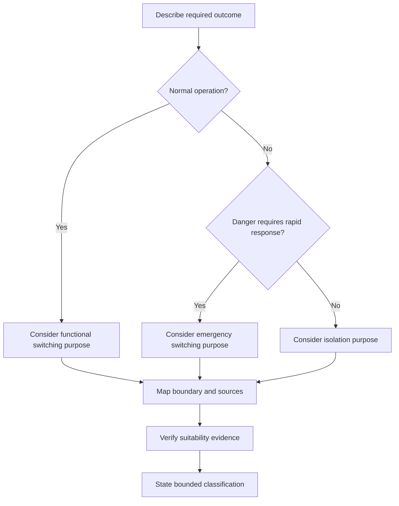
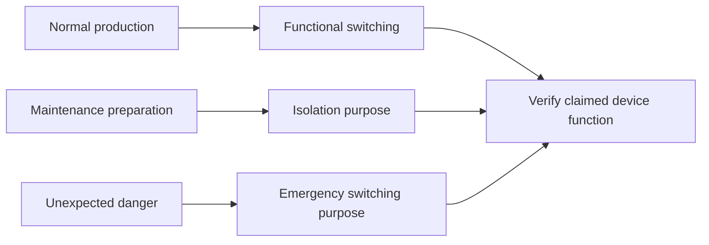

# Day 36 — Functional Switching, Isolation and Emergency Switching Distinctions

> **Scope boundary:** This original module teaches classification and evidence reasoning only. It does not provide a switching procedure, isolation method, device-selection rule or authority to operate equipment.

## 1. Outcome and entry check

By the end, the learner can distinguish functional switching, isolation and emergency switching by purpose, operating condition, boundary and evidence; classify an original scenario without relying on device labels alone; and identify when a conclusion must remain unresolved.

### Entry check

Without notes, define **control**, **protection** and **isolation** in one sentence each. Then explain why one device may perform more than one function but cannot be assumed to do so without evidence. Record **ready**, **needs terminology repair** or **requires supervised support**.

## 2. Why it matters

Confusing switching purposes can produce unsafe assumptions. A device used for normal control is not automatically suitable for isolation, and emergency switching addresses a different need again. The learner must classify the required function before considering equipment or arrangement.

## 3. Core concepts and terminology

- **Functional switching:** switching intended to start, stop or regulate normal operation.
- **Isolation:** separation intended to prevent danger by disconnecting relevant sources within a defined boundary.
- **Emergency switching:** rapid switching intended to remove or reduce an unexpected danger.
- **Purpose statement:** a concise description of what the switching action must achieve.
- **Switching boundary:** the equipment, conductors and energy sources included in the required function.
- **Operating state:** a defined condition such as normal use, maintenance preparation or emergency response.
- **Suitability evidence:** authorised information showing that an arrangement can perform the claimed function.

## 4. Rule-finding workflow

Use **P-U-R-P-O-S-E**:

1. **P — Pinpoint** the hazard, equipment and requested outcome.
2. **U — Understand** the operating state in which action is required.
3. **R — Resolve** whether the purpose is control, isolation, emergency response or a combination.
4. **P — Plot** every source and the boundary that must be affected.
5. **O — Obtain** authorised suitability and arrangement evidence.
6. **S — Separate** verified facts from assumptions and unresolved dependencies.
7. **E — Express** a bounded classification without inventing device capability.

The flowchart classifies purpose before equipment. Actual requirements, device capabilities and exceptions remain subject to authorised-source verification.

## 5. Visual model or worked example

In a fictional machine scenario, one control stops normal motion, a separate arrangement is proposed for maintenance isolation, and an emergency control is intended to respond to an unexpected hazard. The learner maps each claimed function, source boundary and unresolved dependency rather than treating all three controls as interchangeable.

The model is an original conceptual aid. It does not prescribe hardware, placement, operation or testing.

## 6. Practical application

1. Classify six original written scenarios by purpose and justify each classification.
2. Build a table with columns for hazard, operating state, purpose, boundary, sources, evidence and unresolved items.
3. Identify two scenarios where one device is claimed to perform multiple functions and list the evidence needed before accepting that claim.
4. Change one scenario by adding an alternate source and explain which conclusions reopen.
5. Write one bounded conclusion that distinguishes classification from technical acceptance.

Assess six dimensions from 0–2: purpose classification, terminology, boundary mapping, source completeness, evidence discipline and conclusion restraint. Any unsafe operational instruction or unsupported suitability claim is a critical error regardless of score.

## 7. Common errors and safety checkpoint

Common errors include classifying by device name; treating stopping as isolation; omitting stored or alternate energy; assuming emergency switching removes every hazard; and copying a familiar arrangement without checking applicability.

Stop when the boundary is unclear, a source may be omitted, suitability evidence is unavailable, or the task implies practical operation. No switching, isolation, proving, opening, measurement, testing, adjustment, installation, repair, energisation, commissioning, certification or verification is authorised.

## 8. Retrieval and next links

From memory, draw three boxes for functional switching, isolation and emergency switching. Under each, write its purpose, operating state and one evidence question. Then classify one changed scenario containing an additional source.

- **Plan:** [Twelve-Week Capstone Learning Plan](../MASTER_PLAN.md)
- **Knowledge note:** [[12-Week Day 36 - Functional Switching Isolation and Emergency Switching Distinctions]]
- **Previous:** [Day 35 — Week 5 Design-Review Conference and Remediation](day-35-week-5-design-review-conference-and-remediation.md)
- **Next:** [Day 37 — Main Switches, Alternate Supplies and Source Identification](day-37-main-switches-alternate-supplies-and-source-identification.md)

All examples, diagrams and rubrics are original educational constructs. Exact definitions, requirements, device capabilities, locations and exceptions remain `reference_check_required`. This module is not `technically-reviewed`.