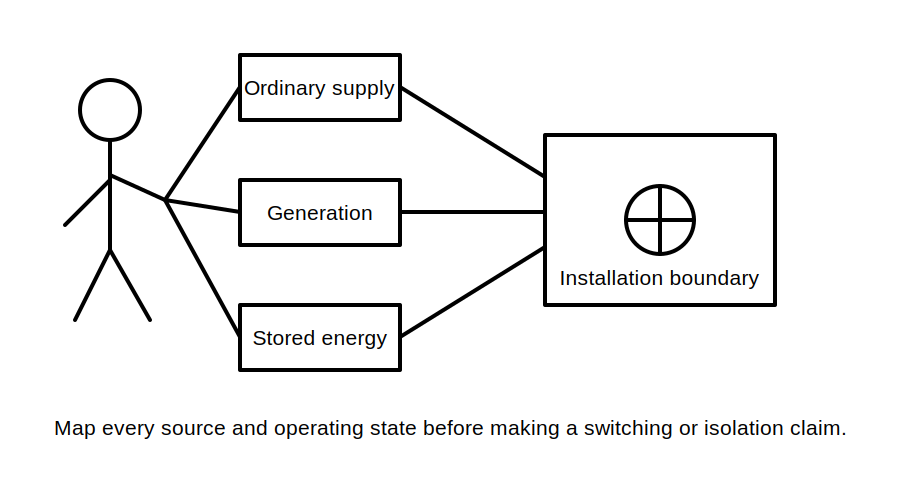
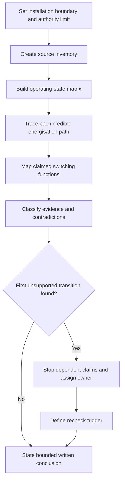
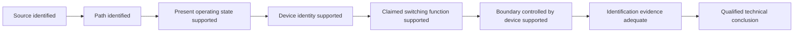
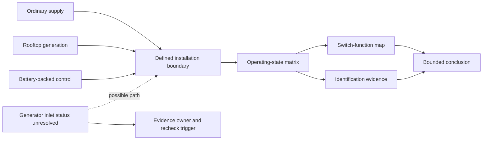

# Day 37 — Main Switches, Alternate Supplies and Source Identification

> **Scope boundary:** This original module develops written source-mapping, evidence classification and identification reasoning. It does not prescribe switch arrangements, labels, operating sequences, isolation procedures or field actions.

## 1. Outcome and entry check

By the end, the learner can:

1. define the installation boundary and identify every credible ordinary, alternate, auxiliary and stored-energy source in an original scenario;
2. distinguish a source, an energisation path, a switching function and identification evidence without treating one as proof of another;
3. build an operating-state matrix showing which sources and paths may be active, unavailable, transferred or uncertain;
4. classify each claim as a stated fact, derived fact, supported inference, assumption, contradiction or evidence gap;
5. locate the first unsupported transition in a source-to-isolation claim and stop dependent conclusions at that point; and
6. transfer the method to a changed scenario in which at least two material conditions differ.

### Entry check

Without checking notes, explain why opening one apparent main switch may not account for every energy source. List four categories of source or stored energy that a scenario could require the learner to investigate. For each answer, record confidence as **high**, **medium** or **low** before checking it. A correct low-confidence answer still needs consolidation; an incorrect high-confidence answer enters the error log.

## 2. Why it matters

Installations may include an ordinary supply, embedded generation, batteries, uninterruptible supplies, auxiliary control supplies, transfer arrangements or backfeed paths. A familiar single-source mental model can therefore hide a credible energisation path. Source identification must begin with the whole installation, its boundaries and its operating states—not with the most visible switch or label.

A **main-switch claim** is narrower than an **isolation claim**. A source may be identified without proving that a device controls it, and a device may be labelled without proving its present function, capability or relationship to every source. Treating those steps as interchangeable can create an unsupported safety conclusion.

*Instructional caption: trace every credible source and operating state to the defined boundary before making any switching or isolation claim.*

## 3. Core concepts and terminology

- **Installation boundary:** the defined extent of the installation or part being analysed. A conclusion cannot be broader than this boundary.
- **Source:** an origin of electrical energy capable of supplying all or part of the defined installation.
- **Ordinary supply:** the source normally expected to supply the installation in the stated operating condition.
- **Alternate supply:** a source capable of energising all or part of the installation in addition to, or instead of, the ordinary source.
- **Auxiliary supply:** a separate source used for control, indication, monitoring or another supporting function. Its presence may matter even when it does not carry the main load.
- **Stored energy:** energy retained in equipment or storage systems after an ordinary supply path changes state.
- **Backfeed:** energisation reaching a point through a path not assumed in a simple source-to-load model.
- **Energisation path:** the connected route through which a source could make a defined point or part electrically live.
- **Main switch:** a switching function associated with controlling a supply to an installation or defined part; exact application requires authorised verification.
- **Switching function:** the purpose a device is claimed to perform. A device identity or label alone does not establish the function.
- **Source inventory:** a complete list of ordinary, alternate, embedded, auxiliary and stored-energy sources within the defined boundary.
- **Operating-state matrix:** a table showing which sources and paths may be active, inactive, transferred, isolated by design, or unresolved in each defined state.
- **Identification evidence:** information communicating source presence, function, boundary or caution. It supports communication but does not by itself prove device capability or isolation.
- **Stated fact:** information explicitly provided by the scenario or a cited current source.
- **Derived fact:** information obtained directly from stated facts by a transparent non-discretionary step.
- **Supported inference:** a conclusion reasonably supported by evidence, with the reasoning stated.
- **Assumption:** a proposition used without sufficient evidence. It must remain visible and cannot support a safety-critical conclusion.
- **Contradiction:** two or more evidence items that cannot all describe the same present condition.
- **Evidence gap:** information required for a conclusion but not presently available.
- **Competing interpretations:** two or more plausible explanations retained while evidence remains unresolved.
- **Evidence owner:** the person, role or authorised source responsible for resolving a named gap or contradiction.
- **Recheck trigger:** a defined event—such as a revised drawing, equipment replacement or newly identified source—that requires affected conclusions to be reopened.
- **First unsupported transition:** the earliest step where the evidence no longer supports movement from one claim to the next. Every dependent conclusion after that point remains unsupported.

## 4. Rule-finding workflow

Use **S-O-U-R-C-E**:

1. **S — Set the boundary and authority limit.** Define exactly what part of the installation is being analysed and what the learner is authorised to conclude.
2. **O — Outline operating states.** Include normal operation, ordinary-source loss, alternate-source operation, transfer, maintenance preparation and any credible abnormal state supplied by the scenario.
3. **U — Uncover every source and path.** Inventory ordinary, alternate, auxiliary and stored-energy sources, then trace each credible energisation path without assuming one visible device controls all of them.
4. **R — Relate functions to evidence.** Map each claimed switching function to a specific source, path and boundary. Classify the supporting evidence and retain competing interpretations where records conflict.
5. **C — Check the claim ladder.** Find the first unsupported transition, assign evidence owners and recheck triggers, and reopen all dependent claims when an upstream fact changes.
6. **E — Express a bounded conclusion.** State what is supported, what remains unresolved, and what current authorised evidence and qualified review are still required. Do not claim isolation.

The diagram shows that source discovery, operating-state analysis and function mapping are separate evidence steps. A gap at any earlier step prevents a broader switching, isolation, suitability or acceptance claim.

### Claim ladder

Each arrow is a transition that requires evidence. For example, identifying rooftop generation does not prove its present operating state; identifying a device does not prove that it controls the source; and adequate identification does not itself prove isolation. The first unsupported arrow fixes the maximum defensible conclusion.

## 5. Visual model or worked example

A fictional workshop has:

- a current single-line drawing showing an ordinary supply and rooftop generation;
- a maintenance note stating that battery-backed control equipment remains available after ordinary-supply loss;
- a switchboard label stating “MAIN SWITCH” without naming the source or boundary;
- an older renovation drawing showing a generator inlet that is absent from the current drawing; and
- a photograph showing an unlabelled control enclosure connected near the transfer equipment.

The learner builds a matrix for normal operation, ordinary-supply loss, alternate-source operation and maintenance preparation. The evidence supports at least three source categories, but the generator-inlet status and the control-enclosure source remain unresolved.

Two competing interpretations must be retained:

- **Interpretation A:** the generator inlet was removed during renovation, so it is no longer an energisation path.
- **Interpretation B:** the inlet remains installed but was omitted from the current drawing.

The first unsupported transition occurs before the learner can claim that the labelled main switch controls every source. The drawing owner must confirm the generator-inlet status; the equipment owner must identify the control enclosure and its source. A revised drawing, equipment schedule or verified removal record becomes the recheck trigger.

This original model is not an installation diagram and does not show a compliant arrangement or operating sequence. The dotted path represents an unresolved interpretation, not a confirmed connection.

## 6. Practical application

Complete the following written exercise using an original scenario pack:

1. Define the installation boundary and list every stated, inferred and unresolved source.
2. Build a four-state matrix for normal operation, ordinary-source loss, alternate-source operation and maintenance preparation.
3. Map each claimed switching function to the exact source, path and boundary it is said to control.
4. Label every material claim as a stated fact, derived fact, supported inference, assumption, contradiction or evidence gap.
5. Identify the first unsupported transition and cross out every dependent conclusion that cannot yet be defended.
6. Record each competing interpretation, its evidence owner and its recheck trigger.
7. State a bounded conclusion that distinguishes source identification, switching-function evidence and isolation evidence.
8. Change at least two material conditions—for example, add an auxiliary supply and replace the drawing with a conflicting revision—then rebuild every affected part of the inventory, matrix and claim ladder. Explain why any unaffected conclusion remains valid.

Assess each criterion separately:

- **Secure:** the learner independently produces a complete bounded map, controls evidence states, stops at the first unsupported transition and transfers the method correctly.
- **Developing:** the learner applies the structure but needs prompts to expose a source, contradiction, dependency or reopened conclusion.
- **Unsupported:** the learner’s conclusion depends on an unstated assumption, unresolved contradiction or missing source/path evidence.
- **`stop-required`:** the learner claims isolation, gives an operating sequence, omits a credible source, treats a label as proof, or continues after a safety-critical unsupported transition.

These are educational planning states, not official assessment grades or competency decisions. A blocking condition cannot be offset by stronger work on another criterion.

## 7. Common errors and safety checkpoint

Common errors include:

- assuming one supply because only one source appears on the latest drawing;
- treating loss of ordinary supply as de-energisation;
- ignoring stored energy, auxiliary control supplies or conditional backfeed paths;
- treating a label, photograph or familiar arrangement as proof of present device function;
- resolving contradictory records by choosing the more convenient version;
- adding a source without reopening switching, identification, protection and documentation conclusions; and
- making a whole-installation conclusion from evidence that covers only one sub-board or operating state.

Stop when any source, state, boundary, path or claimed function is unclear. Do not infer isolation from an open device, absent indicator, label, drawing or operating assumption. No switching, isolation, proving, opening, measurement, testing, adjustment, installation, repair, energisation, commissioning, certification or field verification is authorised.

Exact definitions, switching arrangements, source-treatment requirements, identification wording or placement, device capabilities, exceptions and official assessment requirements remain `reference_check_required` and require current authorised sources and qualified review.

## 8. Retrieval and next links

From memory, draw a source inventory and four-state matrix for a changed fictional scenario. Label each claim by evidence state, circle the first unsupported transition, name the evidence owner and state the recheck trigger. Then explain why adequate identification evidence is not itself proof of isolation.

- **Plan:** [Twelve-Week Capstone Learning Plan](../MASTER_PLAN.md)
- **Knowledge note:** [[12-Week Day 37 - Main Switches Alternate Supplies and Source Identification]]
- **Previous:** [Day 36 — Functional Switching, Isolation and Emergency Switching Distinctions](day-36-functional-switching-isolation-and-emergency-switching-distinctions.md)
- **Next:** [Day 38 — Switchboard Functional Areas and Arrangement Principles](day-38-switchboard-functional-areas-and-arrangement-principles.md)

All examples, diagrams and rubrics are original educational constructs. No standards table, copied figure, systematic clause wording, official operating procedure or near-substitute content is reproduced. This module remains `review-required`, `reference_check_required`, safety-critical and not `technically-reviewed`.