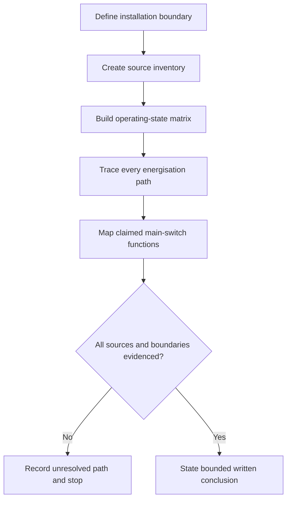
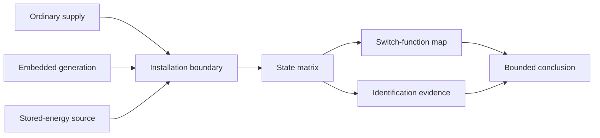

# Day 37 — Main Switches, Alternate Supplies and Source Identification

> **Scope boundary:** This original module develops written source-mapping and identification reasoning. It does not prescribe switch arrangements, labels, operating sequences, isolation procedures or field actions.

## 1. Outcome and entry check

By the end, the learner can map every credible supply and stored-energy path in an original installation scenario; distinguish source, main-switch function and identification evidence; build an operating-state matrix; and state what remains unresolved before any isolation or switching claim could be accepted.

### Entry check

Explain why opening one apparent main switch may not account for every energy source. List four categories of source or stored energy that a scenario could require the learner to investigate. Record **ready**, **needs source-map refresher** or **requires supervised support**.

## 2. Why it matters

Installations may include grid supply, generation, batteries, uninterruptible supplies, control supplies or backfeed paths. A familiar single-source mental model can therefore hide hazards. Source identification must begin with the whole installation and its operating states, not with the most visible switch.

## 3. Core concepts and terminology

- **Main switch:** a switching function associated with controlling a supply to an installation or defined part; exact application requires authorised verification.
- **Alternate supply:** a supply capable of energising all or part of an installation in addition to the ordinary source.
- **Stored energy:** energy retained in equipment or storage systems after an ordinary supply path changes state.
- **Backfeed:** energy reaching a point through a path not assumed in a simple source-to-load model.
- **Source inventory:** a complete list of ordinary, alternate, embedded, auxiliary and stored-energy sources.
- **Operating-state matrix:** a table showing which sources and paths may be active in each defined state.
- **Identification evidence:** information that communicates source presence, function, boundary or required caution.

## 4. Rule-finding workflow

Use **S-O-U-R-C-E**:

1. **S — Survey** the whole installation boundary and every plausible energy source.
2. **O — Outline** operating states, including loss, transfer, maintenance and abnormal conditions.
3. **U — Uncover** alternate, auxiliary, stored-energy and backfeed paths.
4. **R — Relate** each switching function to the source and boundary it is claimed to control.
5. **C — Check** identification, location and suitability evidence against authorised sources.
6. **E — Express** unresolved paths and a bounded conclusion without claiming isolation.

The workflow prevents one visible device from becoming a shortcut for whole-installation reasoning. Exact switch and identification requirements remain subject to qualified verification.

## 5. Visual model or worked example

A fictional workshop has an ordinary supply, rooftop generation and battery-backed control equipment. The learner maps normal operation, ordinary-supply loss and maintenance preparation. Each state changes which paths may remain capable of energisation, so source identification and switching claims are evaluated separately.

This original model is not an installation diagram and does not show a compliant arrangement or operating sequence.

## 6. Practical application

1. Create a source inventory for three original scenarios, including at least one hidden or conditional path.
2. Build a matrix for normal operation, ordinary-source loss, alternate-source operation and maintenance preparation.
3. Map each claimed main-switch function to the exact source and installation boundary it affects.
4. Audit the scenario's identification evidence and list what must be verified rather than inventing wording or placement.
5. Add one new source and explain which switching, identification, protection and documentation conclusions reopen.

Assess six dimensions from 0–2: boundary completeness, source inventory, state reasoning, function mapping, evidence discipline and conclusion restraint. Omitting a credible source, giving an operating procedure or claiming isolation without complete evidence is a critical error regardless of score.

## 7. Common errors and safety checkpoint

Common errors include assuming one supply; treating loss of grid supply as de-energisation; ignoring stored energy or control supplies; equating a switch label with verified capability; and failing to reconsider identification after a source is added.

Stop when any source, state, boundary or claimed function is unclear. Do not infer isolation from an open device or absent indicator. No switching, isolation, proving, opening, measurement, testing, adjustment, installation, repair, energisation, commissioning, certification or verification is authorised.

## 8. Retrieval and next links

From memory, draw a source inventory and four-state matrix for a changed fictional scenario. Circle every path that could remain energised after the ordinary source is unavailable, then state the evidence still needed.

- **Plan:** [Twelve-Week Capstone Learning Plan](../MASTER_PLAN.md)
- **Knowledge note:** [[12-Week Day 37 - Main Switches Alternate Supplies and Source Identification]]
- **Previous:** [Day 36 — Functional Switching, Isolation and Emergency Switching Distinctions](day-36-functional-switching-isolation-and-emergency-switching-distinctions.md)
- **Next:** [Day 38 — Switchboard Functional Areas and Arrangement Principles](day-38-switchboard-functional-areas-and-arrangement-principles.md)

All examples, diagrams and rubrics are original educational constructs. Exact definitions, switching arrangements, identification requirements, locations, device capabilities and exceptions remain `reference_check_required`. This module is not `technically-reviewed`.
