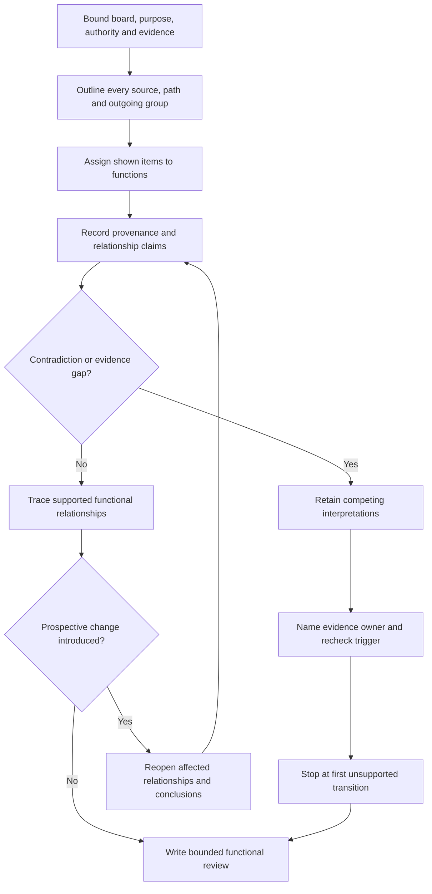
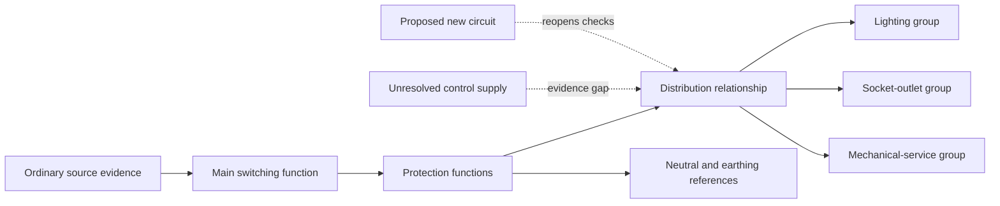

# Day 38 — Switchboard Functional Areas and Arrangement Principles

> **Scope boundary:** This module teaches paper-based functional mapping, evidence control and arrangement reasoning. It is not a construction guide, compliant layout, clearance specification, inspection procedure or authority to open, operate or work on a switchboard.

## 1. Outcome and entry check

By the end, the learner can:

1. define the board, section and documentary evidence boundary before interpreting an arrangement;
2. identify incoming-supply, switching, protection, distribution, neutral/earthing, control/auxiliary and outgoing-circuit functions in an original scenario;
3. distinguish a **shown relationship** from an inferred physical connection, compliant separation or verified capacity;
4. classify each important statement as a stated fact, derived fact, supported inference, assumption, contradiction or evidence gap;
5. identify the first unsupported transition in an arrangement claim and stop dependent conclusions at that point; and
6. revise the functional map after at least two material scenario changes, reopening every affected conclusion.

### Entry check

Without notes, draw a source-to-load chain containing source identification, main switching, protection, distribution and outgoing circuits. Add neutral/earthing and auxiliary/control functions without implying a field wiring arrangement.

For each element, record:

- what you know;
- the evidence that supports it;
- your confidence before checking; and
- the first point at which you would require supervised support or an authorised source.

Use **secure**, **developing**, **unsupported** or `stop-required`. These are learning-planning states, not official grades or competency decisions.

## 2. Why it matters

A switchboard is not merely a collection of devices. It is an interacting system of supply paths, switching functions, protective functions, distribution relationships, neutral and earthing references, control dependencies and outgoing circuits. A learner who recognises individual devices but cannot explain those relationships may:

- assume visual proximity proves electrical connection;
- overlook an auxiliary or alternate supply;
- treat spare physical space as verified electrical or thermal capacity;
- confuse functional grouping with compliant physical segregation;
- fail to reopen downstream conclusions after a proposed change; or
- convert incomplete documentary evidence into an unsafe field claim.

Good Capstone reasoning therefore begins with a bounded functional model, not a declaration that an arrangement is compliant.

*Instructional caption: Map each function and evidence source before making any statement about physical arrangement, capacity, access or compliance.*

## 3. Core concepts and terminology

### Switchboard and functional-map terms

- **Switchboard:** an assembly associated with receiving, controlling, protecting or distributing electrical supply. Exact definitions and requirements remain `reference_check_required`.
- **Board boundary:** the board, section or represented system included in the current analysis.
- **Functional area:** a conceptual grouping by purpose rather than an assertion about compliant physical construction.
- **Incoming-supply function:** the represented point or path by which a relevant source supplies the board or section.
- **Switching function:** the purpose attributed to a device or arrangement for controlling a supply or circuit. Purpose does not prove isolation capability.
- **Protection function:** the role attributed to a device or arrangement in responding to specified abnormal conditions. Device identity alone does not prove suitability.
- **Distribution function:** the represented division of supply among downstream sections or circuits.
- **Neutral function:** the represented neutral connection or distribution relationship. This module does not authorise inspection or alteration.
- **Earthing function:** the represented protective-earthing or related connection role. A drawing reference does not prove continuity or compliance.
- **Control or auxiliary function:** a supply, control circuit or dependency that supports operation but may not follow the main power path.
- **Outgoing-circuit group:** one or more represented downstream circuits grouped for analysis.
- **Arrangement:** the relationship and placement logic among components. Exact construction, spacing, enclosure and access requirements require authorised verification.
- **Segregation:** separation intended to control interaction between circuits, functions or hazards. Required forms, distances and methods are source-dependent.
- **Prospective change:** a proposed alteration that may reopen source, protection, heat, space, access, identification, segregation and documentation questions.
- **Change propagation:** the requirement to reconsider every conclusion that depends on a changed condition.
- **Evidence boundary:** the limit beyond which the available drawing, schedule, photograph or description cannot support a reliable conclusion.
- **First unsupported transition:** the earliest step in a claim chain that lacks adequate evidence. Every dependent claim beyond it must remain unsupported.

### Evidence-control terms

- **Stated fact:** information explicitly supplied by the scenario or an identified source.
- **Derived fact:** a result obtained transparently from stated facts using a justified method.
- **Supported inference:** a conclusion that follows from relevant evidence but remains distinct from direct observation.
- **Assumption:** an unverified proposition introduced to continue reasoning. It must be labelled and cannot support approval.
- **Contradiction:** two or more evidence items that cannot all be accepted without reconciliation.
- **Evidence gap:** information required for a conclusion but not currently available.
- **Provenance:** where an evidence item came from, including document identity, revision or observation context.
- **Competing interpretations:** alternative explanations retained while evidence remains unresolved.
- **Evidence owner:** the authorised person, role or source responsible for resolving a gap.
- **Recheck trigger:** a defined event that requires an earlier conclusion to be reviewed, such as a revised drawing, identified auxiliary source or changed equipment schedule.

## 4. Rule-finding workflow

Use **B-O-A-R-D-S**:

1. **B — Bound** the board, represented section, decision purpose, authority limit and available evidence.
2. **O — Outline** every known source, incoming path, auxiliary/control supply, stored-energy dependency and outgoing group.
3. **A — Assign** each shown item to a functional purpose, recording provenance and refusing to guess hidden connections.
4. **R — Relate** switching, protection, distribution, neutral, earthing, control and outgoing functions as supported claim chains.
5. **D — Detect** contradictions, evidence gaps, competing interpretations, prospective-change consequences and the first unsupported transition.
6. **S — State** bounded observations, evidence owners, recheck triggers, stop conditions and conclusions that must remain open.

The diagram controls the reasoning sequence. It does not depict compliant construction, wiring, segregation, access or operating procedure.

### Claim ladder

Build conclusions one rung at a time:

```mermaid
flowchart LR
    A[Evidence item identified] --> B[Item or label identity supported]
    B --> C[Functional purpose supported]
    C --> D[Relationship to adjacent functions supported]
    D --> E[Board or section boundary supported]
    E --> F[Prospective-change consequence supported]
    F --> G[Arrangement observation bounded]
    G --> H[Qualified technical conclusion]
```

A missing or contradictory rung is the first unsupported transition. Later rungs cannot be rescued by confidence, visual neatness, a plausible label or correct terminology. A qualified technical conclusion requires current authorised sources and competent review outside this automated module.

## 5. Visual model or worked example

### Fictional community-room board

Available evidence includes:

- a labelled single-line schematic marked Revision C;
- a component schedule marked Revision B;
- a photograph with no date or board identifier;
- a maintenance note describing a later timer-controlled lighting addition;
- a proposed new final subcircuit; and
- no current document identifying the small control supply shown near the distribution section.

The schematic represents:

1. an ordinary incoming source;
2. a main switching function;
3. upstream and downstream protective functions;
4. a distribution relationship;
5. neutral and earthing references;
6. lighting, socket-outlet and mechanical-service outgoing groups; and
7. an auxiliary/control path whose origin is unclear.

The dashed links mark unresolved or prospective relationships. They are not wiring instructions.

### Competing interpretations

The maintenance note says the timer supply was added after Revision C, while the undated photograph appears to show a small device beside the distribution group.

Retain both interpretations:

- **Interpretation A:** the auxiliary/control path is supplied from the represented board section.
- **Interpretation B:** it is supplied from another source or section not represented in the current schematic.

Neither interpretation can support an isolation, source-control, segregation, capacity or compliance conclusion until the evidence owner supplies current authoritative information. The first unsupported transition is the origin and relationship of the control supply. Every dependent conclusion remains open.

### Prospective-change propagation

The proposed circuit does not merely raise a “spare way” question. It reopens, at minimum:

- source and section boundary;
- protective-device and conductor evidence;
- distribution relationship;
- thermal and capacity evidence;
- physical space and enclosure evidence;
- access and identification evidence;
- segregation or interaction evidence;
- neutral and earthing relationship evidence; and
- drawing, schedule and labelling currency.

The learner must identify which existing conclusions are affected and which remain unchanged, with reasons for both.

## 6. Practical application

Complete the following using original paper scenarios only.

### Task A — Functional map

Annotate two fictional schematics with:

- board and evidence boundaries;
- every represented source and auxiliary path;
- switching, protection, distribution, neutral/earthing, control and outgoing functions;
- evidence provenance;
- contradictions and evidence gaps; and
- the first unsupported transition.

### Task B — Evidence-controlled relationship table

Create a table with these columns:

| Claim | Evidence and provenance | Evidence state | Competing interpretation | First unsupported transition | Evidence owner | Recheck trigger | Bounded conclusion |
|---|---|---|---|---|---|---|---|

Do not convert an assumption into a fact merely to complete the table.

### Task C — Change propagation

Introduce a fictional new circuit and change at least two material conditions, such as:

- adding an alternate source reference;
- changing the documented board section;
- introducing an auxiliary control supply;
- replacing a current schedule with an older revision;
- adding a conflicting equipment label; or
- changing the proposed circuit purpose.

Rebuild every affected part of the functional map. Explicitly justify:

- conclusions that reopen;
- conclusions that remain unchanged; and
- claims that become `stop-required`.

### Task D — Arrangement review

Write a bounded review containing:

1. supported functional observations;
2. contradictions and competing interpretations;
3. unresolved evidence and named owners;
4. prospective-change consequences;
5. prohibited claims; and
6. the exact recheck trigger for each open conclusion.

### Criterion-level readiness

Assess each criterion independently:

- **Secure:** the learner consistently controls the boundary, evidence states, relationships, contradictions, change propagation and conclusion limits.
- **Developing:** the reasoning is generally sound but needs prompting or misses a non-blocking dependency.
- **Unsupported:** a required claim lacks evidence, provenance or a justified relationship.
- **`stop-required`:** continuing would depend on unknown source paths, hidden connections, unverified isolation, unauthorised access or another safety-critical unknown.

Do not calculate an aggregate score.

### Blocking conditions

Any of the following blocks a secure outcome regardless of strengths elsewhere:

- treating proximity, neatness or a photograph as proof of connection;
- inventing a source path, device function, capacity, segregation method or spare capacity;
- ignoring a contradiction or auxiliary supply;
- carrying a conclusion beyond the first unsupported transition;
- failing to reopen dependent conclusions after a material change;
- claiming compliant construction, access, isolation, segregation or capacity from incomplete evidence; or
- proposing unauthorised opening, operation, measurement, testing or field verification.

## 7. Common errors and safety checkpoint

Common errors include:

- naming equipment without explaining its functional relationship;
- treating a label as proof of current identity or capability;
- assuming visual proximity proves connection;
- confusing functional grouping with physical compliance;
- treating spare physical space as verified electrical, thermal or fault-duty capacity;
- overlooking neutral, earthing, control or auxiliary relationships;
- selecting the most convenient of two conflicting records;
- failing to identify evidence provenance;
- repeating an earlier conclusion after a material change without reopening it; and
- using educational readiness states as official assessment or technical approval.

### Safety checkpoint

Stop when any source path, internal connection, device purpose, board boundary, control dependency, evidence provenance or current-document status is unclear.

This module authorises no:

- cover or barrier removal;
- device operation or isolation;
- access to live or potentially live parts;
- measurement, proving, testing or fault finding;
- alteration, installation or repair;
- energisation, commissioning or certification; or
- declaration of compliance, safety or suitability.

Practical switchboard work requires authorised procedures, competent supervision, verified conditions and current applicable sources.

## 8. Retrieval and next links

Without notes:

1. draw the B-O-A-R-D-S workflow;
2. define functional area, evidence boundary, contradiction, evidence owner, recheck trigger and first unsupported transition;
3. apply the workflow to a changed fictional board containing an alternate source and one undocumented outgoing circuit;
4. classify six claims by evidence state;
5. state three blocking conditions; and
6. explain which conclusions reopen after two material scenario changes.

- **Plan:** [Twelve-Week Capstone Learning Plan](../MASTER_PLAN.md)
- **Knowledge note:** [[12-Week Day 38 - Switchboard Functional Areas and Arrangement Principles]]
- **Previous:** [Day 37 — Main Switches, Alternate Supplies and Source Identification](day-37-main-switches-alternate-supplies-and-source-identification.md)
- **Next:** [Day 39 — Accessibility, Labelling and Original Defect-Recognition Scenarios](day-39-accessibility-labelling-and-original-defect-recognition-scenarios.md)

All diagrams, scenarios and wording are original. Exact definitions, construction, spacing, enclosure, segregation, access, identification, equipment, capacity and official assessment requirements remain `reference_check_required`. This module is not `technically-reviewed`.
