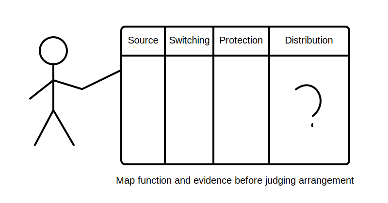
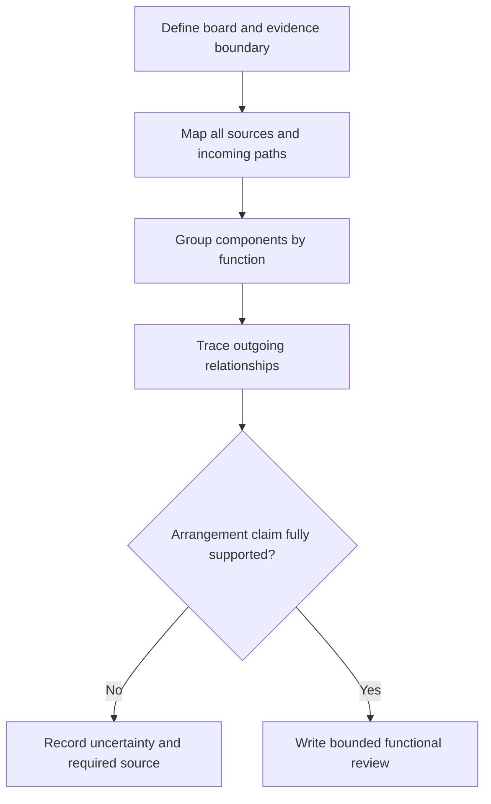
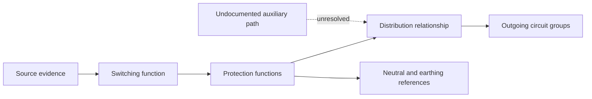

# Day 38 — Switchboard Functional Areas and Arrangement Principles

> **Scope boundary:** This module teaches paper-based functional mapping and evidence questions. It is not a construction guide, compliant layout, clearance specification or authority to open or work on a switchboard.

## 1. Outcome and entry check

By the end, the learner can identify six functional areas in an original switchboard scenario, map source-to-outgoing-circuit relationships, distinguish functional separation from physical compliance, and produce a bounded arrangement review with unresolved evidence clearly marked.

### Entry check

From memory, sketch the information flow from source identification to main switching, protection, distribution and outgoing circuits. Mark any boundary you cannot explain. Record **ready**, **refresh source mapping** or **requires supervised support**.

## 2. Why it matters

A switchboard is not merely a collection of devices. Its arrangement must support identifiable functions, safe access, maintainable boundaries and reliable interpretation. Learners who recognise devices but not relationships can miss cross-connections, ambiguous source paths or evidence gaps.

## 3. Core concepts and terminology

- **Functional area:** a conceptual grouping defined by purpose, such as incoming supply, switching, protection, distribution, neutral/earthing functions or outgoing circuits.
- **Arrangement:** the relationship and placement logic among components; exact physical requirements require authorised verification.
- **Distribution point:** a point from which electrical supply is divided among downstream circuits or sections.
- **Segregation:** separation intended to control interaction between circuits, functions or hazards; required forms and distances are source-dependent.
- **Prospective change:** an alteration or added circuit that may reopen space, heat, identification, protection and access questions.
- **Evidence boundary:** the limit beyond which a drawing, photograph or description cannot support a reliable conclusion.

## 4. Rule-finding workflow

Use **B-O-A-R-D-S**:

1. **B — Bound** the board, supplied section and evidence available.
2. **O — Outline** every source, incoming path and outgoing circuit group.
3. **A — Assign** each shown component to a functional purpose without guessing hidden connections.
4. **R — Relate** switching, protection, distribution, neutral and earthing functions.
5. **D — Detect** interaction, access, identification and change consequences requiring verification.
6. **S — State** supported observations, unresolved questions and stop conditions.

The diagram shows the reasoning order. It does not depict a compliant switchboard construction.

## 5. Visual model or worked example

A fictional community-room board is represented only by a labelled schematic and component schedule. The learner identifies incoming-source information, switching functions, protective devices, distribution relationships, neutral/earthing references and three outgoing groups. One undocumented control supply is deliberately left unresolved.

The dashed path represents missing evidence, not a wiring instruction.

## 6. Practical application

1. Annotate two original switchboard schematics with the six functional areas.
2. Create a relationship table with columns for shown evidence, inferred function, required verification and affected downstream circuits.
3. Add a fictional new circuit and identify every arrangement question that reopens.
4. Compare two candidate descriptions and reject any claim that depends on unseen internal connections.
5. Score 0–2 across boundary control, source mapping, function assignment, relationship tracing, change propagation and conclusion restraint.

Claiming compliant construction, access, segregation or capacity from incomplete evidence is a critical error regardless of score.

## 7. Common errors and safety checkpoint

Common errors include naming equipment without explaining function; assuming visual proximity proves connection; treating spare space as verified capacity; ignoring auxiliary supplies; and converting a conceptual diagram into a field instruction.

Stop when source paths, internal connections, component purpose or evidence provenance are unclear. Do not open covers, remove barriers, operate devices, inspect live parts or infer de-energisation. Practical switchboard work requires authorised procedures, competent supervision and verified conditions.

## 8. Retrieval and next links

Without notes, draw the B-O-A-R-D-S sequence and apply it to a changed fictional board containing an alternate source and one undocumented outgoing circuit. State three claims you must not make.

- **Plan:** [Twelve-Week Capstone Learning Plan](../MASTER_PLAN.md)
- **Knowledge note:** [[12-Week Day 38 - Switchboard Functional Areas and Arrangement Principles]]
- **Previous:** [Day 37 — Main Switches, Alternate Supplies and Source Identification](day-37-main-switches-alternate-supplies-and-source-identification.md)
- **Next:** [Day 39 — Accessibility, Labelling and Original Defect-Recognition Scenarios](day-39-accessibility-labelling-and-original-defect-recognition-scenarios.md)

All diagrams and scenarios are original. Exact construction, spacing, segregation, enclosure, access, identification and equipment requirements remain `reference_check_required`. This module is not `technically-reviewed`.
