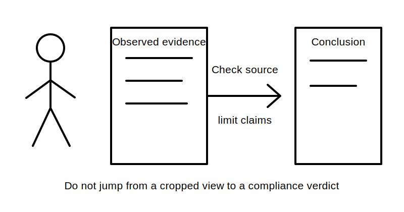
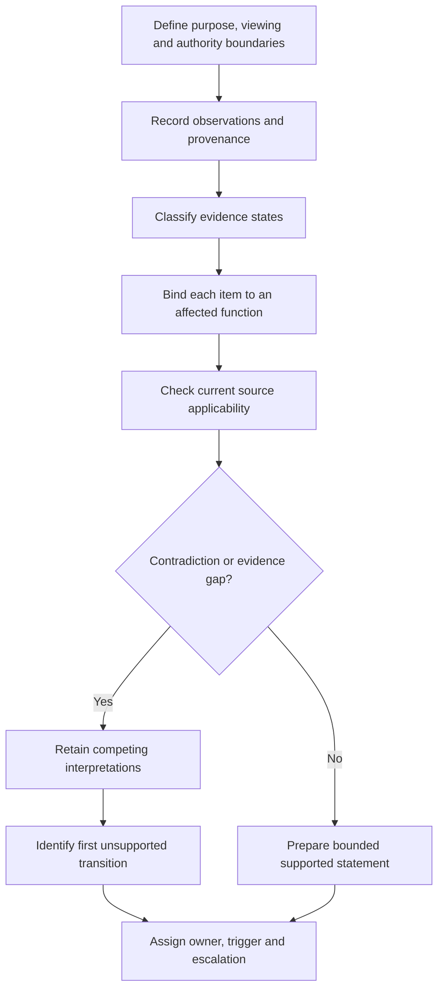
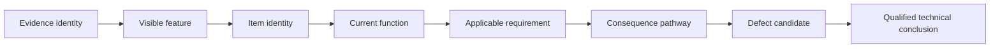

# Day 39 — Accessibility, Labelling and Original Defect-Recognition Scenarios

> **Scope boundary:** This module develops paper-based observation, evidence classification, consequence reasoning and escalation using original fictional records. It does not declare a real installation defective, authorise field inspection, or provide a compliance decision.

## 1. Outcome and entry check

By the end, the learner can:

1. define the viewing, evidence, authority and decision boundaries for an accessibility or identification review;
2. distinguish direct observation, derived fact, supported inference, assumption, contradiction and evidence gap;
3. connect each observation to a switching, isolation, protection, distribution, source-identification or emergency-response function;
4. identify the first unsupported transition in a defect-claim chain and stop dependent conclusions there;
5. write a bounded defect-candidate record with provenance, competing interpretations, an evidence owner and a recheck trigger; and
6. re-evaluate the record after at least two material scenario changes, explaining which conclusions reopen and which remain supported.

### Entry check

Before checking sources, classify each statement and rate your confidence as **guessing**, **unsure**, **reasonably confident** or **certain**:

- “The circuit schedule shows `P1`.”
- “The handwritten `P1` label refers to the same circuit as the schedule.”
- “The device is inaccessible.”
- “The board is non-compliant.”

For each statement, identify the evidence required to move one rung further. A correct guess is not secure evidence of understanding; a high-confidence unsupported claim is a priority misconception.

## 2. Why it matters

Defect recognition becomes unreliable when a learner treats a cropped photograph, old schedule or ambiguous label as a complete representation of an installation. The visible feature may be real, but its meaning, current applicability and consequence can remain uncertain.

A disciplined reviewer records what is available, identifies the affected function, preserves contradictions and asks for the smallest evidence needed to resolve the next decision. This prevents visual untidiness from being confused with a verified technical defect and prevents genuine safety concerns from being dismissed because the evidence is incomplete.

*Instructional caption: Record the visible feature first; classify its function and consequence only after checking provenance, completeness and applicability.*

## 3. Core concepts and terminology

- **Accessibility:** whether the intended authorised person can reach, identify or operate equipment for a defined purpose under defined conditions. Exact requirements depend on current authorised sources.
- **Identification:** information intended to connect equipment, circuits, sources or functions to an understandable reference. A label’s presence does not prove that it is correct, current or connected as stated.
- **Viewing boundary:** the part of a scene, drawing or record actually available for review.
- **Evidence boundary:** the point beyond which the available records cannot support a reliable claim.
- **Authority boundary:** the limit of what the learner or reviewer is permitted to inspect, decide or recommend.
- **Observation:** a feature directly available in the supplied evidence, stated without adding meaning that is not shown.
- **Derived fact:** a result obtained transparently from stated evidence without adding an unsupported premise.
- **Supported inference:** a reasoned interpretation supported by applicable evidence but still distinguishable from direct observation.
- **Assumption:** an unverified premise used temporarily and labelled explicitly.
- **Contradiction:** two or more records or observations that cannot all describe the same condition in the same way.
- **Evidence gap:** information required for the decision but not presently available.
- **Defect candidate:** a condition requiring verification and consequence assessment; it is not an automated declaration of non-compliance.
- **Consequence pathway:** the credible link between a condition and an affected safety, isolation, protection, identification or operating function.
- **Provenance:** where evidence came from, when it was created, who controlled it and whether it applies to the represented condition.
- **Competing interpretations:** two or more plausible explanations retained until stronger evidence resolves them.
- **Evidence owner:** the authorised person or role responsible for obtaining or confirming missing evidence.
- **Recheck trigger:** the event that requires the record to be revisited, such as receiving a current schedule or confirming a source path.
- **First unsupported transition:** the earliest step in a claim chain that lacks sufficient evidence. All dependent claims stop at this point.
- **Change propagation:** reopening every conclusion that depends on a changed condition.

## 4. Rule-finding workflow

Use **L-A-B-E-L-S**:

1. **L — Limit the review.** State the decision purpose, viewing boundary, evidence boundary and authority boundary.
2. **A — Annotate evidence.** Record direct observations and classify each item’s evidence state and provenance.
3. **B — Bind to function.** Connect each observation to the potentially affected source, switching, isolation, protection, distribution, identification or emergency-response function.
4. **E — Examine authority and applicability.** Identify the current authorised reference needed, preserve contradictions and retain competing interpretations.
5. **L — Locate the first unsupported transition.** Stop dependent technical, legal, suitability and acceptance claims at that rung.
6. **S — State the bounded record.** Record the candidate condition, credible consequence pathway, missing evidence, owner, recheck trigger, escalation route and prohibited actions.

The workflow prevents a visible feature from being converted directly into a compliance conclusion. Missing evidence does not erase a concern; it changes the wording, escalation and permitted conclusion.

A useful claim ladder is:

Each arrow is a transition that requires support. The first unsupported transition sets the limit of the record. A qualified technical conclusion remains outside the learner’s authority unless current authorised evidence and qualified review support it.

## 5. Visual model or worked example

### Fictional community-centre board record

The supplied pack contains:

- a cropped photograph dated only by file metadata;
- two outgoing devices with similar handwritten abbreviations;
- a printed circuit schedule marked “revision B”;
- a maintenance note stating that one circuit was repurposed after revision B;
- a source notice visible at the edge of the photograph but not readable;
- stored cartons shown near the closed enclosure door; and
- no verified dimensions, current operating state or confirmation that the cartons remain present.

An evidence-controlled record separates the claims:

| Record item | Evidence state | Bounded interpretation |
|---|---|---|
| Two similar handwritten abbreviations are visible | stated fact | identification ambiguity is a defect candidate |
| Revision B maps one abbreviation to a particular circuit | stated fact | the mapping applies to revision B only |
| The current device still supplies that circuit | assumption | stop the circuit-identity claim here |
| Cartons appear near the door in the photograph | stated fact | possible access concern within the photograph’s boundary |
| Required access is currently obstructed | unsupported inference | current site condition and applicable requirement are missing |
| The unreadable edge notice identifies an alternate source | competing interpretation | obtain the complete current notice and source record |

The **first unsupported transition** for the circuit claim occurs between the historical schedule mapping and the current connected function. The **first unsupported transition** for the access claim occurs between photographic proximity and verified current obstruction against an applicable requirement.

The bounded record might state:

> The supplied photograph shows similar device abbreviations and materials positioned near the enclosure. Current circuit identity, notice content, access conditions and applicable dimensions are not established. Treat identification and access as defect candidates requiring current records and authorised verification. Do not infer compliance status or alter the real installation from this evidence pack.

## 6. Practical application

Complete four original scenario cards:

1. ambiguous circuit identification;
2. an apparently obstructed approach shown in an old photograph;
3. inconsistent source notices across a drawing and maintenance record; and
4. a changed circuit schedule with no verified as-installed update.

For each scenario, produce an evidence-control table containing:

- decision, viewing, evidence and authority boundaries;
- direct observations and provenance;
- evidence-state labels;
- affected function and credible consequence pathway;
- contradictions and competing interpretations;
- first unsupported transition;
- bounded defect-candidate statement;
- evidence owner, recheck trigger and escalation question; and
- prohibited practical or compliance claims.

### Transfer task

Change at least two material conditions, such as:

- replacing the old photograph with a current complete image;
- confirming that the cartons were removed;
- receiving a current signed circuit schedule;
- learning that the board has an auxiliary supply not shown on the earlier drawing; or
- discovering that the handwritten label was copied from a decommissioned circuit.

Rebuild the affected claim ladders. Explain why each conclusion reopens or remains supported; do not simply announce a new answer.

### Criterion-level review

Assess each criterion independently:

- **secure:** the learner produces supported, bounded reasoning and transfers it under changed conditions;
- **developing:** the reasoning is mostly controlled but requires a prompt or contains a repairable omission;
- **unsupported:** the learner cannot support the transition or preserve the relevant uncertainty; and
- **`stop-required`:** the learner crosses an authority or safety boundary, invents evidence or makes a prohibited compliance claim.

Apply these states separately to boundary control, observation discipline, terminology, functional linkage, provenance, contradiction handling, consequence reasoning, first-unsupported-transition control, escalation design and transfer. They are educational planning states, not official assessment grades or competency decisions.

### Blocking conditions

A secure outcome is blocked by:

- inventing dimensions, label content, source paths, operating states or current site conditions;
- treating a label, photograph or drawing as proof of the connected function without corroboration;
- hiding contradictions or choosing the most convenient record without justification;
- carrying a conclusion beyond the first unsupported transition;
- using neatness, age or appearance alone as a compliance test;
- failing to reopen dependent conclusions after material change; or
- proposing unauthorised approach, opening, switching, obstruction removal, measurement, testing, alteration or energisation.

## 7. Common errors and safety checkpoint

Common errors include:

- treating “visible” as “verified current condition”;
- treating identification presence as identification accuracy;
- confusing a defect candidate with a confirmed defect;
- ranking visual untidiness above a credible isolation or source-identification consequence;
- collapsing contradictory records into one unsupported narrative;
- using vague language such as “unsafe” without an evidence chain;
- assuming incomplete evidence means no action is needed; and
- treating a paper exercise as authority to inspect or alter a real board.

**Safety checkpoint:** Stop when source identity, energisation state, access conditions, viewing boundary, evidence provenance or practical authority is unknown. Do not approach, open, operate, isolate, move nearby materials, prove, measure, test, adjust or alter a real switchboard. Escalate real concerns through authorised workplace, supervision and qualified technical-review processes.

## 8. Retrieval and next links

Without looking:

1. write the L-A-B-E-L-S workflow;
2. define a defect candidate and the first unsupported transition;
3. explain why a missing label and an incorrect label create different evidence questions;
4. state two conditions that would reopen an accessibility conclusion; and
5. explain why incomplete evidence may increase escalation priority without supporting a compliance verdict.

Then revisit one scenario after two material changes and update its evidence states, claim ladder, owner and recheck trigger.

- **Plan:** [Twelve-Week Capstone Learning Plan](../MASTER_PLAN.md)
- **Knowledge note:** [[12-Week Day 39 - Accessibility Labelling and Original Defect-Recognition Scenarios]]
- **Previous:** [Day 38 — Switchboard Functional Areas and Arrangement Principles](day-38-switchboard-functional-areas-and-arrangement-principles.md)
- **Next:** [Day 40 — Rest, Retrieval and Boundary-Condition Review](day-40-rest-retrieval-and-boundary-condition-review.md)

All scenarios, tables, diagrams and rubrics are original. Exact accessibility, location, identification, enclosure, notice, defect-classification and official assessment requirements remain `reference_check_required`. This module is not `technically-reviewed`.