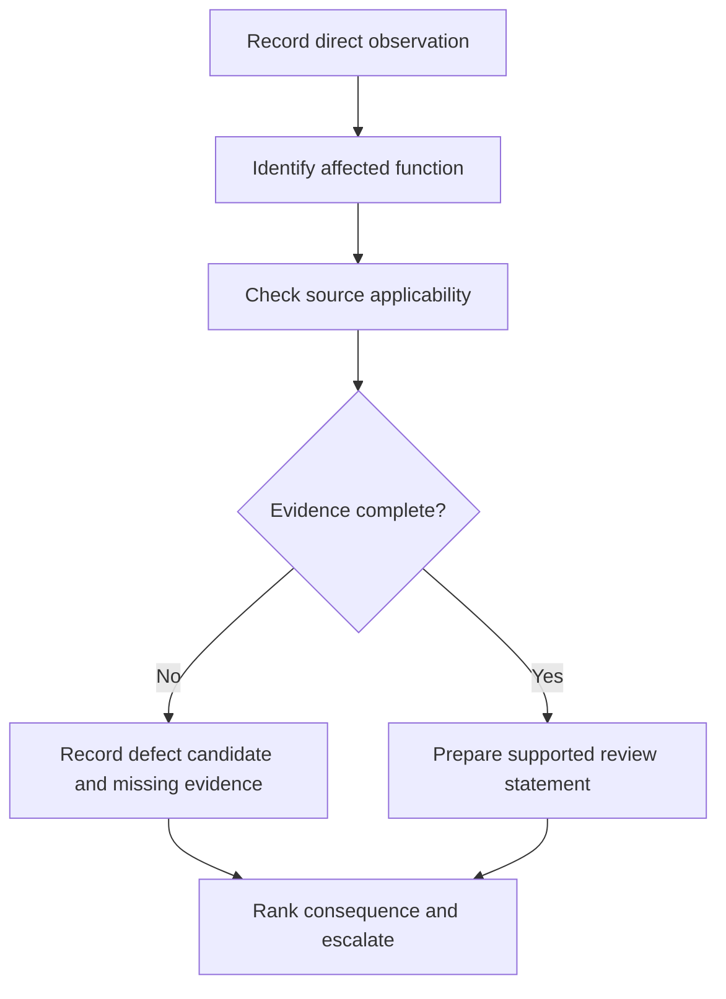
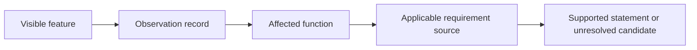

# Day 39 — Accessibility, Labelling and Original Defect-Recognition Scenarios

> **Scope boundary:** This module develops observation, evidence classification and escalation from original drawings and descriptions. It does not declare real installations defective or prescribe field inspection actions.

## 1. Outcome and entry check

By the end, the learner can separate observation from inference, classify accessibility and identification concerns in four original scenarios, rank evidence gaps by consequence, and write a defect-recognition record that avoids unsupported compliance claims.

### Entry check

For each statement—“label missing,” “device inaccessible,” “board non-compliant”—identify whether it is an observation, interpretation or conclusion. Explain what evidence is needed to move to the next level.

## 2. Why it matters

Defect recognition fails when learners jump from a photograph or short description directly to a legal or technical verdict. Reliable review records what is actually visible, identifies the function affected, checks applicability and preserves uncertainty.

## 3. Core concepts and terminology

- **Accessibility:** the ability of the intended authorised person to reach, identify or operate equipment under defined conditions; exact requirements depend on purpose and source.
- **Identification:** information connecting equipment, circuits, sources or functions to an understandable reference.
- **Observation:** directly available evidence without interpretation.
- **Inference:** a reasoned explanation that remains dependent on assumptions.
- **Defect candidate:** a condition requiring verification, not an automated declaration of non-compliance.
- **Consequence ranking:** prioritisation according to credible safety, isolation, protection or operational impact rather than visual untidiness.
- **Provenance:** where evidence came from and whether it is current, complete and applicable.

## 4. Rule-finding workflow

Use **L-A-B-E-L-S**:

1. **L — Locate** the evidence and define the viewing boundary.
2. **A — Annotate** only directly observed features.
3. **B — Bind** each observation to an affected function or source path.
4. **E — Examine** applicability using current authorised references.
5. **L — Limit** conclusions where provenance, dimensions or operating state are missing.
6. **S — State** the defect candidate, consequence, evidence needed and escalation path.

The flow preserves the distinction between seeing a feature and proving a technical conclusion.

## 5. Visual model or worked example

A fictional photograph description says that two outgoing circuits have similar handwritten abbreviations, one alternate-source notice is outside the crop and an enclosure door appears obstructed by stored materials. The learner records three observations, identifies the functions potentially affected and refuses to infer exact access dimensions or label compliance from the description alone.

This is an evidence model, not a standards checklist.

## 6. Practical application

Complete four original scenario cards: ambiguous circuit identification, obstructed approach, inconsistent source references and a changed circuit schedule. For each:

1. list direct observations;
2. separate assumptions and missing evidence;
3. identify the affected switching, protection or distribution function;
4. rank the candidate low, medium or high for learning triage, explaining the consequence basis;
5. write one bounded review statement and one escalation question.

Score 0–2 across observation discipline, terminology, functional linkage, source applicability, consequence reasoning and conclusion restraint. Inventing measurements, declaring legal compliance or authorising field action is a critical error.

## 7. Common errors and safety checkpoint

Common errors include treating neatness as compliance; treating a cropped image as complete evidence; inventing dimensions; assuming a label proves the connected circuit; and using “defect” without identifying consequence or source applicability.

Stop when access conditions, energisation state, source identity, viewing boundary or evidence provenance are unknown. Do not approach, open, operate, move obstructions around, test or alter a real board. Escalate real concerns through authorised workplace and supervision processes.

## 8. Retrieval and next links

From memory, write the L-A-B-E-L-S workflow. Reclassify one scenario after learning that its photograph is two years old and the circuit schedule has since changed. Explain why every prior conclusion reopens.

- **Plan:** [Twelve-Week Capstone Learning Plan](../MASTER_PLAN.md)
- **Knowledge note:** [[12-Week Day 39 - Accessibility Labelling and Original Defect-Recognition Scenarios]]
- **Previous:** [Day 38 — Switchboard Functional Areas and Arrangement Principles](day-38-switchboard-functional-areas-and-arrangement-principles.md)
- **Next:** [Day 40 — Rest, Retrieval and Boundary-Condition Review](day-40-rest-retrieval-and-boundary-condition-review.md)

All scenarios and rubrics are original. Exact accessibility, location, identification, enclosure and defect-classification requirements remain `reference_check_required`. This module is not `technically-reviewed`.
