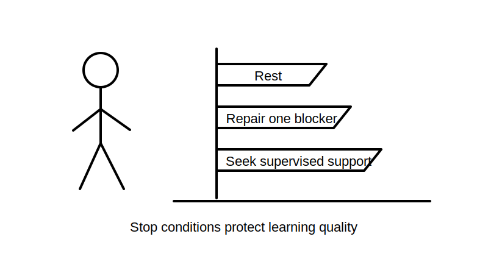
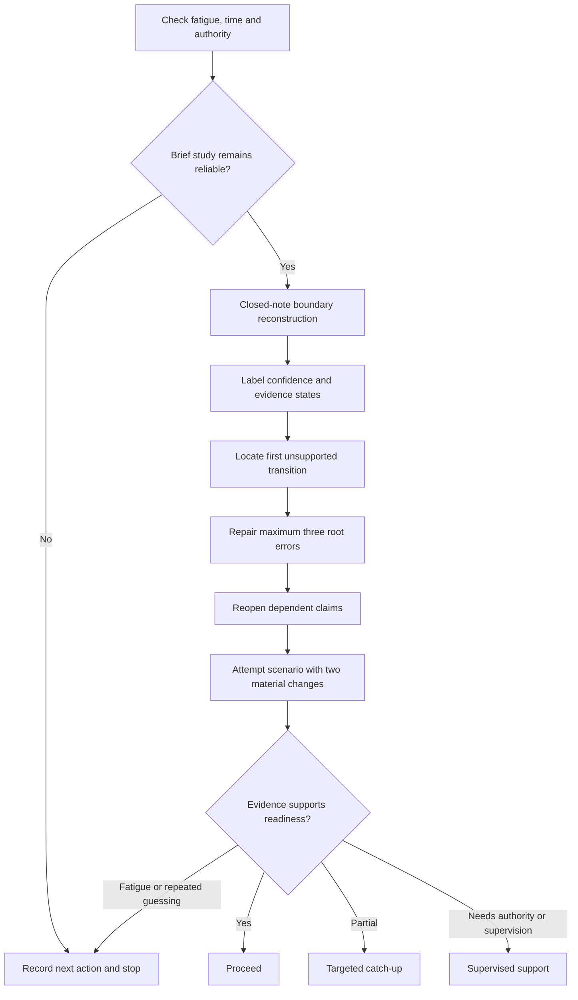
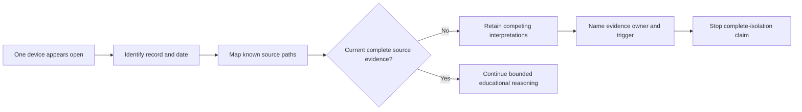

# Day 40 — Rest, Retrieval and Boundary-Condition Review

> **Scope boundary:** This is a deliberate recovery block. It adds no new electrical theory, authorises no practical electrical activity and treats every exact technical claim as `reference_check_required`.

## 1. Outcome and entry check

By the end, the learner can:

1. reconstruct the Week 6 source, switching-function, board-arrangement and evidence boundaries without reopening notes;
2. classify recalled claims as **stated fact**, **derived fact**, **supported inference**, **assumption**, **contradiction** or **evidence gap**;
3. locate the **first unsupported transition** in a reasoning chain and stop dependent claims there;
4. repair no more than three prerequisite errors and reopen affected downstream conclusions;
5. apply fatigue, time and repeated-guessing stop conditions; and
6. demonstrate transfer in a changed scenario before selecting **proceed**, **targeted catch-up**, **supervised support** or `stop-required`.

### Entry check

Before checking notes, record:

- fatigue: 0–5;
- available time;
- confidence: guessing, unsure, reasonably confident or certain; and
- one sentence explaining what evidence would justify continuing.

Use this decision:

- fatigue 4–5, acute frustration or less than 10 available minutes: complete only the five-minute recall map, record the next action and stop;
- fatigue 3: complete recall and at most one repair;
- fatigue 0–2: continue within the 30-minute limit;
- high confidence with weak recent evidence: mark **calibration risk** and require a changed-scenario check.

A correct guess is not secure evidence. Familiar wording is not successful retrieval.

## 2. Why it matters

Recovery protects later inspection reasoning. Week 6 concepts can collapse into unsafe shortcuts:

- one visible source becomes “all sources”;
- one switch becomes “complete isolation”;
- one photograph becomes “the current board condition”;
- one label becomes “proof of circuit identity”;
- one corrected sentence becomes “the whole reasoning chain is repaired”.

This block slows the learner down enough to detect those shortcuts. It prioritises the earliest consequential misconception rather than rewarding volume of study.

*The learner chooses the smallest safe next action instead of continuing past a fatigue, evidence or authority boundary.*

## 3. Core concepts and terminology

- **Boundary condition:** a limit defining the source, function, location, operating state, evidence set or authority covered by a conclusion.
- **Retrieval:** recalling and applying knowledge before reopening notes.
- **Calibration:** alignment between confidence and demonstrated performance.
- **Error log:** a record of the earliest error, why it occurred, affected downstream claims, repair evidence and recheck trigger.
- **Root error:** the earliest misconception or unsupported transition that causes later errors.
- **Symptom error:** a later incorrect answer produced by an earlier root error.
- **Catch-up triage:** selecting the smallest prerequisite gap that blocks the next module.
- **Stop condition:** a predefined reason to end the session rather than continue with unreliable effort.
- **Readiness evidence:** successful performance in a materially changed scenario, not recognition of a previously seen answer.
- **First unsupported transition:** the earliest step where available evidence no longer supports the next claim.
- **Change propagation:** reopening every conclusion that depends on corrected or changed information.
- **Evidence owner:** the person or authorised source expected to resolve a gap.
- **Recheck trigger:** the event or evidence that requires the reasoning chain to be reviewed again.
- **Competing interpretations:** two or more plausible explanations retained because current evidence cannot yet resolve them.

### Criterion states

Assess each criterion independently:

- **secure:** correct, evidence-bounded and transferred under changed conditions;
- **developing:** substantially correct but dependent on prompts or incomplete transfer;
- **unsupported:** conclusion exceeds evidence, omits a material boundary or relies on guessing;
- `stop-required`: fatigue, authority, safety or evidence conditions make continued work unreliable.

These are educational planning states, not official grades, competency decisions or technical approvals.

## 4. Rule-finding workflow

Use **P-A-U-S-E**:

1. **P — Pause:** check fatigue, time, emotional load and authority boundaries.
2. **A — Attempt:** reconstruct S-O-U-R-C-E, B-O-A-R-D-S and L-A-B-E-L-S closed-note; label confidence before checking.
3. **U — Uncover:** classify evidence and locate the first unsupported transition or earliest root error.
4. **S — Select:** choose no more than three repairs by consequence and prerequisite value; assign an evidence owner and recheck trigger where information is missing.
5. **E — Evidence:** test the repair in a scenario with at least two material changes; reopen affected downstream claims and then proceed, catch up, seek supervised support or stop.

The diagram is a learning-control workflow, not a switching, isolation or inspection procedure. It prevents unsupported downstream claims from surviving an upstream correction.

## 5. Visual model or worked example

### Fictional recall scenario

A learner states:

> “The main switch shown open in the photograph isolates the entire community-centre board.”

Available records are:

- a cropped, undated board photograph;
- a current circuit schedule naming a main switch but not showing source paths;
- a maintenance note referring to an auxiliary control supply;
- an older drawing showing a generator inlet; and
- no current source inventory.

Classify the chain:

1. **stated fact:** the photograph shows one device in an open position;
2. **supported inference:** the device may control the supply path identified by the current schedule;
3. **contradiction:** the maintenance note and older drawing indicate possible additional paths;
4. **evidence gap:** current source inventory and operating-state evidence are missing;
5. **first unsupported transition:** moving from “one depicted device is open” to “all sources are isolated”.

The repair is not memorising “check alternate supplies”. The learner must rebuild the source-and-state map, retain competing interpretations, name the evidence owner and stop before claiming complete isolation.

The diagram shows why a visible device state cannot by itself establish a complete source boundary.

## 6. Practical application

Maximum study time: **30 minutes**.

1. **Five minutes — retrieval map**
   - reconstruct S-O-U-R-C-E, B-O-A-R-D-S and L-A-B-E-L-S;
   - draw separate source, function, board and evidence boundaries;
   - mark confidence before checking.

2. **Seven minutes — mixed scenario**
   - label each statement using the six evidence states;
   - identify the first unsupported transition;
   - preserve unresolved competing interpretations.

3. **Eight minutes — targeted repair**
   - select no more than three root errors;
   - record affected downstream claims;
   - add an evidence owner and recheck trigger;
   - reopen every dependent conclusion.

4. **Five minutes — transfer**
   Change at least two material conditions, such as:
   - add an auxiliary source and replace the photograph with a newer but incomplete image;
   - remove the auxiliary-source reference and introduce conflicting device labels;
   - change the decision from source identification to accessibility evidence.

5. **Five minutes — readiness record**
   Record each criterion as **secure**, **developing**, **unsupported** or `stop-required`, then select exactly one next action:
   - **proceed**;
   - **targeted catch-up**;
   - **supervised support**; or
   - **stop and recover**.

### Blocking conditions

A secure outcome is blocked by:

- claiming complete isolation from one device position or one record;
- treating a photograph, label or drawing as current proof without provenance;
- repairing symptom errors while leaving the root error intact;
- ignoring contradictions or discarding competing interpretations;
- failing to reopen dependent claims after a correction;
- continuing beyond the time or fatigue stop condition;
- changing fewer than two material scenario conditions; or
- proposing unauthorised practical electrical activity.

## 7. Common errors and safety checkpoint

Common errors include:

- rereading before making a genuine retrieval attempt;
- turning a recovery block into another full theory session;
- selecting more than three repairs;
- using correct wording without being able to apply it;
- treating confidence as evidence;
- correcting an upstream fact but leaving downstream claims unchanged;
- repeating the same scenario and calling it transfer;
- continuing after two failed attempts on the same boundary; and
- using educational recall as authority for real switching, isolation or inspection.

Stop early for rising fatigue, repeated guessing, escalating frustration, inability to state evidence, two failed attempts on the same root error or any urge to verify the scenario through real equipment.

This block authorises no approach, opening, switching, isolation, proving, measurement, testing, adjustment, repair, energisation, commissioning, certification, defect classification or field verification. Exact rules, values, device capabilities and procedures require current authorised sources and qualified review.

## 8. Retrieval and next links

After at least one sleep period, repeat a five-minute map using a new scenario. Proceed only when the learner can independently:

- inventory possible sources without assuming completeness;
- separate switching function from isolation evidence;
- distinguish board function from physical appearance;
- classify evidence and retain contradictions;
- locate the first unsupported transition; and
- propagate two material changes through affected conclusions.

- **Plan:** [Twelve-Week Capstone Learning Plan](../MASTER_PLAN.md)
- **Knowledge note:** [[12-Week Day 40 - Rest Retrieval and Boundary-Condition Review]]
- **Previous:** [Day 39 — Accessibility, Labelling and Original Defect-Recognition Scenarios](day-39-accessibility-labelling-and-original-defect-recognition-scenarios.md)
- **Next:** [Day 41 — Switchboard Inspection Decision Workshop](day-41-switchboard-inspection-decision-workshop.md)

This original recovery module remains `review-required`, `reference_check_required`, safety-critical and not `technically-reviewed`.
