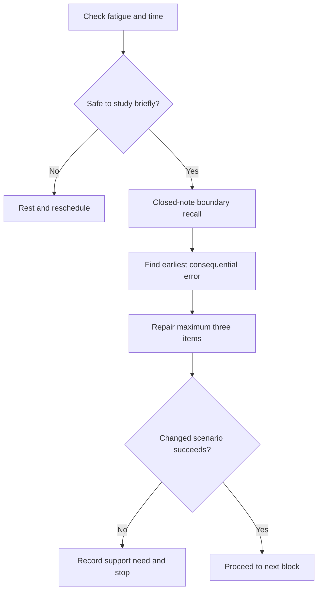
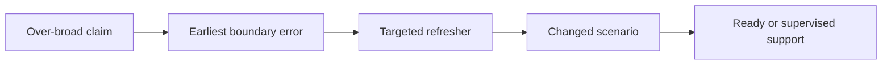

# Day 40 — Rest, Retrieval and Boundary-Condition Review

> **Scope boundary:** This recovery block adds no new electrical theory. It uses short, closed-note retrieval and error correction only; all technical claims remain subject to authorised review.

## 1. Outcome and entry check

By the end, the learner can reconstruct the Week 6 source, function, board and evidence boundaries from memory; correct up to three consequential errors; apply explicit fatigue stop conditions; and decide whether to proceed, catch up or seek supervised support.

### Entry check

Rate fatigue from 0–5 and confidence from 0–5. If fatigue is 4–5, complete only the five-minute recall check and stop. If confidence exceeds evidence from recent work, mark **calibration risk** before continuing.

## 2. Why it matters

Recovery protects learning quality. Switching and switchboard errors often come from collapsed boundaries: one source is treated as all sources, one device as all functions, one image as complete evidence or one label as proof. Spaced retrieval reveals these shortcuts without adding workload.

## 3. Core concepts and terminology

- **Boundary condition:** a limit defining what source, function, location, operating state or evidence a conclusion covers.
- **Retrieval:** recalling and applying knowledge without first reopening notes.
- **Calibration:** alignment between confidence and demonstrated performance.
- **Error log:** a brief record of the earliest cause, downstream effects and repair evidence.
- **Catch-up triage:** selecting only the smallest prerequisite gap that blocks the next module.
- **Stop condition:** a predefined reason to end study rather than continue with unreliable effort.
- **Readiness evidence:** a successful varied attempt, not familiarity with the answer.

## 4. Rule-finding workflow

Use **P-A-U-S-E**:

1. **P — Pause** and check fatigue, time and emotional load.
2. **A — Attempt** closed-note retrieval across source, function, arrangement and evidence boundaries.
3. **U — Uncover** the earliest error causing later mistakes.
4. **S — Select** no more than three repairs, prioritised by consequence and prerequisite value.
5. **E — Evidence** readiness with one changed scenario, or escalate and stop.

The flow limits work deliberately; it is not a technical procedure.

## 5. Visual model or worked example

A learner recalls that an open main switch isolates the complete board. The error log identifies the earliest cause as an incomplete source inventory. The repair is not memorising a different sentence: the learner redraws the operating-state matrix, then solves a changed scenario containing an auxiliary control supply.

The changed scenario tests transfer rather than answer recognition.

## 6. Practical application

Maximum study time: **30 minutes**.

1. Five minutes: reconstruct S-O-U-R-C-E, B-O-A-R-D-S and L-A-B-E-L-S from memory.
2. Ten minutes: complete one mixed scenario and mark every source, function and evidence boundary.
3. Ten minutes: repair no more than three errors using the error log.
4. Five minutes: attempt one changed scenario and record **proceed**, **targeted catch-up** or **supervised support**.

Stop early for rising fatigue, repeated guessing, frustration, inability to state evidence or two failed attempts on the same boundary.

## 7. Common errors and safety checkpoint

Common errors include turning recovery into another full study session; rereading before attempting recall; repairing every minor error; mistaking familiarity for readiness; and continuing after the stop condition.

This block authorises no real switching, isolation, board access, inspection, testing or defect determination. Any retrieved technical statement with an exact rule, value or procedure remains `reference_check_required`.

## 8. Retrieval and next links

After at least one sleep period, repeat a five-minute boundary map using a different scenario. Proceed only when the source inventory, functional map and observation/inference split are independently reconstructed.

- **Plan:** [Twelve-Week Capstone Learning Plan](../MASTER_PLAN.md)
- **Knowledge note:** [[12-Week Day 40 - Rest Retrieval and Boundary-Condition Review]]
- **Previous:** [Day 39 — Accessibility, Labelling and Original Defect-Recognition Scenarios](day-39-accessibility-labelling-and-original-defect-recognition-scenarios.md)
- **Next:** [Day 41 — Switchboard Inspection Decision Workshop](day-41-switchboard-inspection-decision-workshop.md)

This recovery module is original and adds no new electrical theory. It remains `review-required`, `reference_check_required` and not `technically-reviewed`.
