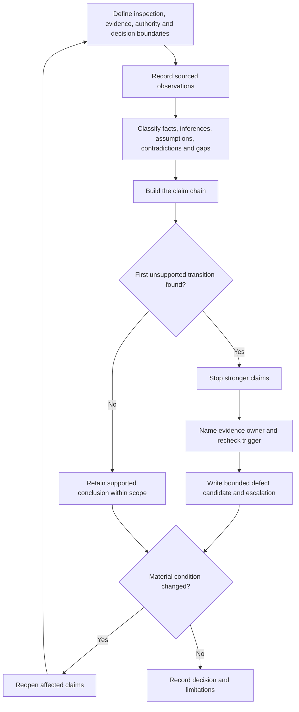
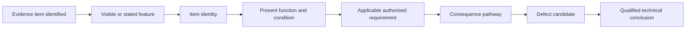

# Day 41 — Switchboard Inspection Decision Workshop

> **Scope boundary:** This is a paper-based inspection-reasoning exercise using fictional records. Exact defect criteria, access requirements, construction rules, classifications and acceptance decisions require current authorised sources and qualified review. No approach, opening, switching, isolation, proving, measurement, testing, adjustment, repair, energisation, certification or field verification is authorised.

## 1. Outcome and entry check

By the end, the learner can:

1. define the inspection, evidence, authority and decision boundaries before reviewing a dossier;
2. classify each material statement as a stated fact, derived fact, supported inference, assumption, contradiction or evidence gap;
3. separate a visible feature from item identity, present function, applicable requirement, consequence pathway and defect candidate;
4. locate the first unsupported transition in a proposed conclusion;
5. produce a bounded inspection record with evidence owners, recheck triggers and a proportionate escalation route; and
6. transfer the method after at least two material scenario changes without carrying forward invalid conclusions.

### Entry check

Study this fictional prompt: *A cropped photograph shows a crowded switchboard, one handwritten label and one blank module cover. An older schedule identifies a spare circuit.*

Before checking any source, write:

- one direct observation;
- one possible inference;
- one claim that cannot yet be made; and
- confidence from 0–100% for each response.

A correct guess with weak reasoning remains **developing**, not secure. Confidence calibration means comparing confidence with demonstrated evidence quality.

## 2. Why it matters

Inspection reasoning fails when appearance is treated as proof. A photograph can support a statement about what is visible in that image; it does not automatically establish current circuit identity, hidden connections, available capacity, device suitability, complete source conditions or compliance.

The goal is not to avoid decisions. It is to make the strongest decision the evidence and authority actually support, preserve unresolved contradictions, and state what must happen next.

*Instructional caption: move from observation to evidence checking; when support is incomplete, bound the claim and escalate rather than inventing hidden conditions.*

## 3. Core concepts and terminology

- **Inspection boundary:** equipment, location, time and viewing conditions covered by the supplied material.
- **Evidence boundary:** documents, images and statements available for the decision.
- **Authority boundary:** actions and conclusions the learner is permitted and competent to make.
- **Decision boundary:** purpose and consequence of the requested output.
- **Observation:** information directly visible in, or explicitly stated by, an identified source.
- **Derived fact:** result obtained transparently from supported facts without adding an unverified premise.
- **Supported inference:** interpretation for which the evidence chain is stated and adequate for the limited claim.
- **Assumption:** unverified proposition temporarily used in reasoning; it must not be disguised as fact.
- **Contradiction:** two evidence items that cannot both describe the same condition in the same way.
- **Evidence gap:** missing information needed before a stronger claim can be supported.
- **Defect candidate:** feature requiring authorised checking against an applicable requirement; it is not a final defect classification.
- **Consequence pathway:** explained route from a condition to a plausible safety, operational or maintainability effect.
- **Provenance:** origin, date, revision, scope and custody of evidence.
- **Competing interpretations:** multiple plausible explanations retained until evidence resolves them.
- **Evidence owner:** person or authorised source expected to resolve a gap.
- **Recheck trigger:** new evidence or changed condition requiring prior reasoning to be reopened.
- **First unsupported transition:** earliest step where evidence no longer supports the next claim.
- **Change propagation:** reopening every dependent conclusion affected by corrected or changed information.

Use **secure**, **developing**, **unsupported** and `stop-required` as independent educational planning states. They are not official grades, competency decisions, defect classifications or technical approvals.

## 4. Rule-finding workflow

Use **I-N-S-P-E-C-T**:

1. **I — Identify** the board, source conditions, inspection boundary, decision purpose and authority limit.
2. **N — Note** observations with source identity, date, revision and viewing limitation.
3. **S — Separate** evidence states and retain contradictions or competing interpretations.
4. **P — Pinpoint** the first unsupported transition and map the plausible consequence pathway.
5. **E — Establish** the applicable authorised source needed, the evidence owner and the recheck trigger.
6. **C — Communicate** a bounded defect-candidate statement, affected scope and prohibited overclaim.
7. **T — Transfer** to a changed scenario, reopening dependent claims before selecting escalation.

The workflow prevents a visible cue from bypassing provenance, applicability, authority and consequence checks.

Each arrow is a transition requiring support. If support fails at any rung, later rungs remain unsupported even when the final conclusion sounds plausible.

## 5. Visual model or worked example

### Fictional dossier

A community hall dossier contains:

- photograph P1, cropped around the switchboard interior and dated eighteen months ago;
- photograph P2, showing the closed enclosure and a faded alternate-supply notice, with no date;
- schedule S3, marked current, listing circuit 12 as “spare”;
- drawing D1, older than S3, showing circuit 12 feeding an external store;
- maintenance note M4, stating that a control supply was added after D1;
- no current single-line diagram, source inventory, circuit tracing record or authorised inspection result.

### Evidence-controlled reasoning

1. **Observation:** P1 shows a blank module cover beside several devices.
2. **Observation:** S3 labels circuit 12 “spare.”
3. **Contradiction:** D1 associates circuit 12 with an external-store load.
4. **Evidence gap:** the current function and connection state of circuit 12 are not established.
5. **Competing interpretations:** the circuit may have been removed, relabelled, repurposed or left connected while records diverged.
6. **First unsupported transition:** moving from “blank cover and spare label” to “unused capacity is available.”
7. **Bounded defect candidate:** current identification and source documentation appear insufficient in the supplied dossier to establish circuit 12’s present function or available capacity.
8. **Evidence owner:** authorised person responsible for current board records and inspection evidence.
9. **Recheck trigger:** receipt of current source inventory, revised single-line information or authorised inspection findings.
10. **Prohibited conclusion:** “The board has spare capacity” or “circuit 12 is defective.”

This example does not determine compliance. It demonstrates how to preserve uncertainty without becoming vague.

## 6. Practical application

Review a fictional dossier containing three photographs, two conflicting schedules, a partial single-line diagram, a maintenance note and a newly disclosed alternate supply.

Produce:

1. a boundary statement covering equipment, time, evidence, authority and decision purpose;
2. eight sourced observations;
3. an evidence-state table with at least one contradiction and one evidence gap;
4. two competing interpretations for one unresolved feature;
5. a claim ladder identifying the first unsupported transition;
6. a consequence pathway for two concerns without inventing hidden conditions;
7. one bounded defect-candidate statement per concern;
8. an evidence owner and recheck trigger for every unresolved blocker;
9. a proportionate escalation statement; and
10. a transfer revision after **two material changes**, such as a newer schedule and disclosure of a control supply.

For transfer, identify which conclusions reopen, which remain unaffected and why.

### Criterion-level readiness evidence

- **Boundary control:** scope, time, source state, authority and decision purpose are explicit.
- **Evidence discipline:** provenance and evidence states are accurate.
- **Claim control:** the first unsupported transition is found before a broader conclusion is made.
- **Consequence reasoning:** plausible pathways are explained without speculative certainty.
- **Communication:** findings distinguish observation, defect candidate and qualified conclusion.
- **Change propagation:** material changes reopen every affected claim.
- **Safety control:** no unauthorised practical action is proposed.

A criterion is **secure** only when demonstrated independently in both the original and changed scenario. **Developing** means partially demonstrated with a repairable gap. **Unsupported** means evidence is absent or contradicted. Use `stop-required` when authority, evidence quality, safety, fatigue or task conditions make continued work unreliable.

Secure readiness is blocked by any of the following:

- treating a label, photograph, blank way or schedule as proof of hidden connection, capacity or suitability;
- concealing a contradiction;
- skipping provenance or applicability checks;
- promoting a defect candidate into a final defect or compliance conclusion;
- failing to name an evidence owner or recheck trigger;
- failing to reopen a dependent claim after material change;
- completing transfer with fewer than two material changes; or
- proposing unauthorised opening, switching, isolation, testing or alteration.

## 7. Common errors and safety checkpoint

Common errors include:

- mixing observation and inference in one sentence;
- treating an old photograph as current-condition proof;
- treating apparent space as capacity;
- accepting the newest-looking document without checking scope and revision;
- ranking concern by visual unusualness rather than a stated consequence pathway;
- selecting one convenient interpretation while suppressing alternatives; and
- repeating the same conclusion after changed evidence.

**Safety checkpoint:** stop if the task requires access, operation, proving, measurement, test interpretation, defect classification or compliance judgement beyond the supplied evidence and authority. Record the blocked claim, evidence owner, recheck trigger and escalation route. Do not convert this educational dossier into field instructions.

## 8. Retrieval and next links

Closed-note prompts:

1. Expand **I-N-S-P-E-C-T**.
2. Name the four boundaries set before inspection reasoning.
3. Distinguish observation, supported inference, assumption and defect candidate.
4. What is the first unsupported transition?
5. Why must contradictions and competing interpretations remain visible?
6. What makes a recheck trigger useful?
7. Name two blocking conditions.
8. Explain how two material changes test transfer.

- **Plan:** [Twelve-Week Capstone Learning Plan](../MASTER_PLAN.md)
- **Knowledge note:** [[12-Week Day 41 - Switchboard Inspection Decision Workshop]]
- **Previous:** [Day 40 — Rest, Retrieval and Boundary-Condition Review](day-40-rest-retrieval-and-boundary-condition-review.md)
- **Next:** [Day 42 — Week 6 Integrated Switching and Switchboard Checkpoint](day-42-week-6-integrated-switching-and-switchboard-checkpoint.md)

This module remains `review-required`, `reference_check_required`, safety-critical and not `technically-reviewed`.
