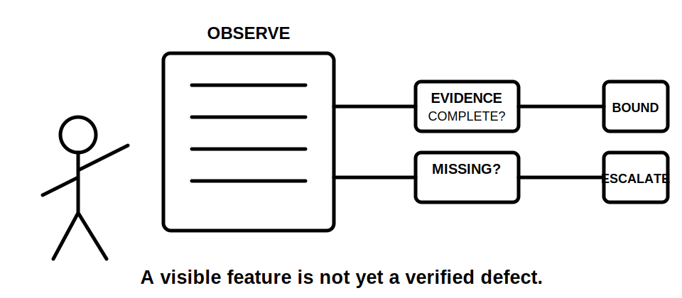
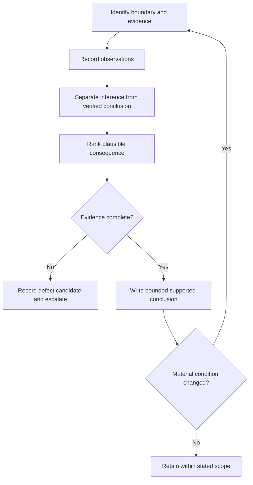

# Day 41 — Switchboard Inspection Decision Workshop

> **Scope boundary:** This is a paper-based inspection-reasoning exercise. Exact defect criteria, access requirements, construction rules and acceptance decisions require current authorised sources and qualified review. No opening, switching, testing or alteration is authorised.

## 1. Outcome and entry check

By the end, the learner can separate observation from inference, classify evidence gaps, rank consequences, write bounded defect-candidate statements and choose an appropriate escalation path.

### Entry check

Given a photograph showing a crowded switchboard, write one observation and one inference. Mark which one is directly supported.

## 2. Why it matters

Inspection errors arise when visible features are promoted too quickly into compliance conclusions. A defensible inspection record distinguishes what is seen, what it may indicate, what evidence is missing and what action is justified.

## 3. Core concepts and terminology

- **Observation:** directly visible or documented information.
- **Inference:** a reasoned interpretation that still requires support.
- **Defect candidate:** a feature requiring further checking, not a final defect determination.
- **Consequence ranking:** ordering concerns by plausible safety or operational impact.
- **Evidence gap:** information required before a stronger conclusion can be made.
- **Escalation:** referral for authorised inspection, testing, documentation or technical review.

## 4. Rule-finding workflow

Use **I-N-S-P-E-C-T**:

1. **I — Identify** the board, source boundary and supplied evidence.
2. **N — Note** observations without interpretation.
3. **S — Separate** observation, inference and verified conclusion.
4. **P — Prioritise** by plausible consequence.
5. **E — Establish** the missing authorised evidence.
6. **C — Communicate** a bounded finding.
7. **T — Trigger** escalation or re-review when conditions change.

The diagram prevents a visual cue from bypassing evidence and authority checks.

## 5. Visual model or worked example

A photograph shows an unreadable circuit label, a blank way and mixed device appearances. The learner records three observations, then rejects the claims “unused capacity exists” and “devices are incompatible” because neither follows from appearance alone. The bounded output is: **identification evidence is inadequate in the supplied material; capacity and compatibility remain unresolved.**

## 6. Practical application

Review a fictional dossier containing two photographs, an old schedule and a partial single-line diagram. Produce:

1. six observations;
2. three inferences clearly labelled;
3. a consequence-ranked concern list;
4. an evidence request for each concern;
5. one bounded finding and one escalation statement;
6. a changed-scenario note for a newly disclosed alternate supply.

### Assessment rubric

Score 0–2 for boundary definition, observation quality, inference control, consequence ranking, evidence requests and safety communication. A score of 10/12 with no critical error indicates readiness for Day 42.

## 7. Common errors and safety checkpoint

Common errors include calling every unusual feature a defect, treating labels as proof of hidden arrangements, treating space as capacity, ignoring alternate sources and writing conclusions beyond the supplied evidence.

Critical errors include inventing hidden conditions, claiming compliance from photographs, omitting a disclosed source or recommending unauthorised opening or testing.

## 8. Retrieval and next links

Closed-note prompts:

1. Expand **I-N-S-P-E-C-T**.
2. Distinguish observation, inference and defect candidate.
3. Why is consequence ranking useful?
4. Name three evidence gaps that can block a conclusion.
5. State two escalation triggers.

- **Plan:** [Twelve-Week Capstone Learning Plan](../MASTER_PLAN.md)
- **Knowledge note:** [[12-Week Day 41 - Switchboard Inspection Decision Workshop]]
- **Previous:** [Day 40 — Rest, Retrieval and Boundary-Condition Review](day-40-rest-retrieval-and-boundary-condition-review.md)
- **Next:** [Day 42 — Week 6 Integrated Switching and Switchboard Checkpoint](day-42-week-6-integrated-switching-and-switchboard-checkpoint.md)

This module remains `review-required`, `reference_check_required` and not `technically-reviewed`.
