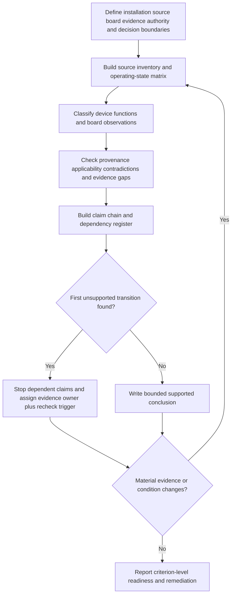
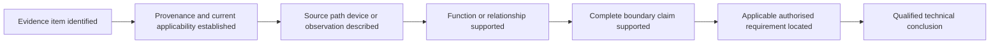

# Day 42 — Week 6 Integrated Switching and Switchboard Checkpoint

> **Assessment boundary:** This is an original, paper-based checkpoint using fictional records. It does not establish compliance, competence, a defect classification or technical approval. Exact switching, isolation, source, switchboard, access, construction, labelling and inspection requirements require current authorised sources and qualified review. No approach, opening, switching, isolation, proving, measurement, testing, adjustment, repair, energisation, commissioning, certification or field verification is authorised.

## 1. Outcome and entry check

By the end, the learner can:

1. define installation, source, switchboard, evidence, authority and decision boundaries before analysing a scenario;
2. build a source-and-operating-state inventory without assuming that one labelled device controls every energisation path;
3. classify device functions and switchboard observations while distinguishing stated facts, derived facts, supported inferences, assumptions, contradictions and evidence gaps;
4. identify the first unsupported transition in a claim chain and stop dependent isolation, defect, suitability or acceptance claims there;
5. reopen affected conclusions after a material scenario change and assign an evidence owner plus recheck trigger to each unresolved blocker; and
6. communicate a bounded checkpoint result using independent educational readiness states rather than an unsupported aggregate pass mark.

### Entry check

Without notes, answer these prompts and record confidence as **guessing**, **unsure**, **reasonably confident** or **certain**:

- What evidence would be needed before claiming that a nominated device controls every relevant source path within a stated boundary?
- Why is a visible label not sufficient evidence of hidden connection, switching function or complete isolation?
- What earlier conclusions must be reopened when a previously undisclosed alternate supply is introduced?

A correct answer with low confidence needs retrieval strengthening. A high-confidence unsupported answer is a priority misconception because it may produce unsafe overclaiming.

## 2. Why it matters

Integrated Capstone tasks do not keep source identification, switching purpose, switchboard arrangement, inspection evidence and escalation separate. A response can sound technically fluent yet fail because it silently changes boundaries, treats a label as proof, ignores an alternate source, converts an observation into a verified defect or leaves earlier conclusions unchanged after new evidence appears.

The checkpoint therefore assesses the quality of the learner's evidence chain, not merely whether the final wording appears plausible. One unsupported transition limits every dependent conclusion.

*Instructional caption: the learner must connect source identity, device function and evidence quality before moving to a bounded conclusion; one missing boundary can invalidate the chain.*

## 3. Core concepts and terminology

- **Integrated scenario:** one task that requires several related domains to be reasoned together rather than solved as isolated topics.
- **Installation boundary:** the physical and functional extent of the installation being discussed.
- **Source boundary:** the set of normal, alternate, stored-energy and auxiliary paths that may energise equipment within the stated scenario.
- **Operating state:** a defined combination of source availability, device positions and equipment condition.
- **Operating-state matrix:** a table showing relevant source and switch states so omitted energisation paths are visible.
- **Switching function:** the purpose attributed to a device, such as functional control, isolation or emergency action; appearance or labelling alone does not prove capability or complete effect.
- **Switchboard functional area:** an educational grouping by purpose, such as incoming supply, switching, protection, distribution, neutral, earthing, auxiliary/control or outgoing circuits. It is not a construction-compliance conclusion.
- **Evidence provenance:** where an evidence item came from, when it was produced, which condition it describes and whether it is applicable to the current scenario.
- **Stated fact:** information explicitly supplied by a traceable source.
- **Derived fact:** a transparent result obtained from supported facts without adding an unverified premise.
- **Supported inference:** a bounded interpretation backed by adequate, applicable evidence.
- **Assumption:** an unverified proposition that must not be presented as fact.
- **Contradiction:** evidence items that cannot both describe the same condition or arrangement.
- **Evidence gap:** missing support required before a stronger claim can be made.
- **Competing interpretations:** two or more plausible explanations retained until evidence resolves them.
- **Dependency:** a conclusion whose validity relies on another fact, state or interpretation.
- **Change propagation:** reopening every dependent conclusion affected by new or corrected information.
- **First unsupported transition:** the earliest step where a claim moves beyond the available evidence.
- **Evidence owner:** the person, document set or authorised source expected to resolve an evidence gap.
- **Recheck trigger:** the specific new evidence or changed condition that requires earlier reasoning to be reviewed.
- **Bounded conclusion:** a statement restricted to the evidence, conditions, authority and unresolved limitations explicitly recorded.
- **Blocking condition:** an error or omission serious enough to prevent a secure educational readiness state, regardless of stronger performance elsewhere.

## 4. Rule-finding workflow

Use **U-N-I-F-Y**:

1. **U — Unpack boundaries and outputs.** State the installation, source, switchboard, evidence, authority and decision boundaries. List every requested output before solving.
2. **N — Name sources, states and functions.** Build a complete source inventory and operating-state matrix. Identify each device only as far as the evidence supports and preserve unknowns.
3. **I — Integrate evidence and authorised rule-finding.** Classify each item by evidence state, check provenance and applicability, retain contradictions and locate the authorised source needed for exact requirements.
4. **F — Follow dependencies and the first unsupported transition.** Build a dependency register, stop claims where support ends and reopen affected reasoning whenever a material condition changes.
5. **Y — Yield a bounded result.** State supported conclusions, unresolved interpretations, evidence owners, recheck triggers, escalation and explicit actions that are not authorised.

The diagram shows that integration is iterative. New source or board evidence returns the learner to the inventory and state model; it does not merely add a footnote to an unchanged conclusion.

### Claim-control ladder

Each rung requires its own support. For example, a photograph may support that a label was visible when the image was taken, but not that the label is current, that the device has the claimed hidden connections, that every alternate source is controlled or that the arrangement is compliant.

## 5. Visual model or worked example

### Fictional community-facility dossier

The learner receives:

- a current single-line drawing showing a normal utility supply and one labelled main switch;
- an older renovation drawing showing an inverter connection that is absent from the current drawing;
- a maintenance note referring to a generator inlet used during an outage;
- a photograph showing an auxiliary control enclosure with no visible source notice;
- a circuit schedule marked current but containing one device identifier that does not match the photograph; and
- no verified current source inventory, connection diagram or operating-state record.

A weak response says, “The main switch isolates the entire installation and the missing notice is a defect.”

An evidence-controlled response separates the chain:

1. The current drawing and photograph support limited descriptive facts, subject to provenance and condition checks.
2. The inverter record and generator note create competing interpretations about current source paths.
3. The device label does not establish hidden connections, complete source control or isolation capability.
4. The unmatched identifier and absent current source inventory are contradictions or evidence gaps, not proof of a final defect category.
5. The first unsupported transition occurs when the response moves from visible identification to complete isolation or verified defect claims.
6. Dependent conclusions stop there. The learner assigns current source-path documentation and qualified inspection evidence to named evidence owners, defines recheck triggers and escalates without proposing field action.

### Changed-condition transfer

After the first response, disclose both of these changes:

- the inverter has a documented automatic transfer function; and
- the auxiliary enclosure is supplied from a separate control transformer shown on a newly issued drawing.

The learner must identify which source, switching, board-boundary, labelling and inspection conclusions reopen, which remain unaffected and why. Merely appending the new facts without revising dependencies is not successful transfer.

## 6. Practical application

Complete a 60-minute closed-note fictional checkpoint.

### Part A — Initial analysis

1. Restate all six boundaries and requested outputs.
2. Build a source inventory and operating-state matrix with explicit unknowns.
3. Classify the evidenced purpose of each nominated device without inferring capability from appearance.
4. Map relevant switchboard functional areas without claiming hidden construction.
5. Classify at least eight dossier statements as stated fact, derived fact, supported inference, assumption, contradiction or evidence gap.
6. Create a claim chain and mark the first unsupported transition for each isolation, defect, suitability or acceptance claim.
7. Build a dependency register linking each conclusion to the facts and interpretations it relies on.
8. Assign an evidence owner and recheck trigger to every unresolved blocker.
9. Write a bounded result and proportionate escalation statement.

### Part B — Material-change transfer

Apply at least two changed conditions supplied after Part A. For each change:

- identify affected and unaffected conclusions;
- reopen the source inventory, operating-state matrix and dependency register where required;
- explain why each conclusion changes or remains stable; and
- issue a revised bounded result.

### Criterion-level educational readiness

Assess each criterion independently:

- **Boundary and task control** — requested outputs and all relevant boundaries are explicit.
- **Source and operating-state completeness** — every evidenced source path and meaningful state is included, with unknowns visible.
- **Evidence and provenance discipline** — facts, inferences, assumptions, contradictions and gaps are correctly separated.
- **Function and board reasoning** — device and functional-area claims stay within available evidence.
- **Claim-chain control** — the first unsupported transition stops dependent claims.
- **Change propagation** — at least two material changes reopen affected reasoning while unaffected conclusions are justified.
- **Safety communication and escalation** — evidence owners, recheck triggers, unresolved limitations and prohibited actions are clear.

Use these educational planning states:

- **Secure:** the criterion is demonstrated independently, consistently and within evidence and authority boundaries.
- **Developing:** the core method is present but needs prompting, correction or clearer evidence control.
- **Unsupported:** the submitted work does not yet provide enough evidence to judge the criterion secure.
- **`stop-required`:** the work contains a blocking safety, authority or evidence-control failure and must not progress to stronger claims.

These are not official grades, competency outcomes, defect classifications or technical approvals. Do not calculate an aggregate score or infer that strengths in one criterion cancel a blocker in another.

### Blocking conditions

A secure checkpoint outcome is blocked by any of the following:

- omitting an evidenced or credibly indicated source path;
- claiming complete isolation from a label, device appearance or incomplete drawing;
- presenting an observation or evidence gap as a verified defect or compliance conclusion;
- inventing hidden construction, connection, rating, capacity or device capability;
- concealing contradictions or selecting the most convenient record without provenance analysis;
- failing to stop at the first unsupported transition;
- failing to assign evidence owners and recheck triggers to material gaps;
- failing to reopen dependent conclusions after a material change;
- testing transfer with fewer than two material changes; or
- proposing unauthorised practical activity.

## 7. Common errors and safety checkpoint

### Common errors

- solving switching, alternate supplies and switchboard inspection as unrelated mini-questions;
- treating “main switch” as proof that all relevant source paths are controlled;
- assuming a current-looking document describes the current physical arrangement;
- confusing functional-area mapping with verification of construction or compliance;
- converting absence from a photograph into proof that an item is absent from the installation;
- using an aggregate mark to hide a source omission or unsupported isolation claim;
- repeating the original conclusion after a changed condition without reopening dependencies; and
- treating confident language as evidence quality.

### Safety checkpoint

This module authorises no approach to equipment, opening, switching, isolation, proving, measurement, testing, adjustment, repair, energisation, commissioning, certification, defect classification or field verification. Stop and escalate if the task would require current-condition confirmation, practical operation, access to live or potentially live equipment, safety-critical interpretation or a qualified compliance decision.

Exact definitions, source-treatment requirements, switch capabilities, board construction and access requirements, identification rules, inspection criteria, test methods, values, limits and official assessment requirements remain `reference_check_required` and require current authorised sources plus qualified review.

## 8. Retrieval and next links

After one sleep period:

1. reconstruct **U-N-I-F-Y** without notes;
2. explain why the first unsupported transition controls every downstream claim;
3. recreate the source-and-operating-state matrix for a different fictional arrangement;
4. correct only the weakest criterion using the error log; and
5. complete a fresh transfer prompt containing two material changes.

Record both accuracy and confidence. A high-confidence error returns to targeted remediation before the learner advances.

- **Plan:** [Twelve-Week Capstone Learning Plan](../MASTER_PLAN.md)
- **Knowledge note:** [[12-Week Day 42 - Week 6 Integrated Switching and Switchboard Checkpoint]]
- **Previous:** [Day 41 — Switchboard Inspection Decision Workshop](day-41-switchboard-inspection-decision-workshop.md)
- **Next:** [Day 43 — Wiring-System Selection and Mechanical Protection](day-43-wiring-system-selection-and-mechanical-protection.md)

This module remains `review-required`, `reference_check_required`, safety-critical and not `technically-reviewed`.