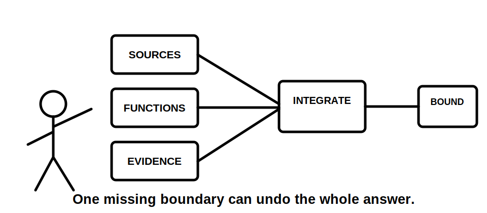
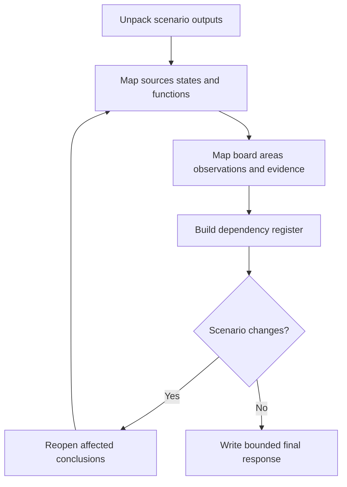

# Day 42 — Week 6 Integrated Switching and Switchboard Checkpoint

> **Assessment boundary:** This original checkpoint assesses paper-based reasoning only. Exact switch, isolation, board, access, construction, labelling and inspection requirements remain subject to current authorised sources and qualified review.

## 1. Outcome and entry check

By the end, the learner can independently integrate source inventories, switch functions, board arrangements, observation discipline and escalation decisions in one changed-condition scenario.

### Entry check

From memory, list the minimum evidence needed before claiming that a nominated device isolates a complete installation.

## 2. Why it matters

Capstone scenarios rarely keep switching, alternate supplies and switchboard inspection separate. A technically plausible answer can still fail if one source, operating state, function or evidence boundary is omitted.

## 3. Core concepts and terminology

- **Integrated scenario:** one task requiring several related domains to be reasoned together.
- **Operating-state matrix:** a table of source availability and switch positions for relevant conditions.
- **Dependency:** a conclusion that changes when another fact changes.
- **Change propagation:** reopening every dependent conclusion after a material change.
- **Critical error:** an error serious enough to override the numerical score.
- **Bounded conclusion:** a claim restricted to the evidence, conditions and authority stated.

## 4. Rule-finding workflow

Use **U-N-I-F-Y**:

1. **U — Unpack** the task and identify every requested output.
2. **N — Name** all sources, states, switch functions and board boundaries.
3. **I — Integrate** observations with applicable authorised evidence.
4. **F — Follow** dependencies when conditions change.
5. **Y — Yield** a bounded conclusion, unresolved item or escalation.

The dependency register prevents an added source or changed board condition from being treated as an isolated detail.

## 5. Visual model or worked example

A fictional board has a normal supply, later-disclosed inverter supply, labelled main switch, partial schedule and one unclear device arrangement. The initial claim that the main switch isolates the installation is reopened when the inverter is disclosed. The board observation remains descriptive; complete isolation, device function and compatibility remain unresolved until the new source path and authorised evidence are checked.

## 6. Practical application

Complete a 60-minute fictional checkpoint:

1. define the installation and board boundaries;
2. build a source and operating-state matrix;
3. classify each switch function;
4. map board functional areas;
5. separate six observations from inferences;
6. identify missing evidence and escalation points;
7. respond to a late alternate-supply disclosure;
8. write a final bounded conclusion and remediation note.

### Assessment rubric

Score 0–2 for task decomposition, source/state completeness, function classification, board/evidence reasoning, change propagation, and safety communication. **10/12** with no critical error is the educational readiness threshold.

Critical errors: omitted source, unsupported isolation claim, observation presented as verified defect, invented hidden construction, or unauthorised practical action.

## 7. Common errors and safety checkpoint

Common errors include solving each topic separately, assuming one main switch controls all sources, failing to revisit earlier answers, using device appearance as compatibility evidence and writing beyond the supplied dossier.

This checkpoint authorises no switching, isolation, opening, testing, measurement, alteration, commissioning or verification.

## 8. Retrieval and next links

After one sleep period, explain **U-N-I-F-Y** using a different source arrangement. Re-attempt only the weakest rubric category, then solve one changed scenario without notes.

- **Plan:** [Twelve-Week Capstone Learning Plan](../MASTER_PLAN.md)
- **Knowledge note:** [[12-Week Day 42 - Week 6 Integrated Switching and Switchboard Checkpoint]]
- **Previous:** [Day 41 — Switchboard Inspection Decision Workshop](day-41-switchboard-inspection-decision-workshop.md)
- **Next:** [Day 43 — Wiring-System Selection and Mechanical Protection](day-43-wiring-system-selection-and-mechanical-protection.md)

This module remains `review-required`, `reference_check_required` and not `technically-reviewed`.
