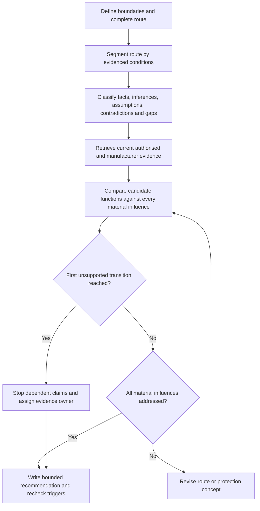
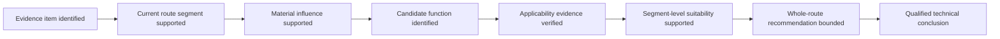

# Day 43 — Wiring-System Selection and Mechanical Protection

> **Scope boundary:** This paper-based module teaches evidence-controlled selection reasoning. It authorises no installation, access, opening, excavation, alteration, testing or energisation. Exact permitted wiring systems, route classifications, protection methods, locations, depths, supports, entries, segregation and construction details require current authorised sources and qualified review.

## 1. Outcome and entry check

By the end, the learner can:

1. define the installation, route, evidence, authority and decision boundaries for a fictional wiring-system selection task;
2. divide a route into condition segments and describe each segment without inventing hidden conditions;
3. distinguish conductor, wiring system, containment, support, entry treatment and mechanical-protection functions;
4. classify supplied information as stated fact, derived fact, supported inference, assumption, contradiction or evidence gap;
5. compare candidate concepts against every evidenced material influence and stop at the first unsupported transition; and
6. produce a bounded recommendation, evidence-owner list and recheck triggers, then revise the reasoning after at least two material scenario changes.

### Entry check

Without consulting notes, list four route conditions that could change the suitability of an otherwise adequate conductor. Mark confidence beside each answer as **high**, **medium** or **low**. After checking, classify each answer as supported, partly supported or unsupported. A correct low-confidence answer indicates fragile recall; a high-confidence unsupported answer requires misconception repair before proceeding.

## 2. Why it matters

A conductor is not selected in isolation. The complete wiring system must remain suitable across the route and through expected conditions. A route can introduce impact, crushing, abrasion, penetration, movement, strain, heat, moisture, contamination, sunlight, access and foreseeable future-work exposure. A protection idea that addresses one segment may create a new entry, support, heat or maintenance problem elsewhere.

The learner must therefore separate visible evidence from assumptions, preserve contradictory records, and avoid converting a paper concept into an installation instruction or compliance conclusion.

*The learner maps each route segment and its evidenced hazards before comparing protection concepts; no single protective feature is treated as universally suitable.*

## 3. Core concepts and terminology

- **Conductor:** conductive material intended to carry current; conductor adequacy alone does not establish wiring-system suitability.
- **Wiring system:** conductors, insulation, sheath, containment, supports, entries and associated protection considered as an integrated arrangement.
- **Route envelope:** the full path plus surrounding conditions, interfaces, access points and foreseeable influences relevant to selection.
- **Condition segment:** a bounded part of the route within which the material influences are reasonably consistent.
- **Mechanical influence:** an exposure such as impact, crushing, abrasion, penetration, movement, vibration or strain.
- **Environmental influence:** an external condition such as heat, moisture, corrosion, contamination, sunlight or another evidenced exposure.
- **Containment:** an enclosure or pathway concept that manages routing, support or protection; its name alone does not prove suitability.
- **Support function:** maintaining position and controlling strain or movement without asserting an unverified spacing or construction rule.
- **Entry treatment:** the concept used where a wiring system enters equipment, containment or a different environment; exact requirements remain source-dependent.
- **Mechanical-protection concept:** a paper-level proposal for reducing an identified mechanical exposure. It is not a verified construction instruction.
- **Material influence:** a condition capable of changing selection, protection, support, entry, route or acceptance reasoning.
- **Evidence provenance:** the source, date, described condition and applicability of an evidence item.
- **Stated fact:** information explicitly supplied by a traceable source.
- **Derived fact:** a transparent result produced from supported facts.
- **Supported inference:** a bounded interpretation adequately supported by evidence.
- **Assumption:** an unverified proposition that must not be presented as fact.
- **Contradiction:** evidence items that cannot both describe the same condition or revision.
- **Evidence gap:** missing support required before a stronger claim can be made.
- **Competing interpretations:** plausible explanations retained until further evidence resolves them.
- **First unsupported transition:** the earliest step where a claim exceeds the available support; all dependent claims stop there.
- **Evidence owner:** the person, current document set, authorised source or qualified reviewer expected to resolve a gap.
- **Recheck trigger:** new evidence or a changed condition requiring earlier reasoning to be reopened.
- **Bounded recommendation:** a recommendation limited to the stated evidence, scenario, authority and unresolved constraints.

## 4. Rule-finding workflow

Use **R-O-U-T-E**:

1. **R — Restrict and record:** state the installation, route, evidence, authority and decision boundaries; then map the complete route and its interfaces.
2. **O — Observe and organise:** segment the route, identify evidenced mechanical and environmental influences, and record contradictions without choosing the convenient version.
3. **U — Use authorised evidence:** locate current applicable standards, regulator guidance and manufacturer information without copying tables, figures or systematic clause wording.
4. **T — Test each candidate:** compare conductor, containment, support, entry and protection functions against every material influence; stop at the first unsupported transition.
5. **E — Explain and escalate:** state the bounded recommendation, competing interpretations, evidence owners, prohibited claims, recheck triggers and which conclusions reopen after change.

The workflow prevents a candidate from being accepted merely because it addresses the most visible hazard. Unresolved evidence limits downstream claims even when the proposal appears plausible.

### Claim ladder

Each rung depends on the previous rung. The learner may make only the strongest claim supported by the chain. The final rung is outside automated authority and requires qualified technical review.

## 5. Visual model or worked example

A fictional workshop drawing shows a circuit leaving a distribution board, crossing a service corridor, passing near warm equipment, entering an external wash-down area and terminating at fixed equipment. The dossier contains:

- a current plan showing the corridor route;
- an older marked-up plan showing a ceiling route;
- a photograph with no date showing exposed low-level containment;
- a maintenance note reporting repeated trolley contact near the corridor wall;
- equipment information that does not confirm the proposed entry arrangement; and
- no verified current record of the external exposure or support condition.

The learner must retain at least two competing interpretations:

1. the route currently follows the corridor and may face impact plus wash-down exposure; or
2. the route was altered to the ceiling, making the impact note historic but leaving support and heat conditions unresolved.

The learner divides the route into source-board, internal corridor, warm-zone, external transition and equipment-entry segments. For each segment, they record facts, contradictions, gaps, candidate functions and the first unsupported transition. The result is not “use conduit” or “the route complies.” It is a bounded comparison identifying which concepts remain plausible, which claims are blocked and who must resolve the current-route and equipment-entry evidence.

## 6. Practical application

For the fictional workshop dossier:

1. write the five boundaries and the prohibited practical actions;
2. draw the route envelope and label every interface;
3. create a segment register with condition, evidence provenance, evidence state and uncertainty;
4. identify mechanical and environmental influences without adding hidden conditions;
5. compare three original candidate concepts by conductor, containment, support, entry and protection functions;
6. record at least one competing interpretation and the first unsupported transition for each candidate;
7. assign an evidence owner and recheck trigger to every blocking gap;
8. write one bounded recommendation and one alternative route concept;
9. apply two material changes—for example, evidence that the route is overhead and evidence that the external area is regularly washed down;
10. identify every conclusion that must reopen and justify any conclusion that remains unaffected.

### Assessment evidence

Assess each criterion independently:

- **secure:** the learner consistently demonstrates the criterion with traceable evidence and bounded language;
- **developing:** the approach is broadly sound but contains a repairable omission, weak provenance or incomplete dependency handling;
- **unsupported:** the claim exceeds the evidence, conceals a contradiction or lacks an applicable source path; and
- **`stop-required`:** continuing would create practical-authority, safety, compliance or evidence overreach.

Criteria are boundary control, route completeness, segmentation, terminology, evidence classification, candidate comparison, first-unsupported-transition control, change propagation, evidence ownership and safety communication. These are educational planning states, not official grades, competency decisions, defect classifications or technical approvals. No aggregate score or unofficial pass threshold applies.

### Blocking conditions

Secure readiness is blocked by:

- inventing route conditions, dimensions, construction or exposure;
- selecting by conductor size or endpoint conditions alone;
- treating containment as universal mechanical protection;
- treating a photograph, label or historic drawing as proof of current condition without provenance;
- hiding contradictory route evidence;
- claiming whole-route suitability when one segment remains unsupported;
- failing to assign evidence owners or recheck triggers;
- failing to reopen dependent conclusions after change;
- transfer using fewer than two material changes; or
- proposing unauthorised access, opening, installation, testing, alteration or energisation.

## 7. Common errors and safety checkpoint

Common errors include reviewing only endpoints, collapsing the route into one condition, confusing conductor adequacy with wiring-system suitability, naming a protection product without stating its function, overlooking entries and supports, and failing to reconsider upstream and downstream segments after a route change.

**Safety checkpoint:** stop when the task would require confirming concealed conditions, approaching exposed electrical hazards, opening equipment, excavation, physical manipulation, measurement, testing, installation, alteration or energisation. Record the evidence gap, preserve competing interpretations and escalate to the authorised person. A paper recommendation is not permission to perform work.

Exact permitted systems, protection methods, locations, depths, supports, segregation, entries, construction rules and official assessment requirements remain `reference_check_required` and require current authorised sources and qualified review.

## 8. Retrieval and next links

1. Define wiring system, route envelope, condition segment and mechanical-protection concept.
2. Expand **R-O-U-T-E** and state where dependent claims stop.
3. Distinguish a stated fact, supported inference, assumption, contradiction and evidence gap.
4. Explain why a candidate that addresses one visible hazard may still be unsuitable or unresolved.
5. Name four blocking conditions and two examples of recheck triggers.
6. Explain why changing two material conditions is a stronger transfer test than repeating the original scenario.

- **Plan:** [Twelve-Week Capstone Learning Plan](../MASTER_PLAN.md)
- **Knowledge note:** [[12-Week Day 43 - Wiring-System Selection and Mechanical Protection]]
- **Previous:** [Day 42 — Week 6 Integrated Switching and Switchboard Checkpoint](day-42-week-6-integrated-switching-and-switchboard-checkpoint.md)
- **Next:** [Day 44 — Environmental Influences, Segregation and Support Concepts](day-44-environmental-influences-segregation-and-support-concepts.md)

This module remains `review-required`, `reference_check_required`, safety-critical and not `technically-reviewed`.