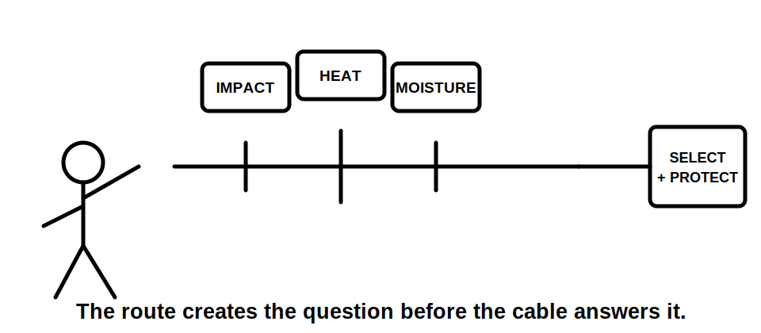
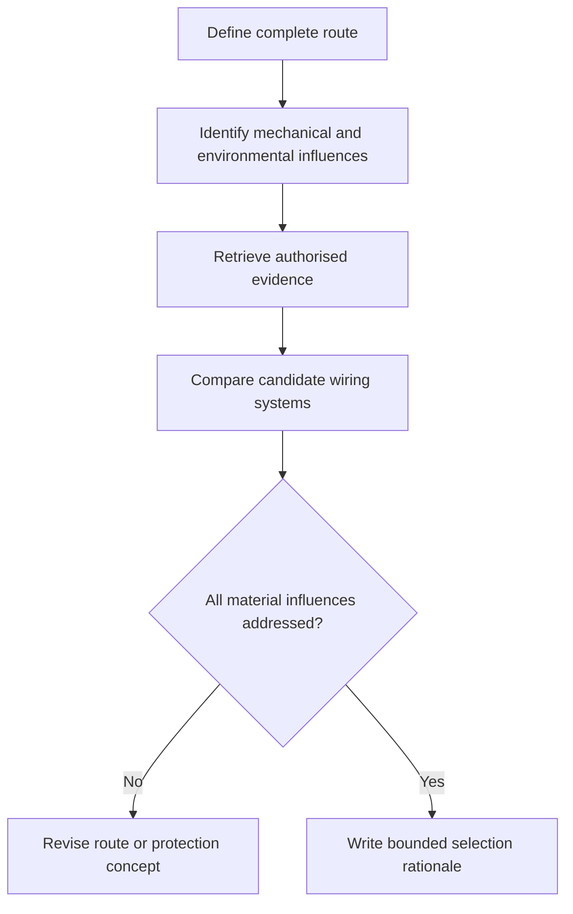

# Day 43 — Wiring-System Selection and Mechanical Protection

> **Scope boundary:** This module teaches selection reasoning, not field installation. Exact permitted systems, protection methods, locations, depths, supports, segregation and construction details require current authorised sources and qualified review.

## 1. Outcome and entry check

By the end, the learner can define a route, identify environmental and mechanical influences, compare wiring-system concepts, request missing evidence and write a bounded selection rationale.

### Entry check

List four route conditions that could change the suitability of an otherwise adequate conductor.

## 2. Why it matters

A conductor is not selected in isolation. Its route can introduce impact, abrasion, heat, moisture, movement, chemical exposure, access and future-work risks. Mechanical protection must respond to the actual exposure rather than being added as a generic afterthought.

## 3. Core concepts and terminology

- **Wiring system:** the conductors, containment, support and associated protection considered together.
- **Route envelope:** the full path and surrounding conditions relevant to selection.
- **Mechanical influence:** impact, crushing, abrasion, penetration, movement or strain exposure.
- **Environmental influence:** heat, moisture, corrosion, contamination, sunlight or other external condition.
- **Protection concept:** a paper-level proposal for reducing an identified exposure.
- **Route evidence:** drawings, photographs, site information and authorised source material supporting the route description.

## 4. Rule-finding workflow

Use **R-O-U-T-E**:

1. **R — Record** the complete route and boundaries.
2. **O — Observe** mechanical and environmental influences.
3. **U — Use** current authorised and manufacturer evidence.
4. **T — Test** candidate systems against every identified influence.
5. **E — Explain** the bounded selection and unresolved items.

The diagram shows that a candidate cannot be accepted while a material route influence remains unaddressed.

## 5. Visual model or worked example

A fictional circuit passes through a service area, near a warm surface and into a damp external zone. A single unqualified cable choice is rejected. The learner divides the route into condition segments, identifies evidence gaps, compares rerouting, containment and protection concepts, and records that final suitability remains unresolved pending authorised data.

## 6. Practical application

For a fictional workshop circuit:

1. draw the route envelope;
2. divide it into condition segments;
3. list mechanical and environmental influences;
4. compare three wiring-system concepts;
5. identify support, entry and future-work questions;
6. request missing evidence;
7. write one bounded recommendation and one alternative route;
8. explain what changes if the route passes through a hotter or more exposed area.

### Assessment rubric

Score 0–2 for route completeness, influence identification, evidence use, candidate comparison, change propagation and safety communication. **10/12** with no critical error indicates readiness for Day 44.

## 7. Common errors and safety checkpoint

Common errors include selecting by conductor size alone, reviewing only the endpoints, treating conduit as universal protection, ignoring support and entry conditions, and failing to reconsider the route after a condition changes.

Critical errors include inventing hidden route conditions, presenting unverified construction details as requirements or proposing unauthorised installation work.

## 8. Retrieval and next links

1. Define route envelope and wiring system.
2. Expand **R-O-U-T-E**.
3. Name four mechanical and four environmental influences.
4. Why must the route be segmented?
5. State three reasons a candidate remains unresolved.

- **Plan:** [Twelve-Week Capstone Learning Plan](../MASTER_PLAN.md)
- **Knowledge note:** [[12-Week Day 43 - Wiring-System Selection and Mechanical Protection]]
- **Previous:** [Day 42 — Week 6 Integrated Switching and Switchboard Checkpoint](day-42-week-6-integrated-switching-and-switchboard-checkpoint.md)
- **Next:** [Day 44 — Environmental Influences, Segregation and Support Concepts](day-44-environmental-influences-segregation-and-support-concepts.md)

This module remains `review-required`, `reference_check_required` and not `technically-reviewed`.
