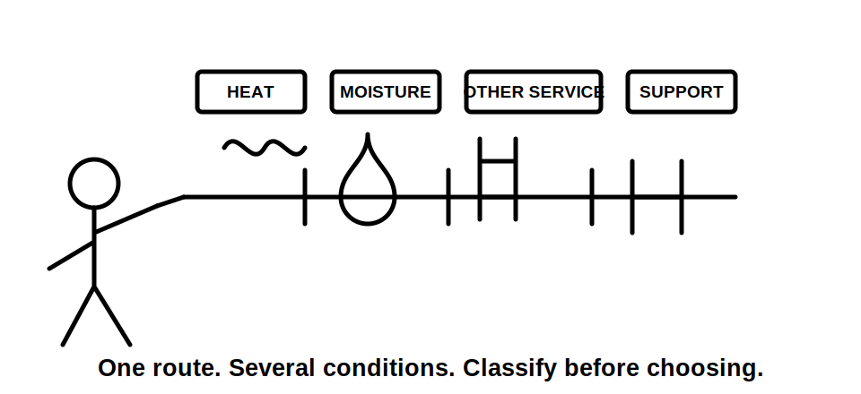
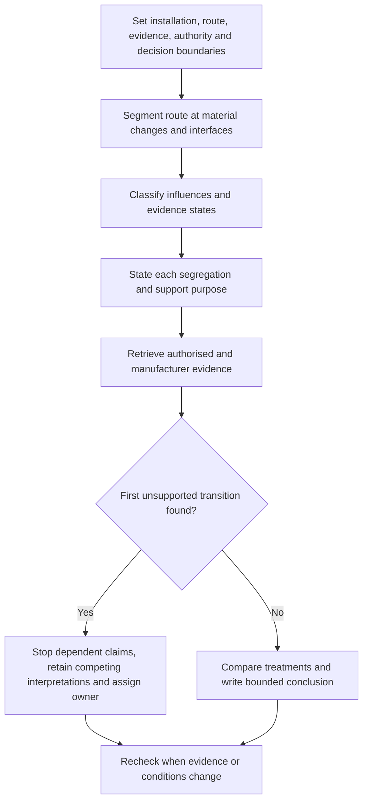
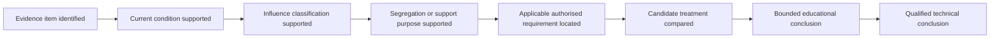

# Day 44 — Environmental Influences, Segregation and Support Concepts

> **Scope boundary:** This module develops paper-based classification, comparison and inspection reasoning. It does not specify exact segregation distances, support spacing, enclosure ratings, material limits or installation methods. Those matters require current authorised sources, applicable manufacturer instructions and qualified review.

## 1. Outcome and entry check

By the end, the learner can:

1. define the installation, route, evidence, authority and decision boundaries for a fictional scenario;
2. divide a route into condition segments and classify each material environmental or neighbouring-service influence;
3. distinguish segregation purpose, support purpose and product suitability without treating one as proof of another;
4. label evidence as a stated fact, derived fact, supported inference, assumption, contradiction or evidence gap;
5. stop dependent claims at the first unsupported transition and assign an evidence owner plus recheck trigger; and
6. transfer the analysis after at least two material conditions change, explaining which conclusions reopen and which remain supported.

### Entry check

Without consulting notes, examine a route passing through a warm plant room, a damp external wall and a shared service space. Record:

- the route segments you would create;
- one influence that belongs to each segment;
- one purpose that segregation might serve;
- one purpose that support might serve; and
- the earliest point at which missing evidence prevents a complete arrangement conclusion.

Rate confidence for each answer as **high**, **medium** or **low** before checking it. Confidence is not evidence: a confident unsupported answer remains unsupported, while a correct low-confidence answer identifies a retrieval need.

## 2. Why it matters

A conductor or wiring system may be electrically adequate yet unsuitable for its complete route. Heat, moisture, corrosion, contamination, sunlight, impact, movement, vibration, proximity to other services and maintenance access can change material suitability or the arrangement needed to preserve a boundary.

Segregation and support are not generic add-ons. **Segregation** must protect a stated safety, operational or performance purpose. **Support** must control position, movement, strain and transition loads for the actual wiring-system concept. Visible spacing does not prove suitable segregation, and a familiar support pattern does not prove suitability.

The assessment skill is therefore not recalling an isolated rule. It is building a traceable claim from current scenario evidence to an authorised requirement, identifying where the chain becomes unsupported and refusing to convert an unresolved paper exercise into a field instruction.

*Instructional caption: Segment the route first; then justify each segregation and support purpose against the evidence for that segment.*

## 3. Core concepts and terminology

- **Installation boundary:** the physical system and locations included in the scenario.
- **Route boundary:** the complete path, interfaces, entries, exits and transition points being analysed.
- **Evidence boundary:** the documents, observations and source material available for the decision.
- **Authority boundary:** the limit of what the learner may inspect, infer, recommend or perform.
- **Decision boundary:** the narrow question being answered, such as identifying evidence needs rather than approving construction.
- **Environmental influence:** an external condition capable of changing suitability, durability, safety or performance.
- **Condition segment:** a route part within which material influences are reasonably consistent.
- **Segregation:** deliberate separation or another authorised arrangement used to preserve a defined safety, operational or performance boundary.
- **Segregation purpose:** the specific boundary the proposed separation is intended to preserve; it must be stated rather than assumed.
- **Support system:** the means by which a wiring system is held, restrained and protected from damaging movement or strain.
- **Support purpose:** the position, load, movement, strain or transition condition that the support arrangement is intended to control.
- **Shared service space:** an area containing electrical wiring and one or more other services or systems.
- **Transition point:** a location where route direction, environment, enclosure, support, entry or wiring-system treatment changes.
- **Evidence provenance:** the source, date, described condition and applicability of a record.
- **Stated fact:** information directly provided by applicable scenario evidence.
- **Derived fact:** information obtained transparently from stated facts without adding an unverified premise.
- **Supported inference:** a conclusion reasonably drawn from identified evidence but not directly stated by it.
- **Assumption:** an unverified premise introduced to continue reasoning.
- **Contradiction:** two evidence items that cannot both describe the same relevant condition in the same way.
- **Evidence gap:** missing or unusable information that prevents a supported conclusion.
- **Competing interpretations:** plausible explanations retained until stronger evidence resolves them.
- **First unsupported transition:** the earliest step where a claim exceeds its evidence; dependent claims stop there.
- **Evidence owner:** the person, current document set, authorised source or reviewer expected to resolve a gap.
- **Recheck trigger:** new evidence or changed conditions requiring an earlier conclusion to reopen.
- **Bounded conclusion:** a result limited to the evidence, scenario, authority and unresolved constraints.

## 4. Rule-finding workflow

Use **S-E-P-A-R-E**:

1. **S — Set boundaries and segment.** State the installation, route, evidence, authority and decision boundaries. Divide the route where material conditions or interfaces change.
2. **E — Examine evidence and influences.** Classify heat, moisture, corrosion, contamination, sunlight, movement, impact, neighbouring services, access and future maintenance. Record provenance and contradictions.
3. **P — Preserve stated purposes.** For each proposed segregation or support feature, state the boundary or condition it is intended to preserve or control.
4. **A — Assess candidates and transitions.** Compare route treatments at supports, entries, exits, bends, changes of environment and shared spaces. Do not treat one product feature as a universal solution.
5. **R — Retrieve authorised evidence.** Locate current authorised requirements and applicable manufacturer instructions. Mark exact values, methods and exceptions `reference_check_required` until verified.
6. **E — Explain and escalate.** Write the evidence chain, stop at the first unsupported transition, retain competing interpretations, assign evidence owners and recheck triggers, and give only a bounded conclusion.

The diagram shows that route treatment follows boundary setting, segmentation, evidence classification and purpose definition. An unresolved earlier step prevents later suitability or acceptance claims.

### Claim ladder

Each rung requires its own support. This module may reach a bounded educational conclusion. It cannot independently establish the final rung, which requires current authorised sources, complete installation evidence and qualified technical review.

## 5. Visual model or worked example

### Fictional mixed-use route dossier

A route leaves an indoor distribution area, crosses a warm service corridor, rises through a shared services shaft and terminates outdoors.

Available records state:

- drawing revision C shows the route inside a dedicated electrical zone;
- a later maintenance sketch shows part of the route moved beside communications equipment;
- an undated photograph shows additional pipework but does not identify the photographed level;
- an equipment schedule identifies a product family but not the installed variant;
- a maintenance note reports intermittent vibration near a fan assembly;
- the outdoor termination location is stated, but current sunlight, moisture and entry conditions are not documented.

The learner records four initial condition segments but does not assume they are complete. Two competing interpretations are retained for the shared shaft:

1. revision C still represents the current arrangement and the sketch was only proposed; or
2. the route was altered and the current separation and support arrangement differs from the drawing.

The first unsupported transition occurs when the learner tries to classify the current shared-space arrangement without evidence establishing which record describes the installed condition. Therefore later claims about segregation suitability, support suitability and whole-route acceptance stop. The evidence owner is the current controlled drawing set or an authorised person able to establish current condition. The recheck trigger is receipt of verified current-route evidence.

### Worked-example fading

For a second fictional route, complete only these prompts:

1. mark every material condition or interface change;
2. classify each evidence item and record its provenance;
3. state the purpose of each proposed segregation boundary and support feature;
4. identify the first unsupported transition;
5. assign an evidence owner and recheck trigger; and
6. write one supported statement, one competing interpretation and one bounded unresolved statement.

## 6. Practical application

Prepare an evidence-controlled route review for a fictional mixed-use building:

1. draw the complete route and state all five boundaries;
2. divide it into condition segments;
3. classify environmental, mechanical, neighbouring-service, access and maintenance influences;
4. classify each evidence item as stated fact, derived fact, supported inference, assumption, contradiction or evidence gap;
5. state the purpose of each proposed segregation and support treatment;
6. compare two route treatments and one rerouting option without inventing exact construction details;
7. identify the first unsupported transition and stop dependent claims;
8. assign an evidence owner and recheck trigger to every unresolved blocker; and
9. repeat the analysis after at least two material changes, such as direct sunlight being added and vibration evidence being withdrawn. Explain which earlier conclusions reopen and which remain supported.

### Assessment evidence

Assess each criterion independently:

- **secure:** the response is accurate within the evidence boundary, explains its reasoning, exposes contradictions and remains valid under the transfer changes;
- **developing:** the method is substantially correct but one or more explanations, evidence links or change effects require repair;
- **unsupported:** a conclusion exceeds the available evidence or depends on an unverified premise; and
- **`stop-required`:** the learner must stop because the authority boundary, current condition or safety-critical evidence is unresolved.

These are educational planning states, not official assessment grades, competency decisions, defect classifications, technical approvals or legal conclusions. There is no aggregate score or unofficial pass threshold.

Readiness for Day 45 requires no blocking condition and a clear remediation action for every criterion not yet secure.

## 7. Common errors and safety checkpoint

Common errors include:

- treating the route as one uniform environment;
- treating all damp, hot or shared spaces as equivalent;
- assuming visible spacing automatically proves suitable segregation;
- selecting support by habit without product, route or transition evidence;
- overlooking entries, exits, bends and changes of enclosure;
- treating a product label as proof of suitability for every influence;
- hiding contradictory records instead of retaining competing interpretations;
- continuing a claim after the first unsupported transition; and
- changing one scenario condition without reopening dependent conclusions.

### Blocking conditions

Secure readiness is blocked by any of the following:

- invented segregation distances, support intervals, enclosure ratings, material limits or construction methods;
- an unsupported claim about current route condition;
- a whole-route suitability or acceptance claim while any material segment remains unresolved;
- a proposed treatment with no stated segregation or support purpose;
- concealed contradictions or unlabelled assumptions;
- missing evidence owners or recheck triggers for blockers;
- transfer using fewer than two material changes or failing to reopen affected conclusions; or
- any unauthorised approach, opening, installation, alteration, measurement, testing, energisation, commissioning, certification or field verification.

The module authorises none of those practical activities. Exact requirements remain `reference_check_required` and must be verified against current authorised sources, applicable manufacturer information and qualified technical review.

## 8. Retrieval and next links

1. Define condition segment, segregation purpose, support purpose and transition point.
2. Expand **S-E-P-A-R-E**.
3. Name the six evidence classifications used in this module.
4. What is the first unsupported transition, and what happens to dependent claims?
5. Why does visible spacing not prove suitable segregation?
6. What must be recorded for an unresolved evidence gap?
7. Describe two material changes that would force route conclusions to reopen.

- **Plan:** [Twelve-Week Capstone Learning Plan](../MASTER_PLAN.md)
- **Knowledge note:** [[12-Week Day 44 - Environmental Influences, Segregation and Support Concepts]]
- **Previous:** [Day 43 — Wiring-System Selection and Mechanical Protection](day-43-wiring-system-selection-and-mechanical-protection.md)
- **Next:** [Day 45 — Consumer Mains, Submains and Final Subcircuits](day-45-consumer-mains-submains-and-final-subcircuits.md)

This module remains `review-required`, `reference_check_required`, safety-critical and not `technically-reviewed`.