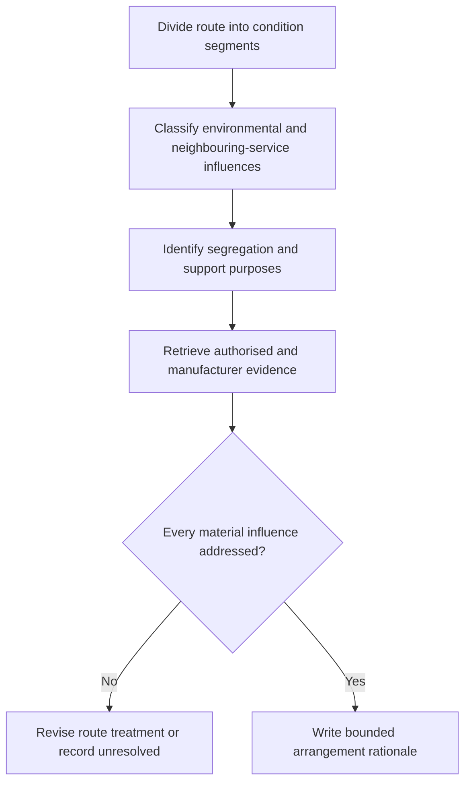

# Day 44 — Environmental Influences, Segregation and Support Concepts

> **Scope boundary:** This module develops paper-based selection and inspection reasoning. Exact segregation distances, support spacing, enclosure ratings, material limits and installation methods require current authorised sources, manufacturer data and qualified review.

## 1. Outcome and entry check

By the end, the learner can classify environmental influences, explain the purpose of segregation and support, identify evidence gaps, compare route treatments and write a bounded installation-planning conclusion.

### Entry check

For a route passing through a warm plant room, a damp external wall and a shared service space, list the conditions that must be classified before selecting an arrangement.

## 2. Why it matters

A wiring system may be electrically adequate yet unsuitable because heat, moisture, corrosion, contamination, sunlight, movement, proximity to other services or inadequate support changes its operating conditions. Segregation and support are not cosmetic details: they preserve intended separation, reduce mechanical stress and help maintain the installation over time.

## 3. Core concepts and terminology

- **Environmental influence:** an external condition capable of changing suitability, durability or performance.
- **Segregation:** deliberate separation used to preserve a safety, operational or performance boundary.
- **Support system:** the means by which a wiring system is held, restrained and protected from damaging movement or strain.
- **Shared service space:** an area containing electrical wiring and one or more other services or systems.
- **Condition segment:** a part of the route with materially similar influences.
- **Evidence gap:** missing information that prevents a supported conclusion.

## 4. Rule-finding workflow

Use **S-E-P-A-R-E**:

1. **S — Segment** the route by changing conditions.
2. **E — Examine** heat, moisture, corrosion, contamination, sunlight, movement and neighbouring services.
3. **P — Preserve** required safety and functional boundaries.
4. **A — Assess** support, restraint, entry and transition points.
5. **R — Retrieve** current authorised and manufacturer evidence.
6. **E — Explain** the selected treatment and unresolved evidence.

The diagram shows that segregation and support decisions follow influence classification; they are not generic add-ons.

## 5. Visual model or worked example

A fictional cable route leaves an indoor distribution area, crosses a warm service corridor, shares a riser with communications equipment and terminates outdoors. The learner divides the route into four segments. Heat, moisture, sunlight, service interaction, transitions and support are considered separately. The learner rejects the statement “use the same method throughout” because the evidence does not show that one treatment addresses every segment.

### Faded example

For a second route, complete only the following:

1. mark condition changes;
2. state the purpose of each proposed segregation boundary;
3. identify two support questions;
4. request the missing authorised evidence;
5. write one supported statement and one unresolved statement.

## 6. Practical application

For a fictional mixed-use building route:

1. draw the full route and divide it into condition segments;
2. classify environmental and neighbouring-service influences;
3. identify where segregation serves safety, interference control or maintainability;
4. identify support, restraint, entry and transition questions;
5. compare two route treatments and one rerouting option;
6. record manufacturer and authorised-source evidence required;
7. explain how the conclusion changes if the route becomes exposed to direct sunlight or vibration.

### Assessment rubric

Score 0–2 for segmentation, influence classification, boundary purpose, support reasoning, evidence discipline and change propagation. **10/12** with no critical error indicates readiness for Day 45. This is an educational threshold, not an official assessment rule.

## 7. Common errors and safety checkpoint

Common errors include treating all damp areas alike, assuming physical separation automatically provides suitable segregation, ignoring transition points, specifying support by habit, and overlooking movement or future maintenance.

Critical errors include inventing exact distances or support intervals, presenting unverified enclosure or material claims as authoritative, or proposing installation work outside the learner's authority.

This module authorises no installation, opening, alteration, testing, measurement, energisation or verification.

## 8. Retrieval and next links

1. Define environmental influence, segregation and support system.
2. Expand **S-E-P-A-R-E**.
3. Why must a route be segmented?
4. Name four purposes or consequences associated with segregation and support.
5. What evidence prevents a supported conclusion?

- **Plan:** [Twelve-Week Capstone Learning Plan](../MASTER_PLAN.md)
- **Knowledge note:** [[12-Week Day 44 - Environmental Influences, Segregation and Support Concepts]]
- **Previous:** [Day 43 — Wiring-System Selection and Mechanical Protection](day-43-wiring-system-selection-and-mechanical-protection.md)
- **Next:** [Day 45 — Consumer Mains, Submains and Final Subcircuits](day-45-consumer-mains-submains-and-final-subcircuits.md)

This module remains `review-required`, `reference_check_required` and not `technically-reviewed`.
