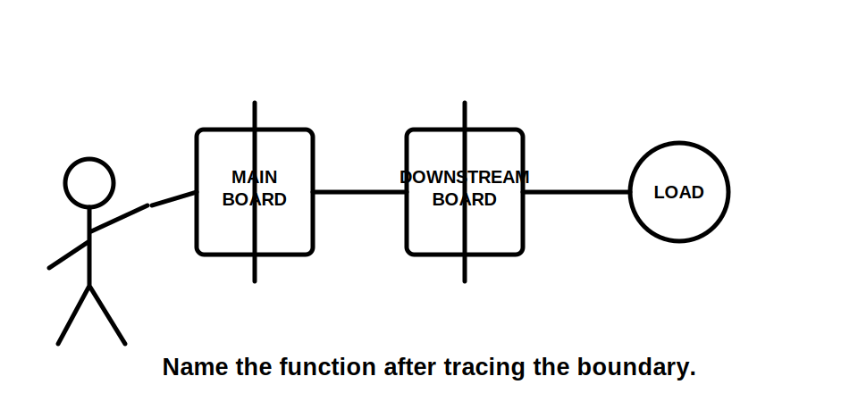
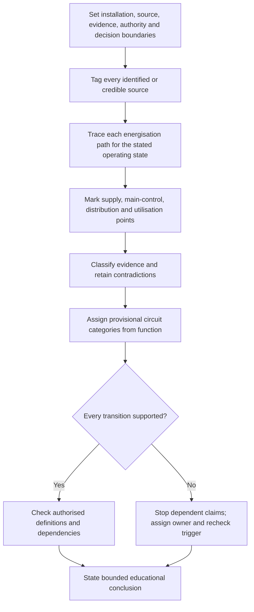
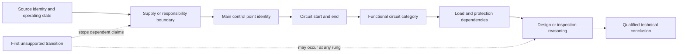

# Day 45 — Consumer Mains, Submains and Final Subcircuits

> **Scope boundary:** This module develops evidence-controlled paper reasoning about source-to-load circuit boundaries. Exact legal and technical definitions, responsibility boundaries, demand methods, conductor requirements, protection arrangements, identification, installation details and official assessment expectations require current authorised sources and qualified review.

## 1. Outcome and entry check

By the end, the learner can:

1. define the installation, source, evidence, authority and decision boundaries for a fictional distribution problem;
2. trace each energisation path from identified source to current-using equipment without classifying a circuit from appearance alone;
3. distinguish a supply boundary, main control point, downstream distribution point and utilisation point in an original diagram;
4. assign consumer-mains, submain or final-subcircuit status provisionally, with the evidence and assumptions supporting each boundary;
5. stop dependent design, inspection and acceptance claims at the first unsupported transition; and
6. rework the classification and dependency map after at least two material scenario changes.

### Entry check

Without notes, sketch one ordinary source-to-load path containing a supply boundary, a main switchboard, a downstream board and one item of current-using equipment. Mark:

- every source and possible energisation path;
- each point where responsibility, control or distribution may change;
- the start and end of every proposed circuit category;
- one protection dependency for each section; and
- every item that is assumed, contradictory or unknown.

Before checking the module, rate confidence in each boundary as **guessing**, **unsure**, **reasonably confident** or **certain**. Confidence is recorded separately from correctness: a correct guess is not secure evidence, and confident fluency does not prove the boundary.

## 2. Why it matters

Circuit categories are not decorative names. They determine which load set, source condition, protection relationship, conductor duty, isolation boundary, identification requirement and evidence set belongs to a design or inspection question. A learner can produce tidy arithmetic and still reason from the wrong circuit boundary.

Alternate, multiple or embedded sources make this more demanding. A downstream board may have more than one possible energisation path, and a drawing, schedule or label may describe only one operating state. Classification therefore begins with source and function mapping, not conductor size, route length or a familiar label.

*Caption: Trace the proven source, control, distribution and utilisation boundaries before assigning a circuit category.*

## 3. Core concepts and terminology

- **Consumer mains:** a provisional learning label for the supply conductors within the consumer installation boundary connecting the relevant supply point to the main switchboard or equivalent main control point. Exact jurisdictional and network wording must be verified.
- **Submain:** a distribution circuit whose function is to supply another switchboard or distribution point rather than directly supplying the final utilisation points.
- **Final subcircuit:** a circuit supplying one or more points of utilisation without another distribution board intervening.
- **Source:** an identified means by which the installation or part of it may be energised.
- **Operating state:** the documented configuration of sources, switching and connected sections for the case being analysed.
- **Energisation path:** the complete route by which a source can supply the item or section under the stated operating state.
- **Supply boundary:** the documented point at which the relevant supply, ownership or responsibility begins for the analysis.
- **Main control point:** the principal switching or control location associated with the relevant supply case; exact technical status requires authorised evidence.
- **Distribution point:** a board or assembly from which downstream circuits are supplied.
- **Utilisation point:** the point at which electrical energy is made available to, or used by, current-using equipment.
- **Circuit boundary:** the stated start and end points used for one design, inspection or reasoning task.
- **Load boundary:** the equipment, utilisation points and operating case included in the circuit's demand or design case.
- **Protection dependency:** an upstream or downstream relationship that can affect conductor protection, fault response, coordination or the validity of a conclusion.
- **Evidence provenance:** the source, revision, date, described condition and applicability of a document, image, label or statement.
- **Competing interpretations:** two or more plausible boundary explanations retained until stronger evidence resolves them.
- **First unsupported transition:** the earliest point where a claim goes beyond the available evidence; dependent claims stop at that point.
- **Evidence owner:** the person, current document set, authorised source or qualified reviewer expected to resolve an evidence gap.
- **Recheck trigger:** new evidence or a changed condition that requires an earlier classification or dependent conclusion to be reopened.
- **Bounded conclusion:** a conclusion limited to the stated installation, operating state, evidence, authority and unresolved constraints.

### Evidence states

Classify every material statement as one of the following:

- **Stated fact:** directly recorded in the supplied evidence.
- **Derived fact:** follows transparently from stated facts without adding an unverified premise.
- **Supported inference:** the best current explanation, but still dependent on stated evidence and scope.
- **Assumption:** used provisionally because required evidence is absent.
- **Contradiction:** two items cannot both describe the same condition in the same operating state.
- **Evidence gap:** information needed before the claim can be supported.

A label may be useful evidence, but it does not prove the point of supply, all alternate sources, the present operating state or the complete circuit boundary by itself.

## 4. Rule-finding workflow

Use **T-R-A-C-E**:

1. **T — Take boundaries and tag sources.** State installation, source, evidence, authority and decision boundaries. Tag every normal, alternate, standby, embedded or backfeed-capable source shown or credibly indicated.
2. **R — Record paths and provenance.** Trace each possible energisation path, circuit start and circuit end. Record document revision, date, described operating state and contradictions.
3. **A — Assign provisional functions.** Classify main control points, distribution points, utilisation points and provisional circuit categories from function—not size, distance, position or label alone.
4. **C — Check authorised evidence and dependencies.** Locate current definitions and applicable requirements in authorised standards, network or regulator material, manufacturer information and RTO procedures. Check demand, protection, source and downstream dependencies without copying restricted content.
5. **E — Explain, escalate and reopen.** Explain the evidence chain, stop at the first unsupported transition, preserve competing interpretations, assign evidence owners and recheck triggers, and reopen every affected conclusion when evidence or operating conditions change.

The workflow separates mapping from technical acceptance. A provisional category may support the next evidence request, but it does not establish conductor suitability, protection adequacy, isolation effectiveness or compliance.

This claim ladder is deliberately ordered. Strong evidence on a later rung cannot compensate for an unsupported earlier boundary. For example, a clear protective-device photograph cannot prove which source and circuit boundary it protects if the board identity or operating state remains unresolved.

## 5. Visual model or worked example

### Fictional mixed-use site dossier

A fictional site contains:

- a service record describing supply to **Main Board A**;
- a current single-line drawing showing Main Board A supplying **Workshop Board B**;
- an older schedule calling the same feeder “workshop final circuit”;
- a recent photograph showing Board B with lighting, socket-outlet and fixed-equipment outgoing circuits;
- an inverter diagram showing a possible supply connection at Board B, but no confirmed commissioning record;
- a maintenance note saying the inverter was “isolated pending replacement”; and
- a handwritten label on Board B reading “MAIN SWITCH”, with no stated source or operating condition.

The evidence supports that Board B is a distribution point in at least one operating state. It does not yet prove whether the inverter can energise Board B now, whether the handwritten label identifies a main switch for every source, or whether the older schedule describes the current arrangement.

### Worked reasoning

1. **Set boundaries:** this is a paper exercise using only the dossier. No enclosure access, testing or field confirmation is authorised.
2. **Tag sources:** the normal supply is stated. The inverter is a credible alternate-source possibility, not a confirmed present source.
3. **Trace paths:** Main Board A to Board B is one documented path. The inverter-to-Board-B path remains a supported possibility with an evidence gap about current status.
4. **Classify functions:** Board B distributes to downstream utilisation circuits. Therefore, the Main Board A–Board B circuit is provisionally treated as a submain in the documented normal-supply case. Board B outgoing circuits directly serving utilisation points are provisionally final subcircuits.
5. **Preserve contradiction:** the older “workshop final circuit” schedule conflicts with the current functional map and remains visible rather than being silently discarded.
6. **Stop at the unsupported transition:** supply-side consumer-mains status, inverter operating state, all-source switching status and technical acceptance remain unresolved.
7. **Assign owners and triggers:** current approved drawings or a qualified reviewer owns the arrangement confirmation; inverter commissioning/decommissioning records own the alternate-source status. Receipt of either reopens the source and protection maps.

### Faded example

For a second diagram containing a normal source, generator inlet, three boards and one load bank, complete only these prompts:

- The stated operating state is ___ because ___.
- The first circuit starts at ___ and ends at ___.
- Its provisional function is ___; the evidence is ___.
- The earliest contradiction or gap is ___.
- Claims that must stop are ___.
- The evidence owner is ___ and the recheck trigger is ___.

Do not calculate demand or select equipment. The assessment target is controlled boundary reasoning.

## 6. Practical application

Prepare a one-page distribution evidence map for a fictional small commercial installation.

### Required output

1. State the five boundaries: installation, source, evidence, authority and decision.
2. Draw a source-to-load single-line sketch with every identified or credible source and operating state.
3. Mark the supply boundary, main control point, downstream distribution points and utilisation points.
4. Define every circuit's start, end and load boundary.
5. Assign a provisional category from function and classify each supporting statement by evidence state.
6. Map at least one protection dependency and one source dependency for every distribution circuit.
7. Record contradictions and at least two competing interpretations where the evidence permits them.
8. Mark the first unsupported transition and list every dependent conclusion that must stop.
9. Assign an evidence owner and recheck trigger for each unresolved blocker.
10. State one bounded educational conclusion that does not imply technical acceptance.

### Changed-condition transfer

Rework the map after **at least two** material changes, such as:

- a verified inverter commissioning record confirms Board B can be energised independently;
- a current approved drawing shows the generator inlet was removed;
- a new board is inserted between Board B and a load group;
- an outgoing circuit is changed to supply another distribution board; or
- a document revision proves that the assumed supply boundary belongs to a different installation section.

For each change, identify:

- classifications that reopen;
- dependencies and conclusions that reopen;
- conclusions that remain unaffected and why; and
- new evidence owners or recheck triggers.

### Criterion-level readiness record

Record each criterion independently:

- **Secure:** correct and complete within the stated evidence and authority boundary, with contradictions and dependencies controlled.
- **Developing:** substantially sound but requiring a limited, named repair.
- **Unsupported:** the learner cannot yet support the claim or transfer it to the changed case.
- **`stop-required`:** the response crosses a safety, evidence or authority boundary and must not continue until corrected.

Assess boundary control, source mapping, functional classification, evidence-state discipline, contradiction handling, dependency mapping, first-unsupported-transition control, evidence ownership, change propagation and safety communication separately. These are educational planning states, not official grades, competency decisions, defect classifications or technical approvals. No aggregate score or unofficial pass threshold applies.

## 7. Common errors and safety checkpoint

### Common errors

- classifying from conductor size, length, route or label instead of function and boundaries;
- assuming every feeder to a detached building is automatically a submain without tracing the actual distribution function;
- treating a downstream board as supplied from only one source because one drawing shows one operating state;
- using “main switch” wording as proof that every source is controlled;
- applying final-subcircuit reasoning to a circuit that supplies another distribution point;
- resolving contradictory records by choosing the most convenient document;
- allowing a later calculation or photograph to compensate for an unsupported source or boundary claim;
- failing to reopen protection, isolation or demand reasoning after a source or distribution point changes; and
- reporting a provisional category as a compliance conclusion.

### Blocking conditions

A secure readiness decision is blocked by any of the following:

- an invented point of supply, source, circuit endpoint or operating state;
- omission of an identified or credible alternate energisation path;
- classification without defined start and end points;
- concealed assumptions, contradictions or competing interpretations;
- dependent conclusions continuing beyond the first unsupported transition;
- unresolved blockers without evidence owners and recheck triggers;
- transfer using fewer than two material changes;
- incomplete reopening of affected source, load, protection, isolation or classification claims; or
- any implication of authority to approach, open, isolate, test, measure, alter, energise, commission, certify or verify an installation.

Strong performance elsewhere cannot offset a blocking condition.

### Safety checkpoint

This module authorises no approach to electrical equipment, opening, isolation, testing, measurement, installation, alteration, energisation, commissioning, certification or field verification. Exact definitions, source and responsibility boundaries, demand rules, conductor requirements, protection arrangements, identification, installation methods, exceptions and official assessment expectations remain `reference_check_required` and require current authorised sources and qualified review.

## 8. Retrieval and next links

Without notes:

1. Define source, operating state, energisation path, distribution point and utilisation point.
2. Distinguish consumer-mains, submain and final-subcircuit reasoning without relying on conductor appearance.
3. Expand **T-R-A-C-E**.
4. Name the six evidence states.
5. Explain why a board label cannot prove every source or boundary.
6. Define the first unsupported transition and explain its effect on dependent claims.
7. State one evidence owner and one recheck trigger for an unresolved alternate source.
8. Explain what must reopen when a final subcircuit is changed to supply another board.
9. Name the four educational criterion states and one blocking condition.
10. Explain why no aggregate readiness score is used.

- **Plan:** [Twelve-Week Capstone Learning Plan](../MASTER_PLAN.md)
- **Knowledge note:** [[12-Week Day 45 - Consumer Mains, Submains and Final Subcircuits]]
- **Previous:** [Day 44 — Environmental Influences, Segregation and Support Concepts](day-44-environmental-influences-segregation-and-support-concepts.md)
- **Next:** [Day 46 — Fixed Appliances and Local Isolation Reasoning](day-46-fixed-appliances-and-local-isolation-reasoning.md)

This module remains `review-required`, `reference_check_required`, safety-critical and not `technically-reviewed`.
