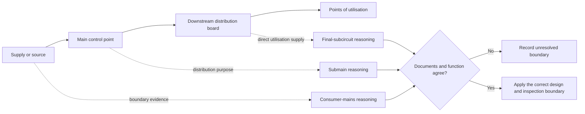

# Day 45 — Consumer Mains, Submains and Final Subcircuits

> **Scope boundary:** This module teaches system-boundary and evidence reasoning. Exact definitions, demand methods, conductor requirements, protection arrangements, identification and installation details require current authorised sources and qualified review.

## 1. Outcome and entry check

By the end, the learner can distinguish consumer mains, submains and final subcircuits in an original installation diagram; identify their source, destination, load boundary and protective relationship; and explain what evidence is needed before making a design or inspection claim.

### Entry check

Sketch a supply path from the point of supply to one item of current-using equipment. Mark where you think each circuit category begins and ends, then label every uncertain boundary.

## 2. Why it matters

Circuit categories organise responsibility, protection, demand, conductor selection, isolation, identification and documentation. Misclassifying a circuit can cause the learner to apply the wrong reasoning boundary even when individual calculations appear correct.

## 3. Core concepts and terminology

- **Consumer mains:** the supply conductors within the consumer installation boundary that connect the relevant supply point to the main switchboard or equivalent main control point; exact jurisdictional wording must be verified.
- **Submain:** a distribution circuit supplying another switchboard or distribution point rather than directly supplying the final current-using equipment.
- **Final subcircuit:** a circuit that supplies one or more points of utilisation without another distribution board intervening.
- **Supply boundary:** the documented point at which the relevant supply or responsibility begins for the analysis.
- **Distribution point:** a board or assembly from which downstream circuits are supplied.
- **Load boundary:** the equipment or group of utilisation points included in the circuit's design case.

## 4. Rule-finding workflow

Use **T-R-A-C-E**:

1. **T — Tag** every source, switchboard, distribution point and load.
2. **R — Record** where each circuit starts and ends.
3. **A — Assign** a provisional category from function, not appearance.
4. **C — Check** current authorised definitions, drawings, schedules and protection evidence.
5. **E — Explain** the category, dependencies and unresolved boundaries.

The diagram is a functional map, not an authoritative construction arrangement. Circuit identity follows documented function and boundaries.

## 5. Visual model or worked example

A fictional site has a main board, a detached-workshop board and lighting, socket-outlet and fixed-equipment circuits. The learner first labels conductors by size and location, then corrects the method: the source and destination functions are traced. The circuit from the main board to the workshop board is treated as a distribution circuit, while circuits leaving the workshop board and directly supplying utilisation points are treated as final subcircuits. The supply-side category remains unresolved until the supplied boundary documents are checked.

### Faded example

Given a diagram with one alternate source and two boards:

1. mark all sources and operating states;
2. draw each circuit boundary;
3. assign provisional categories;
4. identify one protection dependency for each circuit;
5. state which document would confirm each uncertain boundary.

## 6. Practical application

For a fictional small commercial installation:

1. produce a source-to-load single-line sketch;
2. identify the main control point and every downstream distribution point;
3. classify each circuit provisionally;
4. list the load group and operating case associated with each circuit;
5. map upstream and downstream protection dependencies;
6. identify schedule, drawing, label and authorised-source evidence required;
7. explain how adding an inverter-fed distribution board changes the classification and source analysis.

### Assessment rubric

Score 0–2 for source mapping, boundary accuracy, functional classification, protection dependency, evidence discipline and changed-source reasoning. **10/12** with no critical error indicates readiness for Day 46. This is an educational threshold only.

## 7. Common errors and safety checkpoint

Common errors include naming a circuit by conductor size, assuming every long circuit is a submain, ignoring alternate sources, treating a board label as complete evidence and applying final-subcircuit reasoning to a distribution circuit.

Critical errors include inventing the point of supply, omitting an identified source, claiming a circuit category without a defined start and end, or implying practical access or alteration authority.

This module authorises no opening, isolation, testing, measurement, installation, alteration, energisation or verification.

## 8. Retrieval and next links

1. Define consumer mains, submain, final subcircuit and distribution point.
2. Expand **T-R-A-C-E**.
3. Why is conductor size insufficient for classification?
4. What changes when a downstream board has another source?
5. Name four evidence items used to confirm boundaries.

- **Plan:** [Twelve-Week Capstone Learning Plan](../MASTER_PLAN.md)
- **Knowledge note:** [[12-Week Day 45 - Consumer Mains, Submains and Final Subcircuits]]
- **Previous:** [Day 44 — Environmental Influences, Segregation and Support Concepts](day-44-environmental-influences-segregation-and-support-concepts.md)
- **Next:** [Day 46 — Fixed Appliances and Local Isolation Reasoning](day-46-fixed-appliances-and-local-isolation-reasoning.md)

This module remains `review-required`, `reference_check_required` and not `technically-reviewed`.
