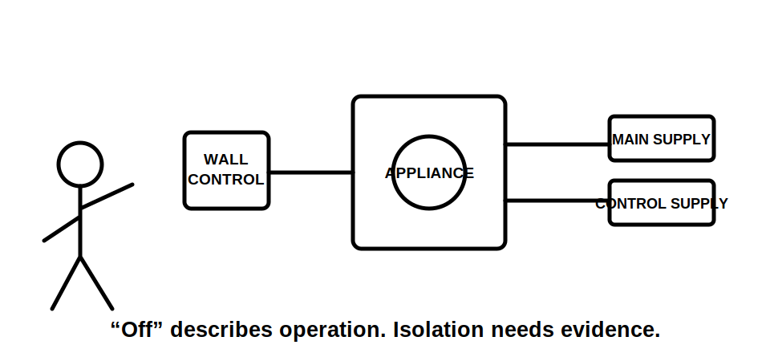
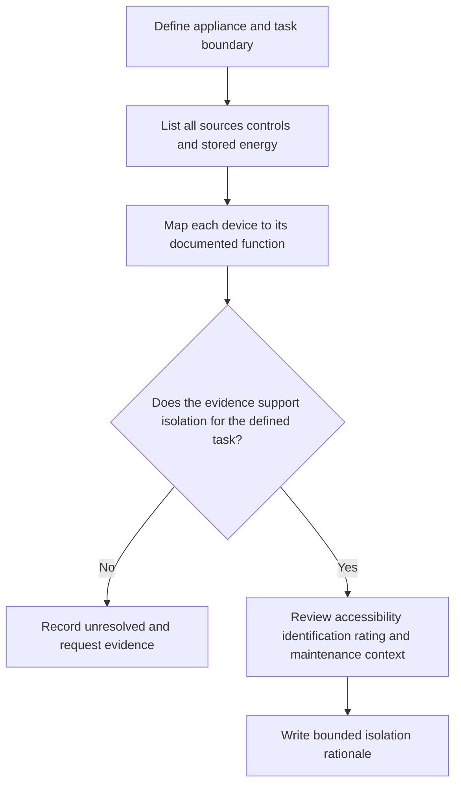

# Day 46 — Fixed Appliances and Local Isolation Reasoning

> **Scope boundary:** This module teaches function, source and evidence reasoning for fixed equipment. Exact isolation, switching, location, accessibility, rating, connection and installation requirements require current authorised sources, manufacturer instructions and qualified review.

## 1. Outcome and entry check

By the end, the learner can define a fixed appliance's supply and energy boundaries, distinguish functional control from isolation, identify local-access and identification questions, and write a bounded isolation rationale without claiming field verification.

### Entry check

For a fixed water-heating appliance, list every energy source or operating condition that could remain after its normal control is switched off.

## 2. Why it matters

A normal control may stop operation without creating a safe isolation state. Fixed appliances can have remote controls, stored energy, multiple supplies, inaccessible connection points or isolation devices that are difficult to identify. Reliable reasoning begins with the equipment boundary and every source, not with the nearest switch.

## 3. Core concepts and terminology

- **Fixed appliance:** current-using equipment intended to remain secured or connected in a fixed location; exact definitions require authorised verification.
- **Functional control:** a means used to start, stop or regulate normal operation.
- **Isolation function:** a means intended to separate defined sources or conductors for a defined purpose.
- **Local isolation:** an isolation function positioned or arranged for the equipment task being considered; exact location and accessibility requirements must be checked.
- **Energy boundary:** every electrical or other stored-energy path capable of affecting the equipment or task.
- **Readily identifiable:** capable of being correctly associated with the intended equipment and function using the available evidence.

## 4. Rule-finding workflow

Use **A-P-P-L-Y**:

1. **A — Account** for every source, control path and stored-energy condition.
2. **P — Place** the appliance, connection and task boundaries on a sketch.
3. **P — Prove** the intended function of each switch or device from authorised evidence.
4. **L — Locate** accessibility, identification, rating and maintenance questions.
5. **Y — Yield** a bounded conclusion or stop with unresolved evidence.

The diagram separates normal control from documented isolation and prevents the nearest switch from being accepted by assumption.

## 5. Visual model or worked example

A fictional fixed fan has a wall controller, a board-mounted protective device and a separate control supply. The learner initially treats the wall controller as local isolation. Applying **A-P-P-L-Y** reveals that its documented function is normal control and that the control supply remains relevant. The learner records that isolation suitability is unresolved until the source map, device function, accessibility and manufacturer evidence are confirmed.

### Faded example

For a fictional cooking appliance with a remote enable input:

1. draw the appliance and task boundary;
2. list every source and control path;
3. label each device as documented control, documented isolation, assumed or unknown;
4. identify accessibility and identification evidence;
5. explain what changes if another supply is added.

## 6. Practical application

For a fictional fixed pump installation:

1. map supply, control and stored-energy boundaries;
2. identify the intended operating and maintenance tasks;
3. distinguish normal control, emergency action and isolation functions;
4. assess whether each device is correctly associated with the equipment;
5. identify accessibility, rating, environmental and maintenance questions;
6. request current drawings, labels, manufacturer instructions and authorised requirements;
7. write one described claim, one supported claim and one unresolved claim;
8. reopen the analysis after a remote-control circuit or alternate supply is disclosed.

### Assessment rubric

Score 0–2 for source completeness, boundary definition, function distinction, access and identity reasoning, evidence discipline and change propagation. **10/12** with no critical error indicates readiness for Day 47. This is an educational threshold only.

## 7. Common errors and safety checkpoint

Common errors include treating “off” as isolated, assuming proximity proves local suitability, ignoring control supplies or stored energy, using a protective device label as proof of isolation function and failing to consider maintenance access.

Critical errors include omitting a disclosed source, presenting an assumed device function as verified, proposing unauthorised isolation or testing, or claiming a safe state from paper evidence alone.

This module authorises no switching, isolation, opening, proving de-energised, testing, measurement, installation, alteration, repair, energisation or verification.

## 8. Retrieval and next links

1. Distinguish functional control from isolation.
2. Define appliance boundary and energy boundary.
3. Expand **A-P-P-L-Y**.
4. Why does proximity not prove local isolation suitability?
5. Name four evidence items needed for a bounded conclusion.

- **Plan:** [Twelve-Week Capstone Learning Plan](../MASTER_PLAN.md)
- **Knowledge note:** [[12-Week Day 46 - Fixed Appliances and Local Isolation Reasoning]]
- **Previous:** [Day 45 — Consumer Mains, Submains and Final Subcircuits](day-45-consumer-mains-submains-and-final-subcircuits.md)
- **Next:** Day 47 — Rest, Retrieval and Installation-Defect Correction

This module remains `review-required`, `reference_check_required` and not `technically-reviewed`.
