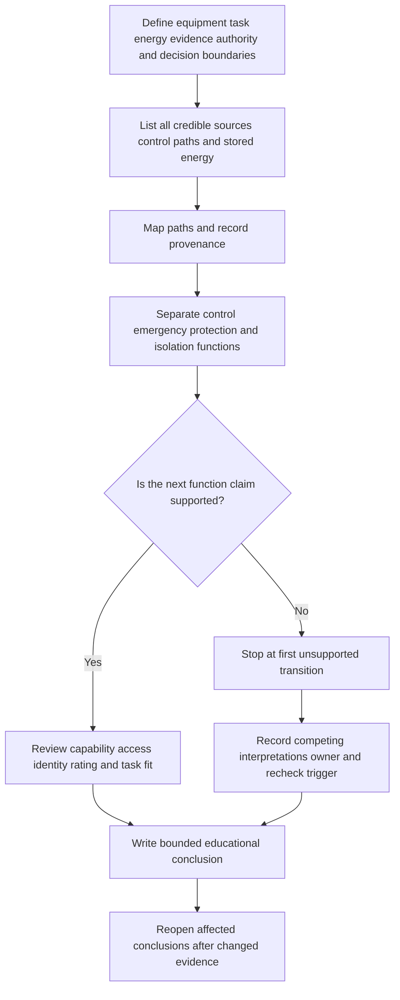
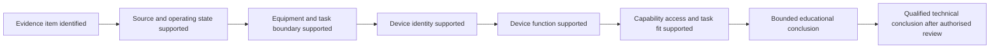

# Day 46 — Fixed Appliances and Local Isolation Reasoning

> **Scope boundary:** This module teaches evidence-controlled paper reasoning about fixed equipment, controls, sources and task-specific isolation. Exact definitions, switching and isolation requirements, device capabilities, locations, accessibility, ratings, connection methods, manufacturer requirements and official assessment expectations require current authorised sources and qualified review.

## 1. Outcome and entry check

By the end, the learner can:

1. define the equipment, task, energy, evidence, authority and decision boundaries for a fictional fixed-appliance scenario;
2. map every credible electrical source, control path and relevant stored-energy condition without treating “off” as proof of isolation;
3. distinguish functional control, emergency action, protection and isolation as separate functions;
4. classify device-function claims by evidence state and stop dependent conclusions at the first unsupported transition;
5. assign evidence owners and recheck triggers for unresolved source, access, identity and device-capability questions; and
6. rework the isolation rationale after at least two material scenario changes, explaining which conclusions reopen and which remain unaffected.

### Entry check

Without notes, consider a fictional fixed water-heating appliance. Record:

- the equipment and maintenance-task boundary;
- every credible electrical source, remote-control path and stored-energy condition;
- what the normal controller proves;
- what it does not prove; and
- your confidence as **guessing**, **unsure**, **reasonably confident** or **certain**.

Check the answer only after recording confidence. A correct guess is not secure evidence, and a high-confidence error requires explicit remediation.

## 2. Why it matters

A normal control may stop operation while one or more energy paths remain available. Fixed appliances may include remote enables, separate control supplies, alternate sources, automatic restart logic, stored energy, inaccessible connection points or devices whose labels do not establish their function. Reliable reasoning therefore begins with a defined task and complete source map, not with the nearest switch.

This distinction matters during design review, inspection planning, maintenance preparation and assessment explanation. It does **not** establish that equipment is de-energised or safe to approach.

*Caption: The nearby control stops normal operation, but the learner withholds an isolation claim until every source, function and task boundary is supported.*

## 3. Core concepts and terminology

- **Fixed appliance:** current-using equipment intended to remain secured or connected in a fixed location; the exact authorised definition must be verified.
- **Equipment boundary:** the equipment, associated controls and interfaces included in the analysis.
- **Task boundary:** the specific fictional operation, inspection or maintenance purpose being analysed. Different tasks can require different isolation reasoning.
- **Energy boundary:** every electrical source, control path or relevant stored-energy condition capable of affecting the equipment or task.
- **Source:** an identified means by which the equipment or an associated circuit may be energised.
- **Control path:** a signal or supply path that can command, enable or influence operation.
- **Stored energy:** energy retained after normal operation stops and capable of affecting the task; its exact treatment requires authorised procedures.
- **Functional control:** a means used to start, stop or regulate normal operation.
- **Emergency action:** an intended response to an abnormal or dangerous condition; it is not automatically an isolation function.
- **Protection function:** a function intended to respond to specified abnormal electrical conditions; a protective device is not automatically suitable for task isolation.
- **Isolation function:** a means intended to separate defined sources or conductors for a defined purpose.
- **Local isolation:** an isolation function positioned or arranged for the equipment task being considered; exact location, access and identification requirements require verification.
- **Device capability:** the supported functions and conditions for which a device is designed and rated.
- **Accessibility:** whether the relevant person can reach and operate or inspect a device under the defined conditions; exact requirements require authorised verification.
- **Identification:** evidence that associates a device with the correct equipment, source and function.
- **Provenance:** where an evidence item came from, its revision or date, and whether it applies to the current scenario.
- **Competing interpretations:** plausible explanations retained visibly until stronger evidence resolves them.
- **First unsupported transition:** the earliest point where a conclusion goes beyond its evidence. Dependent conclusions stop there.
- **Evidence owner:** the person, current document set, authorised source, manufacturer information or qualified reviewer expected to resolve a gap.
- **Recheck trigger:** new evidence or changed conditions requiring earlier conclusions to be reopened.
- **Bounded educational conclusion:** a paper-based statement limited to supported evidence and unresolved items; it is not proof of a safe state, compliance or technical approval.

Classify each material statement as:

- **stated fact** — directly given by the fictional dossier;
- **derived fact** — obtained transparently from supported facts;
- **supported inference** — a reasoned interpretation with an explicit evidence chain;
- **assumption** — used provisionally and labelled;
- **contradiction** — evidence items cannot both describe the same condition without resolution; or
- **evidence gap** — information required for the next claim is absent.

## 4. Rule-finding workflow

Use **A-P-P-L-Y**:

1. **A — Anchor boundaries and account for energy.** Define equipment, task, energy, evidence, authority and decision boundaries. List every credible source, control path and stored-energy condition.
2. **P — Plot paths and provenance.** Sketch energisation and control paths. Record each evidence item’s origin, revision, applicability and contradictions.
3. **P — Prove each function.** Separate documented control, emergency, protection and isolation functions. Retain competing interpretations where evidence is incomplete.
4. **L — Locate dependent questions.** Identify device capability, access, identification, rating, environmental, maintenance and manufacturer-information questions. Consult current authorised sources without reproducing protected material.
5. **Y — Yield a bounded conclusion.** Stop at the first unsupported transition, assign evidence owners and recheck triggers, and reopen every dependent conclusion after material changes.

The workflow prevents a convenient device from becoming an “isolator” by assumption. The conclusion can describe what the evidence supports, what remains unresolved and what must trigger re-analysis, but it cannot prove de-energisation.

A second model controls claim depth:

Each arrow is a transition requiring evidence. If one transition is unsupported, later claims remain unavailable even when the final wording sounds plausible.

## 5. Visual model or worked example

### Conflicting-evidence scenario

A fictional fixed extraction fan dossier contains:

- a current floor plan showing a wall controller beside the room entrance;
- an older single-line drawing showing a board-mounted protective device;
- a manufacturer excerpt identifying a separate control terminal;
- an undated photograph showing a small enclosure near the fan;
- a maintenance note saying the fan restarted after a remote command; and
- a circuit schedule whose label does not clearly distinguish the power and control supplies.

A weak response calls the wall controller the local isolator because it is visible and nearby.

An evidence-controlled response:

1. defines the task as paper planning for maintenance, not field isolation;
2. maps the power path, separate control path and possible remote command;
3. classifies the wall controller’s function as supported normal control only;
4. records the enclosure’s function as unresolved because the photograph has weak provenance;
5. retains two interpretations: the enclosure may contain an isolation device, or it may contain control equipment only;
6. stops before claiming complete source separation;
7. assigns the current approved drawing and manufacturer information to an evidence owner; and
8. sets receipt of current source mapping and device data as recheck triggers.

### Worked-example fading

For a fictional cooking appliance with a remote enable input:

- **Stage 1:** use a completed equipment/task/source map and explain every function label.
- **Stage 2:** complete missing provenance and evidence-state labels.
- **Stage 3:** identify the first unsupported transition without prompts.
- **Stage 4:** independently write a bounded rationale and evidence request.
- **Stage 5:** repeat after two changes: a second supply is disclosed and the labelled device is moved outside the immediate work area.

The last stage tests transfer, not repetition. The learner must state which source, capability, access and task-fit conclusions reopen and why.

## 6. Practical application

Use a fictional fixed-pump dossier containing a sketch, circuit schedule, manufacturer summary, maintenance record and two deliberately conflicting labels.

Produce:

1. a six-boundary statement covering equipment, task, energy, evidence, authority and decision scope;
2. a source and control-path map including credible alternate and stored-energy conditions;
3. an evidence register classifying every material statement;
4. a function table distinguishing control, emergency action, protection and isolation;
5. a claim ladder marking the first unsupported transition;
6. a list of competing interpretations, evidence owners and recheck triggers;
7. one described claim, one supported inference, one assumption, one contradiction and one evidence gap;
8. a bounded educational conclusion that makes no safe-state or compliance claim; and
9. a transfer response after at least two material changes.

### Criterion-level readiness

Evaluate each criterion independently:

- boundary definition;
- source and energy completeness;
- function distinction;
- provenance and contradiction handling;
- device-capability, access and identification reasoning;
- first-unsupported-transition control;
- evidence ownership and recheck planning;
- change propagation;
- safety communication; and
- retrieval without prompts.

Use these educational planning states:

- **secure:** accurate, evidence-linked, transferable and within authority;
- **developing:** substantially correct but requiring a specific repair;
- **unsupported:** evidence or reasoning is insufficient for the claim; or
- **`stop-required`:** a safety, authority or evidence-control failure blocks progression.

These states are not official grades, competency decisions, defect classifications, compliance findings or technical approvals. Do not combine them into an aggregate score or unofficial pass threshold.

### Blocking conditions

Progression is blocked by any of the following, regardless of strength elsewhere:

- omitting a disclosed or credible source or control path;
- treating “off,” proximity or a label as proof of isolation;
- hiding assumptions or contradictory evidence;
- claiming device capability without applicable evidence;
- continuing dependent claims beyond the first unsupported transition;
- failing to assign an owner and trigger for a blocking gap;
- changing fewer than two material conditions during transfer;
- failing to reopen affected conclusions; or
- proposing unauthorised switching, isolation, opening, testing or field verification.

## 7. Common errors and safety checkpoint

Common errors include:

- treating functional control as isolation;
- assuming the nearest switch is suitable because it is local in distance;
- ignoring separate control supplies, automatic operation, alternate sources or stored energy;
- treating a protective-device label as proof of device function and task suitability;
- using an undated photograph as current-condition proof;
- resolving contradictions by choosing the most convenient record;
- repeating a conclusion after changed conditions without reopening its dependencies; and
- confusing a bounded paper conclusion with a verified safe state.

**Safety checkpoint:** Stop the educational analysis when the next claim requires field access, device operation, opening, testing, proving de-energised, measurement or a safety-critical procedure. Record the limitation and refer it to authorised supervision and current approved procedures.

This module authorises no approach, switching, isolation, opening, proving de-energised, testing, measurement, installation, alteration, repair, energisation, commissioning, certification or field verification.

Exact definitions, switching and isolation arrangements, source treatment, device capabilities, locations, accessibility, ratings, connection methods, manufacturer requirements, exceptions and official assessment expectations remain `reference_check_required`.

## 8. Retrieval and next links

Without notes:

1. distinguish functional control, emergency action, protection and isolation;
2. define equipment, task and energy boundaries;
3. expand **A-P-P-L-Y**;
4. explain why proximity and “off” do not prove isolation suitability;
5. name the six evidence states;
6. define the first unsupported transition;
7. give one evidence owner and one recheck trigger for an unresolved device-function claim;
8. explain why a change to a control supply may reopen some conclusions but not every unrelated fact; and
9. state the practical stop boundary for this module.

Then complete a two-minute transfer: add an alternate supply and conflicting manufacturer revision to the fictional pump dossier. Identify the first three conclusions that must be reopened.

- **Plan:** [Twelve-Week Capstone Learning Plan](../MASTER_PLAN.md)
- **Knowledge note:** [[12-Week Day 46 - Fixed Appliances and Local Isolation Reasoning]]
- **Previous:** [Day 45 — Consumer Mains, Submains and Final Subcircuits](day-45-consumer-mains-submains-and-final-subcircuits.md)
- **Next:** [Day 47 — Rest, Retrieval and Installation-Defect Correction](day-47-rest-retrieval-and-installation-defect-correction.md)

This module remains `review-required`, `reference_check_required`, safety-critical and not `technically-reviewed`.
