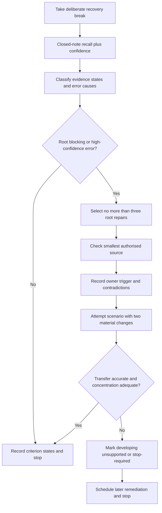
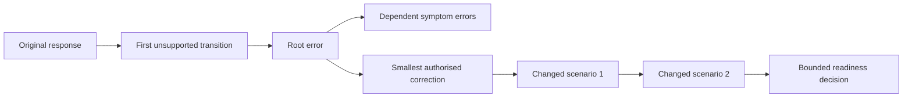

# Day 47 — Rest, Retrieval and Installation-Defect Correction

> **Scope boundary:** This recovery block introduces no new electrical theory. It uses bounded retrieval, error-log correction, transfer checks and fatigue controls. Exact technical conclusions remain `reference_check_required` and require current authorised sources and qualified review.

## 1. Outcome and entry check

By the end, the learner can:

1. reconstruct the Week 7 workflows **R-O-U-T-E**, **S-E-P-A-R-E**, **T-R-A-C-E** and **A-P-P-L-Y** without notes;
2. classify each response as stated recall, supported reconstruction, assumption, contradiction or evidence gap;
3. distinguish a root misconception from a downstream symptom error;
4. identify the first unsupported transition in a reasoning chain and stop dependent claims there;
5. repair no more than three high-value errors using the smallest authorised source check; and
6. demonstrate transfer after at least two material scenario changes before making a bounded readiness decision for Day 48.

### Entry check

Without notes, write one sentence for each Week 7 workflow and mark confidence as **guess**, **unsure**, **reasonably confident** or **certain**. Do not correct answers until all four are complete. Confidence is recorded separately from accuracy because fluent certainty and correct guessing are not secure evidence.

## 2. Why it matters

Fatigued rereading creates familiarity without dependable recall. It can also conceal a root error by repeatedly correcting only its visible consequences. A controlled recovery block protects concentration, repairs the smallest number of errors that could distort later motor, control and installation-planning work, and prevents an unsupported installation conclusion from being carried forward.

*Caption: Repair the few misconceptions that block safe reasoning; defer non-blocking polish and stop when the recovery limit is reached.*

## 3. Core concepts and terminology

- **Retrieval:** producing an answer from memory before checking notes.
- **Error log:** a record of the original answer, confidence, error cause, correction source, revised answer and fresh transfer attempt.
- **Root error:** the earliest misconception or unsupported assumption that causes later errors.
- **Symptom error:** a later incorrect statement produced by an earlier root error.
- **High-confidence error:** an incorrect answer given with strong confidence; it receives priority because the learner is unlikely to self-correct it.
- **Blocking error:** an error that prevents safe or coherent progress into the next module.
- **First unsupported transition:** the earliest step where a conclusion exceeds the available evidence. Dependent claims stop at this point.
- **Evidence owner:** the authorised person, source or qualified reviewer expected to resolve an evidence gap.
- **Recheck trigger:** new information or a changed condition that requires an earlier conclusion to be reopened.
- **Repair:** a focused correction followed by a materially changed application question.
- **Material change:** a change that could alter a source, route, environment, circuit boundary, control function, isolation claim or installation conclusion.
- **Readiness:** sufficient accurate recall, concentration, transfer and self-monitoring to continue studying. It is not technical competence, field authority, a compliance decision or an official assessment result.

Use these evidence states:

- **stated fact:** information explicitly provided in the fictional dossier;
- **derived fact:** information obtained transparently from stated facts without adding an unsupported premise;
- **supported inference:** a provisional interpretation supported by identified evidence;
- **assumption:** an unverified proposition introduced by the learner;
- **contradiction:** two pieces of evidence that cannot both describe the same condition as presented; and
- **evidence gap:** information required before the reasoning can progress.

## 4. Rule-finding workflow

Use **R-E-C-O-V-E-R**:

1. **R — Rest first:** take the deliberate break before technical retrieval.
2. **E — Elicit recall:** answer selected prompts closed-note and record confidence before checking.
3. **C — Classify causes:** distinguish terminology, boundary, evidence, workflow, calculation, transfer and confidence errors; identify root versus symptom errors.
4. **O — Order repairs:** prioritise safety-critical, blocking and high-confidence root errors. Select no more than three.
5. **V — Verify minimally:** check only the smallest current authorised explanation needed. Record provenance, unresolved contradictions, an evidence owner and a recheck trigger.
6. **E — Exercise transfer:** apply the repair to a fresh scenario with at least two material changes. Reopen every dependent conclusion affected by the changes.
7. **R — Reassess readiness:** classify each criterion independently as **secure**, **developing**, **unsupported** or `stop-required`; continue, schedule limited remediation or stop for recovery.

The diagram prevents recovery from becoming an uncontrolled study marathon. It also places source provenance, contradiction handling and changed-condition transfer between correction and readiness.

This claim chain shows why correcting a later symptom is insufficient. The learner repairs the first unsupported transition, then tests whether the corrected reasoning survives two materially different conditions.

## 5. Visual model or worked example

A fictional maintenance pack contains:

- a drawing showing one supply to a fixed pump;
- a later service note referring to a separate control enclosure;
- a photograph showing a nearby switch labelled “PUMP”; and
- an incident note stating that the pump restarted after a remote command.

The learner confidently says the nearby switch proves local isolation. Classify that statement as an **assumption** and identify the root error: treating proximity and a label as evidence of isolation capability, source completeness and task suitability. The drawing and service note are retained as competing evidence rather than blended into one convenient account.

The smallest correction is to revisit the Day 46 distinction among functional control, protection, emergency action and isolation. The unresolved control enclosure receives an evidence owner and a recheck trigger.

Transfer then uses two changes:

1. the next scenario adds an alternate supply to the control equipment; and
2. a later record shows that the nearby switch controls normal operation but its isolation capability is not established.

The learner must reopen source completeness, device function, controlled boundary and safe-state claims. A bounded educational conclusion may state that the dossier does not support an isolation or safe-state conclusion. It must not prescribe a practical method.

### Time limits

- 10 minutes deliberate recovery;
- 15 minutes closed-note retrieval and confidence recording;
- maximum 20 minutes for up to three root-error repairs;
- 10 minutes for two changed-condition transfer checks;
- stop after 55 minutes total, or earlier when a stop condition occurs.

## 6. Practical application

Create a six-row retrieval sheet covering Days 43–46:

1. route segmentation and mechanical-risk boundaries;
2. environmental influences, segregation purpose and support purpose;
3. consumer mains, submains and final-subcircuit boundary classification;
4. source-to-load tracing and changed-source reopening;
5. fixed-appliance control, protection, emergency action and isolation distinctions; and
6. evidence provenance, first unsupported transition, owner and recheck-trigger handling.

For each row record:

- closed-note answer;
- confidence before checking;
- evidence state;
- root or symptom error classification;
- first unsupported transition;
- smallest correction source and provenance;
- unresolved contradiction, evidence owner and recheck trigger;
- changed scenario 1 result;
- changed scenario 2 result; and
- criterion state.

Repair no more than three root errors. Defer non-blocking polish.

### Criterion-level readiness

Assess each criterion separately:

- **secure:** accurate closed-note reasoning, calibrated confidence, no hidden assumption, and correct transfer across both changes;
- **developing:** the learner corrects the reasoning with bounded prompting but transfer remains incomplete or fragile;
- **unsupported:** the learner cannot support the reasoning from the available evidence or leaves a material contradiction unresolved; and
- **`stop-required`:** fatigue, unsafe practical intent, repeated failure after correction or loss of boundary control requires the session to end.

Do not calculate an aggregate score or unofficial pass mark. Strong performance in one criterion cannot offset a blocking condition elsewhere.

## 7. Common errors and safety checkpoint

Common errors include rereading everything, selecting easy symptom errors instead of blocking root errors, copying corrected wording without transfer, treating confidence as evidence, hiding contradictory records, failing to reopen downstream claims after a changed source or boundary, and extending catch-up beyond the time limit.

**Blocking conditions:**

- a credible source, control path or environmental condition is omitted;
- “off,” proximity, a label or a drawing is treated as proof of isolation or safe state;
- the first unsupported transition is not identified;
- a contradiction or evidence gap is concealed;
- an unresolved blocker has no evidence owner or recheck trigger;
- transfer uses fewer than two material changes;
- affected downstream conclusions are not reopened;
- concentration is materially reduced or the same root error recurs after correction; or
- the learner proposes unauthorised approach, switching, opening, testing, measurement, isolation, alteration, energisation or field verification.

Stop immediately when any `stop-required` condition is present, when the time limit expires, or when safe reasoning cannot be maintained. This module authorises no practical electrical work.

## 8. Retrieval and next links

1. Expand **R-E-C-O-V-E-R** and state the purpose of each step.
2. Distinguish a root error from a symptom error.
3. What is the first unsupported transition, and what happens to dependent claims?
4. Why are confidence and accuracy recorded separately?
5. Why must transfer use at least two material changes?
6. What are evidence owners and recheck triggers?
7. Name four blocking conditions and three stop conditions.
8. Why is readiness for Day 48 not evidence of technical competence or field authority?

- **Plan:** [Twelve-Week Capstone Learning Plan](../MASTER_PLAN.md)
- **Knowledge note:** [[12-Week Day 47 - Rest, Retrieval and Installation-Defect Correction]]
- **Previous:** [Day 46 — Fixed Appliances and Local Isolation Reasoning](day-46-fixed-appliances-and-local-isolation-reasoning.md)
- **Next:** [Day 48 — Motors, Associated Protection and Control Boundaries](day-48-motors-associated-protection-and-control-boundaries.md)

This module remains `review-required`, `reference_check_required`, safety-critical and not `technically-reviewed`.