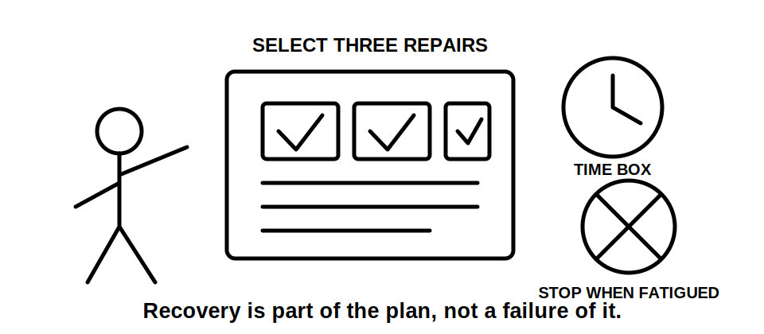
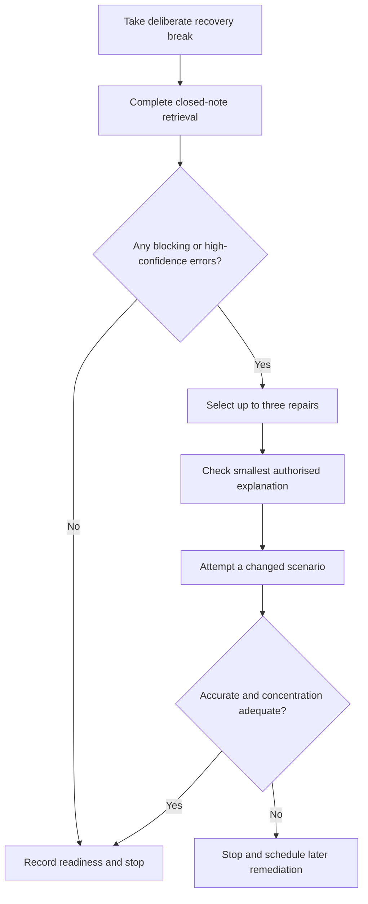

# Day 47 — Rest, Retrieval and Installation-Defect Correction

> **Scope boundary:** This recovery block introduces no new electrical theory. It uses bounded retrieval, error-log repair and fatigue controls. Exact technical conclusions still require current authorised sources and qualified review.

## 1. Outcome and entry check

By the end, the learner can retrieve the Week 7 decision workflows without notes, classify recent errors by cause, repair no more than three high-value misconceptions and make an evidence-based readiness decision for Day 48.

### Entry check

Without notes, write one sentence for each: **R-O-U-T-E**, **S-E-P-A-R-E**, **T-R-A-C-E** and **A-P-P-L-Y**. Mark confidence as guess, unsure, reasonably confident or certain.

## 2. Why it matters

Fatigued rereading creates familiarity without reliable recall. A controlled recovery block protects concentration while correcting the smallest number of errors that could distort later motor, control and installation-planning work.

## 3. Core concepts and terminology

- **Retrieval:** producing an answer from memory before checking notes.
- **Error log:** a record of the answer, confidence, cause, correction and fresh re-attempt.
- **High-confidence error:** an incorrect answer given with strong confidence; treat it as a priority misconception.
- **Blocking error:** a misconception that prevents safe progress into the next module.
- **Repair:** a focused correction followed by a different application question.
- **Readiness:** sufficient accurate recall, concentration and self-monitoring to continue; it is not technical competence or field authority.

## 4. Rule-finding workflow

Use **R-E-C-O-V-E-R**:

1. **R — Rest first:** stop technical work for a short deliberate break.
2. **E — Elicit recall:** answer selected prompts closed-note.
3. **C — Classify errors:** mark memory, terminology, boundary, evidence, calculation or confidence causes.
4. **O — Order repairs:** prioritise safety-critical, blocking and high-confidence errors.
5. **V — Verify sources:** check only the smallest authorised explanation needed.
6. **E — Exercise again:** use a changed scenario, not the original question.
7. **R — Reassess readiness:** continue, take limited catch-up or stop for recovery.

The diagram limits correction work so recovery is not converted into an uncontrolled study marathon.

## 5. Visual model or worked example

A learner correctly recalls route segmentation but confidently says that a nearby appliance switch proves isolation. The error is classified as a **function-and-evidence boundary error**. The learner checks the Day 46 distinction, then answers a changed pump scenario containing a separate control supply. The repaired answer states that control, isolation and safe-state evidence are different claims.

### Time box

- 10 minutes deliberate break;
- 15 minutes closed-note retrieval;
- maximum 25 minutes for up to three repairs;
- 10 minutes changed-scenario check;
- stop after 60 minutes total.

## 6. Practical application

Create a six-row retrieval sheet covering Days 43–46:

1. route segmentation;
2. environmental influences;
3. segregation purpose;
4. circuit boundary classification;
5. fixed-appliance control versus isolation;
6. changed-source reopening.

For each row record answer, confidence, cause of any error, smallest correction source and one changed re-attempt. Repair no more than three rows. Defer non-blocking polish.

### Readiness rubric

Score 0–2 for accurate retrieval, confidence calibration, causal error classification, bounded source checking, changed-scenario transfer and fatigue management. **10/12** with no critical error indicates readiness for Day 48. This is an educational threshold only.

## 7. Common errors and safety checkpoint

Common errors include rereading everything, selecting easy errors instead of blocking ones, copying corrected wording without re-attempting, extending catch-up beyond the time box and treating confidence as evidence.

Critical errors include practising unauthorised switching or testing, continuing despite poor concentration, presenting recalled values as verified, or converting a rest block into practical field work.

Stop when concentration is materially reduced, the learner repeats the same error twice after correction, the time box expires, or safe reasoning cannot be maintained.

## 8. Retrieval and next links

1. Expand **R-E-C-O-V-E-R**.
2. Distinguish blocking, high-confidence and non-blocking errors.
3. Why must the re-attempt use a changed scenario?
4. What is the maximum number of repairs?
5. Name three stop conditions.

- **Plan:** [Twelve-Week Capstone Learning Plan](../MASTER_PLAN.md)
- **Knowledge note:** [[12-Week Day 47 - Rest, Retrieval and Installation-Defect Correction]]
- **Previous:** [Day 46 — Fixed Appliances and Local Isolation Reasoning](day-46-fixed-appliances-and-local-isolation-reasoning.md)
- **Next:** [Day 48 — Motors, Associated Protection and Control Boundaries](day-48-motors-associated-protection-and-control-boundaries.md)

This module remains `review-required`, `reference_check_required` and not `technically-reviewed`.