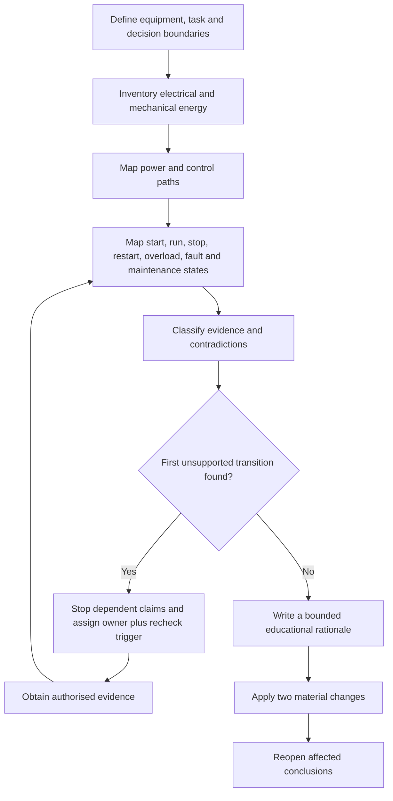
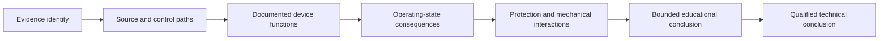

# Day 48 — Motors, Associated Protection and Control Boundaries

> **Scope boundary:** This is a paper-based reasoning module. It does not prescribe motor protection, starting, isolation, emergency action, control, conductor selection, settings, testing or commissioning. Exact requirements require current authorised sources, applicable manufacturer information and qualified technical review.

## 1. Outcome and entry check

By the end, the learner can:

1. define the equipment, task, electrical-energy, mechanical-energy, evidence and decision boundaries for a fictional motor system;
2. distinguish power, control, starting, overload, fault-protection, stopping, isolation and driven-equipment functions without assigning a function from appearance alone;
3. classify each claim as stated fact, derived fact, supported inference, assumption, contradiction or evidence gap;
4. identify the first unsupported transition in a motor-system argument and stop dependent safe-state or suitability claims there;
5. assign an evidence owner and recheck trigger to each unresolved blocker; and
6. transfer the reasoning after at least two material changes while reopening every affected conclusion.

### Entry check

Closed-note, sketch a fictional motor with a protective device, contactor, overload relay, local stop control and remote command. For each item, state only the function supported by the prompt. Mark confidence as high, medium or low before checking.

Then identify:

- every possible electrical and mechanical energy source;
- which claims concern normal operation rather than isolation;
- which claim would fail first if a separate control supply or automatic restart path existed; and
- what evidence would be needed before a safe-state conclusion could be considered.

A correct guess with low evidence remains developing. High confidence does not upgrade an unsupported claim.

## 2. Why it matters

A motor installation is a system, not a single load. Power paths, control paths, protection, stored or driven mechanical energy, automatic commands and operating states interact. A local stop action may stop normal motion while leaving a power circuit connected, a control circuit energised, a restart command available or mechanical energy unresolved.

The educational task is therefore not to name devices quickly. It is to build a bounded evidence chain that separates what is described, what is supported, what conflicts and what remains unknown.

*Instructional caption: Map every energy path and documented function before treating a stop response as evidence of isolation or a safe state.*

## 3. Core concepts and terminology

- **Motor-system boundary:** the motor, supply conductors, switching, protection, control circuits, driven equipment and relevant energy sources included in the analysis.
- **Equipment boundary:** the physical items included in the paper scenario.
- **Task boundary:** the specific activity being considered, such as normal operation, fault response or maintenance planning.
- **Electrical-energy boundary:** every electrical source and conductive path that could influence the task.
- **Mechanical-energy boundary:** rotation, pressure, gravity, stored spring energy, process flow or another non-electrical source associated with the driven equipment.
- **Evidence boundary:** the drawings, labels, schedules, manufacturer information and authorised requirements available for the conclusion.
- **Decision boundary:** the narrowest conclusion the available evidence can support.
- **Power circuit:** the path carrying energy to the motor.
- **Control circuit:** the path that commands or regulates operation; it may use a separate source.
- **Starting condition:** the period in which current, torque and control behaviour differ from established running.
- **Overload condition:** sustained excessive demand or mechanical loading that may overheat equipment without being a short circuit.
- **Fault condition:** an abnormal conductive path or insulation failure requiring an appropriate protective response.
- **Overload function:** a documented function intended to respond to sustained excessive motor demand; its exact application and settings require authorised evidence.
- **Fault-protection function:** a documented protective function associated with fault conditions; it must not be assumed to cover every motor hazard.
- **Contactor or controller:** a device that controls a power path through a separate command arrangement; its presence does not itself prove isolation.
- **Interlock:** a documented control relationship intended to prevent or require a defined operating state.
- **Automatic restart:** renewed operation caused by a retained or new command without a fresh local manual start action.
- **Driven-equipment hazard:** movement, pressure, stored energy or process consequence associated with the machine coupled to the motor.
- **First unsupported transition:** the earliest reasoning step where the conclusion exceeds the evidence.
- **Evidence owner:** the authorised source, person or reviewer responsible for resolving an evidence gap.
- **Recheck trigger:** new evidence or a changed condition that requires an earlier conclusion to be reopened.
- **Material change:** a change capable of altering a source, control path, operating state, protective function, mechanical hazard or conclusion.

## 4. Rule-finding workflow

Use **M-O-T-O-R-S**:

1. **M — Mark boundaries:** define the equipment, task, electrical-energy, mechanical-energy, evidence, authority and decision boundaries.
2. **O — Observe the evidence state:** list each stated fact, derived fact, supported inference, assumption, contradiction and gap; record confidence separately.
3. **T — Trace every path and state:** map power, control and mechanical-energy paths across start, run, stop, automatic restart, overload, fault and maintenance states.
4. **O — Obtain authorised support:** identify the current authorised rule, manufacturer information, drawing, setting record or qualified reviewer needed for each unresolved claim.
5. **R — Relate functions without collapsing them:** keep control, stopping, protection, isolation and mechanical safe-state claims separate; find the first unsupported transition.
6. **S — State and stress-test a bounded conclusion:** assign evidence owners and recheck triggers, then reopen affected conclusions after at least two material changes.

The workflow deliberately loops back after new evidence or changed conditions. A later document, source or control path can invalidate an earlier conclusion even when the original reasoning was internally consistent.

Each arrow is a claim transition. If evidence does not support one transition, every conclusion to its right remains unresolved. The final transition requires current authorised sources and qualified technical review.

## 5. Visual model or worked example

A fictional workshop exhaust fan dossier contains:

- a single-line drawing showing a protective device, contactor and motor;
- a control sketch showing local start and stop controls;
- a maintenance note reporting an unexpected restart after a remote building-management command;
- a motor nameplate photograph whose date and current applicability are unconfirmed;
- an overload-setting record that refers to a different drawing revision;
- a label stating “fan isolator” without evidence of the controlled conductors or all energy sources; and
- no current drawing for the roof-mounted control enclosure.

A weak response treats the stop control and labelled device as proof of a safe maintenance state.

A stronger response:

1. records the local stop response only as evidence about normal control behaviour;
2. keeps the remote-restart note as credible contradictory evidence;
3. separates the power circuit, control circuit and driven-fan mechanical boundary;
4. identifies the first unsupported transition as the move from “normal motion stopped” to “all relevant energy controlled”;
5. assigns the current control drawing and device-function verification to an authorised evidence owner;
6. records the revised drawing or qualified review as the recheck trigger; and
7. refuses to infer settings, isolation capability or a safe state from labels or appearance.

### Faded example

For a fictional pump with a level controller and separate control transformer:

1. draw the known power, control and mechanical-energy paths;
2. classify every item of evidence;
3. map start, run, stop, automatic restart, overload, fault and maintenance states;
4. identify the first unsupported transition;
5. assign owners and triggers to gaps; and
6. repeat the analysis after both:
   - a variable-speed controller is introduced; and
   - a remote automatic command or alternate supply is disclosed.

For each change, state which conclusions reopen and why. Also justify any conclusion that remains unaffected.

## 6. Practical application

Prepare a motor-system dossier for the fictional workshop exhaust fan.

### Part A — bounded system map

Create a table with:

- item or path;
- known source;
- documented function;
- operating states affected;
- evidence source and revision;
- evidence classification;
- confidence;
- contradiction or gap;
- evidence owner;
- recheck trigger; and
- dependent conclusions.

### Part B — claim ladder

Write one sentence for each step:

1. evidence identity;
2. source and path identity;
3. documented device function;
4. operating-state consequence;
5. overload, fault and mechanical interaction;
6. bounded educational conclusion; and
7. matters reserved for authorised sources and qualified review.

Underline the first unsupported transition. Do not continue dependent claims as though the gap were resolved.

### Part C — transfer

Apply at least two material changes, such as:

- adding a separate control supply;
- adding remote automatic restart;
- changing the controller type;
- adding an alternate electrical source;
- changing the driven load so stored mechanical energy exists; or
- discovering that a setting record belongs to another revision.

For each change, list affected and unaffected conclusions and provide an evidence-based reason.

### Readiness criteria

Assess each criterion independently:

- **Secure:** the learner defines all boundaries, maps all credible energy and control paths, separates functions, handles contradictions, stops at the first unsupported transition, assigns owners and triggers, and completes two-condition transfer without a blocking error.
- **Developing:** the core distinction is present but one non-blocking evidence, terminology or transfer explanation needs correction.
- **Unsupported:** a conclusion relies on appearance, an unverified label, an omitted source, an invented setting or an unresolved contradiction.
- **`stop-required`:** fatigue, repeated blocking error, practical-authority overreach or a claim of isolation, safe state, compliance or technical suitability without the required evidence.

These are educational planning states, not official grades, competency outcomes, defect classifications, compliance decisions or technical approvals. There is no aggregate score or unofficial pass threshold.

## 7. Common errors and safety checkpoint

Common errors include:

- treating a stop command as isolation;
- assuming one protective device addresses starting, overload, fault and mechanical hazards;
- omitting a separate or remote control supply;
- confusing overload with short circuit;
- treating an interlock description as proof of current operation;
- ignoring automatic restart;
- ignoring driven-equipment energy;
- relying on an undated drawing, photograph, label or setting record;
- resolving contradictory evidence by convenience;
- failing to reopen downstream conclusions after a material change; and
- repeating a calculator, document or assumption as though it were an independent check.

### Blocking conditions

Progress to Day 49 is blocked by any of the following:

- an omitted credible electrical or mechanical energy source;
- a stop response, contactor state, label or drawing treated as proof of isolation or safe state;
- an invented rating, setting, control path, protective capability or operating result;
- a hidden contradiction or assumption;
- failure to identify the first unsupported transition;
- missing evidence owners or recheck triggers for blockers;
- transfer using fewer than two material changes;
- failure to reopen affected conclusions;
- repeated blocking error after correction;
- fatigue that prevents careful evidence handling; or
- proposed approach, opening, switching, isolation, testing, adjustment, mechanical intervention or energisation.

This module authorises no approach, switching, isolation, opening, proving de-energised, testing, measurement, setting adjustment, mechanical intervention, installation, alteration, repair, energisation, commissioning, certification or field verification.

## 8. Retrieval and next links

Closed-note:

1. Define the six motor-system boundaries used in this module.
2. Expand **M-O-T-O-R-S**.
3. Distinguish power, control, starting, overload, fault-protection, stopping and isolation functions.
4. Define the first unsupported transition.
5. Explain why a normal stop response cannot prove a safe maintenance state.
6. Name the six evidence classifications.
7. Give two examples of a material change.
8. State the four educational readiness states and one blocking condition.

- **Plan:** [Twelve-Week Capstone Learning Plan](../MASTER_PLAN.md)
- **Knowledge note:** [[12-Week Day 48 - Motors, Associated Protection and Control Boundaries]]
- **Previous:** [Day 47 — Rest, Retrieval and Installation-Defect Correction](day-47-rest-retrieval-and-installation-defect-correction.md)
- **Next:** [Day 49 — Week 7 Installation Planning Exercise](day-49-week-7-installation-planning-exercise.md)

This module remains `review-required`, `reference_check_required`, safety-critical and not `technically-reviewed`.
