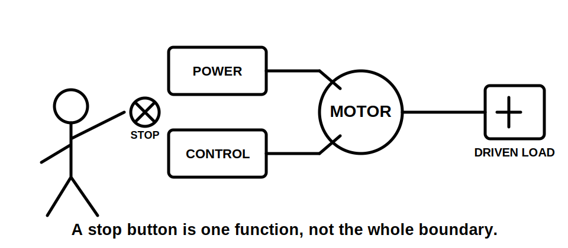
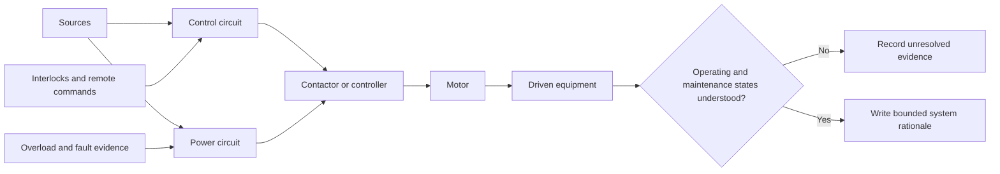

# Day 48 — Motors, Associated Protection and Control Boundaries

> **Scope boundary:** This module teaches paper-based motor-system reasoning. Exact motor protection, starting, isolation, control, conductor, overload, fault, emergency and installation requirements require current authorised sources, manufacturer information and qualified review.

## 1. Outcome and entry check

By the end, the learner can define a motor-system boundary, distinguish power, control and protection functions, map operating states, identify missing evidence and write a bounded protection-and-control rationale.

### Entry check

For a motor with a contactor and stop button, list which items may control operation, interrupt fault current, respond to overload and isolate sources. Mark any answer that depends on evidence.

## 2. Why it matters

A motor circuit is not one device and one load. Starting current, overload behaviour, automatic control, remote commands, mechanical hazards and multiple control supplies can change both protection and isolation reasoning. Device labels or normal stopping behaviour do not prove the whole system's function.

## 3. Core concepts and terminology

- **Motor system boundary:** the motor, supply conductors, switching, protection, control circuits, driven equipment and relevant energy sources included in the analysis.
- **Power circuit:** the path carrying energy to the motor.
- **Control circuit:** the path that commands or regulates operation; it may have a separate source.
- **Starting condition:** the operating period in which current, torque and control behaviour differ from normal running.
- **Overload condition:** sustained excessive demand or mechanical loading that may overheat equipment without being a short circuit.
- **Fault condition:** an abnormal conductive path or insulation failure requiring appropriate protective action.
- **Interlock:** a control relationship intended to prevent or require a defined operating state.
- **Driven-equipment hazard:** movement, pressure, stored mechanical energy or process consequence associated with the machine coupled to the motor.

## 4. Rule-finding workflow

Use **M-O-T-O-R-S**:

1. **M — Map** power, control, protection, driven equipment and every source.
2. **O — Outline** start, run, stop, fault, overload and maintenance states.
3. **T — Tag** each device by documented function, not appearance.
4. **O — Obtain** ratings, settings, manufacturer data, drawings and authorised requirements.
5. **R — Relate** conductors, starting conditions, overload response, fault protection, control and isolation.
6. **S — State** a bounded conclusion and reopen it when a source, load, setting or control path changes.

The diagram shows why power, control and mechanical consequences must be analysed together.

## 5. Visual model or worked example

A fictional ventilation motor has a protective device, contactor, overload relay, local stop button and remote building-management command. The learner initially treats the local stop as isolation. **M-O-T-O-R-S** shows that the stop button acts through the control circuit, the remote command can restart operation and the power circuit remains connected. The correct paper conclusion distinguishes stopping, overload response, fault protection and isolation as separate evidence claims.

### Faded example

For a fictional pump motor with a level controller and a separate control transformer:

1. draw power and control paths;
2. list operating states;
3. assign documented functions to each device;
4. identify starting, overload and driven-load questions;
5. state what changes if the pump becomes mechanically jammed or another control source is added.

## 6. Practical application

Prepare a motor-system dossier for a fictional workshop exhaust fan:

1. define the system and task boundaries;
2. inventory all electrical and mechanical energy sources;
3. map power, control and protective functions;
4. describe start, run, stop, automatic restart, overload, fault and maintenance states;
5. request motor data, controller data, settings, drawings and authorised requirements;
6. distinguish described, supported and unresolved claims;
7. identify interactions with conductor selection, isolation and driven equipment;
8. reopen the analysis after a variable-speed controller or alternate supply is disclosed.

### Assessment rubric

Score 0–2 for boundary completeness, function distinction, state mapping, protection interaction, evidence discipline and changed-condition reasoning. **10/12** with no critical error indicates readiness for Day 49. This is an educational threshold only.

## 7. Common errors and safety checkpoint

Common errors include treating a stop button as isolation, assuming one protective device covers every condition, ignoring control supplies, confusing overload with short circuit, omitting automatic restart and ignoring the driven machine.

Critical errors include proposing live investigation, inventing settings or ratings, claiming a safe state from control behaviour, omitting a disclosed source, or treating a paper exercise as commissioning evidence.

This module authorises no switching, isolation, proving de-energised, testing, setting adjustment, opening, mechanical intervention, energisation, commissioning or verification.

## 8. Retrieval and next links

1. Define motor-system, power-circuit and control-circuit boundaries.
2. Expand **M-O-T-O-R-S**.
3. Distinguish overload, fault and starting conditions.
4. Why can a stop command fail to provide isolation?
5. Name four operating states that must be mapped.

- **Plan:** [Twelve-Week Capstone Learning Plan](../MASTER_PLAN.md)
- **Knowledge note:** [[12-Week Day 48 - Motors, Associated Protection and Control Boundaries]]
- **Previous:** [Day 47 — Rest, Retrieval and Installation-Defect Correction](day-47-rest-retrieval-and-installation-defect-correction.md)
- **Next:** [Day 49 — Week 7 Installation Planning Exercise](day-49-week-7-installation-planning-exercise.md)

This module remains `review-required`, `reference_check_required` and not `technically-reviewed`.